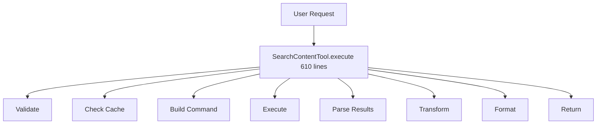
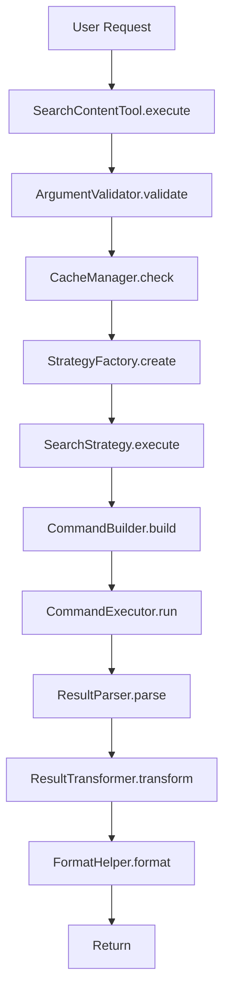

# Design: Code Quality Refactoring Strategy

## 技術選型 (Technology Choices)

### Refactoring Approach
- **Methodology**: Incremental refactoring with TDD
- **Patterns**: Strategy, Builder, Command, Factory
- **Testing**: Characterization tests → Unit tests → Integration tests
- **Tools**: pytest, mypy, ruff, coverage

### Design Patterns to Apply

#### 1. Strategy Pattern (for SearchContentTool)
```python
class SearchStrategy(Protocol):
    def execute(self, arguments: dict) -> dict:
        ...

class TotalOnlyStrategy(SearchStrategy):
    def execute(self, arguments: dict) -> dict:
        # Return only total count
        ...

class CountOnlyStrategy(SearchStrategy):
    def execute(self, arguments: dict) -> dict:
        # Return counts per file
        ...

class FullResultsStrategy(SearchStrategy):
    def execute(self, arguments: dict) -> dict:
        # Return full results
        ...
```

#### 2. Builder Pattern (for Command Construction)
```python
class RgCommandBuilder:
    def __init__(self):
        self._config = RgConfig()
    
    def with_query(self, query: str) -> 'RgCommandBuilder':
        self._config.query = query
        return self
    
    def with_case(self, case: str) -> 'RgCommandBuilder':
        self._config.case = case
        return self
    
    def build(self) -> list[str]:
        return self._build_command(self._config)
```

#### 3. Command Pattern (for Execution Flow)
```python
class SearchCommand:
    def __init__(self, strategy: SearchStrategy, config: SearchConfig):
        self.strategy = strategy
        self.config = config
    
    def execute(self) -> dict:
        return self.strategy.execute(self.config.to_dict())
```

#### 4. Factory Pattern (for Engine Management)
```python
class AnalysisEngineFactory:
    _instances: dict[str, UnifiedAnalysisEngine] = {}
    
    @classmethod
    def get_instance(cls, project_root: str | None = None) -> UnifiedAnalysisEngine:
        # Singleton logic here
        ...
```

## 架構設計 (Architecture Design)

### Module Reorganization

#### Current Structure (Problem)
```
mcp/tools/
├── fd_rg_utils.py (825 lines - GOD MODULE)
├── search_content_tool.py (947 lines - MONSTER CLASS)
└── ...
```

#### Target Structure (Solution)
```
mcp/tools/
├── search_content_tool.py (< 200 lines)
├── fd_rg/
│   ├── __init__.py
│   ├── fd_command_builder.py (< 200 lines)
│   ├── rg_command_builder.py (< 200 lines)
│   ├── command_executor.py (< 150 lines)
│   ├── result_parser.py (< 200 lines)
│   ├── result_transformer.py (< 200 lines)
│   └── config.py (< 100 lines)
├── search_strategies/
│   ├── __init__.py
│   ├── base.py (< 100 lines)
│   ├── total_only.py (< 100 lines)
│   ├── count_only.py (< 100 lines)
│   ├── summary.py (< 150 lines)
│   └── full_results.py (< 150 lines)
└── ...
```

### Class Reorganization

#### UnifiedAnalysisEngine Split
```
core/
├── analysis_engine.py (< 200 lines)
│   └── AnalysisEngine (core logic only)
├── engine_factory.py (< 100 lines)
│   └── AnalysisEngineFactory (singleton management)
├── plugin_registry.py (< 150 lines)
│   └── PluginRegistry (plugin management)
├── analysis_cache.py (< 150 lines)
│   └── AnalysisCache (cache operations)
├── language_resolver.py (< 100 lines)
│   └── LanguageResolver (language detection)
└── security_guard.py (< 100 lines)
    └── SecurityGuard (security validation)
```

## 数据流図 (Data Flow)

### Current Flow (Problematic)


### Target Flow (Clean)


## API 設計 (API Design)

### SearchContentTool Refactored API

```python
class SearchContentTool(BaseTool):
    def __init__(self):
        self._validator = ArgumentValidator()
        self._cache_manager = CacheManager()
        self._strategy_factory = SearchStrategyFactory()
        self._format_helper = FormatHelper()
    
    def execute(self, arguments: dict) -> dict | int:
        """Execute search with clean separation of concerns."""
        # 1. Validate (< 10 lines)
        validated_args = self._validator.validate(arguments)
        
        # 2. Check cache (< 10 lines)
        cached = self._cache_manager.get(validated_args)
        if cached:
            return cached
        
        # 3. Execute strategy (< 10 lines)
        strategy = self._strategy_factory.create(validated_args)
        result = strategy.execute(validated_args)
        
        # 4. Format and cache (< 10 lines)
        formatted = self._format_helper.format(result, validated_args)
        self._cache_manager.set(validated_args, formatted)
        
        return formatted
```

### Command Builder API

```python
@dataclass
class RgConfig:
    query: str
    case: str = "smart"
    fixed_strings: bool = False
    word: bool = False
    multiline: bool = False
    include_globs: list[str] = field(default_factory=list)
    exclude_globs: list[str] = field(default_factory=list)
    # ... other fields

class RgCommandBuilder:
    def __init__(self, config: RgConfig | None = None):
        self._config = config or RgConfig(query="")
    
    def with_query(self, query: str) -> 'RgCommandBuilder':
        self._config.query = query
        return self
    
    def with_case(self, case: str) -> 'RgCommandBuilder':
        self._config.case = case
        return self
    
    # ... other builder methods
    
    def build(self) -> list[str]:
        return self._build_command()
    
    def _build_command(self) -> list[str]:
        cmd = ["rg", "--json"]
        # Build command from config
        return cmd
```

## 実装細節 (Implementation Details)

### Phase 1: SearchContentTool Refactoring

#### Step 1.1: Extract Validation
```python
class ArgumentValidator:
    def validate(self, arguments: dict) -> dict:
        """Validate and normalize arguments."""
        self._validate_query(arguments)
        self._validate_roots_or_files(arguments)
        self._validate_format_options(arguments)
        return arguments
    
    def _validate_query(self, arguments: dict) -> None:
        if not arguments.get("query"):
            raise ValueError("query is required")
    
    def _validate_roots_or_files(self, arguments: dict) -> None:
        if not arguments.get("roots") and not arguments.get("files"):
            raise ValueError("Either roots or files required")
    
    def _validate_format_options(self, arguments: dict) -> None:
        # Validate mutually exclusive options
        exclusive_options = [
            "total_only", "count_only_matches", 
            "summary_only", "group_by_file"
        ]
        enabled = [opt for opt in exclusive_options if arguments.get(opt)]
        if len(enabled) > 1:
            raise ValueError(f"Options {enabled} are mutually exclusive")
```

#### Step 1.2: Extract Cache Management
```python
class CacheManager:
    def __init__(self):
        self._cache = SharedCache()
    
    def get(self, arguments: dict) -> dict | None:
        cache_key = self._generate_key(arguments)
        return self._cache.get(cache_key)
    
    def set(self, arguments: dict, result: dict) -> None:
        cache_key = self._generate_key(arguments)
        self._cache.set(cache_key, result)
    
    def _generate_key(self, arguments: dict) -> str:
        # Generate cache key from arguments
        ...
```

#### Step 1.3: Extract Search Strategies
```python
class TotalOnlyStrategy(SearchStrategy):
    def execute(self, arguments: dict) -> int:
        cmd = self._build_command(arguments)
        result = self._execute_command(cmd)
        return self._count_total(result)

class CountOnlyStrategy(SearchStrategy):
    def execute(self, arguments: dict) -> dict:
        cmd = self._build_command(arguments, count_mode=True)
        result = self._execute_command(cmd)
        return self._parse_counts(result)

class FullResultsStrategy(SearchStrategy):
    def execute(self, arguments: dict) -> dict:
        cmd = self._build_command(arguments)
        result = self._execute_command(cmd)
        matches = self._parse_matches(result)
        return self._format_results(matches, arguments)
```

### Phase 2: fd_rg_utils.py Split

#### Module 1: fd_command_builder.py
```python
@dataclass
class FdConfig:
    pattern: str | None = None
    glob: bool = False
    types: list[str] = field(default_factory=list)
    extensions: list[str] = field(default_factory=list)
    # ... other fields

class FdCommandBuilder:
    def __init__(self, config: FdConfig | None = None):
        self._config = config or FdConfig()
    
    def with_pattern(self, pattern: str) -> 'FdCommandBuilder':
        self._config.pattern = pattern
        return self
    
    def build(self) -> list[str]:
        return self._build_command()
```

#### Module 2: command_executor.py
```python
class CommandExecutor:
    def execute(self, cmd: list[str]) -> tuple[int, bytes, bytes]:
        """Execute command and return (returncode, stdout, stderr)."""
        ...
    
    def execute_parallel(self, commands: list[list[str]]) -> list[tuple[int, bytes, bytes]]:
        """Execute multiple commands in parallel."""
        ...
```

#### Module 3: result_parser.py
```python
class RgResultParser:
    def parse_json_lines(self, stdout: bytes) -> list[dict]:
        """Parse ripgrep JSON output."""
        ...
    
    def parse_count_output(self, stdout: bytes) -> dict[str, int]:
        """Parse ripgrep count output."""
        ...
```

#### Module 4: result_transformer.py
```python
class ResultTransformer:
    def group_by_file(self, matches: list[dict]) -> dict:
        """Group matches by file."""
        ...
    
    def optimize_paths(self, matches: list[dict]) -> list[dict]:
        """Optimize file paths."""
        ...
    
    def summarize(self, matches: list[dict]) -> dict:
        """Create summary of results."""
        ...
```

### Phase 3: UnifiedAnalysisEngine Refactoring

#### Extract Factory
```python
class AnalysisEngineFactory:
    _instances: dict[str, 'AnalysisEngine'] = {}
    _lock: threading.Lock = threading.Lock()
    
    @classmethod
    def get_instance(cls, project_root: str | None = None) -> 'AnalysisEngine':
        instance_key = project_root or "default"
        if instance_key not in cls._instances:
            with cls._lock:
                if instance_key not in cls._instances:
                    cls._instances[instance_key] = AnalysisEngine(project_root)
        return cls._instances[instance_key]
```

#### Simplified AnalysisEngine
```python
class AnalysisEngine:
    def __init__(self, project_root: str | None = None):
        self._project_root = project_root
        self._plugin_registry = PluginRegistry()
        self._cache = AnalysisCache()
        self._language_resolver = LanguageResolver()
        self._security_guard = SecurityGuard(project_root)
        self._parser = Parser()
        self._query_executor = QueryExecutor()
    
    async def analyze(self, request: AnalysisRequest) -> AnalysisResult:
        # Clean, focused analysis logic
        ...
```

## 边界情况処理 (Edge Cases)

### Edge Case 1: Empty Results
- **Scenario**: Search returns no matches
- **Handling**: Return empty structure with metadata
- **Test**: Verify empty result format

### Edge Case 2: Huge Result Sets
- **Scenario**: Search returns >10,000 matches
- **Handling**: Apply hard cap, warn user
- **Test**: Verify cap enforcement

### Edge Case 3: Command Timeout
- **Scenario**: ripgrep times out
- **Handling**: Return partial results with timeout flag
- **Test**: Mock timeout scenario

### Edge Case 4: Invalid Regex
- **Scenario**: User provides invalid regex pattern
- **Handling**: Validate before execution, clear error message
- **Test**: Verify validation catches common errors

### Edge Case 5: Cache Invalidation
- **Scenario**: File modified between cache and retrieval
- **Handling**: Check file mtime in cache key
- **Test**: Verify cache miss on file modification

## 测试策略 (Testing Strategy)

### Characterization Tests (Before Refactoring)
```python
def test_search_content_tool_current_behavior():
    """Capture current behavior before refactoring."""
    tool = SearchContentTool()
    
    # Test case 1: total_only
    result1 = tool.execute({"query": "test", "roots": ["."], "total_only": True})
    assert isinstance(result1, int)
    
    # Test case 2: count_only_matches
    result2 = tool.execute({"query": "test", "roots": ["."], "count_only_matches": True})
    assert isinstance(result2, dict)
    assert "file_count" in result2
    
    # ... more test cases
```

### Unit Tests (After Refactoring)
```python
def test_argument_validator_validates_query():
    validator = ArgumentValidator()
    with pytest.raises(ValueError, match="query is required"):
        validator.validate({})

def test_total_only_strategy_returns_int():
    strategy = TotalOnlyStrategy()
    result = strategy.execute({"query": "test", "roots": ["."]})
    assert isinstance(result, int)

def test_rg_command_builder_builds_correct_command():
    builder = RgCommandBuilder()
    cmd = builder.with_query("test").with_case("sensitive").build()
    assert "rg" in cmd
    assert "--case-sensitive" in cmd
```

### Integration Tests
```python
def test_search_content_tool_end_to_end():
    """Test complete flow after refactoring."""
    tool = SearchContentTool()
    result = tool.execute({
        "query": "class",
        "roots": ["examples/"],
        "extensions": ["py"]
    })
    assert result["success"]
    assert len(result["matches"]) > 0
```

## 性能考虑 (Performance Considerations)

### Optimization Opportunities
1. **Lazy Loading**: Load strategies only when needed
2. **Command Caching**: Cache command strings
3. **Result Streaming**: Stream large result sets
4. **Parallel Execution**: Maintain parallel search capability

### Performance Benchmarks
- Measure before/after refactoring
- Ensure no regression
- Target: <5% performance impact

## 迁移策略 (Migration Strategy)

### Backward Compatibility
- Keep old API as deprecated wrapper
- Gradual migration over 2 releases
- Clear deprecation warnings

### Rollout Plan
1. **Week 1-2**: SearchContentTool refactoring
2. **Week 3-4**: fd_rg_utils split
3. **Week 5-6**: UnifiedAnalysisEngine refactoring
4. **Week 7**: Integration testing
5. **Week 8**: Documentation and release

## 文档更新 (Documentation Updates)

### Required Documentation
- Architecture diagrams (Mermaid)
- API reference updates
- Migration guide
- Design pattern explanations
- Code examples

## 成功指标 (Success Metrics)

### Code Metrics
- ✅ Max method size: 50 lines
- ✅ Max module size: 300 lines
- ✅ Max complexity: 15
- ✅ Test coverage: >80%

### Quality Metrics
- ✅ All mypy checks passing
- ✅ All ruff checks passing
- ✅ All tests passing
- ✅ No performance regression

### Developer Experience
- ✅ Code review time reduced by 50%
- ✅ Bug fix time reduced by 40%
- ✅ Onboarding time reduced by 60%
