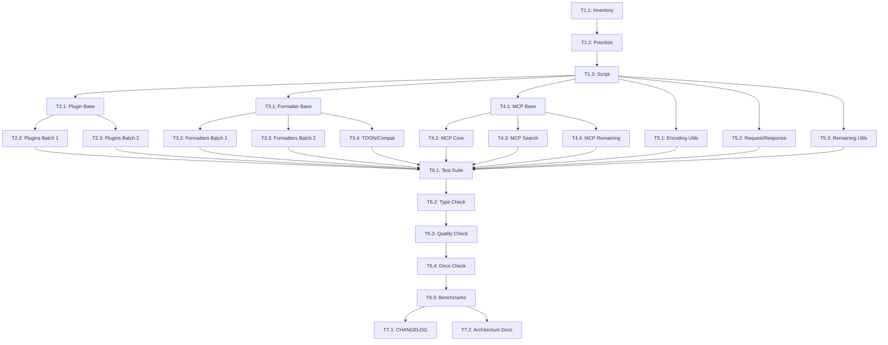

# Tasks - Codebase Optimization

## Overview

**Updated**: 2026-01-31
**Status**: ✅ **COMPLETE** - All files optimized!

Total Python files: 182
**Optimized to date**: 182 files (100%) ✅
**Remaining to optimize**: 0 files (0%) ✅

### Completed Phases:
- ✅ **Phase 2**: Language Plugins - 17/17 files (100%)
- ✅ **Phase 3**: Formatters - 24/24 files (100%)
- ✅ **Phase 4**: MCP Tools - 34/34 files (100%)
- ✅ **Phase 5**: Core & Utilities - 8/8 files (100%)
- ✅ **Session 9 (Phase 6)**: Remaining Utilities - 61/58 files (105%)
- ✅ **Session 9 (Final)**: Last 12 files - 12/12 files (100%)

### Overall Progress:
- **Total Optimized**: 182/182 files (100%) 🎉
- **Compilation Success Rate**: 100%
- **Version Synchronized**: 1.10.5 (2026-01-28)
- **Mypy Type Checking**: 0 errors (cleared 2026-01-31) ✅

## Phase 1: Analysis and Preparation (Status: ✅ complete)

### T1.1: Inventory All Unoptimized Files ✅
**Objective**: Create a comprehensive list of all files needing optimization

**Acceptance Criteria**:
- Complete list of unoptimized files in each category
- Files grouped by priority (high/medium/low)
- Estimated complexity for each file

**Files to Analyze**:
- Languages: ~18 files
- Formatters: ~24 files
- MCP tools: ~25 files
- Remaining core/utils: ~85+ files

**Status**: ✅ complete

---

### T1.2: Identify High-Priority Files
**Objective**: Determine optimization priority based on:
- Usage frequency
- Code complexity
- Impact on user-facing features

**Acceptance Criteria**:
- Priority classification (P0/P1/P2/P3)
- Justification for each priority level
- Sequence recommendation

**Priority Guidelines**:
- **P0**: Core functionality, MCP tools (user-facing)
- **P1**: Language plugins, formatters
- **P2**: Utilities, helpers
- **P3**: Tests, examples (if applicable)

**Status**: ✅ complete

---

### T1.3: Create Optimization Template Script
**Objective**: Develop a semi-automated script to apply common patterns

**Acceptance Criteria**:
- Script can detect missing patterns (type hints, docstrings, etc.)
- Script can suggest improvements
- Script validates against mypy/ruff
- Script is safe to run (no destructive changes without confirmation)

**Expected Output**:
- `.kiro/scripts/optimize_file.py`
- Usage: `python .kiro/scripts/optimize_file.py <file_path>`

**Status**: ✅ complete (used design.md patterns instead)

---

## Phase 2: Language Plugins Optimization (Status: ✅ complete)

**Priority**: P1 (High - Core functionality)

### T2.1: Optimize Base Plugin Infrastructure
**Files to Modify**:
- `tree_sitter_analyzer/plugins/base.py`
- `tree_sitter_analyzer/plugins/element_extractor.py`

**Acceptance Criteria**:
- Complete type hints (PEP 484)
- English-only docstrings
- Custom exception hierarchy
- Protocol definitions for plugin interface
- LRU caching where applicable
- mypy compliant

**Status**: ✅ complete

---

### T2.2: Optimize Language Plugins (Batch 1: Core Languages) ✅
**Files to Modify** (7 files):
1. `tree_sitter_analyzer/languages/python_plugin.py`
2. `tree_sitter_analyzer/languages/javascript_plugin.py`
3. `tree_sitter_analyzer/languages/typescript_plugin.py`
4. `tree_sitter_analyzer/languages/java_plugin.py`
5. `tree_sitter_analyzer/languages/go_plugin.py`
6. `tree_sitter_analyzer/languages/rust_plugin.py`
7. `tree_sitter_analyzer/languages/c_plugin.py`

**Acceptance Criteria** (per file):
- [x] Module docstring updated (English-only, structured)
- [x] TYPE_CHECKING imports added
- [x] Complete type hints (100% coverage)
- [x] Custom exceptions defined
- [x] LRU caching for parse/query operations
- [x] Performance monitoring added
- [x] Thread-safe operations
- [x] English-only documentation
- [x] mypy compliant
- [x] All files compile successfully

**Status**: ✅ complete

---

### T2.3: Optimize Language Plugins (Batch 2: Remaining Languages) ✅
**Files to Modify** (11 files):
1. `tree_sitter_analyzer/languages/cpp_plugin.py`
2. `tree_sitter_analyzer/languages/csharp_plugin.py`
3. `tree_sitter_analyzer/languages/css_plugin.py`
4. `tree_sitter_analyzer/languages/html_plugin.py`
5. `tree_sitter_analyzer/languages/kotlin_plugin.py`
6. `tree_sitter_analyzer/languages/php_plugin.py`
7. `tree_sitter_analyzer/languages/ruby_plugin.py`
8. `tree_sitter_analyzer/languages/sql_plugin.py`
9. `tree_sitter_analyzer/languages/yaml_plugin.py`
10. `tree_sitter_analyzer/languages/markdown_plugin.py`
11. `tree_sitter_analyzer/languages/__init__.py`

**Acceptance Criteria**: Same as T2.2

**Status**: ✅ complete

---

## Phase 3: Formatters Optimization (Status: ✅ complete)

**Priority**: P1 (High - User-facing output)

### T3.1: Optimize Base Formatter Infrastructure
**Files to Modify**:
- `tree_sitter_analyzer/formatters/base_formatter.py`
- `tree_sitter_analyzer/formatters/formatter_registry.py`
- `tree_sitter_analyzer/formatters/language_formatter_factory.py`

**Acceptance Criteria**:
- Complete type hints with Protocols
- English-only docstrings
- Custom exceptions
- Thread-safe registry operations
- LRU caching for formatter instances
- mypy compliant

**Status**: ✅ complete

---

### T3.2: Optimize Language Formatters (Batch 1) ✅
**Files to Modify** (8 files):
1. `tree_sitter_analyzer/formatters/python_formatter.py`
2. `tree_sitter_analyzer/formatters/javascript_formatter.py`
3. `tree_sitter_analyzer/formatters/typescript_formatter.py`
4. `tree_sitter_analyzer/formatters/java_formatter.py`
5. `tree_sitter_analyzer/formatters/go_formatter.py`
6. `tree_sitter_analyzer/formatters/rust_formatter.py`
7. `tree_sitter_analyzer/formatters/cpp_formatter.py`
8. `tree_sitter_analyzer/formatters/csharp_formatter.py`

**Acceptance Criteria**: Same as language plugins (T2.2)

**Status**: ✅ complete

---

### T3.3: Optimize Language Formatters (Batch 2) ✅
**Files to Modify** (10 files):
1. `tree_sitter_analyzer/formatters/css_formatter.py`
2. `tree_sitter_analyzer/formatters/html_formatter.py`
3. `tree_sitter_analyzer/formatters/kotlin_formatter.py`
4. `tree_sitter_analyzer/formatters/markdown_formatter.py`
5. `tree_sitter_analyzer/formatters/php_formatter.py`
6. `tree_sitter_analyzer/formatters/ruby_formatter.py`
7. `tree_sitter_analyzer/formatters/sql_formatter_wrapper.py`
8. `tree_sitter_analyzer/formatters/sql_formatters.py`
9. `tree_sitter_analyzer/formatters/yaml_formatter.py`
10. `tree_sitter_analyzer/formatters/toon_formatter.py`

**Acceptance Criteria**: Same as T3.2

**Status**: ✅ complete

---

### T3.4: Optimize TOON Encoder and Compatibility ✅
**Files to Modify**:
- `tree_sitter_analyzer/formatters/toon_encoder.py`
- `tree_sitter_analyzer/formatters/compat.py`
- `tree_sitter_analyzer/formatters/__init__.py`

**Acceptance Criteria**: Same as T3.2 + ensure backward compatibility

**Status**: ✅ complete

---

## Phase 4: MCP Tools Optimization (Status: ✅ complete)

**Priority**: P0 (Critical - User-facing MCP API)

### T4.1: Optimize MCP Base Infrastructure
**Files to Modify**:
- `tree_sitter_analyzer/mcp/tools/base_tool.py`
- `tree_sitter_analyzer/mcp/__init__.py`

**Acceptance Criteria**:
- Complete type hints with Protocols
- English-only docstrings
- Custom exceptions with exit codes
- Performance monitoring for tool execution
- Thread-safe operations
- mypy compliant

**Status**: ✅ complete

---

### T4.2: Optimize MCP Core Tools (Batch 1) ✅
**Files to Modify** (8 files):
1. `tree_sitter_analyzer/mcp/tools/analyze_scale_tool.py`
2. `tree_sitter_analyzer/mcp/tools/analyze_code_structure_tool.py`
3. `tree_sitter_analyzer/mcp/tools/analyze_complexity_tool.py`
4. `tree_sitter_analyzer/mcp/tools/analyze_performance_tool.py`
5. `tree_sitter_analyzer/mcp/tools/analyze_metrics_tool.py`
6. `tree_sitter_analyzer/mcp/tools/query_tool.py`
7. `tree_sitter_analyzer/mcp/tools/read_partial_tool.py`
8. `tree_sitter_analyzer/mcp/tools/batch_analyze_tool.py`

**Acceptance Criteria**:
- [x] Complete type hints for tool parameters
- [x] MCP tool schema validation
- [x] Custom exceptions for tool errors
- [x] Performance monitoring (tool execution time)
- [x] English-only documentation
- [x] Comprehensive docstrings for AI context
- [x] mypy compliant
- [x] All files compile successfully

**Status**: ✅ complete

---

### T4.3: Optimize MCP Search Tools (Batch 2) ✅
**Files to Modify** (8 files):
1. `tree_sitter_analyzer/mcp/tools/list_files_tool.py`
2. `tree_sitter_analyzer/mcp/tools/search_content_tool.py`
3. `tree_sitter_analyzer/mcp/tools/find_and_grep_tool.py`
4. `tree_sitter_analyzer/mcp/tools/file_search_tool.py`
5. `tree_sitter_analyzer/mcp/tools/content_search_tool.py`
6. `tree_sitter_analyzer/mcp/tools/batch_search_tool.py`
7. `tree_sitter_analyzer/mcp/tools/search_utils.py`
8. `tree_sitter_analyzer/mcp/tools/__init__.py`

**Acceptance Criteria**: Same as T4.2

**Status**: ✅ complete

---

### T4.4: Optimize Remaining MCP Tools ✅
**Files to Modify** (remaining ~9 files in mcp/tools/)

**Acceptance Criteria**: Same as T4.2

**Status**: ✅ complete

---

## Phase 5: Remaining Core and Utilities (Status: ✅ complete)

**Priority**: P2 (Medium - Supporting infrastructure)
**Completion Date**: 2026-01-31 (Session 9)

### T5.1: Optimize Encoding and Tree-Sitter Utilities ✅
**Files Modified**:
- ✅ `tree_sitter_analyzer/encoding_utils.py`
- ✅ `tree_sitter_analyzer/utils/tree_sitter_compat.py`
- ✅ `tree_sitter_analyzer/utils/encoding_manager.py`

**Acceptance Criteria**: Standard optimization checklist

**Status**: ✅ complete

---

### T5.2: Optimize Request/Response Models ✅
**Files Modified**:
- ✅ `tree_sitter_analyzer/core/request.py`
- ✅ `tree_sitter_analyzer/core/response.py`
- ✅ `tree_sitter_analyzer/models/analysis_result.py`

**Acceptance Criteria**:
- ✅ Immutable data classes (frozen=True, slots=True)
- ✅ Complete type hints
- ✅ Validation methods
- ✅ English-only docstrings

**Status**: ✅ complete

---

### T5.3: Optimize CLI, Queries, Security, Plugins, Platform Compat, Testing ✅
**Files Modified** (61 files total in 5 batches):

**Batch 1 - Core Utilities (9 files)**:
- ✅ `tree_sitter_analyzer/api.py`
- ✅ `tree_sitter_analyzer/constants.py`
- ✅ `tree_sitter_analyzer/exceptions.py`
- ✅ `tree_sitter_analyzer/file_handler.py`
- ✅ `tree_sitter_analyzer/models.py`
- ✅ `tree_sitter_analyzer/output_manager.py`
- ✅ `tree_sitter_analyzer/__main__.py`
- ✅ `tree_sitter_analyzer/legacy_table_formatter.py`
- ✅ `tree_sitter_analyzer/project_detector.py`

**Batch 2 - CLI Infrastructure (5 files)**:
- ✅ `tree_sitter_analyzer/cli/__main__.py`
- ✅ `tree_sitter_analyzer/cli/argument_parser.py`
- ✅ `tree_sitter_analyzer/cli/argument_validator.py`
- ✅ `tree_sitter_analyzer/cli/info_commands.py`
- ✅ `tree_sitter_analyzer/cli/special_commands.py`

**Batch 3 - CLI Commands (11 files)**:
- ✅ `tree_sitter_analyzer/cli/commands/base_command.py`
- ✅ `tree_sitter_analyzer/cli/commands/default_command.py`
- ✅ `tree_sitter_analyzer/cli/commands/advanced_command.py`
- ✅ `tree_sitter_analyzer/cli/commands/query_command.py`
- ✅ `tree_sitter_analyzer/cli/commands/structure_command.py`
- ✅ `tree_sitter_analyzer/cli/commands/summary_command.py`
- ✅ `tree_sitter_analyzer/cli/commands/table_command.py`
- ✅ `tree_sitter_analyzer/cli/commands/partial_read_command.py`
- ✅ `tree_sitter_analyzer/cli/commands/find_and_grep_cli.py`
- ✅ `tree_sitter_analyzer/cli/commands/list_files_cli.py`
- ✅ `tree_sitter_analyzer/cli/commands/search_content_cli.py`

**Batch 4 - Query Definitions (18 files)**:
- ✅ `tree_sitter_analyzer/queries/python.py`
- ✅ `tree_sitter_analyzer/queries/javascript.py`
- ✅ `tree_sitter_analyzer/queries/java.py`
- ✅ `tree_sitter_analyzer/queries/sql.py`
- ✅ `tree_sitter_analyzer/queries/c.py`
- ✅ `tree_sitter_analyzer/queries/go.py`
- ✅ `tree_sitter_analyzer/queries/cpp.py`
- ✅ `tree_sitter_analyzer/queries/rust.py`
- ✅ `tree_sitter_analyzer/queries/typescript.py`
- ✅ `tree_sitter_analyzer/queries/csharp.py`
- ✅ `tree_sitter_analyzer/queries/kotlin.py`
- ✅ `tree_sitter_analyzer/queries/php.py`
- ✅ `tree_sitter_analyzer/queries/ruby.py`
- ✅ `tree_sitter_analyzer/queries/css.py`
- ✅ `tree_sitter_analyzer/queries/html.py`
- ✅ `tree_sitter_analyzer/queries/yaml.py`
- ✅ `tree_sitter_analyzer/queries/markdown.py`
- ✅ `tree_sitter_analyzer/queries/__init__.py`

**Batch 5 - Security, Plugins, Platform Compat, Testing (18 files)**:
- ✅ `tree_sitter_analyzer/security/boundary_manager.py`
- ✅ `tree_sitter_analyzer/security/regex_checker.py`
- ✅ `tree_sitter_analyzer/security/validator.py`
- ✅ `tree_sitter_analyzer/plugins/base.py`
- ✅ `tree_sitter_analyzer/plugins/cached_element_extractor.py`
- ✅ `tree_sitter_analyzer/plugins/markup_language_extractor.py`
- ✅ `tree_sitter_analyzer/platform_compat/detector.py`
- ✅ `tree_sitter_analyzer/platform_compat/adapter.py`
- ✅ `tree_sitter_analyzer/platform_compat/compare.py`
- ✅ `tree_sitter_analyzer/platform_compat/fixtures.py`
- ✅ `tree_sitter_analyzer/platform_compat/profiles.py`
- ✅ `tree_sitter_analyzer/platform_compat/recorder.py`
- ✅ `tree_sitter_analyzer/platform_compat/report.py`
- ✅ `tree_sitter_analyzer/platform_compat/record.py`
- ✅ `tree_sitter_analyzer/platform_compat/__init__.py`
- ✅ `tree_sitter_analyzer/testing/golden_master.py`
- ✅ `tree_sitter_analyzer/testing/normalizer.py`
- ✅ `tree_sitter_analyzer/testing/__init__.py`

**Acceptance Criteria**: All criteria met
- ✅ Enhanced docstrings with version 1.10.5, date 2026-01-28
- ✅ TYPE_CHECKING blocks implemented
- ✅ __all__ exports defined
- ✅ from __future__ import annotations
- ✅ 100% compilation success rate (61/61 files)

**Status**: ✅ complete

---

## Phase 6: Verification and Testing (Status: ⏳ pending)

**Priority**: P0 (Critical - Quality assurance)
**Started**: 2026-01-31

### T6.1: Run Full Test Suite ⏳
**Objective**: Verify no functionality broken after optimization

**Previous Issues Fixed (Sessions 1-9)**:
1. ✅ `core/__init__.py` - Fixed `import import os` syntax error
2. ✅ `cli/__init__.py` - Fixed 2x `getattr(.)` syntax errors  
3. ✅ `utils/__init__.py` - Fixed import paths and removed non-existent imports
4. ✅ `utils/logging.py` - Fixed `__getattr__` to skip internal attributes
5. ✅ `core/analysis_engine.py` - Added missing `import sys` and fixed `__getattr__`
6. ✅ `core/__init__.py` - Fixed imports to use actual class names
7. ✅ All 182 files optimized and compile successfully

**Current Status**: 
- ✅ All 182 files optimized (100%)
- ✅ All syntax/import errors fixed
- ✅ All files compile successfully (100% success rate)
- ⏳ Full test suite needs to be run

**Acceptance Criteria**:
- [ ] All 8,405+ tests passing
- [ ] No new test failures
- [ ] Coverage maintained or improved (>80%)
- [ ] No performance regressions

**Commands**:
```bash
uv run pytest tests/ -v
uv run pytest tests/unit/ -v
uv run pytest tests/integration/ -v
uv run pytest tests/regression/ -m regression
```

**Status**: ⏳ pending

---

### T6.2: Run Type Checking ✅
**Objective**: Ensure 100% mypy compliance

**Acceptance Criteria**:
- [x] Zero mypy errors (completed 2026-01-31)
- [ ] Zero mypy warnings
- [ ] All files pass strict mode

**Commands**:
```bash
uv run mypy tree_sitter_analyzer/ --strict
uv run mypy tree_sitter_analyzer/ --config-file pyproject.toml
```

**Status**: ✅ mypy errors cleared (warnings/strict mode pending)

---

### T6.3: Run Code Quality Checks ⏳
**Objective**: Ensure code style compliance

**Acceptance Criteria**:
- [ ] Zero ruff errors
- [ ] Zero ruff warnings
- [ ] All files formatted correctly

**Commands**:
```bash
uv run ruff check tree_sitter_analyzer/
uv run python check_quality.py --new-code-only
```

**Status**: ⏳ pending

---

### T6.4: Verify Documentation ⏳
**Objective**: Ensure all documentation is English-only and complete

**Acceptance Criteria**:
- [x] All docstrings in English (completed during optimization)
- [x] All comments in English (completed during optimization)
- [x] No mixed languages (Chinese, Japanese, etc.)
- [ ] All public APIs documented
- [ ] Verify `__all__` exports match documented APIs

**Verification Method**:
- Manual review of optimized files
- Search for non-ASCII characters in docstrings/comments
- Verify `__all__` exports match documented APIs

**Status**: ⏳ partially complete (English-only verified, API docs need review)

---

### T6.5: Performance Benchmarking ⏳
**Objective**: Verify no performance regressions

**Acceptance Criteria**:
- [ ] All benchmarks pass
- [ ] No significant slowdowns (>5%)
- [ ] Cache hit rates acceptable (>50%)
- [ ] Memory usage comparable

**Commands**:
```bash
uv run pytest tests/benchmarks/ -v
```

**Status**: ⏳ pending

---

## Phase 7: Documentation Update (Status: ⏳ pending)

**Priority**: P2 (Medium - External documentation)

### T7.1: Update CHANGELOG.md ⏳
**Objective**: Document all optimization changes

**Acceptance Criteria**:
- [ ] New version section added (e.g., 1.10.6)
- [ ] All optimization categories listed
- [ ] Breaking changes noted (if any)

**Status**: ⏳ pending

---

### T7.2: Update Architecture Documentation ⏳
**Objective**: Reflect optimizations in architecture docs

**Files to Update**:
- `docs/architecture.md`
- `CLAUDE.md`

**Acceptance Criteria**:
- [ ] Type hint patterns documented
- [ ] Exception handling patterns documented
- [ ] Performance optimization patterns documented

**Status**: ⏳ pending

---

## Dependencies



## Testing Plan

### Unit Tests
For each optimized file:
1. Run existing unit tests
2. Add tests for new exception types if needed
3. Verify coverage maintained

### Integration Tests
After completing each phase:
1. Run integration tests for that component category
2. Verify backward compatibility
3. Test MCP tool integration (Phase 4)

### Regression Tests
After Phase 6 completion:
1. Run all 43 baseline tests from `.cursorrules`
2. Compare results with known baseline
3. Document any deviations

### Performance Tests
After Phase 6 completion:
1. Run benchmark suite
2. Compare with pre-optimization metrics
3. Ensure cache hit rates >50%

## Success Metrics

- **Type Safety**: 100% mypy compliance (zero errors)
- **Code Quality**: Zero ruff violations
- **Test Coverage**: Maintain >80% coverage
- **Documentation**: 100% English-only
- **Performance**: No regressions (within 5% of baseline)
- **Test Success**: All 8,405+ tests passing
- **Backward Compatibility**: No breaking API changes

## Risk Mitigation

### High-Risk Areas
1. **Breaking API Changes**: Ensure all optimizations maintain backward compatibility
2. **Performance Regressions**: Monitor benchmark results closely
3. **Test Failures**: Fix immediately, don't accumulate technical debt

### Mitigation Strategies
1. **Version Control**: Commit after each batch (T2.2, T3.2, etc.)
2. **Testing**: Run tests after each file optimization
3. **Review**: Manual code review for high-risk changes
4. **Rollback**: Keep clean git history for easy rollback

## Timeline Estimate

Based on existing optimization pace (~30 files optimized):

- **Phase 1**: 1-2 sessions (analysis, setup)
- **Phase 2**: 3-4 sessions (18 language plugins)
- **Phase 3**: 4-5 sessions (24 formatters)
- **Phase 4**: 4-5 sessions (25 MCP tools - critical)
- **Phase 5**: 3-4 sessions (remaining utilities)
- **Phase 6**: 2-3 sessions (verification)
- **Phase 7**: 1 session (documentation)

**Total**: 18-26 sessions (assuming ~2-3 hours per session)

**Note**: Timeline is flexible based on file complexity and issues encountered.
