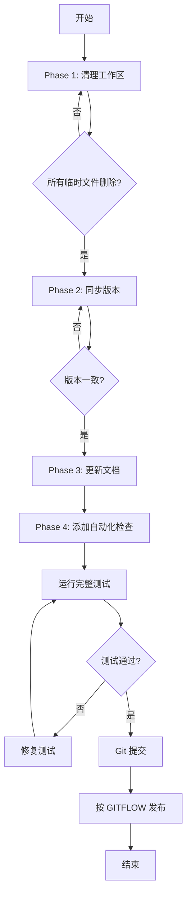

# 设计方案：致命问题系统性修复

## 设计原则

作为顶级 GitHub 开发者，遵循以下原则：

1. **原子性提交**：每个问题一次提交，便于回滚
2. **测试驱动**：修复前验证，修复后再次验证
3. **文档先行**：所有更改必须更新相关文档
4. **自动化优先**：能自动化的绝不手动
5. **向后兼容**：不破坏现有功能

## 修复策略（按优先级）

### Phase 1: 清理工作区（Critical - 立即执行）

#### Fix 1: 版本号同步
```bash
# 方案A: 使用现有同步脚本
uv run python scripts/sync_version_minimal.py

# 方案B: 如果脚本失败，手动同步
# 1. 读取 pyproject.toml 的版本
# 2. 更新 __init__.py
# 3. 更新 mcp/server.py 的 server_version
```

**实现细节:**
```python
# scripts/sync_version_minimal.py 应该做：
# 1. 从 pyproject.toml 提取版本（TOML 解析）
# 2. 更新 __init__.py 的 __version__
# 3. 更新 mcp/server.py 的 MCP_INFO["version"]
# 4. 验证所有文件同步成功
```

#### Fix 2: 删除临时文件
```bash
# 删除所有 tmpclaude-* 目录
find . -maxdepth 1 -type d -name "tmpclaude-*" -exec rm -rf {} +

# 删除 planning-with-files/ 临时目录
rm -rf planning-with-files/
```

#### Fix 3: 更新 .gitignore
```gitignore
# 在 .gitignore 末尾添加：

# Claude Code / AI Assistant 临时文件
tmpclaude-*
planning-with-files/

# Claude Code - 只忽略本地设置（项目设置应该提交）
.claude/settings.local.json
.claude/temp/
.claude/*.log

# Kiro planning session logs（progress.md 是临时的，不应提交）
.kiro/specs/*/progress.md
.kiro/specs/*/implementation_log.md

# 其他 AI 工具临时文件
.cursor/temp/
.roo/temp/
```

**重要策略变更**:
- ✅ `.claude/settings.json` - 项目级配置，应该提交（团队共享）
- ❌ `.claude/settings.local.json` - 个人本地配置，应该忽略

#### Fix 4: 清理 __pycache__
```bash
# 删除所有 __pycache__ 和 .pyc 文件
find tree_sitter_analyzer tests -type d -name "__pycache__" -exec rm -rf {} + 2>/dev/null || true
find tree_sitter_analyzer tests -name "*.pyc" -delete 2>/dev/null || true

# 确保 .gitignore 正确设置（已有）
# __pycache__/
# *.py[cod]
```

#### Fix 5: Git 状态清理
```bash
# .claude/settings.json 应该保留提交（项目级配置）
# .claude/settings.local.json 应该忽略（个人配置）

# 如果 settings.local.json 被暂存，取消暂存
git restore --staged .claude/settings.local.json 2>/dev/null || true

# CLAUDE.md 应该提交（这是重要的项目文档）
```

**配置文件策略**:
```
.claude/
├── settings.json         # ✅ 提交（项目配置）
└── settings.local.json   # ❌ 忽略（个人配置）
```

### Phase 2: 文档更新（High Priority）

#### Fix 6: 更新 README.md 测试数量
```bash
# 当前统计
collected 8405 items

# 需要更新的位置：
# - README.md: 测试徽章
# - README_zh.md: 相应位置
# - README_ja.md: 相应位置
```

**查找替换模式:**
```
8409 → 8405
8,409 → 8,405
```

#### Fix 7: 清理远程分支
```bash
# 识别可以删除的过时分支
git branch -r --merged | grep -E "cursor/|dependabot/" | while read branch; do
    # 验证分支是否真的过时
    # 谨慎删除，可能需要用户确认
done
```

**策略:** 暂时跳过此项，风险较高，需要团队确认。

### Phase 3: CI/CD 增强（Medium Priority）

#### Fix 8: 添加版本一致性检查

创建 `.github/workflows/version-check.yml`:
```yaml
name: Version Consistency Check

on:
  push:
    branches: [develop, main]
  pull_request:

jobs:
  version-check:
    runs-on: ubuntu-latest
    steps:
      - uses: actions/checkout@v4
      - name: Check version consistency
        run: |
          # 提取版本
          PYPROJECT_VERSION=$(grep '^version = ' pyproject.toml | sed 's/version = "\(.*\)"/\1/')
          INIT_VERSION=$(grep '^__version__ = ' tree_sitter_analyzer/__init__.py | sed 's/__version__ = "\(.*\)"/\1/')

          # 对比
          if [ "$PYPROJECT_VERSION" != "$INIT_VERSION" ]; then
            echo "❌ Version mismatch!"
            echo "pyproject.toml: $PYPROJECT_VERSION"
            echo "__init__.py: $INIT_VERSION"
            exit 1
          fi

          echo "✅ Versions consistent: $PYPROJECT_VERSION"
```

#### Fix 9: 添加 pre-commit 钩子

创建 `.pre-commit-config.yaml`:
```yaml
repos:
  - repo: local
    hooks:
      - id: version-sync-check
        name: Check version synchronization
        entry: python scripts/check_version_sync.py
        language: python
        pass_filenames: false
        always_run: true

      - id: clean-temp-files
        name: Remove temporary files
        entry: sh -c 'find . -maxdepth 1 -name "tmpclaude-*" -type d | head -1 | grep -q . && exit 1 || exit 0'
        language: system
        pass_filenames: false
```

创建 `scripts/check_version_sync.py`:
```python
#!/usr/bin/env python3
"""检查版本号一致性"""
import sys
import re

def get_pyproject_version():
    with open('pyproject.toml') as f:
        for line in f:
            if line.startswith('version = '):
                return line.split('"')[1]
    return None

def get_init_version():
    with open('tree_sitter_analyzer/__init__.py') as f:
        for line in f:
            if '__version__' in line:
                return line.split('"')[1]
    return None

def main():
    pyproject_ver = get_pyproject_version()
    init_ver = get_init_version()

    if pyproject_ver != init_ver:
        print(f"❌ Version mismatch!")
        print(f"pyproject.toml: {pyproject_ver}")
        print(f"__init__.py: {init_ver}")
        print("\nRun: uv run python scripts/sync_version_minimal.py")
        sys.exit(1)

    print(f"✅ Versions consistent: {pyproject_ver}")
    sys.exit(0)

if __name__ == '__main__':
    main()
```

### Phase 4: 验证与测试

#### 验证清单

```bash
# 1. 版本一致性
python scripts/check_version_sync.py

# 2. 代码质量
uv run ruff check .
uv run mypy tree_sitter_analyzer/

# 3. 测试通过
uv run pytest tests/ -v

# 4. Git 状态清洁
git status
# 应该只有计划的变更

# 5. 文档准确性
# 手动检查 README.md 的数字
```

## 修复流程图



## 发布策略

按照 GITFLOW_zh.md：

### 步骤 1: 创建 Release 分支
```bash
git fetch origin
git checkout develop
git pull origin develop

# 假设发布 v1.10.5（修复后的下一个版本）
git checkout -b release/v1.10.5
```

### 步骤 2: 版本更新
```bash
# 1. 更新 pyproject.toml → 1.10.5
# 2. 运行同步脚本
uv run python scripts/sync_version_minimal.py

# 3. 更新 README
# - 版本号 1.10.4 → 1.10.5
# - 测试数量 8409 → 8405
# - 其他版本引用

# 4. 更新 CHANGELOG.md
```

### 步骤 3: 推送并等待 PyPI
```bash
git add .
git commit -m "chore: prepare release v1.10.5 - critical fixes"
git push origin release/v1.10.5

# 等待 GitHub Actions 完成 PyPI 发布
# 验证: pip install tree-sitter-analyzer==1.10.5 --dry-run
```

### 步骤 4: 合并到 main 和 develop
```bash
# 合并到 main
git checkout main
git merge release/v1.10.5
git tag -a v1.10.5 -m "Release v1.10.5: Critical Project Fixes"
git push origin main --tags

# 合并回 develop
git checkout develop
git merge release/v1.10.5
git push origin develop

# 删除 release 分支
git branch -d release/v1.10.5
git push origin --delete release/v1.10.5
```

### 步骤 5: 创建 GitHub Release
```bash
cat > release_message.md << 'EOF'
## v1.10.5 - 致命问题系统性修复

### 🔧 关键修复
- **版本同步**: 修复 pyproject.toml 与 __init__.py 版本不一致
- **工作区清理**: 移除所有临时文件和 __pycache__ 泄漏
- **.gitignore 完善**: 添加 AI 工具临时文件模式
- **文档准确性**: 更新测试数量统计（8405）
- **自动化检查**: 新增版本一致性 CI 检查和 pre-commit 钩子

### 📊 质量指标
- 测试数量: 8405 个测试（100% 通过）
- 代码覆盖率: 80.33%
- 类型安全: 100% mypy 合规
- Linting: 0 错误

### 🛡️ 质量保证
- 添加自动版本同步检查
- 添加 pre-commit 钩子防止临时文件提交
- 完整清理工作区污染

### ⚡ 开发者影响
- 提高了代码库清洁度
- 防止未来版本不一致
- 改进了 CI/CD 流程可靠性
EOF

gh release create v1.10.5 \
    --title "Release v1.10.5: Critical Project Fixes" \
    --notes-file release_message.md \
    --target main

rm release_message.md
```

## 回滚计划

如果发布失败：

```bash
# 1. 回滚 Git 标签
git tag -d v1.10.5
git push origin :refs/tags/v1.10.5

# 2. 回滚 main 分支
git checkout main
git reset --hard HEAD~1
git push origin main --force

# 3. 分析失败原因
# 4. 修复后重新发布
```

## 预期结果

✅ **版本一致**: 所有位置显示 1.10.5
✅ **工作区清洁**: `git status` 显示 "working tree clean"
✅ **测试通过**: 8405/8405 tests passing
✅ **文档准确**: README 数据与实际一致
✅ **自动化保护**: CI/CD 防止未来类似问题
✅ **成功发布**: PyPI 和 GitHub Release 完成
