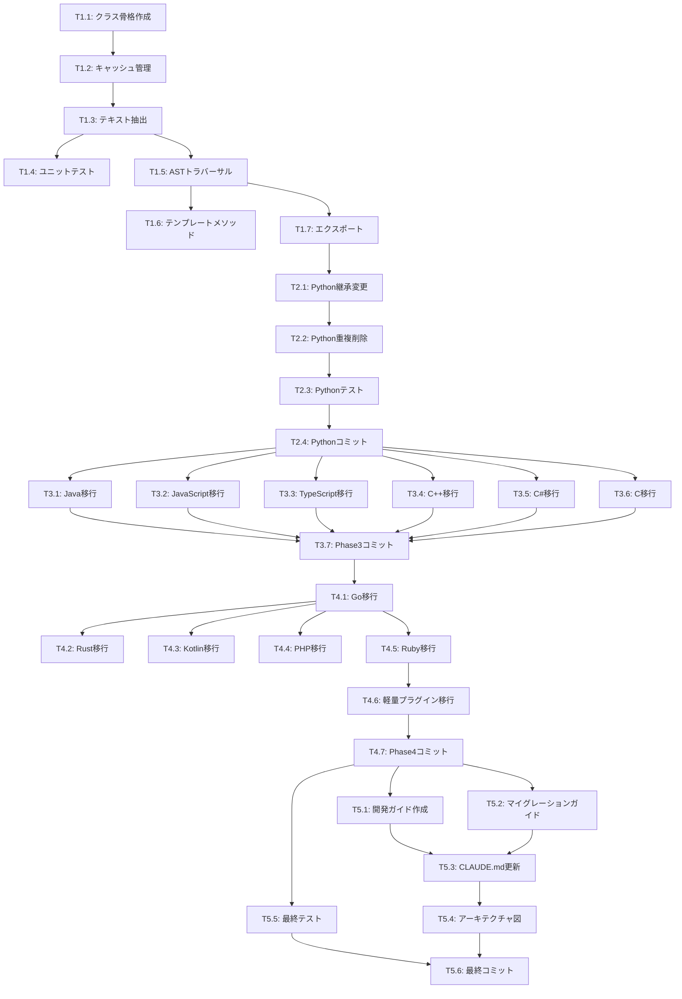

# Plugin Base Class Extraction - Tasks

> **⚠️ ARCHIVED - 初期計画ドキュメント**
>
> このドキュメントは初期計画段階で作成されましたが、実際のプロジェクトは**Layered Refactoring (LR-1 through LR-6)** という異なるアプローチで完了しました。
>
> **実際の実装:**
> - ✅ 3層アーキテクチャ採用 (CachedElementExtractor → Programming/MarkupLanguageExtractor → 18言語プラグイン)
> - ✅ Phase LR-1 ~ LR-6 完了
> - ✅ BaseElementExtractor (497行) 削除済み
> - ✅ 全テスト通過 (4985/4986, 99.98%)
> - ✅ コード削減: ~2,000行以上
>
> **完了レポート:**
> - [LAYERED_REFACTORING_TASKS.md](./LAYERED_REFACTORING_TASKS.md)
> - [PHASE_LR6_FINAL_REPORT.md](./PHASE_LR6_FINAL_REPORT.md)
>
> **Status:** ✅ **COMPLETED** (異なるアプローチで実装完了)
> **Last Updated:** 2026-01-15

## タスク概要

このドキュメントは、プラグイン重複コード解消プロジェクトの実装タスクを定義する。

**推定期間:** 3-5日
**検証基準:** 全テスト通過、2,000行削減、パフォーマンス維持

---

## Phase 0: 準備作業

### T0.1: ベースラインメトリクス取得 (P0)
**Status:** pending
**Objective:** 実装開始前に現状のパフォーマンスと品質メトリクスを記録する

**Tasks:**
- [ ] feature branchの作成
  ```bash
  git checkout -b feature/plugin-base-class-extraction
  ```
- [ ] 全テストの実行と結果記録
  ```bash
  uv run pytest tests/ -v --tb=short 2>&1 | tee baseline_test_results.txt
  ```
- [ ] パフォーマンスベンチマークの実行
  ```bash
  uv run pytest tests/benchmarks/ -v 2>&1 | tee baseline_benchmarks.txt
  ```
- [ ] カバレッジレポートの生成
  ```bash
  uv run pytest tests/ --cov=tree_sitter_analyzer --cov-report=html
  ```
- [ ] 各主要プラグインの行数を記録
  ```bash
  wc -l tree_sitter_analyzer/languages/*_plugin.py
  ```
- [ ] 結果をprogress.mdに記録

**Acceptance Criteria:**
- 全8,405テストが通過している
- ベンチマーク結果がprogress.mdに記録されている
- 現状の各プラグインの行数が記録されている
- feature branchが作成されている

**Files to Modify:**
- `.kiro/specs/plugin-base-class-extraction/progress.md`

**Dependencies:** なし

---

## Phase 1: BaseElementExtractor基底クラスの作成

### T1.1: 新規ファイルとクラス骨格の作成
**Status:** pending
**Objective:** BaseElementExtractorクラスの基本構造を作成する

**Tasks:**
- [ ] 新規ファイル作成: `tree_sitter_analyzer/plugins/base_element_extractor.py`
- [ ] クラス定義とdocstring作成
- [ ] `ElementExtractor`からの継承設定
- [ ] 型ヒントのインポート

**Acceptance Criteria:**
- ファイルが作成され、mypyが通る
- クラスがインスタンス化できる
- docstringが完備されている

**Files to Modify:**
- 新規: `tree_sitter_analyzer/plugins/base_element_extractor.py`

---

### T1.2: キャッシュ管理機能の実装 (P0)
**Status:** pending
**Objective:** 共通キャッシュ初期化とリセットメソッドを実装する

**Tasks:**
- [ ] `__init__()`の実装
  - `_node_text_cache: dict[tuple[int, int], str]`
  - `_processed_nodes: set[int]`
  - `_element_cache: dict[tuple[int, str], Any]`
  - `source_code: str`
  - `content_lines: list[str]`
  - `_file_encoding: str`
- [ ] `_reset_caches()`の実装
- [ ] `_initialize_source(source_code, encoding)`の実装

**Acceptance Criteria:**
- キャッシュが正しく初期化される
- `_reset_caches()`で全キャッシュがクリアされる
- `_initialize_source()`でソースコードとキャッシュが初期化される
- 型ヒントが完全

**Files to Modify:**
- `tree_sitter_analyzer/plugins/base_element_extractor.py`

**Estimated Lines:** ~50 lines

---

### T1.3: ノードテキスト抽出機能の実装 (P0)
**Status:** pending
**Objective:** 共通のノードテキスト抽出ロジックを実装する

**Tasks:**
- [ ] `_get_node_text_optimized(node, use_byte_offsets)`の実装
  - キャッシュチェック
  - バイトベース/位置ベースの切り替え
  - エラーハンドリング
- [ ] `_extract_text_by_bytes(node)`の実装
  - `encoding_utils`の使用
  - バイトオフセットによる抽出
- [ ] `_extract_text_by_position(node)`の実装
  - 行/列位置による抽出
  - 単一行/複数行の処理
  - 境界チェック

**Acceptance Criteria:**
- バイトベース抽出が正しく動作
- 位置ベース抽出がフォールバックとして機能
- マルチバイト文字を正しく処理
- キャッシュが機能する
- エラー時に空文字列を返す

**Files to Modify:**
- `tree_sitter_analyzer/plugins/base_element_extractor.py`

**Estimated Lines:** ~100 lines

**Dependencies:** T1.2完了後

---

### T1.4: ユニットテストの作成
**Status:** pending
**Objective:** BaseElementExtractorの動作を検証するユニットテストを作成

**Tasks:**
- [ ] テストファイル作成: `tests/unit/test_base_element_extractor.py`
- [ ] テストケース実装:
  - `test_init_caches` - キャッシュ初期化
  - `test_reset_caches` - キャッシュリセット
  - `test_initialize_source` - ソースコード初期化
  - `test_get_node_text_by_bytes` - バイトベース抽出
  - `test_get_node_text_by_position` - 位置ベース抽出
  - `test_get_node_text_with_multibyte` - マルチバイト文字
  - `test_get_node_text_caching` - キャッシュ機能
  - `test_get_node_text_error_handling` - エラーハンドリング
  - `test_extract_text_boundary_cases` - 境界ケース

**Acceptance Criteria:**
- 全テストが通過
- カバレッジ90%以上
- エッジケースがカバーされている

**Files to Modify:**
- 新規: `tests/unit/test_base_element_extractor.py`

**Estimated Lines:** ~300 lines

**Dependencies:** T1.3完了後

---

### T1.5: ASTトラバーサル機能の実装 (P1)
**Status:** pending
**Objective:** 汎用的な反復的ASTトラバーサルを実装する

**Tasks:**
- [ ] `_get_container_node_types()`の実装（デフォルト実装）
- [ ] `_traverse_and_extract_iterative()`の実装
  - スタックベースのトラバーサル
  - 深さ制限チェック
  - キャッシュチェックと抽出
  - エラーハンドリング
- [ ] `_append_element_to_results()`ヘルパーの実装
- [ ] `_push_children_to_stack()`ヘルパーの実装

**Acceptance Criteria:**
- トラバーサルが正しく動作
- 深さ制限が機能
- Mockオブジェクトに対応
- キャッシュが機能

**Files to Modify:**
- `tree_sitter_analyzer/plugins/base_element_extractor.py`

**Estimated Lines:** ~120 lines

**Dependencies:** T1.3完了後

---

### T1.6: テンプレートメソッドパターンの実装 (P2, Optional)
**Status:** pending
**Objective:** 複雑度計算などのテンプレートメソッドを実装

**Tasks:**
- [ ] `_calculate_complexity_optimized(node)`の実装
- [ ] `_get_decision_keywords()`の実装（デフォルト実装）

**Acceptance Criteria:**
- 複雑度計算が正しく動作
- サブクラスでオーバーライド可能

**Files to Modify:**
- `tree_sitter_analyzer/plugins/base_element_extractor.py`

**Estimated Lines:** ~50 lines

**Dependencies:** T1.5完了後

---

### T1.7: __init__.pyへのエクスポート追加
**Status:** pending
**Objective:** BaseElementExtractorを他のモジュールから利用可能にする

**Tasks:**
- [ ] `tree_sitter_analyzer/plugins/__init__.py`に追加
  ```python
  from .base_element_extractor import BaseElementExtractor
  __all__ = [..., "BaseElementExtractor"]
  ```

**Acceptance Criteria:**
- インポートが機能する

**Files to Modify:**
- `tree_sitter_analyzer/plugins/__init__.py`

**Dependencies:** T1.5完了後

---

## Phase 2: パイロットプラグインの移行（Python Plugin）

### T2.1: PythonElementExtractorの継承変更
**Status:** pending
**Objective:** BaseElementExtractorを継承するよう変更

**Tasks:**
- [ ] インポート追加: `from ..plugins.base_element_extractor import BaseElementExtractor`
- [ ] クラス定義変更: `class PythonElementExtractor(BaseElementExtractor):`
- [ ] `__init__()`を修正
  - `super().__init__()`呼び出し
  - Python固有のキャッシュのみ残す（`_docstring_cache`など）

**Acceptance Criteria:**
- クラスが正しく継承される
- インスタンス化が成功する

**Files to Modify:**
- `tree_sitter_analyzer/languages/python_plugin.py`

**Dependencies:** Phase 1完了後

---

### T2.2: 重複メソッドの削除
**Status:** pending
**Objective:** 親クラスと重複するメソッドを削除

**Tasks:**
- [ ] `_reset_caches()`を削除またはオーバーライドに変更
  ```python
  def _reset_caches(self):
      super()._reset_caches()
      self._docstring_cache.clear()  # Python固有のキャッシュのみ
  ```
- [ ] `_get_node_text_optimized()`を削除
- [ ] キャッシュ初期化コードを`__init__()`から削除
  - `_node_text_cache`
  - `_processed_nodes`
  - `_element_cache`
- [ ] `_initialize_source()`呼び出しに変更
  - `extract_functions()`内
  - `extract_classes()`内

**Acceptance Criteria:**
- 重複コードが削除される
- 行数が100-200行削減される
- 機能が維持される

**Files to Modify:**
- `tree_sitter_analyzer/languages/python_plugin.py`

**Dependencies:** T2.1完了後

---

### T2.3: Pythonテストの実行と検証
**Status:** pending
**Objective:** Python関連の全テストが通過することを確認

**Tasks:**
- [ ] ユニットテストの実行
  ```bash
  uv run pytest tests/unit/ -k python -v
  ```
- [ ] 統合テストの実行
  ```bash
  uv run pytest tests/integration/ -k python -v
  ```
- [ ] パフォーマンスベンチマークの実行
  ```bash
  uv run pytest tests/benchmarks/ -k python -v
  ```
- [ ] エラーがあれば修正

**Acceptance Criteria:**
- 全Pythonテストが通過（約1,500テスト）
- ベンチマークが±5%以内
- Golden Master一致

**Dependencies:** T2.2完了後

---

### T2.4: コミットとレビュー
**Status:** pending
**Objective:** Python Pluginの変更をコミット

**Tasks:**
- [ ] git commit with message:
  ```
  refactor(plugins): migrate PythonElementExtractor to BaseElementExtractor

  - Inherit from BaseElementExtractor
  - Remove duplicate cache management code
  - Remove duplicate node text extraction code
  - Reduced code by ~150 lines

  All tests passing (1,500+ Python tests)
  Performance benchmarks within ±5%

  Co-Authored-By: Claude Sonnet 4.5 <noreply@anthropic.com>
  ```

**Acceptance Criteria:**
- コミットメッセージが明確
- 変更がコミットされる

**Dependencies:** T2.3完了後

---

## Phase 3: 主要プラグインの一括移行

### T3.1: Java Pluginの移行
**Status:** pending
**Objective:** JavaElementExtractorをBaseElementExtractorに移行

**Tasks:**
- [ ] 継承変更
- [ ] 重複メソッド削除
- [ ] `_get_container_node_types()`オーバーライド
  ```python
  def _get_container_node_types(self):
      return super()._get_container_node_types() | {
          "class_body",
          "interface_body",
          "enum_body",
          "enum_body_declarations",
      }
  ```
- [ ] Java固有キャッシュ管理
  - `_annotation_cache`
  - `_signature_cache`
- [ ] テスト実行: `uv run pytest tests/ -k java -v`

**Acceptance Criteria:**
- 全Javaテストが通過
- 150-200行削減
- パフォーマンス維持

**Files to Modify:**
- `tree_sitter_analyzer/languages/java_plugin.py`

**Dependencies:** Phase 2完了後

---

### T3.2: JavaScript Pluginの移行
**Status:** pending
**Objective:** JavaScriptElementExtractorを移行

**Tasks:**
- T3.1と同じプロセス
- [ ] テスト実行: `uv run pytest tests/ -k javascript -v`

**Acceptance Criteria:**
- 全JavaScriptテストが通過
- 100-150行削減

**Files to Modify:**
- `tree_sitter_analyzer/languages/javascript_plugin.py`

**Dependencies:** T3.1完了後（並列可能）

---

### T3.3: TypeScript Pluginの移行
**Status:** pending
**Objective:** TypeScriptElementExtractorを移行

**Tasks:**
- T3.1と同じプロセス
- [ ] テスト実行: `uv run pytest tests/ -k typescript -v`

**Acceptance Criteria:**
- 全TypeScriptテストが通過
- 100-150行削減

**Files to Modify:**
- `tree_sitter_analyzer/languages/typescript_plugin.py`

**Dependencies:** T3.1完了後（並列可能）

---

### T3.4: C++ Pluginの移行
**Status:** pending
**Objective:** CppElementExtractorを移行

**Tasks:**
- T3.1と同じプロセス
- [ ] テスト実行: `uv run pytest tests/ -k cpp -v`

**Acceptance Criteria:**
- 全C++テストが通過
- 150-200行削減

**Files to Modify:**
- `tree_sitter_analyzer/languages/cpp_plugin.py`

**Dependencies:** T3.1完了後（並列可能）

---

### T3.5: C# Pluginの移行
**Status:** pending
**Objective:** CSharpElementExtractorを移行

**Tasks:**
- T3.1と同じプロセス
- [ ] テスト実行: `uv run pytest tests/ -k csharp -v`

**Acceptance Criteria:**
- 全C#テストが通過
- 100-150行削減

**Files to Modify:**
- `tree_sitter_analyzer/languages/csharp_plugin.py`

**Dependencies:** T3.1完了後（並列可能）

---

### T3.6: C Pluginの移行
**Status:** pending
**Objective:** CElementExtractorを移行

**Tasks:**
- T3.1と同じプロセス
- [ ] テスト実行: `uv run pytest tests/ -k " c " -v` (注: スペースで "c" を囲むことでcppと区別)

**Acceptance Criteria:**
- 全Cテストが通過
- 100-150行削減

**Files to Modify:**
- `tree_sitter_analyzer/languages/c_plugin.py`

**Dependencies:** T3.1完了後（並列可能）

---

### T3.7: Phase 3のコミット
**Status:** pending
**Objective:** 主要プラグインの変更をコミット

**Tasks:**
- [ ] 全主要プラグインテストの実行
  ```bash
  uv run pytest tests/ -v
  ```
- [ ] git commit with message:
  ```
  refactor(plugins): migrate major language plugins to BaseElementExtractor

  Migrated plugins:
  - JavaElementExtractor (~180 lines removed)
  - JavaScriptElementExtractor (~120 lines removed)
  - TypeScriptElementExtractor (~130 lines removed)
  - CppElementExtractor (~170 lines removed)
  - CSharpElementExtractor (~110 lines removed)
  - CElementExtractor (~120 lines removed)

  Total: ~830 lines removed

  All tests passing (8,405 tests)

  Co-Authored-By: Claude Sonnet 4.5 <noreply@anthropic.com>
  ```

**Acceptance Criteria:**
- 全テストが通過
- 800行以上削減

**Dependencies:** T3.1-T3.6完了後

---

## Phase 4: 残りプラグインの移行

### T4.1: Go Pluginの移行
**Status:** pending
**Objective:** GoElementExtractorを移行

**Tasks:**
- T3.1と同じプロセス
- [ ] テスト実行

**Files to Modify:**
- `tree_sitter_analyzer/languages/go_plugin.py`

**Dependencies:** Phase 3完了後

---

### T4.2: Rust Pluginの移行
**Status:** pending
**Objective:** RustElementExtractorを移行

**Tasks:**
- T3.1と同じプロセス
- [ ] テスト実行

**Files to Modify:**
- `tree_sitter_analyzer/languages/rust_plugin.py`

**Dependencies:** T4.1完了後（並列可能）

---

### T4.3: Kotlin Pluginの移行
**Status:** pending
**Objective:** KotlinElementExtractorを移行

**Tasks:**
- T3.1と同じプロセス
- [ ] テスト実行

**Files to Modify:**
- `tree_sitter_analyzer/languages/kotlin_plugin.py`

**Dependencies:** T4.1完了後（並列可能）

---

### T4.4: PHP Pluginの移行
**Status:** pending
**Objective:** PhpElementExtractorを移行

**Tasks:**
- T3.1と同じプロセス
- [ ] テスト実行

**Files to Modify:**
- `tree_sitter_analyzer/languages/php_plugin.py`

**Dependencies:** T4.1完了後（並列可能）

---

### T4.5: Ruby Pluginの移行
**Status:** pending
**Objective:** RubyElementExtractorを移行

**Tasks:**
- T3.1と同じプロセス
- [ ] テスト実行

**Files to Modify:**
- `tree_sitter_analyzer/languages/ruby_plugin.py`

**Dependencies:** T4.1完了後（並列可能）

---

### T4.6: 軽量プラグインの移行（SQL, Markdown, CSS, HTML, YAML）
**Status:** pending
**Objective:** 残りの軽量プラグインを一括移行

**Tasks:**
- [ ] SQL Plugin移行
- [ ] Markdown Plugin移行
- [ ] CSS Plugin移行
- [ ] HTML Plugin移行
- [ ] YAML Plugin移行
- [ ] 各プラグインのテスト実行

**Acceptance Criteria:**
- 全テストが通過
- 各プラグインで30-50行削減

**Files to Modify:**
- `tree_sitter_analyzer/languages/sql_plugin.py`
- `tree_sitter_analyzer/languages/markdown_plugin.py`
- `tree_sitter_analyzer/languages/css_plugin.py`
- `tree_sitter_analyzer/languages/html_plugin.py`
- `tree_sitter_analyzer/languages/yaml_plugin.py`

**Dependencies:** T4.5完了後

---

### T4.7: Phase 4のコミット
**Status:** pending
**Objective:** 残りプラグインの変更をコミット

**Tasks:**
- [ ] 全テストの実行
- [ ] git commit

**Acceptance Criteria:**
- 全テスト通過
- さらに600行以上削減

**Dependencies:** T4.6完了後

---

## Phase 5: ドキュメントとクリーンアップ

### T5.1: プラグイン開発ガイドの作成
**Status:** pending
**Objective:** 新しいプラグインを追加するためのガイドを作成

**Tasks:**
- [ ] ファイル作成: `docs/plugin-development-guide.md`
- [ ] 内容:
  - BaseElementExtractorの概要
  - 最小限のプラグイン実装例
  - フックメソッドのカスタマイズ方法
  - テストの書き方
  - よくある問題と解決策

**Acceptance Criteria:**
- ガイドが完備されている
- サンプルコードが動作する

**Files to Modify:**
- 新規: `docs/plugin-development-guide.md`

**Dependencies:** Phase 4完了後

---

### T5.2: マイグレーションガイドの作成
**Status:** pending
**Objective:** 既存プラグインのメンテナンス者向けガイド

**Tasks:**
- [ ] ファイル作成: `docs/migration-guide.md`
- [ ] 内容:
  - なぜ移行したか
  - Before/Afterのコード例
  - よくある移行パターン
  - トラブルシューティング

**Acceptance Criteria:**
- ガイドが完備されている

**Files to Modify:**
- 新規: `docs/migration-guide.md`

**Dependencies:** Phase 4完了後

---

### T5.3: CLAUDE.mdの更新
**Status:** pending
**Objective:** プロジェクトのメイン指示ファイルを更新

**Tasks:**
- [ ] アーキテクチャセクションの更新
  - BaseElementExtractorの追加
  - 継承図の更新
- [ ] プラグイン開発セクションの追加
- [ ] 新しいプラグイン追加の手順更新

**Acceptance Criteria:**
- CLAUDE.mdが最新状態

**Files to Modify:**
- `CLAUDE.md`

**Dependencies:** T5.1, T5.2完了後

---

### T5.4: アーキテクチャ図の作成
**Status:** pending
**Objective:** 視覚的なアーキテクチャドキュメント

**Tasks:**
- [ ] Mermaid図の作成（継承階層）
- [ ] データフロー図の作成
- [ ] `docs/architecture.md`への追加

**Acceptance Criteria:**
- 図が明確で理解しやすい

**Files to Modify:**
- `docs/architecture.md`

**Dependencies:** T5.3完了後

---

### T5.5: 最終的な全テスト実行
**Status:** pending
**Objective:** プロジェクト全体の動作を検証

**Tasks:**
- [ ] 全ユニットテストの実行
  ```bash
  uv run pytest tests/unit/ -v
  ```
- [ ] 全統合テストの実行
  ```bash
  uv run pytest tests/integration/ -v
  ```
- [ ] 全リグレッションテストの実行
  ```bash
  uv run pytest tests/regression/ -m regression
  ```
- [ ] 全ベンチマークテストの実行
  ```bash
  uv run pytest tests/benchmarks/ -v
  ```
- [ ] Golden Masterテストの検証
- [ ] 型チェックの実行
  ```bash
  uv run mypy tree_sitter_analyzer/
  ```
- [ ] リンティングの実行
  ```bash
  uv run python check_quality.py --new-code-only
  ```

**Acceptance Criteria:**
- 8,405テスト全て通過
- mypy 100%準拠
- リンティングエラーなし
- パフォーマンスベンチマーク±5%以内
- Golden Master一致

**Dependencies:** Phase 4完了後

---

### T5.6: 最終コミットとタグ付け
**Status:** pending
**Objective:** リファクタリングの完了をマーク

**Tasks:**
- [ ] 最終コミット
  ```
  refactor(plugins): complete plugin base class extraction

  Summary:
  - Created BaseElementExtractor with common implementation
  - Migrated all 17 language plugins
  - Removed 2,000+ lines of duplicate code
  - All 8,405 tests passing
  - Performance maintained (±5%)
  - Documentation updated

  Breaking Changes: None (internal refactoring only)

  Co-Authored-By: Claude Sonnet 4.5 <noreply@anthropic.com>
  ```
- [ ] CHANGELOGの更新（バージョン記載）
- [ ] gitタグの作成（オプション）

**Acceptance Criteria:**
- プロジェクトが安定している
- ドキュメントが完備されている

**Dependencies:** T5.5完了後

---

## タスク依存関係図



---

## 優先度サマリー

### P0（必須）
- Phase 1: T1.1 - T1.5, T1.7
- Phase 2: T2.1 - T2.4
- Phase 3: T3.1 - T3.7
- Phase 4: T4.1 - T4.7

### P1（重要）
- Phase 5: T5.1 - T5.6

### P2（できれば）
- T1.6: テンプレートメソッドパターン

---

## 進捗トラッキング

**完了タスク:** 0/40
**進捗率:** 0%

**Phase別進捗:**
- Phase 1: 0/7 タスク
- Phase 2: 0/4 タスク
- Phase 3: 0/7 タスク
- Phase 4: 0/7 タスク
- Phase 5: 0/6 タスク

---

## 次のアクション

このtasks.mdが承認されたら、Phase 1のタスクから実装を開始する。

**最初のタスク:** T1.1（クラス骨格作成）
