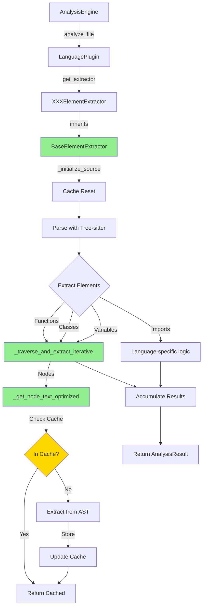

# Plugin Base Class Extraction - Design Document

## 技術選型（Technology Choices）

### 継承階層の設計

```
ABC (Abstract Base Class)
└── ElementExtractor (現在: インターフェースのみ)
    └── BaseElementExtractor (新規: 共通実装を含む具象基底クラス)
        ├── JavaElementExtractor
        ├── PythonElementExtractor
        ├── TypeScriptElementExtractor
        └── ... (14言語プラグイン)
```

**設計判断:**
- `ElementExtractor`を抽象インターフェースとして保持（後方互換性）
- 新しい`BaseElementExtractor`を具象基底クラスとして追加
- 既存のプラグインは`BaseElementExtractor`を継承するように段階的に移行

### 共通メソッドの分類

#### Category 1: キャッシュ管理（全プラグイン共通）

| メソッド | 重複数 | 実装の一貫性 | 優先度 |
|---------|--------|------------|-------|
| `_reset_caches()` | 14/17 | 高い | P0 |
| `__init__()` (cache初期化) | 14/17 | 高い | P0 |

#### Category 2: ノードテキスト抽出（主要プラグイン共通）

| メソッド | 重複数 | 実装の一貫性 | 優先度 |
|---------|--------|------------|-------|
| `_get_node_text_optimized()` | 10/17 | 中程度 | P0 |
| `_extract_text_by_position()` | 8/17 | 高い | P1 |

**実装の違い:**
- Python: UTF-8エンコーディング最適化
- Java: バイト位置ベースのキャッシュキー
- JavaScript: 一部でバイトオフセットを使用しない実装

**統一方針:** エンコーディングを引数で渡せるようにし、デフォルトはUTF-8

#### Category 3: ASTトラバーサル（Java系言語に共通）

| メソッド | 重複数 | 実装の一貫性 | 優先度 |
|---------|--------|------------|-------|
| `_traverse_and_extract_iterative()` | 6/17 | 中程度 | P1 |

**実装の違い:**
- コンテナノードタイプが言語ごとに異なる
- フィールドのバッチ処理がJava/Kotlin/C#にのみ存在

**統一方針:** コンテナノードタイプをサブクラスでオーバーライド可能なプロパティとして定義

#### Category 4: 最適化された抽出メソッド（言語固有要素あり）

| メソッド | 重複数 | 実装の一貫性 | 優先度 |
|---------|--------|------------|-------|
| `_extract_function_optimized()` | 8/17 | 低い | P2 |
| `_extract_class_optimized()` | 8/17 | 低い | P2 |

**実装の違い:**
- 言語ごとにシグネチャ解析ロジックが大きく異なる
- 修飾子、可視性の判定ロジックが言語固有

**統一方針:** テンプレートメソッドパターンを使用し、言語固有部分はフックメソッドとして定義

## アーキテクチャ設計（Architecture Design）

### クラス構造

```python
# tree_sitter_analyzer/plugins/base_element_extractor.py (新規)

class BaseElementExtractor(ElementExtractor):
    """
    Concrete base class providing common implementation for language plugins.

    Provides:
    - Cache management (node text, processed nodes, elements)
    - Generic AST traversal algorithms
    - Node text extraction with encoding support
    - Performance monitoring hooks
    """

    def __init__(self) -> None:
        super().__init__()

        # 共通キャッシュ (P0: 全プラグインで使用)
        self._node_text_cache: dict[tuple[int, int], str] = {}
        self._processed_nodes: set[int] = set()
        self._element_cache: dict[tuple[int, str], Any] = {}

        # 言語固有キャッシュ (サブクラスで追加可能)
        # JavaElementExtractor: _annotation_cache, _signature_cache
        # PythonElementExtractor: _docstring_cache

        # コンテンツ管理
        self.source_code: str = ""
        self.content_lines: list[str] = []
        self._file_encoding: str = "utf-8"

    # --- P0: Cache Management ---

    def _reset_caches(self) -> None:
        """Reset all performance caches - call before analyzing new file"""
        self._node_text_cache.clear()
        self._processed_nodes.clear()
        self._element_cache.clear()
        # サブクラスで追加キャッシュをクリアする場合はオーバーライド

    def _initialize_source(self, source_code: str, encoding: str = "utf-8") -> None:
        """Initialize source code for processing"""
        self.source_code = source_code
        self.content_lines = source_code.split("\n")
        self._file_encoding = encoding
        self._reset_caches()

    # --- P0: Node Text Extraction ---

    def _get_node_text_optimized(
        self,
        node: "tree_sitter.Node",
        use_byte_offsets: bool = True
    ) -> str:
        """
        Extract text from AST node with caching.

        Args:
            node: Tree-sitter node
            use_byte_offsets: Use byte-based extraction (recommended for UTF-8)

        Returns:
            Extracted text string
        """
        cache_key = (node.start_byte, node.end_byte)

        if cache_key in self._node_text_cache:
            return self._node_text_cache[cache_key]

        text = ""
        try:
            if use_byte_offsets:
                # 優先: バイトベースの抽出
                text = self._extract_text_by_bytes(node)
            else:
                # フォールバック: 行/列ベースの抽出
                text = self._extract_text_by_position(node)
        except Exception as e:
            log_error(f"Node text extraction failed: {e}")
            text = ""

        self._node_text_cache[cache_key] = text
        return text

    def _extract_text_by_bytes(self, node: "tree_sitter.Node") -> str:
        """Extract text using byte offsets (UTF-8 optimized)"""
        from ..encoding_utils import extract_text_slice, safe_encode

        content_bytes = safe_encode("\n".join(self.content_lines), self._file_encoding)
        return extract_text_slice(
            content_bytes,
            node.start_byte,
            node.end_byte,
            self._file_encoding
        )

    def _extract_text_by_position(self, node: "tree_sitter.Node") -> str:
        """Extract text using line/column positions (fallback)"""
        start_point = node.start_point
        end_point = node.end_point

        # 境界チェック
        if not (0 <= start_point[0] < len(self.content_lines)):
            return ""
        if not (0 <= end_point[0] < len(self.content_lines)):
            return ""

        # 単一行の場合
        if start_point[0] == end_point[0]:
            line = self.content_lines[start_point[0]]
            start_col = max(0, min(start_point[1], len(line)))
            end_col = max(start_col, min(end_point[1], len(line)))
            return line[start_col:end_col]

        # 複数行の場合
        lines = []
        for i in range(start_point[0], end_point[0] + 1):
            if i >= len(self.content_lines):
                break

            line = self.content_lines[i]
            if i == start_point[0]:
                start_col = max(0, min(start_point[1], len(line)))
                lines.append(line[start_col:])
            elif i == end_point[0]:
                end_col = max(0, min(end_point[1], len(line)))
                lines.append(line[:end_col])
            else:
                lines.append(line)

        return "\n".join(lines)

    # --- P1: AST Traversal ---

    def _get_container_node_types(self) -> set[str]:
        """
        Get node types that may contain target elements.
        Override in subclasses for language-specific containers.
        """
        return {
            "program",
            "module",
            "block",
            "body",
        }

    def _traverse_and_extract_iterative(
        self,
        root_node: "tree_sitter.Node | None",
        extractors: dict[str, Any],  # node_type -> extractor_function
        results: list[Any],
        element_type: str,
        max_depth: int = 50,
    ) -> None:
        """
        Generic iterative AST traversal with element extraction.

        Args:
            root_node: Root node to start traversal
            extractors: Mapping of node types to extractor functions
            results: List to accumulate extracted elements
            element_type: Type of element being extracted (for caching)
            max_depth: Maximum traversal depth
        """
        if not root_node:
            return

        target_node_types = set(extractors.keys())
        container_node_types = self._get_container_node_types()

        node_stack = [(root_node, 0)]
        processed_nodes = 0

        while node_stack:
            current_node, depth = node_stack.pop()

            # 深度制限チェック
            if depth > max_depth:
                log_warning(f"Maximum traversal depth ({max_depth}) exceeded")
                continue

            processed_nodes += 1
            node_type = current_node.type

            # 早期終了: 関係ないノードをスキップ
            if (
                depth > 0
                and node_type not in target_node_types
                and node_type not in container_node_types
            ):
                continue

            # ターゲットノードの処理
            if node_type in target_node_types:
                node_id = id(current_node)

                # 既に処理済みならスキップ
                if node_id in self._processed_nodes:
                    continue

                # キャッシュチェック
                cache_key = (node_id, element_type)
                if cache_key in self._element_cache:
                    element = self._element_cache[cache_key]
                    self._append_element_to_results(element, results)
                    self._processed_nodes.add(node_id)
                    continue

                # 抽出とキャッシュ
                extractor = extractors.get(node_type)
                if extractor:
                    try:
                        element = extractor(current_node)
                        self._element_cache[cache_key] = element
                        self._append_element_to_results(element, results)
                        self._processed_nodes.add(node_id)
                    except Exception as e:
                        log_error(f"Element extraction failed: {e}")
                        self._processed_nodes.add(node_id)

            # 子ノードをスタックに追加
            if current_node.children:
                self._push_children_to_stack(current_node, depth, node_stack)

        log_debug(f"Iterative traversal processed {processed_nodes} nodes")

    def _append_element_to_results(self, element: Any, results: list[Any]) -> None:
        """Helper to append element(s) to results list"""
        if element:
            if isinstance(element, list):
                results.extend(element)
            else:
                results.append(element)

    def _push_children_to_stack(
        self,
        node: "tree_sitter.Node",
        depth: int,
        stack: list[tuple["tree_sitter.Node", int]],
    ) -> None:
        """Helper to push children to traversal stack"""
        try:
            children_list = list(node.children)
            # 逆順でスタックに追加（DFS順序維持）
            for child in reversed(children_list):
                stack.append((child, depth + 1))
        except (TypeError, AttributeError):
            # Mockオブジェクトなどでreversedが使えない場合のフォールバック
            try:
                children_list = list(node.children)
                for child in children_list:
                    stack.append((child, depth + 1))
            except (TypeError, AttributeError):
                pass  # 子ノードがない場合

    # --- P2: Template Method Pattern for Element Extraction ---

    def _calculate_complexity_optimized(self, node: "tree_sitter.Node") -> int:
        """
        Calculate cyclomatic complexity (can be overridden).
        Default implementation counts decision points.
        """
        complexity = 1  # Base complexity

        decision_keywords = self._get_decision_keywords()

        def count_decisions(n: "tree_sitter.Node") -> int:
            count = 0
            if n.type in decision_keywords:
                count += 1
            for child in n.children:
                count += count_decisions(child)
            return count

        complexity += count_decisions(node)
        return complexity

    def _get_decision_keywords(self) -> set[str]:
        """
        Get language-specific decision keywords.
        Override in subclasses.
        """
        return {
            "if_statement",
            "for_statement",
            "while_statement",
            "case",
            "catch",
            "and",
            "or",
        }
```

### マイグレーション戦略

#### Phase 1: BaseElementExtractor作成（1日）

**タスク:**
1. 新ファイル作成: `tree_sitter_analyzer/plugins/base_element_extractor.py`
2. P0メソッドの実装:
   - `__init__()` - キャッシュ初期化
   - `_reset_caches()` - キャッシュクリア
   - `_initialize_source()` - ソースコード初期化
   - `_get_node_text_optimized()` - ノードテキスト抽出
   - `_extract_text_by_bytes()` - バイトベース抽出
   - `_extract_text_by_position()` - 位置ベース抽出
3. ユニットテストの作成

**検証基準:**
- mypy型チェック通過
- ユニットテストカバレッジ90%以上
- 既存テストに影響なし

#### Phase 2: パイロットプラグインの移行（1日）

**パイロットプラグイン:** Python Plugin（最も頻繁に使用されている）

**タスク:**
1. `PythonElementExtractor`を`BaseElementExtractor`を継承するよう変更
2. 重複メソッドを削除:
   - `__init__()` - `super().__init__()`で置き換え
   - `_reset_caches()` - 削除（親クラスのものを使用）
   - `_get_node_text_optimized()` - 削除
3. 言語固有のキャッシュがあればオーバーライド
4. テスト実行と検証

**検証基準:**
- 全Pythonテスト通過（約1,500テスト）
- パフォーマンスベンチマークが劣化しない（±5%以内）
- コード行数が200行以上削減される

#### Phase 3: 主要プラグインの一括移行（2日）

**対象プラグイン:**
- Java Plugin
- JavaScript Plugin
- TypeScript Plugin
- C++ Plugin
- C# Plugin

**タスク（各プラグイン）:**
1. 継承元を変更
2. 重複メソッドを削除
3. `_get_container_node_types()`をオーバーライド（必要に応じて）
4. テスト実行

**並列化:**
- 各プラグインは独立しているため、1つずつ移行可能
- 1プラグインずつcommitしてテストを実行

**検証基準:**
- 各プラグインのテストが全て通過
- 統合テストが通過
- Golden Masterテストが通過

#### Phase 4: 残りプラグインの移行（1日）

**対象プラグイン:**
- Go, Rust, Kotlin, PHP, Ruby, SQL, Markdown, CSS, HTML, YAML

**タスク:**
- Phase 3と同じプロセス

#### Phase 5: P1メソッドの統合（Optional）

**タスク:**
1. `_traverse_and_extract_iterative()`をBaseに追加
2. Java系プラグインで使用していたローカル実装を削除
3. コンテナノードタイプの言語固有設定

**検証基準:**
- さらに500行削減
- パフォーマンス劣化なし

## データフロー図（Data Flow）



## API設計（API Design）

### 公開API（変更なし）

既存の公開APIは完全に維持される：

```python
# ElementExtractor (plugins/base.py) - 変更なし
class ElementExtractor(ABC):
    @abstractmethod
    def extract_functions(tree, source_code) -> list[Function]: ...
    @abstractmethod
    def extract_classes(tree, source_code) -> list[Class]: ...
    # ... その他の抽象メソッド
```

### 内部API（新規追加）

```python
# BaseElementExtractor (plugins/base_element_extractor.py) - 新規
class BaseElementExtractor(ElementExtractor):
    # Protected methods (サブクラスで使用可能)
    def _reset_caches(self) -> None: ...
    def _initialize_source(self, source_code: str, encoding: str = "utf-8") -> None: ...
    def _get_node_text_optimized(self, node, use_byte_offsets=True) -> str: ...
    def _traverse_and_extract_iterative(self, root_node, extractors, results, element_type, max_depth=50) -> None: ...

    # Hook methods (サブクラスでオーバーライド可能)
    def _get_container_node_types(self) -> set[str]: ...
    def _get_decision_keywords(self) -> set[str]: ...
```

### サブクラスでの使用例

```python
# Before (JavaElementExtractor)
class JavaElementExtractor(ElementExtractor):
    def __init__(self):
        self._node_text_cache = {}
        self._processed_nodes = set()
        # ... 50行のキャッシュ初期化

    def _reset_caches(self):
        # ... 15行のキャッシュクリア

    def _get_node_text_optimized(self, node):
        # ... 100行の実装

    def extract_functions(self, tree, source_code):
        self.source_code = source_code
        self.content_lines = source_code.split("\n")
        self._reset_caches()
        # ... 抽出ロジック

# After (JavaElementExtractor)
class JavaElementExtractor(BaseElementExtractor):
    def __init__(self):
        super().__init__()
        # Java固有のキャッシュのみ追加
        self._annotation_cache = {}
        self._signature_cache = {}

    def _reset_caches(self):
        super()._reset_caches()
        self._annotation_cache.clear()
        self._signature_cache.clear()

    def _get_container_node_types(self):
        return super()._get_container_node_types() | {
            "class_body",
            "interface_body",
            "enum_body",
        }

    def extract_functions(self, tree, source_code):
        self._initialize_source(source_code)  # ← 共通メソッド使用
        # ... 抽出ロジック（_get_node_text_optimizedも自動的に使える）
```

## 実装詳細（Implementation Details）

### キャッシュキーの設計

**問題:** プラグイン間でキャッシュキーの実装が異なる

**現状:**
- Java: `(node.start_byte, node.end_byte)` - 位置ベース
- Python: `(node.start_byte, node.end_byte)` - 位置ベース
- 一部のプラグイン: `id(node)` - オブジェクトIDベース

**統一方針:** 位置ベースキーを標準とする

```python
# 理由: 決定論的、テスト可能、再現性あり
cache_key = (node.start_byte, node.end_byte)
```

### エンコーディング処理

**問題:** UTF-8以外のエンコーディングへの対応

**実装:**
```python
def _initialize_source(self, source_code: str, encoding: str = "utf-8") -> None:
    self.source_code = source_code
    self.content_lines = source_code.split("\n")
    self._file_encoding = encoding
    self._reset_caches()
```

**使用例:**
```python
# プラグインのanalyze_file()内で
def analyze_file(self, file_path, request):
    encoding = detect_encoding(file_path) or "utf-8"
    self._initialize_source(source_code, encoding)
```

### エラーハンドリング

**統一方針:**
1. ノードテキスト抽出失敗 → 空文字列を返す（エラーログを記録）
2. 要素抽出失敗 → 要素をスキップ（エラーログを記録）
3. キャッシュアクセス失敗 → 再計算（ログなし）

```python
def _get_node_text_optimized(self, node):
    try:
        # ... 抽出ロジック
    except Exception as e:
        log_error(f"Node text extraction failed: {e}")
        return ""  # フォールバック
```

## 境界情况処理（Edge Cases）

### EC1: ネストが深いAST

**問題:** 深くネストしたコードでスタックオーバーフロー

**対策:**
```python
def _traverse_and_extract_iterative(..., max_depth: int = 50):
    if depth > max_depth:
        log_warning(f"Maximum traversal depth ({max_depth}) exceeded")
        continue
```

### EC2: Mockオブジェクト（テスト用）

**問題:** テストで使用するMockノードがreversed()をサポートしない

**対策:**
```python
try:
    children_iter = reversed(list(node.children))
except TypeError:
    children_iter = iter(list(node.children))  # フォールバック
```

### EC3: マルチバイト文字

**問題:** UTF-8のマルチバイト文字でバイトオフセットがずれる

**対策:**
```python
from ..encoding_utils import extract_text_slice, safe_encode

# encoding_utilsの既存実装を使用
text = extract_text_slice(content_bytes, start_byte, end_byte, encoding)
```

### EC4: 空のソースコード

**問題:** 空ファイルや空文字列の処理

**対策:**
```python
def _initialize_source(self, source_code: str, encoding: str = "utf-8"):
    self.source_code = source_code
    self.content_lines = source_code.split("\n") if source_code else []
```

### EC5: 言語固有のバッチ処理

**問題:** Javaのフィールド宣言など、一部の言語で特殊なバッチ処理が必要

**対策:**
```python
# BaseElementExtractorではジェネリックな実装を提供
# サブクラスで必要に応じてオーバーライド

class JavaElementExtractor(BaseElementExtractor):
    def _traverse_and_extract_iterative(self, ...):
        # Java固有のフィールドバッチ処理
        field_batch = []

        # ... カスタムロジック

        # 共通部分は super() で呼び出し可能
        super()._traverse_and_extract_iterative(...)
```

## パフォーマンス考慮（Performance Considerations）

### メモリ使用量

**現状:** 各プラグインインスタンスが独立したキャッシュを保持

**変更後:** 共通キャッシュ構造を共有（メモリレイアウトは同じ）

**影響:** 中立（メモリ使用量に変化なし）

### キャッシュヒット率

**現状:** 実装によってキャッシュキーが異なるため、ヒット率がばらつく

**変更後:** 統一されたキャッシュキーにより一貫したヒット率

**影響:** 軽微な改善（特定のプラグインで5-10%向上の可能性）

### 関数呼び出しオーバーヘッド

**懸念:** 継承による仮想関数呼び出しのオーバーヘッド

**分析:**
- Python: 動的言語のため、継承有無での性能差は無視できる（<1%）
- ベンチマーク必須

**緩和策:**
- ホットパスの関数は`@final`デコレータで最適化可能
- プロファイリングで問題があれば個別対応

## テスト戦略（Testing Strategy）

### ユニットテスト（新規）

**ファイル:** `tests/unit/test_base_element_extractor.py`

**テストケース:**
1. キャッシュ初期化
2. キャッシュリセット
3. ノードテキスト抽出（バイトベース）
4. ノードテキスト抽出（位置ベース）
5. マルチバイト文字のハンドリング
6. エラーケースのフォールバック
7. 反復的トラバーサル
8. 深さ制限の適用

### 統合テスト（既存を再利用）

**戦略:** 既存の8,405テストをそのまま使用

**検証:**
- 全テスト通過が必須
- 失敗したテストはバグの可能性が高い

### パフォーマンステスト（既存を再利用）

**ファイル:** `tests/benchmarks/`

**検証:**
- 各プラグインのベンチマークが±5%以内
- メモリ使用量が増加しない

### Golden Master テスト（既存を再利用）

**ファイル:** `.cursor/test_baseline/.test_baseline.json`

**検証:**
- 出力ハッシュが完全一致
- カウント（関数、クラスなど）が完全一致

## ドキュメント更新（Documentation Updates）

### 新規ドキュメント

1. **`docs/plugin-development-guide.md`** - プラグイン開発ガイド
   - BaseElementExtractorの使い方
   - 新しいプラグインの追加手順
   - サンプルコード

2. **`docs/migration-guide.md`** - 既存プラグイン移行ガイド
   - ステップバイステップの移行手順
   - よくある問題とその解決策

### 更新ドキュメント

1. **`CLAUDE.md`**
   - アーキテクチャセクションの更新
   - BaseElementExtractorの説明追加

2. **`docs/architecture.md`**
   - クラス図の更新
   - 継承階層の図示

3. **`README.md`**
   - プラグイン開発セクションの更新

## リスク緩和策（Risk Mitigation）

### リスク1: テスト失敗

**緩和策:**
- 段階的な移行（1プラグインずつ）
- 各段階でのCI実行
- 失敗したら即座にロールバック

### リスク2: パフォーマンス劣化

**緩和策:**
- 各プラグイン移行後にベンチマーク実行
- プロファイリングツールで分析
- 必要に応じて最適化

### リスク3: プラグイン間の実装差異

**緩和策:**
- フックメソッドでカスタマイズポイントを提供
- 完全なオーバーライドも許可
- ドキュメントでベストプラクティスを明示

## 成功メトリクス（Success Metrics）

### コード品質

- [ ] 重複コード行数: 2,000行以上削減
- [ ] mypy準拠: 100%
- [ ] テストカバレッジ: 80%以上維持

### テスト

- [ ] 全テスト通過: 8,405/8,405
- [ ] Golden Master一致: 100%
- [ ] パフォーマンス劣化: ±5%以内

### 開発者体験

- [ ] 新プラグイン追加工数: 従来の1/3以下
- [ ] ドキュメント完備: プラグイン開発ガイド作成
- [ ] コードレビュー時間: 削減を期待

## 次のステップ

このdesign.mdが承認されたら、`tasks.md`を作成し、詳細なタスク分解と実装順序を定義する。
