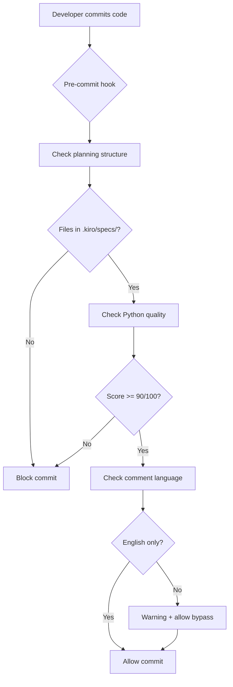
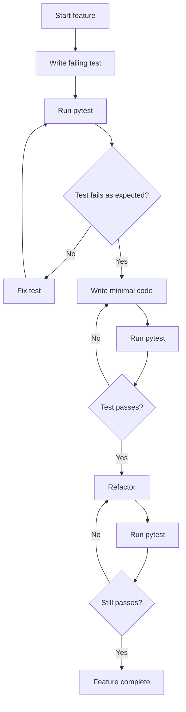

# Project Rescue - Design

## Technical Approach (技术方案)

### Architecture Overview

```
┌─────────────────────────────────────────────────────────────┐
│                     Project Rescue System                    │
├─────────────────────────────────────────────────────────────┤
│                                                               │
│  ┌─────────────────────────────────────────────────────┐   │
│  │  Phase 0: Emergency Cleanup                         │   │
│  │  - File structure validation                         │   │
│  │  - Planning file migration                           │   │
│  │  - Pre-commit hook installation                      │   │
│  └─────────────────────────────────────────────────────┘   │
│                           │                                  │
│                           ▼                                  │
│  ┌─────────────────────────────────────────────────────┐   │
│  │  Phase 1: Python Excellence Foundation              │   │
│  │  - python_plugin.py: 97-100/100                     │   │
│  │  - python_formatter.py: 97-100/100                  │   │
│  │  - Comprehensive test suite (TDD)                   │   │
│  │  - Optimization pattern documentation               │   │
│  └─────────────────────────────────────────────────────┘   │
│                           │                                  │
│                           ▼                                  │
│  ┌─────────────────────────────────────────────────────┐   │
│  │  Phase 2: Test Infrastructure Rebuild               │   │
│  │  - TDD workflow integration                          │   │
│  │  - Core module test coverage (80%+)                 │   │
│  │  - Property-based testing (Hypothesis)              │   │
│  └─────────────────────────────────────────────────────┘   │
│                           │                                  │
│                           ▼                                  │
│  ┌─────────────────────────────────────────────────────┐   │
│  │  Phase 3: Language Standardization                  │   │
│  │  - Comment translation automation                   │   │
│  │  - English-only enforcement                         │   │
│  │  - Documentation migration                          │   │
│  └─────────────────────────────────────────────────────┘   │
│                           │                                  │
│                           ▼                                  │
│  ┌─────────────────────────────────────────────────────┐   │
│  │  Phase 4: Quality Automation                        │   │
│  │  - Pre-commit quality checks (90/100)               │   │
│  │  - Auto-fix common issues                           │   │
│  │  - CI/CD integration                                │   │
│  └─────────────────────────────────────────────────────┘   │
│                           │                                  │
│                           ▼                                  │
│  ┌─────────────────────────────────────────────────────┐   │
│  │  Phase 5: Pattern Propagation                       │   │
│  │  - Apply to Java, JavaScript, TypeScript...         │   │
│  │  - Systematic optimization (11 languages)           │   │
│  │  - Knowledge base building                          │   │
│  └─────────────────────────────────────────────────────┘   │
│                                                               │
└─────────────────────────────────────────────────────────────┘
```

---

## Component Design (组件设计)

### 1. Planning Structure Enforcer

**Purpose**: Prevent planning files outside `.kiro/specs/`

**Implementation**:
```python
# scripts/check_planning_structure.py
import sys
from pathlib import Path

def check_planning_files():
    """Check for misplaced planning files."""
    root = Path(".")
    forbidden_files = ["task_plan.md", "progress.md", "findings.md"]
    
    violations = []
    for file in forbidden_files:
        if (root / file).exists():
            violations.append(file)
    
    if violations:
        print("ERROR: Planning files must be in .kiro/specs/")
        print(f"Found in root: {', '.join(violations)}")
        print("\nMove them to: .kiro/specs/{feature-name}/")
        return 1
    
    return 0

if __name__ == "__main__":
    sys.exit(check_planning_files())
```

**Integration**: `.pre-commit-config.yaml`
```yaml
repos:
  - repo: local
    hooks:
      - id: check-planning-structure
        name: Check planning file structure
        entry: python scripts/check_planning_structure.py
        language: system
        pass_filenames: false
        always_run: true
```

---

### 2. Quality Score Enforcer

**Purpose**: Block commits with code < 90/100

**Implementation**:
```python
# scripts/pre_commit_quality_check.py
import sys
from pathlib import Path
from check_code_quality import check_file_quality

def check_staged_python_files():
    """Check quality of staged Python files."""
    import subprocess
    
    # Get staged Python files
    result = subprocess.run(
        ["git", "diff", "--cached", "--name-only", "--diff-filter=ACM"],
        capture_output=True,
        text=True
    )
    
    files = [
        f for f in result.stdout.strip().split("\n")
        if f.endswith(".py") and Path(f).exists()
    ]
    
    if not files:
        return 0
    
    failed = []
    for file in files:
        score, report = check_file_quality(file)
        if score < 90:
            failed.append((file, score))
            print(f"\n{file}: {score}/100 (< 90)")
            print(report)
    
    if failed:
        print("\n❌ Quality check failed. Fix issues or use --no-verify to bypass.")
        return 1
    
    print("✅ All files passed quality check (>= 90/100)")
    return 0

if __name__ == "__main__":
    sys.exit(check_staged_python_files())
```

**Integration**: `.pre-commit-config.yaml`
```yaml
  - repo: local
    hooks:
      - id: python-quality-check
        name: Python code quality check (>= 90/100)
        entry: python scripts/pre_commit_quality_check.py
        language: system
        pass_filenames: false
        types: [python]
```

---

### 3. Comment Language Detector

**Purpose**: Detect non-English comments

**Implementation**:
```python
# scripts/check_comment_language.py
import re
import sys
from pathlib import Path

def has_non_english_comments(file_path):
    """Check if file contains non-English comments."""
    # Regex patterns for Chinese/Japanese characters
    cjk_pattern = re.compile(r'[\u4e00-\u9fff\u3040-\u309f\u30a0-\u30ff]+')
    
    content = Path(file_path).read_text(encoding='utf-8')
    
    violations = []
    for line_num, line in enumerate(content.splitlines(), 1):
        # Check comments and docstrings
        if '#' in line or '"""' in line or "'''" in line:
            if cjk_pattern.search(line):
                violations.append((line_num, line.strip()))
    
    return violations

def check_staged_files():
    """Check staged Python files for non-English comments."""
    import subprocess
    
    result = subprocess.run(
        ["git", "diff", "--cached", "--name-only", "--diff-filter=ACM"],
        capture_output=True,
        text=True
    )
    
    files = [
        f for f in result.stdout.strip().split("\n")
        if f.endswith(".py") and Path(f).exists()
    ]
    
    failed = []
    for file in files:
        violations = has_non_english_comments(file)
        if violations:
            failed.append((file, violations))
    
    if failed:
        print("❌ Non-English comments detected:")
        for file, violations in failed:
            print(f"\n{file}:")
            for line_num, line in violations[:3]:  # Show first 3
                print(f"  Line {line_num}: {line[:60]}...")
        print("\n⚠ Use --no-verify to bypass or convert to English.")
        return 1
    
    return 0

if __name__ == "__main__":
    sys.exit(check_staged_files())
```

**Integration**: `.pre-commit-config.yaml`
```yaml
  - repo: local
    hooks:
      - id: check-english-comments
        name: Check for English-only comments
        entry: python scripts/check_comment_language.py
        language: system
        pass_filenames: false
        types: [python]
```

---

### 4. Comment Translation Script

**Purpose**: Assist in converting non-English comments to English

**Implementation**:
```python
# scripts/translate_comments.py
import re
import sys
from pathlib import Path

def extract_translatable_comments(file_path):
    """Extract comments needing translation."""
    cjk_pattern = re.compile(r'[\u4e00-\u9fff\u3040-\u309f\u30a0-\u30ff]+')
    
    content = Path(file_path).read_text(encoding='utf-8')
    lines = content.splitlines()
    
    translatable = []
    for line_num, line in enumerate(lines, 1):
        if cjk_pattern.search(line):
            translatable.append({
                'line_num': line_num,
                'original': line,
                'comment': extract_comment(line)
            })
    
    return translatable

def extract_comment(line):
    """Extract comment text from line."""
    # Handle inline comments
    if '#' in line:
        return line[line.index('#')+1:].strip()
    # Handle docstrings (simplified)
    if '"""' in line or "'''" in line:
        return line.strip().strip('"""').strip("'''")
    return line.strip()

def generate_translation_template(file_path, output_path):
    """Generate template for manual translation."""
    translatable = extract_translatable_comments(file_path)
    
    if not translatable:
        print(f"✅ {file_path}: No non-English comments found")
        return
    
    template = f"""# Translation Template: {file_path}
# Instructions:
# 1. Translate each "TRANSLATE_ME" value to English
# 2. Keep translations concise and clear
# 3. Run: python scripts/apply_translations.py {output_path}

translations = [
"""
    
    for item in translatable:
        template += f"""    {{
        'line_num': {item['line_num']},
        'original': {repr(item['original'])},
        'translation': "TRANSLATE_ME: {item['comment']}"
    }},
"""
    
    template += "]\n"
    
    Path(output_path).write_text(template, encoding='utf-8')
    print(f"📝 Created translation template: {output_path}")
    print(f"   Found {len(translatable)} comments to translate")

if __name__ == "__main__":
    if len(sys.argv) < 2:
        print("Usage: python translate_comments.py <file.py>")
        sys.exit(1)
    
    file_path = sys.argv[1]
    output_path = f"{file_path}.translations.py"
    generate_translation_template(file_path, output_path)
```

---

### 5. TDD Workflow Integration

**Purpose**: Enforce test-first development

**Implementation**: Use existing `tdd-workflow` skill

**Workflow**:
```bash
# When starting new feature
/tdd

# Agent will:
# 1. Ask you to describe feature
# 2. Generate failing test first
# 3. Guide you to implement minimal code
# 4. Help refactor while keeping tests green
```

**Measurement**:
```bash
# Check coverage
uv run pytest --cov=tree_sitter_analyzer.languages.python_plugin --cov-report=term-missing
```

---

### 6. Python Plugin Optimization Template

**Purpose**: Systematic approach to achieving 97-100/100

**Step-by-Step Process**:

```bash
# Step 1: Baseline
python scripts/check_code_quality.py tree_sitter_analyzer/languages/python_plugin.py

# Step 2: Fix Module Header (11 sections)
# - Add missing sections
# - Ensure all 11 present

# Step 3: Add Exception Classes (3 required)
class PythonPluginException(Exception):
    """Base exception for Python plugin."""
    pass

class PythonParseError(PythonPluginException):
    """Error parsing Python source code."""
    pass

class PythonFeatureNotSupported(PythonPluginException):
    """Python feature not supported."""
    pass

# Step 4: Document All Public Methods
# - Args (even if None)
# - Returns
# - Note

# Step 5: Add Performance Monitoring
# - 5-8 monitoring points
# - perf_counter timing
# - Stats tracking

# Step 6: Add Statistics Method
def get_statistics(self) -> dict[str, Any]:
    """Get performance statistics."""
    ...

# Step 7: Update __all__
__all__ = [
    'PythonPlugin',
    # Exceptions
    'PythonPluginException',
    'PythonParseError',
    'PythonFeatureNotSupported'
]

# Step 8: Validate
python scripts/check_code_quality.py tree_sitter_analyzer/languages/python_plugin.py
# Target: >= 97/100
```

---

## Data Flow (数据流)

### Code Quality Check Flow



### TDD Workflow



---

## Security Considerations (安全考虑)

**S1: Pre-commit Bypass**
- **Risk**: Developers use `--no-verify` to skip hooks
- **Mitigation**: CI/CD runs same checks, blocks PR merge

**S2: Translation Quality**
- **Risk**: Automated translation introduces errors
- **Mitigation**: Manual review required, translation is template-based

**S3: Hook Performance**
- **Risk**: Slow hooks frustrate developers
- **Mitigation**: Checks run only on staged files, < 5s target

---

## Performance Characteristics (性能特性)

**Planning Structure Check**: O(1) - check 3 files
**Quality Check**: O(n) - per staged Python file, ~2s per file
**Comment Language Check**: O(n×m) - per file, per line, ~1s per file
**Total Pre-commit Time**: ~5-10s for typical commit (2-3 files)

---

## Alternative Approaches Considered (备选方案)

### Alternative 1: Full Automation with LLM Translation
**Pros**: Fast, no manual work
**Cons**: Inaccurate translations, loses nuance
**Decision**: Rejected - quality critical, manual review required

### Alternative 2: Gradual Migration (No Enforcement)
**Pros**: Less disruptive, flexible timeline
**Cons**: Never completes, inconsistency persists
**Decision**: Rejected - discipline required for rescue

### Alternative 3: Rewrite from Scratch
**Pros**: Clean slate, perfect structure
**Cons**: Loses existing value, high risk, months of work
**Decision**: Rejected - rescue is faster and safer

---

## Technology Choices (技术选型)

**Pre-commit Framework**: `pre-commit` (industry standard)
**Quality Check**: Existing `check_code_quality.py` (already validated)
**Testing Framework**: `pytest` with `pytest-cov` (existing)
**TDD Guidance**: `tdd-workflow` skill (available in Copilot)
**Language Detection**: Regex for CJK characters (simple, fast)

---

## Integration Points (集成点)

**Git Hooks**: `.pre-commit-config.yaml`
**CI/CD**: GitHub Actions (if exists)
**IDE**: Compatible with VSCode, PyCharm
**Copilot**: Instructions in `.github/copilot-instructions.md`

---

## Rollback Plan (回滚方案)

If rescue fails or causes issues:

1. **Pre-commit hooks**: Remove `.pre-commit-config.yaml`
2. **Code changes**: Git revert to last stable commit
3. **Planning files**: Keep `.kiro` structure (no rollback needed)
4. **Tests**: Keep new tests (improvement regardless)

---

## Success Criteria (验收标准)

**Phase 0**: Zero planning files in root
**Phase 1**: `python_plugin.py` and `python_formatter.py` score >= 97/100
**Phase 2**: Core tests at 80%+ coverage
**Phase 3**: Zero non-English comments in `tree_sitter_analyzer/`
**Phase 4**: Pre-commit hooks functional, CI passing
**Phase 5**: 10+ language plugins optimized to >= 90/100

---

## Monitoring & Metrics (监控指标)

**Dashboard Metrics**:
- Quality Score Distribution (histogram)
- Test Coverage Trend (line graph)
- Non-English Comment Count (decreasing)
- Planning File Compliance (100% target)

**Tools**:
```bash
# Quality distribution
python scripts/check_code_quality.py --check-all --summary

# Coverage trend
uv run pytest --cov=tree_sitter_analyzer --cov-report=term

# Comment language check
grep -r "[\u4e00-\u9fa5]" tree_sitter_analyzer/ | wc -l

# Planning compliance
ls *.md | grep -E "(task_plan|progress|findings)" | wc -l
```
