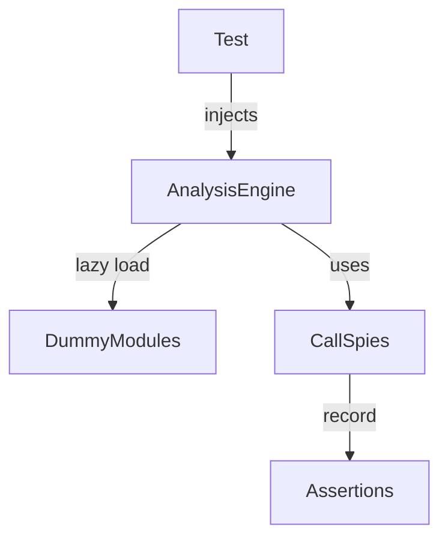

## 技术选型 (Technology Choices)
- pytest fixtures and monkeypatch for isolation.
- Lightweight call spy classes to replace MagicMock/AsyncMock where possible.
- Typed helper functions to reduce Any usage.

## 架构设计 (Architecture Design)
- Keep tests in tests/unit/test_analysis_engine.py only.
- Introduce local utility classes:
  - CallSpy: captures call arguments, supports assert_called_once.
  - AsyncCallSpy: async-callable variant.
- Centralize dummy modules for lazy dependency injection (parser, language detector, plugin manager).

## 数据流图 (Data Flow)

## API 设计 (API Design)
- No public API changes; tests only.
- Helper APIs in test module:
  - make_call_spy(name: str) -> CallSpy
  - make_async_call_spy(name: str) -> AsyncCallSpy

## 实现细节 (Implementation Details)
- Add Args/Returns/Note to public test method docstrings (quality checker).
- Replace MagicMock/AsyncMock with CallSpy/AsyncCallSpy in targeted areas.
- Replace analysis_engine.os monkeypatching with os/pathlib patches.
- Prefer engine.get_stats() over direct private attribute reads where possible.

## 边界情况处理 (Edge Cases)
- Cache miss/hit behavior without cache service.
- Missing parser/plugin manager/validator.
- Stat failures in cache key generation.
