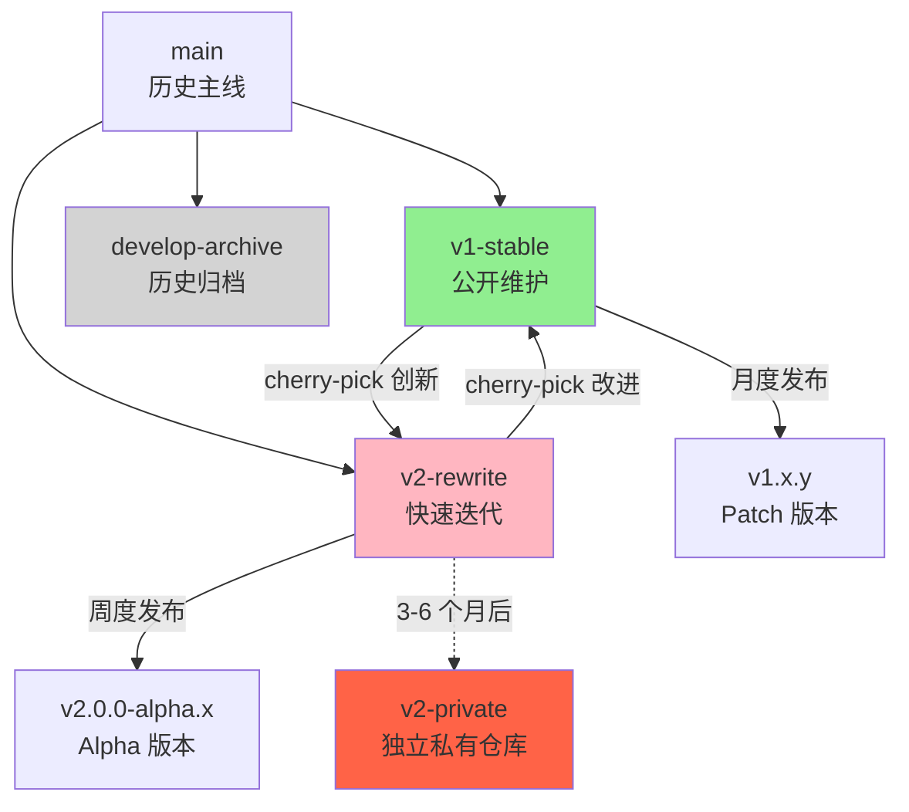

# V1/V2 分离与双向演进 - 设计文档

**日期**: 2026-02-04
**状态**: Draft - 设计中
**作者**: tree-sitter-analyzer team

---

## 1. 架构设计概览

### 1.1 整体架构

```
tree-sitter-analyzer (单一仓库，双分支策略)
│
├─── v1-stable 分支 (公开维护)
│    ├── tree_sitter_analyzer/    # V1 代码
│    ├── tests/                    # V1 测试
│    ├── docs/                     # V1 文档
│    └── .kiro/specs/v1-maintenance/  # V1 规划
│
├─── v2-rewrite 分支 (未来私有)
│    ├── v2/                       # V2 代码
│    ├── v2/tests/                 # V2 测试
│    ├── v2/docs/                  # V2 文档
│    └── .kiro/specs/v2-complete-rewrite/  # V2 规划
│
└─── shared/ (两个分支共享)
     ├── .kiro/specs/v1-v2-separation/  # 分离规划
     ├── .github/workflows/             # CI/CD
     └── scripts/                       # 工具脚本
```

### 1.2 分支策略图



---

## 2. Git 分支管理设计

### 2.1 分支创建流程

```bash
# 当前状态检查
git branch -a
# * v2-rewrite
#   main
#   develop

# Step 1: 归档 develop 分支
git branch develop-archive develop
git push origin develop-archive
# develop 分支保留但不再使用

# Step 2: 从 main 创建 v1-stable
git checkout main
git checkout -b v1-stable
git push -u origin v1-stable

# Step 3: 验证 v2-rewrite 分支
git checkout v2-rewrite
git status
# 确保所有变更已提交

# Step 4: 设置分支保护规则（GitHub）
# v1-stable: Protected, Require PR, Require reviews
# v2-rewrite: Protected (未来私有化后)

# Step 5: 更新默认分支
# GitHub Settings → Branches → Default branch: v1-stable
```

### 2.2 .gitignore 分离策略

#### v1-stable 分支的 .gitignore

```gitignore
# 标准 Python 忽略
__pycache__/
*.py[cod]
*$py.class
*.so
.Python
build/
develop-eggs/
dist/
downloads/
eggs/
.eggs/
lib/
lib64/
parts/
sdist/
var/
wheels/
*.egg-info/
.installed.cfg
*.egg

# 虚拟环境
venv/
ENV/
env/
.venv

# IDE
.vscode/
.idea/
*.swp
*.swo

# 测试覆盖
.coverage
htmlcov/
.pytest_cache/

# V2 相关文件（V1 分支忽略）
v2/
.kiro/specs/v2-complete-rewrite/
.kiro/specs/v1-v2-separation/design-v2.md

# OS
.DS_Store
Thumbs.db
```

#### v2-rewrite 分支的 .gitignore

```gitignore
# 标准 Python 忽略（同上）
__pycache__/
*.py[cod]
# ... (省略重复部分)

# V1 相关文件（V2 分支忽略）
tree_sitter_analyzer/
tests/test_*  # V1 的测试
examples/  # V1 的示例（如果 V2 有自己的）
.kiro/specs/v1-maintenance/

# 保留必要的共享文件
!.github/
!.kiro/specs/v1-v2-separation/
!scripts/

# V2 特定
.mypy_cache/
.ruff_cache/
```

### 2.3 分支同步工作流

#### 每周 V1 → V2 同步

```bash
#!/bin/bash
# scripts/sync-v1-to-v2.sh

# 切换到 v2-rewrite 分支
git checkout v2-rewrite

# 获取 v1-stable 最新变更
git fetch origin v1-stable

# 查看本周 V1 的提交
echo "=== V1 commits in last 7 days ==="
git log origin/v1-stable --oneline --since="7 days ago"

# 手动选择需要移植的 commit
echo "Enter commit hashes to cherry-pick (space-separated):"
read -r commits

for commit in $commits; do
    echo "Cherry-picking $commit..."
    git cherry-pick "$commit" || {
        echo "Conflict detected. Resolve manually."
        exit 1
    }
done

echo "V1 → V2 sync completed."
```

#### 每月 V2 → V1 回流

```bash
#!/bin/bash
# scripts/backport-v2-to-v1.sh

# 切换到 v1-stable 分支
git checkout v1-stable

# 获取 v2-rewrite 最新变更
git fetch origin v2-rewrite

# 查看本月 V2 的创新提交
echo "=== V2 innovations in last 30 days ==="
git log origin/v2-rewrite --oneline --since="30 days ago" --grep="feat"

# 手动选择需要回流的 commit
echo "Enter commit hashes to cherry-pick (space-separated):"
read -r commits

for commit in $commits; do
    echo "Backporting $commit..."
    git cherry-pick "$commit" || {
        echo "Conflict detected. Resolve manually."
        exit 1
    }
done

echo "V2 → V1 backport completed."
```

---

## 3. 双向学习机制设计

### 3.1 V1 → V2 移植路径

#### 3.1.1 TOON 格式优化

**V1 实现**: `tree_sitter_analyzer/formatters/toon_formatter.py`
**V2 目标**: `v2/tree_sitter_analyzer_v2/formatters/toon.py`

**移植步骤**:
1. 比较 V1 和 V2 的 TOON 实现差异
2. 提取 V1 的优化算法（70%+ token 减少）
3. 编写测试验证 V2 TOON 达到同等水平
4. 性能基准测试对比

**测试覆盖**:
```python
# v2/tests/unit/test_toon_formatter.py

def test_toon_token_reduction_v1_parity():
    """Verify V2 TOON achieves same reduction as V1."""
    # V1 baseline: 50-70% reduction
    # V2 target: 70%+ reduction
    v2_formatter = TOONFormatter()
    result = v2_formatter.format(sample_data)
    reduction = calculate_token_reduction(result)
    assert reduction >= 0.70  # 70%+ target
```

#### 3.1.2 语言插件移植（14 种）

**优先级顺序**:
1. **P0 (本月)**: C/C++, Go, Rust (系统级高频)
2. **P1 (下月)**: JavaScript, C#, SQL (企业常用)
3. **P2 (未来)**: Kotlin, PHP, Ruby, HTML, CSS, YAML, Markdown

**移植模板**:
```python
# v2/tree_sitter_analyzer_v2/languages/c_plugin.py

from tree_sitter_analyzer_v2.plugins.base import LanguagePlugin
from tree_sitter_analyzer_v2.core.types import AnalysisResult

class CPlugin(LanguagePlugin):
    """C language plugin ported from V1."""

    def get_language_name(self) -> str:
        return "c"

    def get_supported_extensions(self) -> list[str]:
        return [".c", ".h"]

    async def analyze_file(self, file_path: str, request: AnalysisRequest) -> AnalysisResult:
        # Port from V1: tree_sitter_analyzer/plugins/languages/c.py
        # 1. Parse file
        # 2. Extract functions, structs
        # 3. Handle preprocessor directives
        # 4. Build Code Graph
        pass
```

**测试策略**:
```python
# v2/tests/unit/test_c_plugin.py

# 使用 V1 的 Golden Master 测试数据
@pytest.mark.parametrize("test_file", V1_C_TEST_FILES)
def test_c_plugin_v1_parity(test_file):
    """Verify V2 C plugin matches V1 output."""
    v1_result = load_v1_golden_master(test_file)
    v2_result = CPlugin().analyze_file(test_file)
    assert v2_result.functions == v1_result.functions
    assert v2_result.structs == v1_result.structs
```

### 3.2 V2 → V1 回流路径

#### 3.2.1 Code Graph (实验性)

**V2 实现**: `v2/tree_sitter_analyzer_v2/graph/`
**V1 目标**: `tree_sitter_analyzer/experimental/code_graph/`

**集成策略**:
```python
# tree_sitter_analyzer/experimental/__init__.py

def enable_experimental_features():
    """Enable experimental features via environment variable."""
    import os
    return os.getenv("TSA_EXPERIMENTAL", "").lower() == "true"

# tree_sitter_analyzer/cli/main.py

if enable_experimental_features():
    from tree_sitter_analyzer.experimental.code_graph import CodeGraphBuilder
    # 添加 --code-graph 子命令
```

**文档说明**:
```bash
# V1 用户使用实验性 Code Graph
export TSA_EXPERIMENTAL=true
tree-sitter-analyzer analyze file.py --code-graph
```

#### 3.2.2 Markdown 格式

**V2 实现**: `v2/tree_sitter_analyzer_v2/formatters/markdown.py`
**V1 目标**: `tree_sitter_analyzer/formatters/markdown_formatter.py`

**回流步骤**:
1. 复制 V2 Markdown formatter 代码
2. 调整适配 V1 的数据结构
3. 添加到 formatter 注册表
4. 更新 CLI `--format` 参数

```python
# tree_sitter_analyzer/formatters/__init__.py

FORMATTERS = {
    'toon': TOONFormatter,
    'json': JSONFormatter,
    'markdown': MarkdownFormatter,  # 新增
}
```

---

## 4. 文件组织设计

### 4.1 共享资源管理

#### .kiro/ 目录结构

```
.kiro/
├── specs/
│   ├── v1-maintenance/           # V1 维护规划
│   │   ├── requirements.md
│   │   ├── tasks.md
│   │   └── progress.md
│   ├── v2-complete-rewrite/      # V2 开发规划
│   │   ├── requirements.md
│   │   ├── design.md
│   │   ├── tasks.md
│   │   └── ... (现有文件)
│   └── v1-v2-separation/         # 分离策略（共享）
│       ├── requirements.md       # ✅ 已创建
│       ├── design.md             # ✅ 正在创建
│       ├── tasks.md              # 待创建
│       └── progress.md           # 待创建
└── project_map.toon              # 项目结构索引（共享）
```

#### scripts/ 目录结构

```
scripts/
├── sync-v1-to-v2.sh             # V1 → V2 同步脚本
├── backport-v2-to-v1.sh         # V2 → V1 回流脚本
├── compare-branches.sh          # 分支差异对比
├── validate-separation.sh       # 验证分支分离正确性
└── README.md                    # 脚本使用文档
```

### 4.2 README 组织

#### 主 README.md (main/v1-stable 分支)

```markdown
# tree-sitter-analyzer

Enterprise-grade code analysis tool for the AI era.

## 🌟 Versions

- **V1 (Stable)**: Production-ready, 17 languages, community-supported
  - See [README-V1.md](README-V1.md) for V1 documentation
- **V2 (Alpha)**: Advanced Code Graph, rapid iteration, enterprise-focused
  - See [README-V2.md](README-V2.md) for V2 documentation

## Quick Start

### V1 (Recommended for production)
...

### V2 (Recommended for advanced analysis)
...
```

#### README-V1.md

```markdown
# tree-sitter-analyzer V1 - Stable Release

**Branch**: `v1-stable`
**Status**: Production Ready
**Languages**: 17

## Features
- 17 language support
- MCP integration
- TOON format (50-70% token reduction)
- fd + ripgrep search

## Roadmap
- Experimental Code Graph (from V2)
- Markdown formatter (from V2)
- TOON optimization to 70%+
```

#### README-V2.md

```markdown
# tree-sitter-analyzer V2 - Advanced Analysis

**Branch**: `v2-rewrite`
**Status**: Alpha (Rapid Iteration)
**Languages**: 3 (Python, Java, TypeScript) + expanding

## Killer Features
- 🚀 Code Graph (cross-file call analysis)
- 📊 Mermaid visualization
- 🔍 Advanced query & filtering
- ⚡ 100% type-safe architecture

## Roadmap
- C/C++, Go, Rust language support
- Query DSL for Code Graph
- Incremental analysis
```

---

## 5. CI/CD 设计

### 5.1 GitHub Actions 工作流

#### .github/workflows/v1-ci.yml

```yaml
name: V1 CI

on:
  push:
    branches: [v1-stable]
  pull_request:
    branches: [v1-stable]

jobs:
  test:
    runs-on: ubuntu-latest
    strategy:
      matrix:
        python-version: ["3.10", "3.11", "3.12"]

    steps:
      - uses: actions/checkout@v4
        with:
          ref: v1-stable

      - name: Set up Python
        uses: actions/setup-python@v4
        with:
          python-version: ${{ matrix.python-version }}

      - name: Install dependencies
        run: |
          pip install -e ".[all,mcp]"
          pip install pytest pytest-cov

      - name: Run V1 tests
        run: |
          pytest tests/ -v --cov=tree_sitter_analyzer

      - name: Upload coverage
        uses: codecov/codecov-action@v3
        with:
          flags: v1
```

#### .github/workflows/v2-ci.yml

```yaml
name: V2 CI

on:
  push:
    branches: [v2-rewrite]
  pull_request:
    branches: [v2-rewrite]

jobs:
  test:
    runs-on: ubuntu-latest

    steps:
      - uses: actions/checkout@v4
        with:
          ref: v2-rewrite

      - name: Set up Python 3.13
        uses: actions/setup-python@v4
        with:
          python-version: "3.13"

      - name: Install uv
        run: curl -LsSf https://astral.sh/uv/install.sh | sh

      - name: Install dependencies
        working-directory: v2
        run: uv sync --extra all --extra mcp

      - name: Run V2 tests
        working-directory: v2
        run: uv run pytest tests/ -v --cov=tree_sitter_analyzer_v2

      - name: Type checking
        working-directory: v2
        run: uv run mypy tree_sitter_analyzer_v2/

      - name: Upload coverage
        uses: codecov/codecov-action@v3
        with:
          flags: v2
```

### 5.2 发布工作流

#### V1 月度发布

```yaml
name: V1 Release

on:
  push:
    tags:
      - 'v1.*.*'

jobs:
  release:
    runs-on: ubuntu-latest
    steps:
      - uses: actions/checkout@v4
        with:
          ref: v1-stable

      - name: Build package
        run: python -m build

      - name: Publish to PyPI
        uses: pypa/gh-action-pypi-publish@release/v1
        with:
          password: ${{ secrets.PYPI_API_TOKEN }}

      - name: Create GitHub Release
        uses: softprops/action-gh-release@v1
        with:
          body: "See CHANGELOG.md for details"
          files: dist/*
```

#### V2 周度 Alpha 发布

```yaml
name: V2 Alpha Release

on:
  push:
    tags:
      - 'v2.0.0-alpha.*'

jobs:
  release:
    runs-on: ubuntu-latest
    steps:
      - uses: actions/checkout@v4
        with:
          ref: v2-rewrite

      - name: Build package
        working-directory: v2
        run: |
          uv build

      - name: Publish to TestPyPI (for testing)
        uses: pypa/gh-action-pypi-publish@release/v1
        with:
          repository-url: https://test.pypi.org/legacy/
          password: ${{ secrets.TEST_PYPI_API_TOKEN }}
          packages-dir: v2/dist/
```

---

## 6. 性能优化设计

### 6.1 V1 性能基准

**当前性能**:
- 文件解析: <100ms (10KB 文件)
- MCP 响应: <200ms
- fd 搜索: <100ms
- ripgrep 搜索: <200ms

**优化目标**: 保持现有性能

### 6.2 V2 性能目标

**当前性能** (基于 PAINPOINTS_TRACKER.md):
- 文件解析: ~100ms
- Code Graph 构建: 68 nodes/sec
- Windows subprocess: 600-950ms (高于目标)

**优化方向**:
1. **Code Graph 缓存**: 文件 mtime 检测 + 增量更新
2. **并行处理**: 多文件分析使用 asyncio
3. **Windows 优化**: 减少 subprocess overhead

```python
# v2/tree_sitter_analyzer_v2/core/cache.py

class AnalysisCache:
    """File-level cache with mtime tracking."""

    def __init__(self):
        self._cache: dict[Path, tuple[float, AnalysisResult]] = {}

    def get(self, file_path: Path) -> AnalysisResult | None:
        """Get cached result if file hasn't changed."""
        if file_path not in self._cache:
            return None

        cached_mtime, cached_result = self._cache[file_path]
        current_mtime = file_path.stat().st_mtime

        if current_mtime != cached_mtime:
            del self._cache[file_path]
            return None

        return cached_result

    def set(self, file_path: Path, result: AnalysisResult) -> None:
        """Cache result with current mtime."""
        mtime = file_path.stat().st_mtime
        self._cache[file_path] = (mtime, result)
```

---

## 7. 测试策略设计

### 7.1 V1 测试保持

**目标**: 保持 8,405 测试，80%+ 覆盖率

**测试类别**:
- Unit: 60%
- Integration: 25%
- Regression (Golden Master): 10%
- E2E: 5%

### 7.2 V2 测试扩展

**当前**: 814 测试
**目标**: 5,000+ 测试 (达到 V1 的 60%)

**扩展计划**:
1. **语言插件测试** (每种语言 ~200 tests):
   - C/C++: 400 tests
   - Go: 200 tests
   - Rust: 200 tests
   - 其他: 1,000+ tests
2. **Code Graph 测试** (已有 89 tests，扩展到 300+):
   - 查询功能: 100 tests
   - 过滤功能: 100 tests
   - 可视化: 50 tests
   - 增量更新: 50 tests
3. **回归测试** (Golden Master from V1):
   - 移植 V1 的关键测试用例
   - 确保 V2 不低于 V1 质量

---

## 8. 文档策略设计

### 8.1 V1 文档维护

**保持内容**:
- 安装指南
- 快速开始
- API 参考
- MCP 集成
- 17 语言支持矩阵

**新增内容**:
- 实验性功能说明（Code Graph）
- V1 → V2 迁移指南
- V1 维护路线图

### 8.2 V2 文档创建

**必需内容**:
- Code Graph 使用指南
- 查询 DSL 参考
- Mermaid 可视化示例
- 性能优化最佳实践
- V2 → V1 回流日志

---

## 9. 独立化准备设计

### 9.1 触发条件检查清单

```bash
# scripts/check-v2-independence.sh

#!/bin/bash
# 检查 V2 是否准备好独立化

echo "=== V2 Independence Readiness Check ==="

# 1. 功能完整度
LANGUAGE_COUNT=$(grep -c "def get_language_name" v2/tree_sitter_analyzer_v2/languages/*.py)
echo "Languages: $LANGUAGE_COUNT/17 (Target: ≥10)"

# 2. 测试覆盖
COVERAGE=$(uv run pytest v2/tests/ --cov=tree_sitter_analyzer_v2 --cov-report=term | grep TOTAL | awk '{print $4}')
echo "Coverage: $COVERAGE (Target: >80%)"

# 3. 痛点解决
CRITICAL_PAINPOINTS=$(grep -c "🔴 Critical" .kiro/specs/v2-complete-rewrite/PAINPOINTS_TRACKER.md)
echo "Critical Painpoints: $CRITICAL_PAINPOINTS (Target: 0)"

# 4. 日常使用
echo "Daily usage: Manual check (Target: >5 times/day)"

# 综合评估
if [ "$LANGUAGE_COUNT" -ge 10 ] && [ "$CRITICAL_PAINPOINTS" -eq 0 ]; then
    echo "✅ V2 is READY for independence!"
else
    echo "❌ V2 is NOT ready yet. Continue iterating."
fi
```

### 9.2 独立化执行计划

```bash
# scripts/split-v2-to-private.sh

#!/bin/bash
# 将 V2 分离为独立私有仓库

set -e

echo "=== V2 Independence Execution ==="

# Step 1: 创建 V2 专用分支
git checkout v2-rewrite
git checkout -b v2-only

# Step 2: 使用 git filter-repo 提取 v2/ 目录
# (需要先安装: pip install git-filter-repo)
git filter-repo --path v2/ --path-rename v2/:

# Step 3: 创建新的私有仓库
mkdir -p ../tree-sitter-analyzer-v2-private
cd ../tree-sitter-analyzer-v2-private
git init

# Step 4: 拉取 V2 代码
git remote add v2-source ../tree-sitter-analyzer
git pull v2-source v2-only

# Step 5: 设置远程私有仓库
git remote remove v2-source
git remote add origin <private-repo-url>
git push -u origin main

echo "✅ V2 is now independent!"
```

---

## 10. 风险缓解设计

### 10.1 技术风险缓解

#### 风险：Git 分支混乱

**缓解措施**:
- 文档化分支策略（本文档）
- 自动化脚本验证分支状态
- 定期 Git 审计

```bash
# scripts/validate-separation.sh

#!/bin/bash
# 验证 V1/V2 分支分离正确性

echo "=== Validating V1/V2 Separation ==="

# 检查 v1-stable 分支不包含 V2 代码
git checkout v1-stable
if [ -d "v2" ]; then
    echo "❌ ERROR: v1-stable branch contains v2/ directory!"
    exit 1
fi

# 检查 v2-rewrite 分支不包含 V1 测试
git checkout v2-rewrite
if [ -f "tests/test_api.py" ]; then
    echo "❌ ERROR: v2-rewrite branch contains V1 tests!"
    exit 1
fi

echo "✅ Separation is valid!"
```

#### 风险：代码冲突

**缓解措施**:
- 使用 cherry-pick 而非 merge
- 冲突时手动解决并记录
- 建立冲突解决模式库

### 10.2 业务风险缓解

#### 风险：V1 社区不满

**缓解措施**:
- 透明沟通：在 README 和 CHANGELOG 中说明 V1/V2 策略
- 继续维护 V1：月度发布，bug 修复
- 回流创新：将 V2 的创新选择性集成到 V1

---

## 11. 时间线

### Phase 1: 分支重组 (本周)
- ✅ 创建规划文档
- [ ] 执行 Git 分支重组
- [ ] 更新 .gitignore
- [ ] 设置 CI/CD

### Phase 2: V2 实用化 (2-4 周)
- [ ] 解决所有 Critical 痛点
- [ ] 补全 C/C++, Go, Rust
- [ ] Code Graph 查询与过滤
- [ ] 每天使用 V2 > 5 次

### Phase 3: 双向学习 (4-12 周)
- [ ] 每周 V1 → V2 同步
- [ ] 每月 V2 → V1 回流
- [ ] 持续迭代优化

### Phase 4: 独立化准备 (12-24 周)
- [ ] V2 功能完整度 > 80%
- [ ] V2 测试达到 5,000+
- [ ] 文档完善
- [ ] 独立化执行

---

## 12. 批准与签核

| 角色 | 名称 | 日期 | 状态 |
|------|------|------|--------|
| **项目负责人** | TBD | 2026-02-04 | Draft |
| **技术负责人** | TBD | 2026-02-04 | Draft |

---

**最后更新**: 2026-02-04
**文档版本**: 1.0
**下次审查**: 任务拆解完成后
