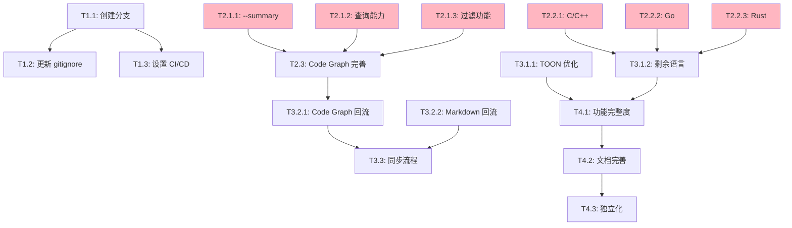

# V1/V2 分离与双向演进 - 任务拆解

**日期**: 2026-02-04
**状态**: 执行中
**作者**: tree-sitter-analyzer team

---

## 任务层级结构

```
Epic: V1/V2 分离与双向演进
├── Phase 1: Git 分支重组 (本周)
│   ├── T1.1: 创建分支结构
│   ├── T1.2: 更新 .gitignore
│   └── T1.3: 设置 CI/CD
├── Phase 2: V2 快速实用化 (2-4 周)
│   ├── T2.1: 修复 Critical 痛点
│   ├── T2.2: 补全高频语言
│   └── T2.3: Code Graph 完善
├── Phase 3: 双向学习机制 (4-12 周)
│   ├── T3.1: V1 → V2 功能移植
│   ├── T3.2: V2 → V1 创新回流
│   └── T3.3: 定期同步流程
└── Phase 4: V2 独立化准备 (12-24 周)
    ├── T4.1: 功能完整度达标
    ├── T4.2: 文档完善
    └── T4.3: 独立化执行
```

---

## Phase 1: Git 分支重组 (本周，4-6 小时)

### T1.1: 创建分支结构
**优先级**: P0 (Critical)
**预计时间**: 1 小时
**依赖**: 无

**目标**: 建立清晰的 V1/V2 分支策略

**子任务**:
```bash
# ✅ 已完成：创建规划文档
- [x] requirements.md
- [x] design.md
- [x] tasks.md (本文档)

# 待执行：Git 分支操作
- [ ] 归档 develop 分支为 develop-archive
- [ ] 从 main 创建 v1-stable 分支
- [ ] 验证 v2-rewrite 分支状态
- [ ] 推送所有分支到远程
- [ ] 设置分支保护规则（GitHub）
```

**执行命令**:
```bash
# 1. 归档 develop
git branch develop-archive develop
git push origin develop-archive

# 2. 创建 v1-stable
git checkout main
git checkout -b v1-stable
git push -u origin v1-stable

# 3. 验证 v2-rewrite
git checkout v2-rewrite
git status

# 4. 验证所有分支
git branch -a
```

**验收标准**:
- [ ] 4 个分支存在：main, v1-stable, v2-rewrite, develop-archive
- [ ] 所有分支已推送到远程
- [ ] 分支保护规则设置完成

---

### T1.2: 更新 .gitignore
**优先级**: P0 (Critical)
**预计时间**: 0.5 小时
**依赖**: T1.1

**目标**: 确保 V1/V2 代码正确分离

**子任务**:

**v1-stable 分支**:
```bash
git checkout v1-stable
# 编辑 .gitignore，添加：
# V2 相关文件
v2/
.kiro/specs/v2-complete-rewrite/
```

**v2-rewrite 分支**:
```bash
git checkout v2-rewrite
# 编辑 .gitignore，添加：
# V1 相关文件（保留共享）
tree_sitter_analyzer/
tests/test_*  # V1 测试
!.github/
!.kiro/specs/v1-v2-separation/
!scripts/
```

**验收标准**:
- [ ] v1-stable 忽略 v2/
- [ ] v2-rewrite 忽略 tree_sitter_analyzer/
- [ ] git status 验证无误

---

### T1.3: 设置 CI/CD
**优先级**: P1 (High)
**预计时间**: 2 小时
**依赖**: T1.1

**目标**: 为 V1/V2 分别设置 CI 流程

**子任务**:
- [ ] 创建 `.github/workflows/v1-ci.yml`
- [ ] 创建 `.github/workflows/v2-ci.yml`
- [ ] 配置分支触发规则
- [ ] 测试 CI 流程

**v1-ci.yml 配置**:
```yaml
name: V1 CI
on:
  push:
    branches: [v1-stable]
  pull_request:
    branches: [v1-stable]
jobs:
  test:
    runs-on: ubuntu-latest
    strategy:
      matrix:
        python-version: ["3.10", "3.11", "3.12"]
    steps:
      - uses: actions/checkout@v4
      - name: Run V1 tests
        run: pytest tests/ --cov=tree_sitter_analyzer
```

**v2-ci.yml 配置**:
```yaml
name: V2 CI
on:
  push:
    branches: [v2-rewrite]
  pull_request:
    branches: [v2-rewrite]
jobs:
  test:
    runs-on: ubuntu-latest
    steps:
      - uses: actions/checkout@v4
      - name: Install uv
        run: curl -LsSf https://astral.sh/uv/install.sh | sh
      - name: Run V2 tests
        working-directory: v2
        run: uv run pytest tests/ --cov=tree_sitter_analyzer_v2
```

**验收标准**:
- [ ] V1 CI 在 v1-stable 分支触发
- [ ] V2 CI 在 v2-rewrite 分支触发
- [ ] 所有测试通过

---

## Phase 2: V2 快速实用化 (2-4 周，30-40 小时)

### T2.1: 修复 Critical 痛点
**优先级**: P0 (Critical)
**预计时间**: 8 小时
**依赖**: 无（可并行）

**目标**: 解决所有 🔴 Critical 优先级痛点

#### T2.1.1: 实现 --summary 模式（痛点 #4）
**预计时间**: 2 小时

**需求**:
```bash
# 当前：详细输出，信息过载
tsa analyze file.py --format markdown  # 输出 500+ 行

# 期望：快速摘要
tsa analyze file.py --summary
# 输出：
# File: file.py
# Lines: 357 (Code: 280, Comments: 50, Blank: 27)
# Classes: 3 (SymbolEntry, SymbolTable, SymbolTableBuilder)
# Methods: 6
# Complexity: 2.5 avg
```

**实现步骤**:
1. 在 CLI 添加 `--summary` flag
2. 创建 `SummaryFormatter`
3. 计算聚合统计
4. 添加测试

**文件变更**:
- `v2/tree_sitter_analyzer_v2/cli/main.py`
- `v2/tree_sitter_analyzer_v2/formatters/summary.py` (新建)
- `v2/tests/unit/test_summary_formatter.py` (新建)

**验收标准**:
- [ ] `--summary` flag 可用
- [ ] 输出简洁（< 10 行）
- [ ] 测试覆盖 > 80%

---

#### T2.1.2: Code Graph 查询能力（痛点 #14）
**预计时间**: 4 小时

**需求**:
```python
# 当前：只能手动遍历
for node_id, data in graph.nodes(data=True):
    if 'SymbolTable' in node_id:
        print(node_id)

# 期望：方便的查询 API
graph.query_methods(class_name='SymbolTable')
graph.find_callers(function_name='lookup')
graph.find_call_chain(from_node='main', to_node='helper')
```

**实现步骤**:
1. 在 `CodeGraph` 类添加查询方法
2. 实现 `query_methods()`, `find_callers()`, `find_call_chain()`
3. 添加测试

**文件变更**:
- `v2/tree_sitter_analyzer_v2/graph/queries.py` (增强)
- `v2/tests/unit/test_code_graph_queries.py` (增强)

**验收标准**:
- [ ] 3 个查询方法可用
- [ ] 性能 < 50ms (1000 节点图)
- [ ] 测试覆盖 > 90%

---

#### T2.1.3: Code Graph 过滤功能（痛点 #6）
**预计时间**: 2 小时

**需求**:
```python
# 当前：92 节点，Mermaid 图难以阅读

# 期望：灵活过滤
graph.filter(node_types=['METHOD'], file_pattern='symbols.py')
graph.focus(node_id='SymbolTable.lookup', depth=2)
```

**实现步骤**:
1. 实现 `filter()` 方法
2. 实现 `focus()` 方法
3. 更新 Mermaid 导出
4. 添加测试

**文件变更**:
- `v2/tree_sitter_analyzer_v2/graph/builder.py` (增强)
- `v2/tree_sitter_analyzer_v2/graph/export.py` (增强)
- `v2/tests/unit/test_code_graph_filtering.py` (新建)

**验收标准**:
- [ ] `filter()` 和 `focus()` 方法可用
- [ ] Mermaid 图可配置 max_nodes
- [ ] 测试覆盖 > 85%

---

### T2.2: 补全高频语言
**优先级**: P0 (Critical)
**预计时间**: 16 小时
**依赖**: 无（可并行）

**目标**: 支持 C/C++, Go, Rust（从 3 种扩展到 7 种）

#### T2.2.1: C/C++ 语言支持
**预计时间**: 6 小时

**实现步骤**:
1. 从 V1 移植 C/C++ 插件
2. 适配 V2 的插件架构
3. 添加 Code Graph 支持
4. 添加完整测试

**文件变更**:
- `v2/tree_sitter_analyzer_v2/languages/c_plugin.py` (新建)
- `v2/tree_sitter_analyzer_v2/languages/cpp_plugin.py` (新建)
- `v2/tests/unit/test_c_plugin.py` (新建)
- `v2/tests/unit/test_cpp_plugin.py` (新建)

**参考**:
- V1 实现: `tree_sitter_analyzer/plugins/languages/c.py`
- V1 测试: `tests/test_languages/test_c.py`

**验收标准**:
- [ ] C/C++ 文件可解析
- [ ] Code Graph 支持
- [ ] 测试覆盖 > 85%
- [ ] 使用 V1 Golden Master 验证

---

#### T2.2.2: Go 语言支持
**预计时间**: 5 小时

**实现步骤**:
1. 从 V1 移植 Go 插件
2. 处理 Go 特性（goroutines, channels, interfaces）
3. 添加 Code Graph 支持
4. 添加完整测试

**文件变更**:
- `v2/tree_sitter_analyzer_v2/languages/go_plugin.py` (新建)
- `v2/tests/unit/test_go_plugin.py` (新建)

**验收标准**:
- [ ] Go 文件可解析
- [ ] Code Graph 支持
- [ ] 测试覆盖 > 85%

---

#### T2.2.3: Rust 语言支持
**预计时间**: 5 小时

**实现步骤**:
1. 从 V1 移植 Rust 插件
2. 处理 Rust 特性（traits, lifetimes, macros）
3. 添加 Code Graph 支持
4. 添加完整测试

**文件变更**:
- `v2/tree_sitter_analyzer_v2/languages/rust_plugin.py` (新建)
- `v2/tests/unit/test_rust_plugin.py` (新建)

**验收标准**:
- [ ] Rust 文件可解析
- [ ] Code Graph 支持
- [ ] 测试覆盖 > 85%

---

### T2.3: Code Graph 完善
**优先级**: P1 (High)
**预计时间**: 6 小时
**依赖**: T2.1.2, T2.1.3

**目标**: Code Graph 达到生产级别

**子任务**:
- [ ] 增量更新优化
- [ ] 性能基准测试
- [ ] 错误处理完善
- [ ] 使用文档

**验收标准**:
- [ ] 增量更新 < 50ms
- [ ] 1000 节点图查询 < 100ms
- [ ] 文档完整

---

## Phase 3: 双向学习机制 (4-12 周，20-30 小时)

### T3.1: V1 → V2 功能移植
**优先级**: P1 (High)
**预计时间**: 15 小时
**依赖**: T2.2

**目标**: 将 V1 的成熟功能移植到 V2

#### T3.1.1: TOON 格式优化
**预计时间**: 4 小时

**当前状态**:
- V1: 50-70% token 减少
- V2: 基础实现

**目标**: V2 达到 70%+ token 减少

**实现步骤**:
1. 对比 V1 和 V2 的 TOON 实现
2. 提取 V1 的优化算法
3. 性能基准测试
4. 验证达标

**文件变更**:
- `v2/tree_sitter_analyzer_v2/formatters/toon.py` (优化)
- `v2/tests/unit/test_toon_formatter.py` (增强)

**验收标准**:
- [ ] Token 减少 ≥ 70%
- [ ] 性能不低于 V1
- [ ] 测试覆盖 > 90%

---

#### T3.1.2: 剩余语言移植（10 种）
**预计时间**: 10 小时

**优先级排序**:
1. **P1 (下月)**: JavaScript, C#, SQL
2. **P2 (未来)**: Kotlin, PHP, Ruby, HTML, CSS, YAML, Markdown

**每种语言预计 1 小时**:
- 移植插件
- 适配架构
- 添加测试

**验收标准**:
- [ ] 每种语言测试覆盖 > 80%
- [ ] Code Graph 支持（如适用）
- [ ] 使用 V1 Golden Master 验证

---

#### T3.1.3: Security 验证移植
**预计时间**: 1 小时

**从 V1 学习**:
- 路径遍历保护
- ReDoS 防护
- 输入验证模式

**文件变更**:
- `v2/tree_sitter_analyzer_v2/security/validator.py` (增强)

**验收标准**:
- [ ] 通过 V1 的安全测试
- [ ] 0 已知安全漏洞

---

### T3.2: V2 → V1 创新回流
**优先级**: P2 (Medium)
**预计时间**: 8 小时
**依赖**: T2.3

**目标**: 将 V2 的创新功能回流到 V1

#### T3.2.1: Code Graph (实验性)
**预计时间**: 6 小时

**实现策略**:
- 作为 V1 的实验性功能
- 通过 `TSA_EXPERIMENTAL=true` 环境变量启用
- 不影响现有功能

**实现步骤**:
1. 创建 `tree_sitter_analyzer/experimental/code_graph/`
2. 复制 V2 Code Graph 核心代码
3. 适配 V1 数据结构
4. 添加 CLI `--code-graph` 子命令
5. 文档说明

**文件变更**:
- `tree_sitter_analyzer/experimental/code_graph/` (新建)
- `tree_sitter_analyzer/cli/main.py` (增强)
- `README-V1.md` (更新)

**验收标准**:
- [ ] 实验性功能可用
- [ ] 不影响现有测试
- [ ] 文档清晰

---

#### T3.2.2: Markdown 格式回流
**预计时间**: 2 小时

**实现步骤**:
1. 复制 V2 Markdown formatter
2. 适配 V1 数据结构
3. 注册到 formatter 列表
4. 更新 CLI `--format` 参数

**文件变更**:
- `tree_sitter_analyzer/formatters/markdown_formatter.py` (新建)
- `tree_sitter_analyzer/formatters/__init__.py` (更新)

**验收标准**:
- [ ] `--format markdown` 可用
- [ ] 输出与 V2 一致
- [ ] 测试覆盖 > 80%

---

### T3.3: 定期同步流程
**优先级**: P2 (Medium)
**预计时间**: 2 小时
**依赖**: T3.1, T3.2

**目标**: 建立自动化同步机制

**实现步骤**:
1. 创建同步脚本
2. 文档化流程
3. 设置定期提醒

**文件变更**:
- `scripts/sync-v1-to-v2.sh` (新建)
- `scripts/backport-v2-to-v1.sh` (新建)
- `.kiro/specs/v1-v2-separation/sync-log.md` (新建)

**同步频率**:
- **每周**: V1 → V2 (bug 修复、小改进)
- **每月**: V2 → V1 (创新回流)

**验收标准**:
- [ ] 脚本可用
- [ ] 文档完整
- [ ] 执行 1 轮同步验证

---

## Phase 4: V2 独立化准备 (12-24 周，10-15 小时)

### T4.1: 功能完整度达标
**优先级**: P2 (Medium)
**预计时间**: 5 小时
**依赖**: T2.2, T3.1

**目标**: V2 功能完整度 > 80%

**检查清单**:
- [ ] 语言支持 ≥ 10/17
- [ ] Code Graph 功能完整
- [ ] 所有 Critical 痛点解决
- [ ] 测试覆盖 > 80%
- [ ] 测试数量 > 5,000

**自动化检查**:
```bash
scripts/check-v2-independence.sh
```

---

### T4.2: 文档完善
**优先级**: P2 (Medium)
**预计时间**: 3 小时
**依赖**: T4.1

**目标**: V2 文档达到 V1 水平

**文档清单**:
- [ ] README-V2.md (完整)
- [ ] API 参考
- [ ] Code Graph 使用指南
- [ ] 迁移指南（V1 → V2）
- [ ] 性能优化最佳实践

---

### T4.3: 独立化执行
**优先级**: P3 (Low)
**预计时间**: 2 小时
**依赖**: T4.1, T4.2

**目标**: 将 V2 分离为独立私有仓库

**触发条件** (全部满足):
- ✅ V2 功能完整度 > 80%
- ✅ V2 语言支持 ≥ 10/17
- ✅ V2 日常使用无阻碍
- ✅ V2 测试覆盖 > 80%
- ✅ 有明确的私有化需求

**执行步骤**:
```bash
# 使用 git subtree split
scripts/split-v2-to-private.sh
```

**验收标准**:
- [ ] V2 私有仓库创建成功
- [ ] Git 历史完整
- [ ] CI/CD 配置正确
- [ ] 文档更新

---

## 任务依赖关系



**图例**:
- 粉色：Critical 优先级任务（本月必做）

---

## 时间估算汇总

| Phase | 总时间 | 关键任务 |
|-------|--------|----------|
| **Phase 1** | 4-6h | Git 分支重组 |
| **Phase 2** | 30-40h | V2 实用化（Critical） |
| **Phase 3** | 20-30h | 双向学习 |
| **Phase 4** | 10-15h | 独立化准备 |
| **总计** | 64-91h | 2-3 个月 |

---

## 本周计划 (2026-02-04 ~ 02-10)

### 本周目标
- [ ] 完成 Phase 1 (Git 分支重组)
- [ ] 开始 Phase 2 (修复 2-3 个 Critical 痛点)

### 每日任务

**周一 (今天)**:
- [x] 创建规划文档（requirements.md, design.md, tasks.md）
- [ ] 执行 T1.1: 创建分支结构
- [ ] 执行 T1.2: 更新 .gitignore

**周二**:
- [ ] 执行 T1.3: 设置 CI/CD
- [ ] 开始 T2.1.1: 实现 --summary 模式

**周三**:
- [ ] 完成 T2.1.1
- [ ] 开始 T2.1.2: Code Graph 查询能力

**周四**:
- [ ] 完成 T2.1.2
- [ ] 开始 T2.1.3: Code Graph 过滤功能

**周五**:
- [ ] 完成 T2.1.3
- [ ] 周总结与下周计划

---

## 风险与应对

### 风险 1: 时间估算过于乐观
**影响**: 高
**应对**:
- 每周重新评估进度
- 优先完成 Critical 任务
- 可选任务灵活调整

### 风险 2: V2 实用化失败
**影响**: 高
**应对**:
- 每天使用 V2 进行真实工作
- 快速修复发现的问题
- 及时调整优先级

### 风险 3: 双向学习中断
**影响**: 中
**应对**:
- 设置定期提醒
- 自动化脚本辅助
- 文档化流程

---

## 更新日志

### 2026-02-04
- ✅ 创建 requirements.md
- ✅ 创建 design.md
- ✅ 创建 tasks.md（本文档）
- ✅ 使用 Claude Code Task 工具创建任务层级
- 🔄 准备执行 Phase 1

---

**最后更新**: 2026-02-04
**文档版本**: 1.0
**下次审查**: 每周五
