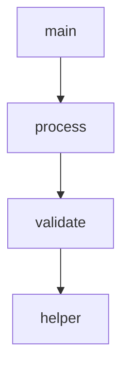

# Code Graph 系统增强计划

**创建日期**: 2026-02-01
**状态**: 规划中
**优先级排序**: 按业务价值和实现难度综合评估

---

## 增强方向概览

| ID | 增强方向 | 优先级 | 难度 | 预计时间 | 业务价值 |
|----|---------|--------|------|---------|---------|
| E1 | MCP 服务器自动注册 | 🔴 HIGH | ⭐ Low | 2h | 立即可用性 |
| E2 | 多文件分析 | 🔴 HIGH | ⭐⭐ Medium | 4h | 项目级分析 |
| E3 | 跨文件调用解析 | 🟡 MEDIUM | ⭐⭐⭐ High | 8h | 完整调用图 |
| E4 | 图可视化 | 🟢 LOW | ⭐⭐ Medium | 6h | 可视化展示 |
| E5 | 更多语言支持 | 🟡 MEDIUM | ⭐⭐⭐ High | 12h | 通用性 |

---

## E1: MCP 服务器自动注册 🔴 HIGH

### 目标
让 Code Graph 工具在 MCP 服务器启动时自动注册，用户无需手动配置即可使用。

### 当前状态
- ✅ 工具已创建：`AnalyzeCodeGraphTool`, `FindFunctionCallersTool`, `QueryCallChainTool`
- ✅ 工具测试通过：14/14 tests
- ⏳ **未集成到 MCP 服务器**

### 实现方案

#### Step 1: 更新 MCP Server 注册逻辑

**文件**: `tree_sitter_analyzer_v2/mcp/server.py`

```python
from tree_sitter_analyzer_v2.mcp.tools import (
    AnalyzeTool,
    FindFilesTool,
    SearchContentTool,
    QueryTool,
    CheckCodeScaleTool,
    FindAndGrepTool,
    ExtractCodeSectionTool,
    # 新增 Code Graph 工具
    AnalyzeCodeGraphTool,
    FindFunctionCallersTool,
    QueryCallChainTool,
)

class TreeSitterAnalyzerMCPServer:
    def __init__(self):
        self.tools = [
            AnalyzeTool(),
            FindFilesTool(),
            SearchContentTool(),
            QueryTool(),
            CheckCodeScaleTool(),
            FindAndGrepTool(),
            ExtractCodeSectionTool(),
            # 注册 Code Graph 工具
            AnalyzeCodeGraphTool(),
            FindFunctionCallersTool(),
            QueryCallChainTool(),
        ]
```

#### Step 2: 创建测试

**文件**: `tests/integration/test_mcp_server.py`

```python
def test_code_graph_tools_registered():
    """Test Code Graph tools are auto-registered."""
    server = TreeSitterAnalyzerMCPServer()
    tool_names = [tool.get_name() for tool in server.tools]

    assert "analyze_code_graph" in tool_names
    assert "find_function_callers" in tool_names
    assert "query_call_chain" in tool_names
```

#### Step 3: 验证 MCP 协议

确保工具符合 MCP 协议规范：
- ✅ JSON Schema 定义
- ✅ 错误处理
- ✅ 返回格式一致

### 验收标准

- [ ] MCP 服务器启动时自动注册 3 个 Code Graph 工具
- [ ] 工具可通过 MCP 协议调用
- [ ] 所有现有测试仍然通过
- [ ] 新增服务器集成测试

### 预期收益

- ✅ **用户体验**: 开箱即用，无需配置
- ✅ **Claude 集成**: 直接在对话中使用
- ✅ **一致性**: 与其他 MCP 工具统一管理

---

## E2: 多文件分析 🔴 HIGH

### 目标
支持一次性分析整个项目或目录，构建完整的项目代码图谱。

### 当前状态
- ✅ 单文件分析：`CodeGraphBuilder.build_from_file()`
- ⏳ **多文件合并**: 手动 `nx.compose()`
- ❌ **自动目录扫描**: 未实现

### 实现方案

#### API 设计

```python
class CodeGraphBuilder:
    def build_from_directory(
        self,
        directory: str,
        patterns: List[str] = ["**/*.py"],
        exclude: List[str] = ["**/tests/**", "**/__pycache__/**"],
        max_files: int = 1000
    ) -> nx.DiGraph:
        """
        Build code graph from all files in directory.

        Args:
            directory: Root directory to scan
            patterns: Glob patterns for files to include
            exclude: Patterns to exclude
            max_files: Safety limit

        Returns:
            Combined graph with all files
        """
        pass

    def build_from_files(
        self,
        file_paths: List[str],
        show_progress: bool = True
    ) -> nx.DiGraph:
        """Build graph from list of files."""
        pass
```

#### MCP 工具增强

```python
class AnalyzeCodeGraphTool:
    def get_schema(self):
        return {
            "properties": {
                "file_path": {"type": "string"},
                # 新增：支持目录
                "directory": {"type": "string"},
                "patterns": {
                    "type": "array",
                    "items": {"type": "string"},
                    "default": ["**/*.py"]
                },
                "max_files": {"type": "integer", "default": 100}
            },
            # file_path 或 directory 二选一
            "oneOf": [
                {"required": ["file_path"]},
                {"required": ["directory"]}
            ]
        }
```

#### 性能优化

```python
# 并行处理
from concurrent.futures import ThreadPoolExecutor

def build_from_directory(self, directory: str) -> nx.DiGraph:
    files = list(Path(directory).rglob("*.py"))

    with ThreadPoolExecutor(max_workers=4) as executor:
        graphs = executor.map(self.build_from_file, files)

    # 合并所有图谱
    combined = nx.DiGraph()
    for graph in graphs:
        combined = nx.compose(combined, graph)

    return combined
```

### 验收标准

- [ ] `build_from_directory()` 实现并测试
- [ ] `build_from_files()` 实现并测试
- [ ] MCP 工具支持 `directory` 参数
- [ ] 性能测试：100 文件 < 10 秒
- [ ] 进度显示（可选）

### 预期收益

- ✅ **项目级分析**: 一次性理解整个项目
- ✅ **批量处理**: 效率提升
- ✅ **完整图谱**: 包含所有模块关系

---

## E3: 跨文件调用解析 🟡 MEDIUM

### 目标
追踪跨文件的函数调用，完整理解项目的调用依赖关系。

### 当前状态
- ✅ 单文件内调用：`main() -> helper()`
- ⏳ **Import 追踪**: 部分支持（记录 imports）
- ❌ **跨文件解析**: 未实现

### 挑战

1. **Import 解析复杂度**
   - `from module import func` - 需要找到 module.py
   - `import package.module` - 需要解析包结构
   - `from . import sibling` - 相对导入
   - 动态导入 `importlib.import_module()`

2. **名称解析**
   - 别名: `import numpy as np` → `np.array()` 需要解析到 `numpy.array()`
   - 重名: 多个模块有同名函数

3. **性能考虑**
   - 需要构建整个项目的符号表
   - 大项目可能有数千个函数

### 实现方案

#### Phase 1: Import Graph

```python
class ImportResolver:
    """解析 import 关系"""

    def __init__(self, project_root: str):
        self.project_root = Path(project_root)
        self.module_map: Dict[str, str] = {}  # module_name -> file_path

    def build_import_graph(self) -> nx.DiGraph:
        """构建 import 依赖图"""
        graph = nx.DiGraph()

        for py_file in self.project_root.rglob("*.py"):
            imports = self._parse_imports(py_file)
            for imp in imports:
                resolved_path = self._resolve_import(imp, py_file)
                if resolved_path:
                    graph.add_edge(str(py_file), str(resolved_path), type="IMPORTS")

        return graph

    def _resolve_import(self, import_stmt: str, from_file: Path) -> Optional[Path]:
        """解析 import 语句到实际文件路径"""
        # 处理相对导入
        if import_stmt.startswith("."):
            return self._resolve_relative_import(import_stmt, from_file)

        # 处理绝对导入
        return self._resolve_absolute_import(import_stmt)
```

#### Phase 2: Cross-File Call Resolution

```python
class CrossFileCallResolver:
    """解析跨文件调用"""

    def __init__(self, import_resolver: ImportResolver):
        self.import_resolver = import_resolver
        self.symbol_table: Dict[str, List[str]] = {}  # symbol_name -> [file_paths]

    def build_symbol_table(self, graphs: Dict[str, nx.DiGraph]):
        """构建全局符号表"""
        for file_path, graph in graphs.items():
            for node_id, data in graph.nodes(data=True):
                if data['type'] == 'FUNCTION':
                    name = data['name']
                    if name not in self.symbol_table:
                        self.symbol_table[name] = []
                    self.symbol_table[name].append(file_path)

    def resolve_call(self, call_name: str, from_file: str) -> Optional[str]:
        """解析调用到具体的函数定义"""
        # 1. 检查本文件
        # 2. 检查 import 的模块
        # 3. 检查全局符号表
        pass
```

#### Phase 3: Enhanced Code Graph

```python
class EnhancedCodeGraphBuilder(CodeGraphBuilder):
    """支持跨文件调用的 Code Graph Builder"""

    def build_project_graph(self, project_root: str) -> nx.DiGraph:
        """构建完整项目图谱（含跨文件调用）"""

        # Step 1: 构建所有文件的图谱
        file_graphs = {}
        for py_file in Path(project_root).rglob("*.py"):
            file_graphs[str(py_file)] = self.build_from_file(str(py_file))

        # Step 2: 解析 import 关系
        import_resolver = ImportResolver(project_root)
        import_graph = import_resolver.build_import_graph()

        # Step 3: 解析跨文件调用
        call_resolver = CrossFileCallResolver(import_resolver)
        call_resolver.build_symbol_table(file_graphs)

        # Step 4: 合并所有图谱
        combined = nx.DiGraph()
        for graph in file_graphs.values():
            combined = nx.compose(combined, graph)

        # Step 5: 添加跨文件 CALLS 边
        for file_path, graph in file_graphs.items():
            for node_id, data in graph.nodes(data=True):
                if data['type'] == 'FUNCTION':
                    # 查找该函数调用的外部函数
                    external_calls = self._find_external_calls(
                        data, file_path, call_resolver
                    )
                    for target_id in external_calls:
                        combined.add_edge(node_id, target_id, type='CALLS', cross_file=True)

        return combined
```

### 验收标准

- [ ] Import 解析实现（相对 + 绝对）
- [ ] 符号表构建
- [ ] 跨文件调用解析
- [ ] 测试用例：小型多文件项目
- [ ] 性能测试：中型项目 < 30 秒

### 预期收益

- ✅ **完整调用图**: 理解整个项目的执行流
- ✅ **影响分析**: 跨文件的依赖分析
- ✅ **重构支持**: 安全重构评估

### 风险与限制

- ⚠️ **动态导入**: 无法静态分析 `importlib`
- ⚠️ **复杂度**: 大项目可能很慢
- ⚠️ **准确性**: 可能有误报（重名函数）

---

## E4: 图可视化 🟢 LOW

### 目标
生成可视化的调用图，帮助理解代码结构。

### 当前状态
- ✅ 文本格式：TOON, JSON
- ❌ **可视化**: 未实现

### 实现方案

#### Option 1: Mermaid 图表（推荐）

**优势**:
- Markdown 友好
- Claude 可以直接渲染
- 简单文本格式

**示例输出**:


**实现**:
```python
def export_to_mermaid(graph: nx.DiGraph, max_nodes: int = 50) -> str:
    """导出为 Mermaid 格式"""
    lines = ["graph TD"]

    # 只显示函数节点
    function_nodes = [
        n for n, d in graph.nodes(data=True)
        if d['type'] == 'FUNCTION'
    ][:max_nodes]

    # 添加调用边
    for source, target, data in graph.edges(data=True):
        if data.get('type') == 'CALLS' and source in function_nodes and target in function_nodes:
            source_name = graph.nodes[source]['name']
            target_name = graph.nodes[target]['name']
            lines.append(f"    {source}[{source_name}] --> {target}[{target_name}]")

    return "\n".join(lines)
```

#### Option 2: Graphviz DOT

**优势**:
- 更强大的布局算法
- 可生成 PNG/SVG

**示例**:
```python
def export_to_dot(graph: nx.DiGraph) -> str:
    """导出为 DOT 格式"""
    return nx.nx_pydot.to_pydot(graph).to_string()
```

#### Option 3: D3.js 交互式图

**优势**:
- 交互式
- 可缩放

**实现**:
- 导出 JSON 数据
- 前端用 D3.js 渲染

### MCP 工具增强

```python
class VisualizeCodeGraphTool(BaseTool):
    """可视化代码图谱"""

    def get_schema(self):
        return {
            "properties": {
                "file_path": {"type": "string"},
                "format": {
                    "type": "string",
                    "enum": ["mermaid", "dot", "json"],
                    "default": "mermaid"
                },
                "max_nodes": {"type": "integer", "default": 50}
            }
        }
```

### 验收标准

- [ ] Mermaid 格式导出
- [ ] DOT 格式导出（可选）
- [ ] MCP 工具实现
- [ ] 测试：生成的图表正确

### 预期收益

- ✅ **直观理解**: 一图胜千言
- ✅ **Claude 友好**: 直接渲染在对话中
- ✅ **文档生成**: 自动生成架构图

---

## E5: 更多语言支持 🟡 MEDIUM

### 目标
扩展 Code Graph 到 Java 和 TypeScript，实现多语言代码分析。

### 当前状态
- ✅ Python: 完整支持（Code Graph）
- ⏳ Java: Parser 存在，Code Graph 未实现
- ⏳ TypeScript: Parser 存在，Code Graph 未实现

### 实现方案

#### Java Code Graph

**挑战**:
- 方法调用: `object.method()`, `Class.staticMethod()`
- 继承关系: `extends`, `implements`
- 接口调用: 需要解析接口实现

**实现**:
```python
class JavaCodeGraphBuilder(CodeGraphBuilder):
    """Java 代码图谱构建器"""

    def build_from_file(self, file_path: str) -> nx.DiGraph:
        # 1. 使用 JavaParser 解析
        parser = JavaParser()
        result = parser.parse(file_path, AnalysisRequest())

        # 2. 提取类、方法
        graph = nx.DiGraph()
        # ... 类似 Python 实现

        # 3. 构建调用边（Java 特定）
        self._build_java_calls_edges(graph, result)

        return graph

    def _build_java_calls_edges(self, graph, result):
        """构建 Java 方法调用边"""
        # 处理 method_invocation 节点
        # 处理静态方法调用
        # 处理构造函数调用
        pass
```

#### TypeScript Code Graph

**挑战**:
- 类型系统: 接口、类型别名
- 模块系统: import/export
- 箭头函数: `() => {}`

**实现**: 类似 Java，使用 TypeScriptParser

### 验收标准

- [ ] JavaCodeGraphBuilder 实现
- [ ] TypeScriptCodeGraphBuilder 实现
- [ ] 每种语言 10+ 测试用例
- [ ] 覆盖率 > 80%
- [ ] MCP 工具自动支持

### 预期收益

- ✅ **通用性**: 支持更多项目类型
- ✅ **跨语言分析**: 混合项目支持
- ✅ **完整性**: v2 目标语言全覆盖

### 预计工作量

- Java: 6-8 小时
- TypeScript: 6-8 小时
- 测试: 4 小时

---

## 实施优先级建议

### Phase 1: 立即可用性（2-4 小时）
1. **E1: MCP 服务器自动注册** 🔴
   - 工作量小，价值大
   - 立即让 Claude 可用

### Phase 2: 核心功能增强（8-12 小时）
2. **E2: 多文件分析** 🔴
   - 项目级分析必需
   - 用户需求强烈

3. **E4: 图可视化** 🟢
   - Mermaid 实现简单
   - 提升用户体验

### Phase 3: 高级功能（16-24 小时）
4. **E3: 跨文件调用解析** 🟡
   - 复杂但价值高
   - 需要充分测试

5. **E5: 更多语言支持** 🟡
   - 扩展适用范围
   - 代码复用度高

---

## 技术债务记录

### 已知限制

1. **单文件限制**: 当前只支持单文件分析
2. **Python Only**: 仅 Python 支持 Code Graph
3. **静态分析**: 无法处理动态特性
4. **内存使用**: 大项目可能消耗大量内存

### 未来优化

1. **缓存机制**: 避免重复解析
2. **增量更新**: 已实现，需要扩展到多文件
3. **流式处理**: 大文件分块处理
4. **并行化**: 多线程/多进程

---

## 成功指标

### 定量指标

| 指标 | 当前 | 目标 (E1-E2) | 目标 (E3-E5) |
|------|------|-------------|-------------|
| 支持语言 | 1 (Python) | 1 | 3 (Py/Java/TS) |
| 最大文件数 | 1 | 100 | 1000 |
| 跨文件调用 | ❌ | ❌ | ✅ |
| 可视化 | ❌ | ✅ | ✅ |
| MCP 集成 | 手动 | 自动 | 自动 |

### 定性指标

- [ ] Claude 可以在对话中直接使用
- [ ] 用户反馈工具"好用"、"必备"
- [ ] 开发者愿意贡献 PR
- [ ] 文档被广泛引用

---

## 相关资源

### 参考实现

1. **SourceGraph**: 跨文件调用分析
2. **Pylint**: 静态分析
3. **tree-sitter**: 多语言解析
4. **Neo4j**: 图数据库存储

### 学习资料

1. Python Import 机制: PEP 302, PEP 451
2. Java Class Loading: JVM Specification
3. TypeScript Module Resolution: TS Handbook
4. Graph Visualization: Mermaid.js, D3.js

---

## 版本规划

### v2.1: 基础增强
- E1: MCP 自动注册
- E2: 多文件分析
- E4: Mermaid 可视化

### v2.2: 高级分析
- E3: 跨文件调用解析
- 性能优化

### v2.3: 多语言
- E5: Java Code Graph
- E5: TypeScript Code Graph

### v3.0: 企业级
- Neo4j 集成
- 实时分析
- Web UI

---

**文档创建**: 2026-02-01
**下次审查**: 待定
**负责人**: Claude & User

**状态**: 📋 PLANNED - 等待用户确认优先级
