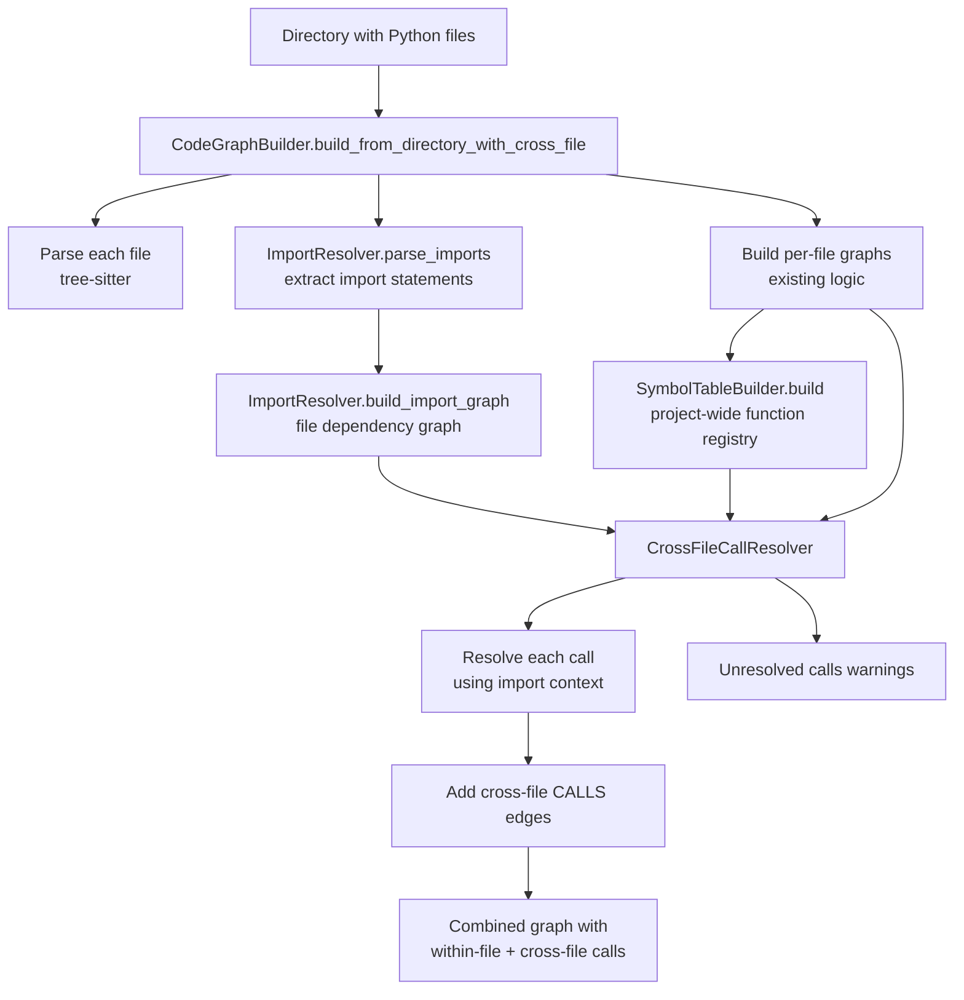

# E3: Cross-File Call Resolution - Technical Design

**Enhancement**: E3 (Cross-File Call Resolution)
**Date**: 2026-02-01
**Status**: Design Phase

---

## 技术选型 (Technology Choices)

### TC1: Import Resolution Strategy

**Decision**: Use tree-sitter Python parser + custom import resolver

**Rationale**:
- Already using tree-sitter for code parsing (E1, E2, E4)
- Can extract import statements reliably
- No external dependencies needed

**Alternatives Considered**:
- `ast` module: Requires valid Python code (tree-sitter more tolerant)
- `importlib` metadata: Runtime-based, not suitable for static analysis

### TC2: Symbol Table Structure

**Decision**: Two-level dictionary `{function_name: {file_path: [node_ids]}}`

**Rationale**:
- Fast lookup by function name O(1)
- Handles name collisions (multiple files with same function name)
- Tracks all occurrences (useful for ambiguity detection)

**Example**:
```python
symbol_table = {
    "format": {
        "utils/string.py": ["utils/string.py:format"],
        "utils/number.py": ["utils/number.py:format"]
    },
    "helper": {
        "app.py": ["app.py:helper"],
        "tests/test_app.py": ["tests/test_app.py:helper"]
    }
}
```

### TC3: Import Graph Representation

**Decision**: NetworkX DiGraph with file paths as nodes

**Rationale**:
- Consistent with existing Code Graph implementation
- Efficient graph algorithms (DFS, BFS for resolution)
- Easy to merge with function call graph

**Edge Types**:
- `IMPORTS`: file1 → file2 (file1 imports from file2)
- Attributes: `import_type` (absolute/relative), `imported_names` (list)

### TC4: Resolution Strategy

**Decision**: Conservative resolution (skip ambiguous cases)

**Rationale**:
- **Accuracy over completeness**: Prefer false negatives to false positives
- User can see unresolved calls in warnings
- Safer for refactoring use cases

**Resolution Priority**:
1. **Same file**: `func()` called in same file as definition → highest confidence
2. **Direct import**: `from x import func; func()` → high confidence
3. **Module import**: `import x; x.func()` → high confidence
4. **Aliased import**: `import x as y; y.func()` → medium confidence
5. **Wildcard import**: `from x import *; func()` → low confidence (warn)
6. **Unresolved**: Cannot determine → skip (log warning)

---

## 架构设计 (Architecture Design)

### Component Overview

```
┌─────────────────────────────────────────────────────────┐
│              CodeGraphBuilder (existing)                │
│  ┌───────────────────────────────────────────────────┐  │
│  │  New: build_from_directory_with_cross_file()      │  │
│  └───────────────────────────────────────────────────┘  │
└─────────────────────────────────────────────────────────┘
                          │
                          ▼
┌─────────────────────────────────────────────────────────┐
│           ImportResolver (NEW)                          │
│  - parse_imports(file_path) → List[Import]             │
│  - resolve_import(import_stmt, from_file) → Path       │
│  - build_import_graph(files) → nx.DiGraph              │
└─────────────────────────────────────────────────────────┘
                          │
                          ▼
┌─────────────────────────────────────────────────────────┐
│           SymbolTableBuilder (NEW)                      │
│  - build(file_graphs) → SymbolTable                     │
│  - lookup(func_name, context_file) → List[NodeID]      │
└─────────────────────────────────────────────────────────┘
                          │
                          ▼
┌─────────────────────────────────────────────────────────┐
│           CrossFileCallResolver (NEW)                   │
│  - resolve_calls(graph, import_graph, symbol_table)    │
│  - add_cross_file_edges(combined_graph) → nx.DiGraph   │
└─────────────────────────────────────────────────────────┘
```

### Component Details

#### Component 1: ImportResolver

**Location**: `tree_sitter_analyzer_v2/graph/imports.py`

**Responsibilities**:
- Extract import statements from Python files
- Resolve import paths (absolute, relative)
- Build file-level import dependency graph

**Key Classes**:

```python
@dataclass
class Import:
    """Represents a single import statement."""
    module: str  # e.g., "utils.parser"
    names: List[str]  # e.g., ["parse_data", "validate"]
    alias: Optional[Dict[str, str]]  # e.g., {"parse_data": "pd"}
    import_type: str  # "absolute" | "relative"
    level: int  # for relative imports: 0 = absolute, 1 = ".", 2 = ".."

class ImportResolver:
    """Resolves Python import statements to file paths."""

    def __init__(self, project_root: Path):
        self.project_root = project_root
        self.module_cache: Dict[str, Path] = {}

    def parse_imports(self, file_path: Path) -> List[Import]:
        """Extract all import statements from a file."""
        # Use tree-sitter to find import_statement and import_from_statement nodes
        pass

    def resolve_import(self, import_stmt: Import, from_file: Path) -> Optional[Path]:
        """Resolve an import to actual file path."""
        if import_stmt.import_type == "relative":
            return self._resolve_relative(import_stmt, from_file)
        else:
            return self._resolve_absolute(import_stmt)

    def _resolve_relative(self, import_stmt: Import, from_file: Path) -> Optional[Path]:
        """Resolve relative import (from . import x)."""
        # Go up 'level' directories from from_file
        # Append module path
        # Check if file exists
        pass

    def _resolve_absolute(self, import_stmt: Import) -> Optional[Path]:
        """Resolve absolute import (from package.module import x)."""
        # Convert module path to file path
        # Search from project_root
        pass

    def build_import_graph(self, files: List[Path]) -> nx.DiGraph:
        """Build import dependency graph for all files."""
        graph = nx.DiGraph()
        for file in files:
            imports = self.parse_imports(file)
            for imp in imports:
                target_file = self.resolve_import(imp, file)
                if target_file:
                    graph.add_edge(
                        str(file),
                        str(target_file),
                        type="IMPORTS",
                        imported_names=imp.names,
                        aliases=imp.alias
                    )
        return graph
```

#### Component 2: SymbolTableBuilder

**Location**: `tree_sitter_analyzer_v2/graph/symbols.py`

**Responsibilities**:
- Build project-wide function registry
- Lookup function definitions by name
- Handle name collisions

**Key Classes**:

```python
@dataclass
class SymbolEntry:
    """Single entry in symbol table."""
    node_id: str  # e.g., "app.py:main"
    file_path: str  # e.g., "app.py"
    name: str  # e.g., "main"
    type: str  # "FUNCTION" | "CLASS" | "METHOD"
    line_start: int
    line_end: int

class SymbolTable:
    """Project-wide symbol registry."""

    def __init__(self):
        # function_name → list of all definitions
        self._table: Dict[str, List[SymbolEntry]] = {}

    def add(self, entry: SymbolEntry):
        """Add symbol to table."""
        if entry.name not in self._table:
            self._table[entry.name] = []
        self._table[entry.name].append(entry)

    def lookup(self, name: str, context_file: Optional[str] = None) -> List[SymbolEntry]:
        """Find all definitions of a symbol."""
        results = self._table.get(name, [])

        # If context provided, prioritize same-file definitions
        if context_file:
            same_file = [e for e in results if e.file_path == context_file]
            if same_file:
                return same_file

        return results

    def lookup_in_file(self, name: str, file_path: str) -> Optional[SymbolEntry]:
        """Find definition in specific file."""
        entries = self._table.get(name, [])
        for entry in entries:
            if entry.file_path == file_path:
                return entry
        return None

class SymbolTableBuilder:
    """Build symbol table from code graphs."""

    def build(self, file_graphs: Dict[str, nx.DiGraph]) -> SymbolTable:
        """Build symbol table from all file graphs."""
        table = SymbolTable()

        for file_path, graph in file_graphs.items():
            for node_id, data in graph.nodes(data=True):
                if data.get('type') in ['FUNCTION', 'METHOD']:
                    entry = SymbolEntry(
                        node_id=node_id,
                        file_path=file_path,
                        name=data['name'],
                        type=data['type'],
                        line_start=data.get('line_start', 0),
                        line_end=data.get('line_end', 0)
                    )
                    table.add(entry)

        return table
```

#### Component 3: CrossFileCallResolver

**Location**: `tree_sitter_analyzer_v2/graph/cross_file.py`

**Responsibilities**:
- Resolve function calls to definitions across files
- Use import context for disambiguation
- Add cross-file CALLS edges

**Key Classes**:

```python
class CrossFileCallResolver:
    """Resolve cross-file function calls."""

    def __init__(
        self,
        import_graph: nx.DiGraph,
        symbol_table: SymbolTable
    ):
        self.import_graph = import_graph
        self.symbol_table = symbol_table
        self.unresolved: List[str] = []  # Track unresolved calls

    def resolve(
        self,
        file_graphs: Dict[str, nx.DiGraph]
    ) -> nx.DiGraph:
        """Add cross-file CALLS edges to combined graph."""

        # Step 1: Combine all file graphs
        combined = nx.DiGraph()
        for graph in file_graphs.values():
            combined = nx.compose(combined, graph)

        # Step 2: For each function, resolve external calls
        for file_path, graph in file_graphs.items():
            for node_id, data in graph.nodes(data=True):
                if data.get('type') != 'FUNCTION':
                    continue

                # Get calls made by this function
                calls = self._get_call_nodes(graph, node_id)

                for call_name in calls:
                    # Try to resolve this call
                    target = self._resolve_call(
                        call_name,
                        file_path,
                        node_id
                    )

                    if target and target != node_id:  # Avoid self-loops
                        # Add cross-file CALLS edge
                        combined.add_edge(
                            node_id,
                            target,
                            type='CALLS',
                            cross_file=(self._get_file(target) != file_path)
                        )

        return combined

    def _resolve_call(
        self,
        call_name: str,
        from_file: str,
        caller_node_id: str
    ) -> Optional[str]:
        """Resolve a function call to its definition."""

        # Priority 1: Same file
        same_file_def = self.symbol_table.lookup_in_file(call_name, from_file)
        if same_file_def:
            return same_file_def.node_id

        # Priority 2: Direct imports
        imported_defs = self._find_imported_symbols(call_name, from_file)
        if len(imported_defs) == 1:
            # Unambiguous - single import
            return imported_defs[0].node_id
        elif len(imported_defs) > 1:
            # Ambiguous - log warning and skip
            self.unresolved.append(
                f"{caller_node_id}: Ambiguous call to '{call_name}' "
                f"(found in {len(imported_defs)} files)"
            )
            return None

        # Priority 3: Not found
        # (Could be stdlib, external package, or unresolved)
        return None

    def _find_imported_symbols(
        self,
        symbol_name: str,
        from_file: str
    ) -> List[SymbolEntry]:
        """Find symbols imported by this file."""
        results = []

        # Get all files imported by from_file
        if from_file not in self.import_graph:
            return results

        for imported_file in self.import_graph.successors(from_file):
            edge_data = self.import_graph[from_file][imported_file]
            imported_names = edge_data.get('imported_names', [])

            # Check if symbol is in imported names
            if symbol_name in imported_names or '*' in imported_names:
                # Look up symbol in imported file
                entry = self.symbol_table.lookup_in_file(symbol_name, imported_file)
                if entry:
                    results.append(entry)

        return results

    def get_unresolved_calls(self) -> List[str]:
        """Get list of unresolved call warnings."""
        return self.unresolved
```

---

## 数据流图 (Data Flow)



---

## API 设计 (API Design)

### Updated CodeGraphBuilder API

```python
class CodeGraphBuilder:
    """Enhanced with cross-file resolution support."""

    def build_from_directory(
        self,
        directory: str,
        pattern: str = "**/*.py",
        exclude_patterns: Optional[List[str]] = None,
        cross_file: bool = False  # NEW parameter
    ) -> nx.DiGraph:
        """
        Build code graph from directory.

        Args:
            directory: Root directory to analyze
            pattern: Glob pattern for files
            exclude_patterns: Patterns to exclude
            cross_file: If True, resolve cross-file calls (E3)

        Returns:
            Combined graph with CALLS edges
        """
        if not cross_file:
            # Existing E2 behavior (fast, within-file only)
            return self._build_multi_file_simple(directory, pattern, exclude_patterns)
        else:
            # New E3 behavior (slower, cross-file resolution)
            return self._build_with_cross_file(directory, pattern, exclude_patterns)

    def _build_with_cross_file(
        self,
        directory: str,
        pattern: str,
        exclude_patterns: Optional[List[str]]
    ) -> nx.DiGraph:
        """Build graph with cross-file call resolution."""

        # Step 1: Find all files
        files = self._find_files(directory, pattern, exclude_patterns)

        # Step 2: Build per-file graphs (parallel)
        file_graphs = {}
        with ThreadPoolExecutor(max_workers=4) as executor:
            results = executor.map(self._build_single_file, files)
            file_graphs = dict(zip(files, results))

        # Step 3: Resolve imports
        import_resolver = ImportResolver(Path(directory))
        import_graph = import_resolver.build_import_graph(files)

        # Step 4: Build symbol table
        symbol_builder = SymbolTableBuilder()
        symbol_table = symbol_builder.build(file_graphs)

        # Step 5: Resolve cross-file calls
        resolver = CrossFileCallResolver(import_graph, symbol_table)
        combined_graph = resolver.resolve(file_graphs)

        # Step 6: Log warnings
        unresolved = resolver.get_unresolved_calls()
        if unresolved:
            logger.warning(f"Unresolved calls: {len(unresolved)}")
            for warning in unresolved[:10]:  # Show first 10
                logger.warning(f"  {warning}")

        return combined_graph
```

### Updated MCP Tools

```python
class AnalyzeCodeGraphTool(BaseTool):
    """Enhanced with cross_file parameter."""

    def get_schema(self) -> Dict[str, Any]:
        return {
            "properties": {
                # ... existing parameters ...
                "cross_file": {
                    "type": "boolean",
                    "description": "Enable cross-file call resolution (slower, more complete)",
                    "default": False
                }
            }
        }

    def execute(self, arguments: Dict[str, Any]) -> Dict[str, Any]:
        cross_file = arguments.get("cross_file", False)

        # Use updated builder API
        graph = self.builder.build_from_directory(
            directory,
            pattern=pattern,
            exclude_patterns=exclude_patterns,
            cross_file=cross_file  # Pass through
        )

        # Add cross-file statistics
        cross_file_edges = [
            (u, v) for u, v, d in graph.edges(data=True)
            if d.get('cross_file', False)
        ]

        return {
            "success": True,
            "statistics": {
                # ... existing stats ...
                "cross_file_calls": len(cross_file_edges),
                "cross_file_enabled": cross_file
            }
        }
```

---

## 实现细节 (Implementation Details)

### ID1: Tree-sitter Queries for Imports

**Import Statement Query**:
```scheme
;; Capture "import x" and "import x as y"
(import_statement
  name: (dotted_name) @module
  (aliased_import
    name: (dotted_name) @module
    alias: (identifier) @alias)?
)

;; Capture "from x import y"
(import_from_statement
  module_name: (relative_import
    (dotted_name)? @module
    (import_prefix)? @prefix
  )?
  (dotted_name) @import_names
)
```

### ID2: Import Resolution Algorithm

**Absolute Import Resolution**:
```python
def _resolve_absolute(self, import_stmt: Import) -> Optional[Path]:
    """Resolve absolute import to file path."""
    # Convert: "package.subpackage.module" → "package/subpackage/module.py"
    parts = import_stmt.module.split('.')

    # Try with .py extension
    candidate = self.project_root / '/'.join(parts)
    if candidate.with_suffix('.py').exists():
        return candidate.with_suffix('.py')

    # Try as package (__init__.py)
    init_file = candidate / '__init__.py'
    if init_file.exists():
        return init_file

    return None  # External package or not found
```

**Relative Import Resolution**:
```python
def _resolve_relative(self, import_stmt: Import, from_file: Path) -> Optional[Path]:
    """Resolve relative import."""
    # Level 1: from . import x (same directory)
    # Level 2: from .. import x (parent directory)

    base_dir = from_file.parent
    for _ in range(import_stmt.level - 1):
        base_dir = base_dir.parent

    # Append module path
    if import_stmt.module:
        parts = import_stmt.module.split('.')
        candidate = base_dir / '/'.join(parts)
    else:
        candidate = base_dir

    # Check existence
    if candidate.with_suffix('.py').exists():
        return candidate.with_suffix('.py')

    init_file = candidate / '__init__.py'
    if init_file.exists():
        return init_file

    return None
```

### ID3: Call Resolution Priority

```python
def _resolve_call_priority(
    self,
    call_name: str,
    from_file: str,
    import_graph: nx.DiGraph,
    symbol_table: SymbolTable
) -> Optional[str]:
    """Resolve call with priority order."""

    # Priority 1: Same file (highest confidence)
    same_file = symbol_table.lookup_in_file(call_name, from_file)
    if same_file:
        return same_file.node_id

    # Priority 2: Directly imported (high confidence)
    imported = self._find_directly_imported(call_name, from_file, import_graph)
    if len(imported) == 1:
        return imported[0].node_id
    elif len(imported) > 1:
        # Ambiguous - log and skip
        logger.warning(f"Ambiguous: {call_name} found in {len(imported)} files")
        return None

    # Priority 3: Wildcard import (low confidence)
    wildcard = self._find_wildcard_imported(call_name, from_file, import_graph)
    if wildcard:
        logger.info(f"Resolved via wildcard: {call_name} → {wildcard.node_id}")
        return wildcard.node_id

    # Not found - likely stdlib or external
    return None
```

---

## 边界情况处理 (Edge Cases)

### EC1: Circular Imports
**Problem**: A imports B, B imports A
**Solution**: Import graph allows cycles (DiGraph), resolution still works

### EC2: Wildcard Imports
**Problem**: `from utils import *` - which functions are imported?
**Solution**:
- Parse target file's `__all__` if present
- Otherwise, import all public functions (not starting with `_`)
- Log warning about wildcard usage

### EC3: Name Shadowing
**Problem**: Local variable shadows imported function
```python
from utils import helper
def main():
    helper = lambda: 42  # Shadows import
    helper()  # Calls local, not imported
```
**Solution**: Skip (too complex for static analysis), log warning

### EC4: Aliased Imports
**Problem**: `import numpy as np; np.array()`
**Solution**: Track aliases in import graph edge data, resolve `np.array` → `numpy.array`

### EC5: Package __init__.py Re-exports
**Problem**: `package/__init__.py` contains `from .module import func`
**Solution**: When resolving `from package import func`, check both `package/__init__.py` and `package/func.py`

---

## 性能优化 (Performance Optimization)

### PO1: Parallel File Parsing
Use existing E2 parallel processing for initial file parsing.

### PO2: Import Graph Caching
Cache import graph per directory, invalidate on file changes.

### PO3: Symbol Table Indexing
Use dictionary for O(1) lookup instead of list iteration.

### PO4: Early Termination
Stop resolution search once unambiguous match found.

### PO5: Lazy Import Resolution
Only resolve imports for files that actually make cross-file calls.

---

## 测试策略 (Testing Strategy)

### Test Levels

1. **Unit Tests** (New: ~20 tests)
   - `test_import_resolver.py`: Import parsing and resolution
   - `test_symbol_table.py`: Symbol table construction and lookup
   - `test_cross_file_resolver.py`: Call resolution logic

2. **Integration Tests** (New: ~15 tests)
   - `test_cross_file_e2e.py`: End-to-end cross-file resolution
   - Small test projects with known cross-file calls

3. **Regression Tests** (Existing: must pass)
   - Ensure E1, E2, E4 still work with `cross_file=False`

### Test Projects

Create `tests/fixtures/cross_file_project/`:
```
tests/fixtures/cross_file_project/
├── __init__.py
├── main.py           # from utils import helper; main() calls helper()
├── utils/
│   ├── __init__.py
│   ├── helper.py     # def helper(): ...
│   └── validator.py  # def validate(): ...
└── tests/
    └── test_main.py  # from main import main; test calls main()
```

**Expected Graph**:
- `main.py:main` → `utils/helper.py:helper` (cross_file=True)
- `tests/test_main.py:test_main` → `main.py:main` (cross_file=True)

---

## 文档更新 (Documentation Updates)

1. **User Guide**: Add "Cross-File Analysis" section
2. **API Reference**: Document `cross_file` parameter
3. **Examples**: Add cross-file analysis examples
4. **MCP Tools**: Update tool descriptions

---

## 风险缓解 (Risk Mitigation)

| Risk | Mitigation |
|------|------------|
| **Complex import resolution** | Start with simple cases (absolute, direct), add complexity iteratively |
| **Performance degradation** | Make `cross_file` opt-in (default False), profile and optimize |
| **False positives** | Conservative resolution (skip ambiguous), log warnings |
| **Breaking changes** | Comprehensive regression testing, `cross_file` as new parameter |

---

**Design Status**: ✅ READY FOR IMPLEMENTATION

**Next Step**: Create E3_TASKS.md with detailed task breakdown
