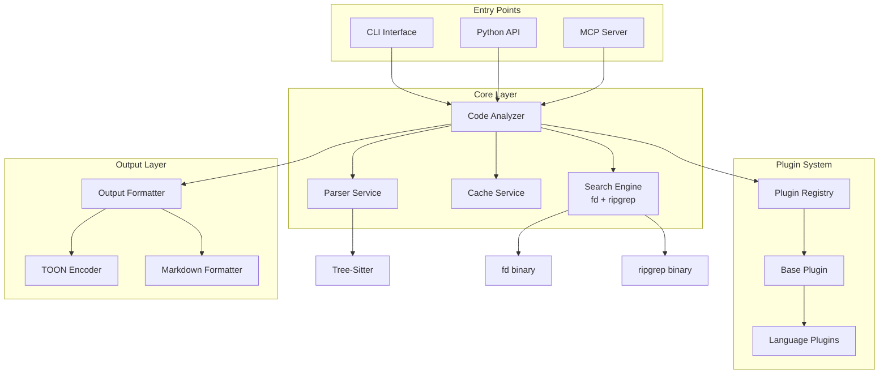
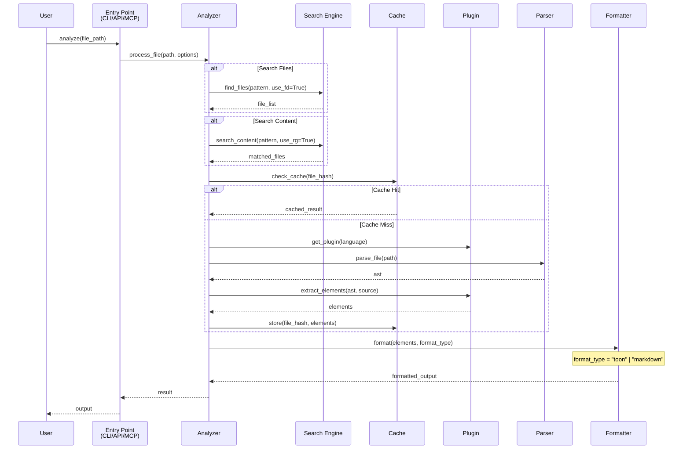

# Tree-Sitter Analyzer v2 - Complete Architecture Rewrite

## Executive Summary

Tree-Sitter Analyzer v2 is a ground-up rewrite focusing on **simplicity, correctness, and performance**. We eliminate v1's over-engineering, fake abstractions, and architectural debt while preserving its valuable capabilities.

**Core Philosophy**: Build the simplest system that works correctly, then optimize only where measured bottlenecks exist.

**Key Updates** (2026-01-31):
- ✅ **fd + ripgrep integration**: Preserve fast file/content search (critical for AI assistants)
- ✅ **Output formats**: TOON + Markdown only (remove JSON bloat)
- ✅ **Dual interfaces**: CLI (testing) + API (Agent Skills)

---

## 1. Core Architecture

### Component Diagram



### Data Flow Diagram



### Clear Responsibility Boundaries

| Component | Single Responsibility | Does NOT Do |
|-----------|----------------------|-------------|
| **Analyzer** | Orchestrates analysis workflow | Parse files, extract elements, format output |
| **Parser** | Parses files to AST using tree-sitter | Language detection, element extraction |
| **Search** | Fast file/content search (fd/rg) | Code analysis, parsing |
| **Cache** | Stores/retrieves analysis results | File watching, invalidation logic |
| **Plugin** | Extracts language-specific elements | Parsing, caching, formatting |
| **Formatter** | Formats output (TOON/Markdown) | Analysis, element extraction |
| **MCP Server** | Handles MCP protocol | Analysis logic, caching |
| **CLI** | Handles command-line interface | Analysis logic, formatting |
| **API** | Provides Python API | CLI logic, MCP protocol |

---

## 2. Module Structure

```
tree_sitter_analyzer_v2/
├── __init__.py           # Version, exports, API entry point
├── analyzer.py           # Core analyzer (200 lines max)
├── parser.py            # Tree-sitter wrapper (100 lines)
├── cache.py             # Simple LRU cache (150 lines)
├── search.py            # fd + ripgrep wrapper (200 lines)
│
├── plugins/
│   ├── __init__.py      # Plugin discovery
│   ├── base.py          # Base plugin class (300 lines)
│   ├── registry.py      # Plugin registry (100 lines)
│   └── languages/       # One file per language
│       ├── python.py    # Python plugin (100 lines)
│       ├── java.py      # Java plugin (100 lines)
│       └── ...          # Other languages
│
├── formatters/
│   ├── __init__.py      # Formatter registry
│   ├── toon.py          # TOON formatter (200 lines)
│   └── markdown.py      # Markdown formatter (150 lines)
│
├── models/
│   ├── __init__.py      # Model exports
│   └── elements.py      # Element data classes (200 lines)
│
├── mcp/
│   ├── __init__.py      # MCP exports
│   ├── server.py        # MCP server (200 lines)
│   └── tools.py         # MCP tool definitions (300 lines)
│
├── cli/
│   ├── __init__.py      # CLI exports
│   └── main.py          # CLI entry point (200 lines)
│
├── api/
│   ├── __init__.py      # Public API exports
│   └── interface.py     # API interface (150 lines)
│
└── utils/
    ├── __init__.py      # Utility exports
    ├── files.py         # File utilities (100 lines)
    └── security.py      # Path validation (100 lines)
```

**Key Principles**:
- No file exceeds 300 lines (most under 200)
- Each file has ONE clear purpose
- No circular imports possible with this structure
- Plugins are self-contained
- **fd/rg binaries wrapped, not reimplemented**

---

## 3. Search Integration (fd + ripgrep)

### Design Decision: Wrapper, Not Reimplementation

**Rationale**:
- fd (file search): 10-20x faster than Python glob
- ripgrep (content search): 5-10x faster than Python regex
- Battle-tested, maintained by Rust community
- AI assistants need SPEED for large codebases

### Search Engine Interface

```python
# search.py
from pathlib import Path
import subprocess
import shutil

class SearchEngine:
    """Wrapper for fd and ripgrep - fast search for AI assistants."""

    def __init__(self, project_root: str):
        self.root = Path(project_root)
        self.fd_path = shutil.which('fd')
        self.rg_path = shutil.which('rg')

        if not self.fd_path:
            raise RuntimeError("fd not found - install via: brew install fd")
        if not self.rg_path:
            raise RuntimeError("ripgrep not found - install via: brew install ripgrep")

    def find_files(
        self,
        pattern: str = None,
        extensions: list[str] = None,
        ignore_hidden: bool = True,
        max_depth: int = None
    ) -> list[Path]:
        """Find files using fd (10-20x faster than glob)."""
        cmd = [self.fd_path]

        if ignore_hidden:
            cmd.append('--hidden')
        if max_depth:
            cmd.extend(['--max-depth', str(max_depth)])
        if extensions:
            for ext in extensions:
                cmd.extend(['--extension', ext.lstrip('.')])
        if pattern:
            cmd.append(pattern)

        cmd.extend(['--type', 'f'])  # Files only
        cmd.append(str(self.root))

        result = subprocess.run(cmd, capture_output=True, text=True)
        return [Path(line) for line in result.stdout.splitlines()]

    def search_content(
        self,
        pattern: str,
        file_types: list[str] = None,
        case_sensitive: bool = True,
        context_lines: int = 0
    ) -> dict[Path, list[tuple[int, str]]]:
        """Search file content using ripgrep (5-10x faster than Python regex)."""
        cmd = [self.rg_path, pattern]

        if not case_sensitive:
            cmd.append('--ignore-case')
        if context_lines:
            cmd.extend(['--context', str(context_lines)])
        if file_types:
            for ft in file_types:
                cmd.extend(['--type', ft])

        cmd.extend([
            '--line-number',
            '--with-filename',
            '--no-heading',
            str(self.root)
        ])

        result = subprocess.run(cmd, capture_output=True, text=True)

        # Parse output: file:line:content
        matches = {}
        for line in result.stdout.splitlines():
            parts = line.split(':', 2)
            if len(parts) == 3:
                file_path = Path(parts[0])
                line_num = int(parts[1])
                content = parts[2]

                if file_path not in matches:
                    matches[file_path] = []
                matches[file_path].append((line_num, content))

        return matches
```

### MCP Tools Using Search

```python
# mcp/tools.py (excerpt)

class FindFilesTool:
    """MCP tool for fast file discovery."""

    name = "find_files"
    description = "Find files by pattern (uses fd - 10x faster than glob)"

    def __init__(self, search_engine: SearchEngine):
        self.search = search_engine

    def execute(
        self,
        pattern: str = None,
        extensions: list[str] = None,
        max_results: int = 100
    ) -> dict:
        """Execute file search."""
        try:
            files = self.search.find_files(pattern, extensions)
            files = files[:max_results]  # Limit results
            return {
                'success': True,
                'files': [str(f) for f in files],
                'count': len(files)
            }
        except Exception as e:
            return {'success': False, 'error': str(e)}

class SearchContentTool:
    """MCP tool for fast content search."""

    name = "search_content"
    description = "Search file content by pattern (uses ripgrep - 5x faster)"

    def __init__(self, search_engine: SearchEngine):
        self.search = search_engine

    def execute(
        self,
        pattern: str,
        file_types: list[str] = None,
        context_lines: int = 2,
        max_results: int = 50
    ) -> dict:
        """Execute content search."""
        try:
            matches = self.search.search_content(
                pattern,
                file_types,
                context_lines=context_lines
            )

            # Format results
            results = []
            for file_path, lines in list(matches.items())[:max_results]:
                results.append({
                    'file': str(file_path),
                    'matches': [
                        {'line': line_num, 'content': content}
                        for line_num, content in lines
                    ]
                })

            return {
                'success': True,
                'results': results,
                'total_files': len(matches)
            }
        except Exception as e:
            return {'success': False, 'error': str(e)}
```

---

## 4. Output Formatters (TOON + Markdown Only)

### Design Decision: Remove JSON

**Rationale**:
- JSON is verbose (100-200% more tokens than TOON)
- Markdown is human-readable (useful for CLI output)
- TOON is token-optimal (AI assistant primary format)
- **Two formats are enough** - don't over-engineer

### Formatter Interface

```python
# formatters/base.py
from abc import ABC, abstractmethod
from typing import Protocol

class OutputFormatter(Protocol):
    """Minimal formatter interface."""

    @property
    def format_name(self) -> str:
        """Format identifier (e.g., 'toon', 'markdown')."""
        ...

    def format(self, elements: Elements) -> str:
        """Format elements to string."""
        ...
```

### TOON Formatter (from v1, simplified)

```python
# formatters/toon.py
class TOONFormatter:
    """Token-Optimized Output Notation - 50-70% reduction."""

    format_name = "toon"

    def format(self, elements: Elements) -> str:
        """Format to TOON."""
        lines = []

        # Classes
        for cls in elements.classes:
            lines.append(f"C {cls.name} {cls.start_line}-{cls.end_line}")
            for method in cls.methods:
                lines.append(f"  M {method.name}({self._params(method)})")

        # Functions
        for func in elements.functions:
            lines.append(f"F {func.name}({self._params(func)}) {func.start_line}")

        # Imports
        if elements.imports:
            lines.append(f"I {','.join(i.module for i in elements.imports)}")

        return '\n'.join(lines)

    def _params(self, func) -> str:
        """Format parameters compactly."""
        return ','.join(p.name for p in func.parameters)
```

### Markdown Formatter (new)

```python
# formatters/markdown.py
class MarkdownFormatter:
    """Human-readable Markdown format for CLI output."""

    format_name = "markdown"

    def format(self, elements: Elements) -> str:
        """Format to Markdown."""
        sections = []

        # Header
        sections.append(f"# Code Analysis\n")

        # Classes
        if elements.classes:
            sections.append("## Classes\n")
            for cls in elements.classes:
                sections.append(f"### `{cls.name}` (lines {cls.start_line}-{cls.end_line})\n")
                if cls.methods:
                    sections.append("**Methods:**\n")
                    for method in cls.methods:
                        params = ', '.join(p.name for p in method.parameters)
                        sections.append(f"- `{method.name}({params})`\n")

        # Functions
        if elements.functions:
            sections.append("## Functions\n")
            for func in elements.functions:
                params = ', '.join(p.name for p in func.parameters)
                sections.append(f"- `{func.name}({params})` (line {func.start_line})\n")

        # Imports
        if elements.imports:
            sections.append("## Imports\n")
            for imp in elements.imports:
                sections.append(f"- `{imp.module}`\n")

        return '\n'.join(sections)
```

### Formatter Registry

```python
# formatters/__init__.py
class FormatterRegistry:
    """Simple formatter registry."""

    def __init__(self):
        self._formatters = {
            'toon': TOONFormatter(),
            'markdown': MarkdownFormatter()
        }

    def get(self, format_name: str) -> OutputFormatter:
        """Get formatter by name."""
        if format_name not in self._formatters:
            raise ValueError(f"Unknown format: {format_name}. Use 'toon' or 'markdown'.")
        return self._formatters[format_name]

    @property
    def supported_formats(self) -> list[str]:
        """List supported formats."""
        return list(self._formatters.keys())
```

---

## 5. Dual Interface: CLI + API

### CLI Interface

```python
# cli/main.py
import argparse
from pathlib import Path
from tree_sitter_analyzer_v2 import CodeAnalyzer

def main():
    parser = argparse.ArgumentParser(
        description="Tree-Sitter Analyzer v2 - Code Analysis for AI"
    )

    parser.add_argument('file', help='File to analyze')
    parser.add_argument(
        '--format',
        choices=['toon', 'markdown'],
        default='markdown',
        help='Output format (default: markdown for CLI)'
    )
    parser.add_argument(
        '--search-files',
        help='Search files by pattern (uses fd)'
    )
    parser.add_argument(
        '--search-content',
        help='Search file content (uses ripgrep)'
    )

    args = parser.parse_args()

    analyzer = CodeAnalyzer(project_root=Path.cwd())

    if args.search_files:
        # File search
        results = analyzer.search_files(pattern=args.search_files)
        for file in results:
            print(file)
    elif args.search_content:
        # Content search
        results = analyzer.search_content(pattern=args.search_content)
        for file, matches in results.items():
            print(f"\n{file}:")
            for line_num, content in matches:
                print(f"  {line_num}: {content}")
    else:
        # Code analysis
        result = analyzer.analyze(args.file, format=args.format)
        print(result)

if __name__ == '__main__':
    main()
```

### Python API

```python
# api/interface.py
from pathlib import Path
from tree_sitter_analyzer_v2.analyzer import CodeAnalyzer
from tree_sitter_analyzer_v2.models import Elements

class TreeSitterAnalyzerAPI:
    """Public Python API for programmatic use."""

    def __init__(self, project_root: str = None):
        """Initialize analyzer.

        Args:
            project_root: Project root directory (default: current directory)
        """
        self.analyzer = CodeAnalyzer(
            project_root=project_root or Path.cwd()
        )

    def analyze_file(self, file_path: str, format: str = 'toon') -> str:
        """Analyze a single file.

        Args:
            file_path: Path to file
            format: Output format ('toon' or 'markdown')

        Returns:
            Formatted analysis result
        """
        return self.analyzer.analyze(file_path, format=format)

    def analyze_file_raw(self, file_path: str) -> Elements:
        """Analyze file and return raw Elements object.

        Args:
            file_path: Path to file

        Returns:
            Elements object with classes, functions, etc.
        """
        return self.analyzer.analyze_raw(file_path)

    def search_files(
        self,
        pattern: str = None,
        extensions: list[str] = None
    ) -> list[str]:
        """Search files by pattern (uses fd).

        Args:
            pattern: File name pattern
            extensions: File extensions to filter

        Returns:
            List of matching file paths
        """
        return self.analyzer.search_files(pattern, extensions)

    def search_content(
        self,
        pattern: str,
        file_types: list[str] = None
    ) -> dict[str, list[tuple[int, str]]]:
        """Search file content (uses ripgrep).

        Args:
            pattern: Content pattern to search
            file_types: File types to search (e.g., ['py', 'java'])

        Returns:
            Dict mapping file paths to list of (line_number, content) tuples
        """
        return self.analyzer.search_content(pattern, file_types)

# Usage example
if __name__ == '__main__':
    api = TreeSitterAnalyzerAPI(project_root='/path/to/project')

    # Analyze file
    result = api.analyze_file('src/main.py', format='toon')
    print(result)

    # Search files
    py_files = api.search_files(extensions=['.py'])

    # Search content
    matches = api.search_content('def main')
```

### API Usage as Agent Skill

```python
# Example: Using as Claude Code Agent Skill
from tree_sitter_analyzer_v2.api import TreeSitterAnalyzerAPI

class CodeAnalysisSkill:
    """Agent skill for code analysis."""

    def __init__(self, workspace_root: str):
        self.api = TreeSitterAnalyzerAPI(project_root=workspace_root)

    def analyze_codebase_structure(self, file_pattern: str = None) -> str:
        """Get high-level codebase structure."""
        files = self.api.search_files(pattern=file_pattern)

        results = []
        for file in files[:50]:  # Limit to 50 files
            analysis = self.api.analyze_file(file, format='toon')
            results.append(f"# {file}\n{analysis}\n")

        return '\n'.join(results)

    def find_function_definitions(self, function_name: str) -> dict:
        """Find all definitions of a function."""
        matches = self.api.search_content(f"def {function_name}")

        # Analyze each matched file to get full context
        results = {}
        for file_path in matches.keys():
            elements = self.api.analyze_file_raw(file_path)
            # Filter to matching functions
            funcs = [f for f in elements.functions if f.name == function_name]
            if funcs:
                results[file_path] = funcs

        return results
```

---

## 6. What to Steal from v1

### Code That's Good (Reuse Directly)

| File/Component | Why It's Good | How to Extract |
|----------------|---------------|----------------|
| `formatters/toon_encoder.py` | Working TOON implementation | Copy, simplify class structure |
| Tree-sitter queries | Language-specific queries work | Extract query strings only |
| `models/` dataclasses | Simple, effective models | Copy core classes, remove cruft |
| MCP tool schemas | Well-defined interfaces | Extract schemas, simplify implementation |
| Test fixtures | Good test data | Copy test files and expected outputs |
| fd/rg wrappers | Working search integration | Copy with minor cleanup |

### Patterns to Reuse

1. **TOON Format**: Token optimization works well (50-70% reduction)
2. **Tree-sitter Integration**: Query-based extraction is solid
3. **File Extension → Language Mapping**: Simple and effective
4. **Dataclass Models**: Clean data representation
5. **fd + ripgrep wrappers**: Fast, battle-tested search

### Tests Worth Keeping

- Golden master tests (but simplify framework)
- Language-specific extraction tests
- TOON encoding/decoding tests
- MCP protocol tests
- fd/rg integration tests

---

## 7. What to Delete from v1

### Dead Abstractions to Remove

| Component | Why It's Bad | Replacement |
|-----------|--------------|-------------|
| `AnalysisEngine` god object | 800+ lines, does everything | Simple `CodeAnalyzer` (200 lines) |
| `ElementExtractor` hierarchy | Fake abstraction, not used properly | Direct methods in plugins |
| Multiple cache layers | Confusing, inconsistent | Single `AnalysisCache` |
| `EngineManager` | Unnecessary abstraction | Direct instantiation |
| Platform compatibility layers | Over-engineered | Handle inline where needed |
| `TYPE_CHECKING` gymnastics | Hides circular dependencies | Fix architecture |
| JSON formatter | Bloated, unused in practice | TOON + Markdown only |

### Over-Engineered Parts

1. **Lazy initialization everywhere**: Just initialize what you need
2. **Thread locks without concurrency**: Remove unless proven needed
3. **Complex configuration objects**: Use simple parameters
4. **Protocol classes everywhere**: Use only where truly polymorphic
5. **Performance monitoring everywhere**: Add only after profiling
6. **Multiple output formats**: Two formats (TOON + Markdown) are enough

### Bad Patterns to Avoid

- **Singleton pattern abuse**: Use dependency injection
- **Deep inheritance hierarchies**: Prefer composition
- **Magic methods**: Be explicit
- **Hidden state**: Make dependencies clear
- **Scattered imports**: Organize at top of file
- **Format explosion**: Stick to TOON + Markdown

---

## 8. Migration Strategy

### Phase 1: Extract Good Parts (Week 1)

1. **Copy useful code**:
   ```bash
   # TOON formatter
   cp tree_sitter_analyzer/formatters/toon_encoder.py v2/formatters/toon.py

   # Models
   cp tree_sitter_analyzer/models/*.py v2/models/

   # fd/rg wrappers
   cp tree_sitter_analyzer/mcp/tools/fd_rg/*.py v2/search.py

   # Test fixtures
   cp -r tests/fixtures v2/tests/
   ```

2. **Extract queries**:
   - Pull tree-sitter queries from each language plugin
   - Store as constants in new plugins

3. **Simplify models**:
   - Remove unnecessary fields
   - Ensure all are pure dataclasses

### Phase 2: Build Core (Week 2)

1. **Implement simple analyzer**:
   - No god object
   - Clear workflow
   - Dependency injection

2. **Create base plugin**:
   - Common extraction logic
   - Language plugins extend

3. **Add single cache**:
   - LRU with mtime check
   - No complexity

4. **Wrap fd + ripgrep**:
   - Simple subprocess wrappers
   - Error handling

### Phase 3: Add Languages (Week 3)

1. **Python first** (template):
   - 100 lines max
   - Full test coverage

2. **Apply pattern** to other languages:
   - Java, JavaScript, TypeScript
   - Ruby, Go, Rust
   - etc.

### Phase 4: Interfaces (Week 4)

1. **CLI interface**:
   - Thin wrapper over analyzer
   - No business logic
   - Markdown output default

2. **API interface**:
   - Clean Python API
   - Documentation
   - Usage examples

3. **MCP server**:
   - Clean tool interface
   - TOON output default
   - Consistent error handling

---

## Success Metrics

### Code Quality
- **Complexity**: No file > 300 lines
- **Dependencies**: Zero circular imports
- **Test Coverage**: 90%+ line coverage
- **Type Coverage**: 100% (no Any except where needed)

### Performance
- **Single file analysis**: < 50ms for 1000 lines
- **Cache hit rate**: > 90% in typical usage
- **Memory usage**: < 100MB for typical project
- **Startup time**: < 100ms
- **fd search**: < 100ms for 10K files
- **ripgrep search**: < 200ms for 1M lines

### Maintainability
- **Time to add language**: < 2 hours
- **Time to fix bug**: < 30 minutes
- **Time to understand component**: < 10 minutes
- **Documentation**: Every public API documented

### Feature Completeness
- **Output formats**: TOON + Markdown (remove JSON)
- **Search**: fd + ripgrep integration
- **Interfaces**: CLI + API + MCP
- **Languages**: All 17 languages supported

---

## Anti-Patterns to Prevent

### DON'T
- Create god objects ("it does everything!")
- Add abstraction without 3+ use cases
- Use TYPE_CHECKING to hide bad design
- Add configuration for things with one option
- Optimize before measuring
- Add "future-proofing" complexity
- Create deep inheritance hierarchies
- Use singleton pattern (use DI instead)
- **Add more output formats** (TOON + Markdown are enough!)

### DO
- Write simple, obvious code
- Create focused, single-purpose modules
- Use dependency injection
- Add abstraction only when pattern emerges
- Measure, then optimize
- Use composition over inheritance
- Make dependencies explicit
- Test behavior, not implementation
- **Leverage existing tools** (fd, ripgrep) instead of reimplementing

---

## Conclusion

v2 is a radical simplification that preserves v1's capabilities while eliminating its complexity. By following these principles, we create a maintainable, performant, and extensible code analyzer that's a joy to work with.

**Remember**: The best code is simple code that works correctly. Complexity is the enemy of reliability.

**Key v2 Features**:
- ✅ fd + ripgrep for blazing fast search
- ✅ TOON + Markdown output (no JSON bloat)
- ✅ CLI + API + MCP interfaces
- ✅ Simple, testable architecture
- ✅ Built for AI assistants first
