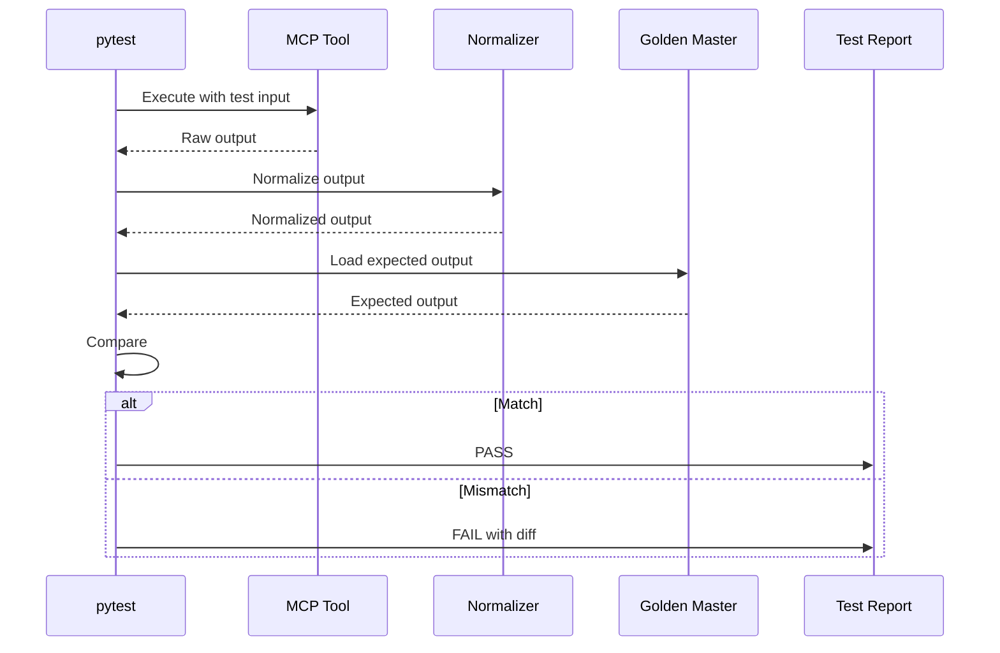
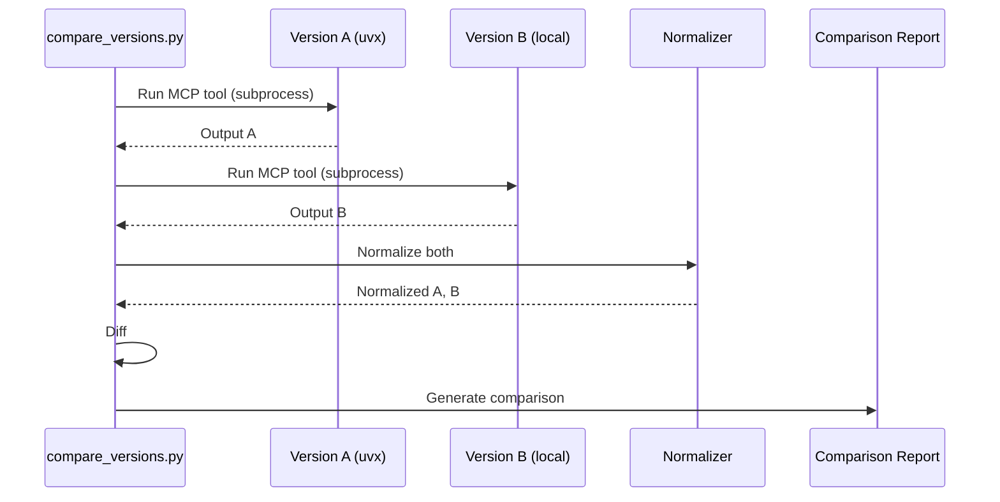

# Version Compatibility Testing - Design

## Technology Choices

### Core Approach: Extended Golden Master Pattern

Extend the existing Golden Master methodology to cover:
1. MCP tool outputs
2. Cross-version comparison
3. Behavioral contracts

### Key Design Decisions

| Decision | Choice | Rationale |
|----------|--------|-----------|
| Test Framework | pytest | Already used project-wide |
| Golden Master Storage | JSON files | Structured, diffable, version-controllable |
| Normalization | Regex-based | Matches existing pattern in golden_master_regression.py |
| Cross-version Runner | subprocess + uvx | Leverages existing package distribution |
| Contract Definition | YAML schema | Human-readable, validatable |

## Architecture Design

```
┌─────────────────────────────────────────────────────────────────┐
│                    Version Compatibility Testing                 │
├─────────────────────────────────────────────────────────────────┤
│                                                                 │
│  ┌─────────────────┐  ┌─────────────────┐  ┌────────────────┐  │
│  │  MCP Golden     │  │  Cross-Version  │  │  Behavioral    │  │
│  │  Master Tests   │  │  Comparator     │  │  Contract      │  │
│  │                 │  │                 │  │  Validator     │  │
│  └────────┬────────┘  └────────┬────────┘  └───────┬────────┘  │
│           │                    │                    │           │
│           ▼                    ▼                    ▼           │
│  ┌─────────────────────────────────────────────────────────────┐│
│  │                   Normalization Layer                       ││
│  │  - Remove timestamps                                        ││
│  │  - Normalize paths (Windows/Unix)                           ││
│  │  - Remove volatile fields                                   ││
│  └─────────────────────────────────────────────────────────────┘│
│           │                    │                    │           │
│           ▼                    ▼                    ▼           │
│  ┌─────────────────────────────────────────────────────────────┐│
│  │                   Storage Layer                             ││
│  │  tests/golden_masters/                                      ││
│  │  ├── mcp/                  # MCP tool outputs               ││
│  │  │   ├── check_code_scale.json                              ││
│  │  │   ├── analyze_code_structure.json                        ││
│  │  │   └── ...                                                ││
│  │  ├── contracts/            # Behavioral contracts           ││
│  │  │   └── mcp_output_contract.yaml                           ││
│  │  └── versions/             # Cross-version snapshots        ││
│  │      ├── v1.6.1.2/                                          ││
│  │      └── v1.9.2/                                            ││
│  └─────────────────────────────────────────────────────────────┘│
│                                                                 │
└─────────────────────────────────────────────────────────────────┘
```

## Data Flow

### MCP Golden Master Test Flow



### Cross-Version Comparison Flow



## API Design

### MCP Golden Master Test Structure

```python
# tests/regression/test_mcp_golden_master.py

import pytest
from pathlib import Path
from tree_sitter_analyzer.mcp.tools import (
    CheckCodeScaleTool,
    AnalyzeCodeStructureTool,
    # ... all 8 tools
)

GOLDEN_MASTER_DIR = Path("tests/golden_masters/mcp")
TEST_FILE = "examples/BigService.java"

class TestMCPGoldenMasters:
    """Golden master tests for all MCP tools."""
    
    @pytest.fixture
    def normalizer(self):
        return MCPOutputNormalizer()
    
    @pytest.mark.parametrize("tool_class,input_args,golden_file", [
        (CheckCodeScaleTool, {"file_path": TEST_FILE}, "check_code_scale.json"),
        (AnalyzeCodeStructureTool, {"file_path": TEST_FILE, "output_format": "json"}, "analyze_code_structure.json"),
        # ... other tools
    ])
    def test_tool_output_matches_golden_master(
        self, tool_class, input_args, golden_file, normalizer
    ):
        tool = tool_class(project_root=Path.cwd())
        result = tool.execute(input_args)
        
        normalized = normalizer.normalize(result)
        expected = load_golden_master(GOLDEN_MASTER_DIR / golden_file)
        
        assert normalized == expected, generate_diff(normalized, expected)
```

### Normalizer Interface

```python
# tree_sitter_analyzer/testing/normalizer.py

class MCPOutputNormalizer:
    """Normalizes MCP output for deterministic comparison."""
    
    # Fields to remove entirely (volatile)
    VOLATILE_FIELDS = ["timestamp", "duration_ms", "cache_hit"]
    
    # Fields to normalize (dynamic but deterministic format)
    PATH_FIELDS = ["file_path", "project_root", "absolute_path"]
    
    def normalize(self, output: dict) -> dict:
        """Normalize output for comparison."""
        result = deepcopy(output)
        result = self._remove_volatile(result)
        result = self._normalize_paths(result)
        result = self._sort_keys(result)
        return result
    
    def _remove_volatile(self, data: dict) -> dict:
        """Remove fields that change between runs."""
        ...
    
    def _normalize_paths(self, data: dict) -> dict:
        """Normalize file paths for cross-platform comparison."""
        ...
```

### Behavioral Contract Schema

```yaml
# tests/golden_masters/contracts/mcp_output_contract.yaml

version: "1.0"
description: "Behavioral contract for MCP tool outputs"

tools:
  check_code_scale:
    stable_fields:  # MUST NOT change format
      - file_path
      - language
      - total_lines
      - blank_lines
      - comment_lines
      - code_lines
      - complexity_score
    additive_fields:  # CAN add new fields here
      - metrics  # Can add new metrics
    volatile_fields:  # MAY change between runs
      - timestamp
      - cache_hit
      - duration_ms

  analyze_code_structure:
    stable_fields:
      - classes[].name
      - classes[].methods[].name
      - classes[].methods[].start_line
      - classes[].methods[].end_line
      - functions[].name
      - imports[].module
    additive_fields:
      - classes[].annotations  # Can add new properties
    volatile_fields:
      - analysis_time
```

### Cross-Version Comparison Script

```python
# scripts/compare_versions.py

import subprocess
import json
from pathlib import Path

def run_mcp_tool_version(version: str, tool: str, args: dict) -> dict:
    """Run an MCP tool at a specific version using uvx."""
    if version == "local":
        cmd = ["uv", "run", "python", "-m", "tree_sitter_analyzer.mcp.cli", 
               tool, json.dumps(args)]
    else:
        cmd = ["uvx", f"tree-sitter-analyzer=={version}", "--mcp-tool", 
               tool, json.dumps(args)]
    
    result = subprocess.run(cmd, capture_output=True, text=True)
    return json.loads(result.stdout)

def compare_versions(v1: str, v2: str, tools: list[str]) -> dict:
    """Compare outputs between two versions."""
    report = {"compatible": True, "differences": []}
    
    for tool in tools:
        output_v1 = run_mcp_tool_version(v1, tool, TEST_ARGS[tool])
        output_v2 = run_mcp_tool_version(v2, tool, TEST_ARGS[tool])
        
        diff = compute_diff(output_v1, output_v2)
        if diff:
            report["compatible"] = False
            report["differences"].append({
                "tool": tool,
                "diff": diff
            })
    
    return report
```

## Implementation Details

### File Structure

```
tests/
├── golden_masters/
│   ├── mcp/                              # MCP tool golden masters
│   │   ├── check_code_scale.json
│   │   ├── analyze_code_structure.json
│   │   ├── extract_code_section.json
│   │   ├── query_code.json
│   │   ├── list_files.json
│   │   ├── search_content.json
│   │   ├── find_and_grep.json
│   │   └── get_supported_languages.json
│   ├── contracts/                        # Behavioral contracts
│   │   └── mcp_output_contract.yaml
│   └── versions/                         # Version snapshots (gitignored)
│       └── .gitkeep
├── regression/
│   ├── test_mcp_golden_master.py         # NEW: MCP golden master tests
│   └── conftest.py                       # Shared fixtures
└── integration/
    └── mcp/
        └── test_cross_version.py         # NEW: Cross-version tests

tree_sitter_analyzer/
└── testing/                              # NEW: Testing utilities
    ├── __init__.py
    ├── normalizer.py                     # Output normalization
    ├── golden_master.py                  # Golden master utilities
    └── contract_validator.py             # Contract validation

scripts/
├── compare_versions.py                   # Cross-version comparison
└── update_golden_masters.py              # Golden master update utility
```

### Edge Cases

| Scenario | Handling |
|----------|----------|
| Windows vs Unix paths | Normalize to forward slashes |
| Floating point precision | Round to 2 decimal places |
| Dictionary key ordering | Sort keys before comparison |
| Optional fields missing | Treat as None, don't fail |
| New additive fields | Pass (not breaking) |
| Changed stable fields | Fail (breaking) |

### CI Integration

```yaml
# .github/workflows/compatibility.yml

name: Compatibility Tests

on:
  pull_request:
    branches: [main, develop]

jobs:
  golden-master:
    runs-on: ubuntu-latest
    steps:
      - uses: actions/checkout@v4
      - uses: astral-sh/setup-uv@v4
      - run: uv sync --extra all
      - run: uv run pytest tests/regression/test_mcp_golden_master.py -v

  cross-version:
    runs-on: ubuntu-latest
    steps:
      - uses: actions/checkout@v4
      - uses: astral-sh/setup-uv@v4
      - run: uv sync --extra all
      - run: uv run python scripts/compare_versions.py --base 1.9.2 --head local
```

## Migration Strategy

### Phase 1: MCP Golden Masters (Week 1)
1. Create normalizer module
2. Generate golden masters for all 8 tools
3. Create pytest tests
4. Add to CI

### Phase 2: Behavioral Contracts (Week 2)
1. Define contract schema
2. Document stable/additive/volatile fields
3. Create contract validator
4. Integrate with golden master tests

### Phase 3: Cross-Version Testing (Week 3)
1. Create comparison script
2. Test with 1.6.1.2 → 1.9.2 → current
3. Generate compatibility report
4. Add to release workflow
