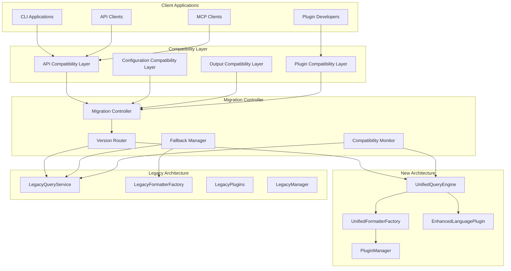

# 後方互換性保証設計書

## 🎯 互換性保証目標

### 主要目標
1. **既存APIの完全互換性** - 全ての公開APIが変更なしで動作
2. **設定ファイルの互換性** - 既存の設定ファイルがそのまま使用可能
3. **出力フォーマットの互換性** - 既存の出力形式を完全に維持
4. **プラグインの互換性** - 既存のプラグインが引き続き動作
5. **段階的移行の保証** - ユーザーが任意のタイミングで移行可能

### 互換性レベル
- ✅ **Level 1**: API署名の完全互換性
- ✅ **Level 2**: 出力フォーマットの完全互換性
- ✅ **Level 3**: 設定ファイルの完全互換性
- ✅ **Level 4**: プラグインインターフェースの互換性
- ✅ **Level 5**: パフォーマンス特性の互換性

## 🏗️ 互換性アーキテクチャ



## 📋 互換性保証コンポーネント

### 1. API互換性レイヤー

#### 1.1 APICompatibilityLayer
```python
# tree_sitter_analyzer/compatibility/api_compatibility_layer.py
from typing import Any, Dict, List, Optional, Union
from functools import wraps
import warnings
from dataclasses import dataclass

@dataclass
class CompatibilityConfig:
    """互換性設定"""
    strict_mode: bool = True
    deprecation_warnings: bool = True
    fallback_enabled: bool = True
    version_check: bool = True

class APICompatibilityLayer:
    """API互換性レイヤー"""
    
    def __init__(self, new_system, legacy_system, config: CompatibilityConfig = None):
        self.new_system = new_system
        self.legacy_system = legacy_system
        self.config = config or CompatibilityConfig()
        self.compatibility_monitor = CompatibilityMonitor()
        self.version_router = VersionRouter()
        
        # 互換性マッピングの初期化
        self.api_mappings = self._initialize_api_mappings()
        self.parameter_mappings = self._initialize_parameter_mappings()
        self.response_transformers = self._initialize_response_transformers()
    
    def execute_query(self, language: str, query_key: str, node, **kwargs) -> List[Any]:
        """クエリ実行の互換性ラッパー"""
        
        # 互換性チェック
        compatibility_info = self._check_api_compatibility("execute_query", locals())
        
        try:
            # 新システムでの実行を試行
            if self.version_router.should_use_new_system(language, query_key):
                result = self._execute_with_new_system(language, query_key, node, **kwargs)
                
                # 結果の互換性変換
                compatible_result = self._transform_result_for_compatibility(result)
                
                # 互換性監視
                self.compatibility_monitor.record_success("execute_query", language, query_key)
                
                return compatible_result
            else:
                # レガシーシステムでの実行
                return self._execute_with_legacy_system(language, query_key, node, **kwargs)
                
        except Exception as e:
            # フォールバック処理
            if self.config.fallback_enabled:
                self.compatibility_monitor.record_fallback("execute_query", str(e))
                return self._execute_with_legacy_system(language, query_key, node, **kwargs)
            else:
                raise
    
    def format_elements(self, elements: List[Any], format_type: str, **options) -> str:
        """フォーマット実行の互換性ラッパー"""
        
        try:
            # 新システムでのフォーマット
            if self.version_router.should_use_new_formatter(format_type):
                # 要素の言語を推定
                language = self._infer_language_from_elements(elements)
                
                # 新システムでフォーマット
                result = self.new_system.format_elements(language, format_type, elements, **options)
                
                # 互換性のある形式に変換
                if hasattr(result, 'content'):
                    return result.content
                else:
                    return result
            else:
                # レガシーシステムでのフォーマット
                return self.legacy_system.format_elements(elements, format_type, **options)
                
        except Exception as e:
            if self.config.fallback_enabled:
                self.compatibility_monitor.record_fallback("format_elements", str(e))
                return self.legacy_system.format_elements(elements, format_type, **options)
            else:
                raise
    
    def get_supported_languages(self) -> List[str]:
        """サポート言語一覧の互換性ラッパー"""
        
        # 新旧システムの言語リストをマージ
        new_languages = set(self.new_system.get_supported_languages())
        legacy_languages = set(self.legacy_system.get_supported_languages())
        
        # 互換性のため、レガシー言語を優先
        all_languages = legacy_languages.union(new_languages)
        
        return sorted(list(all_languages))
    
    def get_supported_queries(self, language: str) -> List[str]:
        """サポートクエリ一覧の互換性ラッパー"""
        
        try:
            # 新システムから取得を試行
            new_queries = set(self.new_system.get_supported_queries(language))
        except:
            new_queries = set()
        
        try:
            # レガシーシステムから取得
            legacy_queries = set(self.legacy_system.get_supported_queries(language))
        except:
            legacy_queries = set()
        
        # 互換性のため、レガシークエリを優先
        all_queries = legacy_queries.union(new_queries)
        
        return sorted(list(all_queries))
    
    def _execute_with_new_system(self, language: str, query_key: str, node, **kwargs):
        """新システムでの実行"""
        
        # パラメータの互換性変換
        converted_kwargs = self._convert_parameters_for_new_system(kwargs)
        
        # 新システムでの実行
        result = self.new_system.execute_query(language, query_key, node, **converted_kwargs)
        
        return result
    
    def _execute_with_legacy_system(self, language: str, query_key: str, node, **kwargs):
        """レガシーシステムでの実行"""
        
        # パラメータの互換性変換
        converted_kwargs = self._convert_parameters_for_legacy_system(kwargs)
        
        # レガシーシステムでの実行
        result = self.legacy_system.execute_query(language, query_key, node, **converted_kwargs)
        
        return result
    
    def _transform_result_for_compatibility(self, result):
        """結果の互換性変換"""
        
        # 新システムの結果を既存形式に変換
        if hasattr(result, 'elements'):
            return result.elements
        elif isinstance(result, list):
            return result
        else:
            # 必要に応じて変換ロジックを追加
            return result
    
    def _convert_parameters_for_new_system(self, kwargs: Dict) -> Dict:
        """新システム用パラメータ変換"""
        
        converted = {}
        
        for key, value in kwargs.items():
            # パラメータマッピングに基づく変換
            if key in self.parameter_mappings['new_system']:
                new_key = self.parameter_mappings['new_system'][key]
                converted[new_key] = value
            else:
                converted[key] = value
        
        return converted
    
    def _convert_parameters_for_legacy_system(self, kwargs: Dict) -> Dict:
        """レガシーシステム用パラメータ変換"""
        
        converted = {}
        
        for key, value in kwargs.items():
            # パラメータマッピングに基づく変換
            if key in self.parameter_mappings['legacy_system']:
                new_key = self.parameter_mappings['legacy_system'][key]
                converted[new_key] = value
            else:
                converted[key] = value
        
        return converted
    
    def _infer_language_from_elements(self, elements: List[Any]) -> str:
        """要素から言語を推定"""
        
        if not elements:
            return "unknown"
        
        # 最初の要素から言語を推定
        first_element = elements[0]
        
        if hasattr(first_element, 'language'):
            return first_element.language
        elif hasattr(first_element, 'file_path'):
            # ファイル拡張子から推定
            return self._infer_language_from_file_path(first_element.file_path)
        else:
            return "unknown"
    
    def _initialize_api_mappings(self) -> Dict:
        """APIマッピングの初期化"""
        return {
            'execute_query': 'execute_query',
            'format_elements': 'format_elements',
            'get_supported_languages': 'get_supported_languages',
            'get_supported_queries': 'get_supported_queries'
        }
    
    def _initialize_parameter_mappings(self) -> Dict:
        """パラメータマッピングの初期化"""
        return {
            'new_system': {
                'format': 'format_type',
                'options': 'options'
            },
            'legacy_system': {
                'format_type': 'format',
                'options': 'options'
            }
        }
    
    def _initialize_response_transformers(self) -> Dict:
        """レスポンス変換器の初期化"""
        return {
            'execute_query': self._transform_query_response,
            'format_elements': self._transform_format_response
        }
    
    def _transform_query_response(self, response):
        """クエリレスポンスの変換"""
        # 新システムのレスポンスを既存形式に変換
        return response
    
    def _transform_format_response(self, response):
        """フォーマットレスポンスの変換"""
        # 新システムのレスポンスを既存形式に変換
        if hasattr(response, 'content'):
            return response.content
        return response
```

#### 1.2 VersionRouter
```python
# tree_sitter_analyzer/compatibility/version_router.py
class VersionRouter:
    """バージョンルーティング"""
    
    def __init__(self, config_file: Optional[str] = None):
        self.routing_config = self._load_routing_config(config_file)
        self.migration_status = MigrationStatus()
    
    def should_use_new_system(self, language: str, query_key: str) -> bool:
        """新システムを使用すべきかの判定"""
        
        # 移行状況に基づく判定
        if self.migration_status.is_language_migrated(language):
            return True
        
        # 設定に基づく判定
        if language in self.routing_config.get('force_new_system', []):
            return True
        
        if language in self.routing_config.get('force_legacy_system', []):
            return False
        
        # デフォルトは段階的移行の状況に依存
        return self.migration_status.get_migration_percentage() > 0.5
    
    def should_use_new_formatter(self, format_type: str) -> bool:
        """新フォーマッターを使用すべきかの判定"""
        
        # フォーマッター移行状況に基づく判定
        if self.migration_status.is_formatter_migrated(format_type):
            return True
        
        # 設定に基づく判定
        if format_type in self.routing_config.get('force_new_formatter', []):
            return True
        
        return False
    
    def _load_routing_config(self, config_file: Optional[str]) -> Dict:
        """ルーティング設定の読み込み"""
        
        if config_file and os.path.exists(config_file):
            with open(config_file, 'r') as f:
                return json.load(f)
        
        # デフォルト設定
        return {
            'force_new_system': [],
            'force_legacy_system': [],
            'force_new_formatter': [],
            'migration_threshold': 0.5
        }
```

### 2. 設定互換性レイヤー

#### 2.1 ConfigurationCompatibilityLayer
```python
# tree_sitter_analyzer/compatibility/config_compatibility_layer.py
class ConfigurationCompatibilityLayer:
    """設定互換性レイヤー"""
    
    def __init__(self):
        self.config_transformers = self._initialize_config_transformers()
        self.legacy_config_loader = LegacyConfigLoader()
        self.new_config_loader = NewConfigLoader()
    
    def load_configuration(self, config_path: str) -> Dict[str, Any]:
        """設定ファイルの互換性読み込み"""
        
        # 設定ファイルの形式を判定
        config_format = self._detect_config_format(config_path)
        
        if config_format == 'legacy':
            # レガシー設定の読み込みと変換
            legacy_config = self.legacy_config_loader.load(config_path)
            return self._transform_legacy_to_new_config(legacy_config)
        
        elif config_format == 'new':
            # 新設定の読み込み
            return self.new_config_loader.load(config_path)
        
        else:
            # 自動判定と変換
            return self._auto_detect_and_convert(config_path)
    
    def save_configuration(self, config: Dict[str, Any], config_path: str, format_type: str = 'auto'):
        """設定ファイルの互換性保存"""
        
        if format_type == 'legacy' or (format_type == 'auto' and self._is_legacy_path(config_path)):
            # 新設定をレガシー形式に変換して保存
            legacy_config = self._transform_new_to_legacy_config(config)
            self.legacy_config_loader.save(legacy_config, config_path)
        else:
            # 新形式で保存
            self.new_config_loader.save(config, config_path)
    
    def _transform_legacy_to_new_config(self, legacy_config: Dict) -> Dict:
        """レガシー設定から新設定への変換"""
        
        new_config = {}
        
        # 言語設定の変換
        if 'languages' in legacy_config:
            new_config['plugin_configs'] = {}
            for lang, lang_config in legacy_config['languages'].items():
                new_config['plugin_configs'][lang] = self._transform_language_config(lang_config)
        
        # フォーマッター設定の変換
        if 'formatters' in legacy_config:
            new_config['formatter_configs'] = {}
            for fmt, fmt_config in legacy_config['formatters'].items():
                new_config['formatter_configs'][fmt] = self._transform_formatter_config(fmt_config)
        
        # クエリ設定の変換
        if 'queries' in legacy_config:
            new_config['query_configs'] = {}
            for query, query_config in legacy_config['queries'].items():
                new_config['query_configs'][query] = self._transform_query_config(query_config)
        
        # その他の設定
        for key, value in legacy_config.items():
            if key not in ['languages', 'formatters', 'queries']:
                new_config[key] = value
        
        return new_config
    
    def _transform_new_to_legacy_config(self, new_config: Dict) -> Dict:
        """新設定からレガシー設定への変換"""
        
        legacy_config = {}
        
        # プラグイン設定の変換
        if 'plugin_configs' in new_config:
            legacy_config['languages'] = {}
            for lang, plugin_config in new_config['plugin_configs'].items():
                legacy_config['languages'][lang] = self._transform_plugin_to_language_config(plugin_config)
        
        # フォーマッター設定の変換
        if 'formatter_configs' in new_config:
            legacy_config['formatters'] = {}
            for fmt, fmt_config in new_config['formatter_configs'].items():
                legacy_config['formatters'][fmt] = self._transform_new_formatter_config(fmt_config)
        
        # クエリ設定の変換
        if 'query_configs' in new_config:
            legacy_config['queries'] = {}
            for query, query_config in new_config['query_configs'].items():
                legacy_config['queries'][query] = self._transform_new_query_config(query_config)
        
        # その他の設定
        for key, value in new_config.items():
            if key not in ['plugin_configs', 'formatter_configs', 'query_configs']:
                legacy_config[key] = value
        
        return legacy_config
```

### 3. 出力互換性レイヤー

#### 3.1 OutputCompatibilityLayer
```python
# tree_sitter_analyzer/compatibility/output_compatibility_layer.py
class OutputCompatibilityLayer:
    """出力互換性レイヤー"""
    
    def __init__(self):
        self.output_transformers = self._initialize_output_transformers()
        self.format_validators = self._initialize_format_validators()
    
    def ensure_output_compatibility(self, output: Any, expected_format: str, language: str) -> Any:
        """出力の互換性保証"""
        
        # 出力形式の検証
        if not self._validate_output_format(output, expected_format):
            # 形式変換が必要
            return self._transform_output_format(output, expected_format, language)
        
        return output
    
    def _validate_output_format(self, output: Any, expected_format: str) -> bool:
        """出力形式の検証"""
        
        validator = self.format_validators.get(expected_format)
        if validator:
            return validator(output)
        
        return True  # 検証器がない場合は通す
    
    def _transform_output_format(self, output: Any, target_format: str, language: str) -> Any:
        """出力形式の変換"""
        
        transformer = self.output_transformers.get(target_format)
        if transformer:
            return transformer(output, language)
        
        return output  # 変換器がない場合はそのまま
    
    def _initialize_output_transformers(self) -> Dict:
        """出力変換器の初期化"""
        return {
            'json': self._transform_to_json,
            'csv': self._transform_to_csv,
            'summary': self._transform_to_summary,
            'xml': self._transform_to_xml
        }
    
    def _initialize_format_validators(self) -> Dict:
        """形式検証器の初期化"""
        return {
            'json': self._validate_json_format,
            'csv': self._validate_csv_format,
            'summary': self._validate_summary_format
        }
    
    def _transform_to_json(self, output: Any, language: str) -> str:
        """JSON形式への変換"""
        
        if isinstance(output, str):
            try:
                # 既にJSONの場合はそのまま
                json.loads(output)
                return output
            except:
                pass
        
        # オブジェクトをJSONに変換
        if hasattr(output, 'to_dict'):
            return json.dumps(output.to_dict(), indent=2)
        elif isinstance(output, (list, dict)):
            return json.dumps(output, indent=2)
        else:
            return json.dumps({"content": str(output)}, indent=2)
    
    def _validate_json_format(self, output: Any) -> bool:
        """JSON形式の検証"""
        
        if isinstance(output, str):
            try:
                json.loads(output)
                return True
            except:
                return False
        
        return isinstance(output, (dict, list))
```

### 4. プラグイン互換性レイヤー

#### 4.1 PluginCompatibilityLayer
```python
# tree_sitter_analyzer/compatibility/plugin_compatibility_layer.py
class PluginCompatibilityLayer:
    """プラグイン互換性レイヤー"""
    
    def __init__(self, plugin_manager):
        self.plugin_manager = plugin_manager
        self.legacy_plugin_adapters = {}
        self.compatibility_wrappers = {}
    
    def register_legacy_plugin(self, language: str, plugin_instance):
        """レガシープラグインの登録"""
        
        # レガシープラグインを新インターフェースでラップ
        wrapped_plugin = LegacyPluginWrapper(plugin_instance)
        
        # プラグインマネージャーに登録
        self.plugin_manager.register_plugin(language, wrapped_plugin)
        
        # アダプターを保存
        self.legacy_plugin_adapters[language] = wrapped_plugin
    
    def create_compatibility_wrapper(self, plugin_instance) -> 'EnhancedLanguagePlugin':
        """互換性ラッパーの作成"""
        
        if hasattr(plugin_instance, 'execute_query'):
            # 新インターフェースを実装している場合
            return plugin_instance
        else:
            # レガシーインターフェースの場合はラップ
            return LegacyPluginWrapper(plugin_instance)

class LegacyPluginWrapper(EnhancedLanguagePlugin):
    """レガシープラグインラッパー"""
    
    def __init__(self, legacy_plugin):
        self.legacy_plugin = legacy_plugin
        self.language_name = getattr(legacy_plugin, 'language', 'unknown')
    
    def get_language_name(self) -> str:
        """言語名の取得"""
        return self.language_name
    
    def execute_query(self, query_key: str, node, **options):
        """クエリ実行の互換性ラッパー"""
        
        # レガシープラグインのメソッド名を推定
        method_name = self._map_query_to_method(query_key)
        
        if hasattr(self.legacy_plugin, method_name):
            method = getattr(self.legacy_plugin, method_name)
            return method(node, **options)
        else:
            # 汎用メソッドを試行
            if hasattr(self.legacy_plugin, 'extract_elements'):
                return self.legacy_plugin.extract_elements(node, query_key, **options)
            else:
                raise NotImplementedError(f"Query {query_key} not supported by legacy plugin")
    
    def create_formatter(self, format_type: str):
        """フォーマッター作成の互換性ラッパー"""
        
        # レガシープラグインがフォーマッターをサポートしているかチェック
        if hasattr(self.legacy_plugin, 'get_formatter'):
            return self.legacy_plugin.get_formatter(format_type)
        else:
            # デフォルトフォーマッターを使用
            raise UnsupportedFormatError(f"Format {format_type} not supported by legacy plugin")
    
    def get_supported_formatters(self) -> List[str]:
        """サポートフォーマッター一覧"""
        
        if hasattr(self.legacy_plugin, 'supported_formats'):
            return self.legacy_plugin.supported_formats
        else:
            return ['json', 'csv', 'summary']  # デフォルト
    
    def _map_query_to_method(self, query_key: str) -> str:
        """クエリキーからメソッド名へのマッピング"""
        
        mapping = {
            'class_definition': 'extract_classes',
            'method_definition': 'extract_methods',
            'function_definition': 'extract_functions',
            'field_definition': 'extract_fields',
            'variable_definition': 'extract_variables'
        }
        
        return mapping.get(query_key, f'extract_{query_key}')
```

## 🧪 互換性テスト戦略

### 1. 互換性テストスイート
```python
# tests/compatibility/test_compatibility_suite.py
class CompatibilityTestSuite:
    """互換性テストスイート"""
    
    def __init__(self):
        self.legacy_system = self._setup_legacy_system()
        self.new_system = self._setup_new_system()
        self.compatibility_layer = APICompatibilityLayer(self.new_system, self.legacy_system)
    
    def test_api_signature_compatibility(self):
        """API署名の互換性テスト"""
        
        # 既存のAPIメソッドが同じ署名で呼び出せることを確認
        test_cases = [
            ('execute_query', ['java', 'class_definition', Mock()]),
            ('format_elements', [[], 'json']),
            ('get_supported_languages', []),
            ('get_supported_queries', ['java'])
        ]
        
        for method_name, args in test_cases:
            # レガシーシステムでの実行
            legacy_result = getattr(self.legacy_system, method_name)(*args)
            
            # 互換性レイヤーでの実行
            compat_result = getattr(self.compatibility_layer, method_name)(*args)
            
            # 結果の互換性を確認
            assert self._results_are_compatible(legacy_result, compat_result)
    
    def test_output_format_compatibility(self):
        """出力フォーマットの互換性テスト"""
        
        elements = self._create_sample_elements()
        formats = ['json', 'csv', 'summary', 'xml']
        
        for format_type in formats:
            # レガシーシステムでの出力
            legacy_output = self.legacy_system.format_elements(elements, format_type)
            
            # 互換性レイヤーでの出力
            compat_output = self.compatibility_layer.format_elements(elements, format_type)
            
            # 出力の互換性を確認
            assert self._outputs_are_compatible(legacy_output, compat_output, format_type)
    
    def test_configuration_compatibility(self):
        """設定の互換性テスト"""
        
        # レガシー設定ファイルの読み込み
        legacy_config_path = "tests/data/legacy_config.json"
        
        # 互換性レイヤーでの設定読み込み
        config_layer = ConfigurationCompatibilityLayer()
        loaded_config = config_layer.load_configuration(legacy_config_path)
        
        # 設定が正しく変換されていることを確認
        assert 'plugin_configs' in loaded_config
        assert 'formatter_configs' in loaded_config
        
        # 変換された設定でシステムが正常に動作することを確認
        system = self._create_system_with_config(loaded_config)
        result = system.execute_query('java', 'class_definition', Mock())
        assert result is not None
```

### 2. 回帰テスト
```python
# tests/compatibility/test_regression.py
class RegressionTestSuite:
    """回帰テストスイート"""
    
    def test_no_performance_regression(self):
        """パフォーマンス回帰のテスト"""
        
        test_files = self._load_performance_test_files()
        
        for test_file in test_files:
            # レガシーシステムでの実行時間
            legacy_time = self._measure_execution_time(self.legacy_system, test_file)
            
            # 互換性レイヤーでの実行時間
            compat_time = self._measure_execution_time(self.compatibility_layer, test_file)
            
            # パフォーマンス回帰がないことを確認（10%以内の劣化は許容）
            assert compat_time