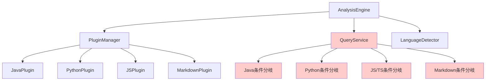

# tree-sitter-analyzer プロジェクト現状アーキテクチャ分析レポート

## 📋 分析概要

本レポートは、tree-sitter-analyzerプロジェクトの現状アーキテクチャを詳細に分析し、問題点と改善が必要な箇所を特定したものです。

### 分析対象期間
- 分析実施日: 2025年10月12日
- 対象コードベース: tree-sitter-analyzer メインブランチ

---

## 🏗️ 現状アーキテクチャ概要

### プロジェクト構造
```
tree_sitter_analyzer/
├── core/           # コアエンジン（554行、19メソッド）
├── plugins/        # プラグインシステム基盤（529行、4クラス）
├── languages/      # 言語固有実装（6言語、合計376KB）
├── formatters/     # 出力フォーマッター（10ファイル）
├── queries/        # Tree-sitterクエリ定義（7言語）
├── interfaces/     # CLI・MCP インターフェース
├── mcp/           # Model Context Protocol実装
└── security/      # セキュリティ機能
```

### 対応言語の実装状況

| 言語 | プラグインサイズ | 複雑度 | 状態 |
|------|-----------------|--------|------|
| **Markdown** | 1,684行 | 513 (最大36) | ⚠️ 過度に複雑 |
| **TypeScript** | 1,548行 | - | 🟡 大規模 |
| **JavaScript** | 1,356行 | - | 🟡 大規模 |
| **Java** | 1,157行 | - | 🟡 大規模 |
| **Python** | 1,123行 | - | 🟡 大規模 |
| **HTML** | 569行 | - | 🟢 開発中 |

---

## ⚠️ 重大な問題点

### 1. 言語固有条件分岐の肥大化

**問題の詳細:**
- **54件**の言語固有条件分岐が散在
- 特に`query_service.py`に**9件**の条件分岐が集中
- 新言語追加時の回帰リスク極大

**具体例（query_service.py L214-240）:**
```python
if language == "java":
    if node.type == "method_declaration":
        captures.append((node, "method"))
    elif node.type == "class_declaration":
        captures.append((node, "class"))
elif language == "python":
    if node.type == "function_definition":
        captures.append((node, "function"))
elif language in ["javascript", "typescript"]:
    if node.type in ["function_declaration", "method_definition"]:
        captures.append((node, "function"))
```

**影響範囲:**
- `core/query_service.py`: 9件
- `cli/commands/table_command.py`: 7件
- `language_loader.py`: 4件
- `mcp/server.py`: 4件

### 2. プラグインシステムの設計不整合

**問題の詳細:**
- プラグインインターフェースは存在するが、実際の処理で使用されていない
- コアエンジンが直接言語固有ロジックを含有
- プラグインマネージャー（379行、13メソッド）が十分活用されていない

**設計矛盾:**
```python
# plugins/base.py - 抽象インターフェース定義
class LanguagePlugin(ABC):
    @abstractmethod
    def is_applicable(self, file_path: str) -> bool: ...

# しかし実際の処理では直接条件分岐
# core/query_service.py
if language == "java":
    # 直接実装...
```

### 3. Markdownプラグインの過度な複雑化

**問題の詳細:**
- **1,684行**の巨大ファイル
- **複雑度513**（平均8.14、最大36）
- **63メソッド**を持つ単一クラス

**リスク:**
- メンテナンス困難
- テスト網羅性の低下
- バグ混入リスク増大

---

## 🔍 アーキテクチャ問題の根本原因

### 1. 責務分離の不徹底

**現状の問題:**
- `AnalysisEngine`（554行、19メソッド）が多責務
- 言語検出、プラグイン管理、クエリ実行を一手に担当
- 単一責任原則違反

### 2. プラグインシステムの形骸化

**設計意図と実装の乖離:**
- プラグインインターフェースは定義済み
- しかし実際の処理はコアエンジン内で条件分岐
- プラグインの動的ロードが機能していない

### 3. 言語固有ロジックの散在

**問題箇所:**
- `query_service.py`: クエリ処理の言語分岐
- `table_command.py`: 出力フォーマットの言語分岐
- `language_loader.py`: 言語ロード処理の分岐
- `mcp/server.py`: MCP処理の言語分岐

---

## 📊 依存関係とインターフェース設計の評価

### 現状の依存関係



### 問題点
1. **循環依存リスク**: コアエンジンが言語固有ロジックを直接参照
2. **インターフェース不整合**: プラグインが定義されているが使用されていない
3. **テスト困難性**: 条件分岐が多すぎてテストケースが爆発的に増加

---

## 🧪 テスト体制の現状

### テストファイル構成
- **159個**のテストファイルとサンプルファイル
- `tests/`ディレクトリに包括的なテストスイート
- `examples/`ディレクトリに各言語のサンプルファイル

### テスト体制の問題点
1. **条件分岐テストの複雑化**: 54件の言語分岐をすべてテストする必要
2. **回帰テストの困難性**: 新言語追加時の既存機能への影響が予測困難
3. **プラグイン単体テストの不足**: プラグインが独立してテストされていない

---

## 🎯 拡張性とメンテナンス性の問題点

### 新言語追加時の課題

**現状の追加手順（問題あり）:**
1. `languages/`に新プラグインファイル作成
2. `queries/`に新クエリファイル作成
3. `formatters/`に新フォーマッター作成
4. **各所の条件分岐を手動更新**（⚠️ 回帰リスク）
5. **テストケースの大量追加**

**具体的な修正箇所（新言語追加時）:**
- `query_service.py`: クエリ処理分岐追加
- `table_command.py`: 出力フォーマット分岐追加
- `language_loader.py`: ロード処理分岐追加
- `mcp/server.py`: MCP処理分岐追加
- その他50箇所の潜在的修正点

### メンテナンス性の問題

**コード重複:**
- 各言語プラグインで類似処理の重複実装
- フォーマッター間での共通ロジックの重複
- クエリ処理での言語固有分岐の重複

**変更の影響範囲:**
- 単一言語の修正が他言語に影響する可能性
- コアエンジンの変更が全言語に波及
- インターフェース変更時の大規模修正が必要

---

## 📈 問題の優先順位付け

### 🔴 最優先（Critical）

1. **query_service.pyの条件分岐除去**
   - 影響度: 極大
   - 修正難易度: 高
   - 回帰リスク: 極大

2. **プラグインシステムの実装整合性確保**
   - 影響度: 大
   - 修正難易度: 高
   - 拡張性への影響: 極大

### 🟡 高優先（High）

3. **Markdownプラグインのリファクタリング**
   - 影響度: 中
   - 修正難易度: 高
   - メンテナンス性への影響: 大

4. **AnalysisEngineの責務分離**
   - 影響度: 大
   - 修正難易度: 中
   - 設計品質への影響: 大

### 🟢 中優先（Medium）

5. **フォーマッターシステムの統一**
   - 影響度: 中
   - 修正難易度: 中
   - 一貫性への影響: 中

6. **テスト体制の改善**
   - 影響度: 中
   - 修正難易度: 中
   - 品質保証への影響: 大

---

## 🔧 推奨改善アプローチ

### Phase 1: プラグインシステムの実装整合性確保
1. プラグインインターフェースの実装強化
2. コアエンジンからの言語固有ロジック除去
3. プラグインマネージャーの活用促進

### Phase 2: 条件分岐の段階的除去
1. `query_service.py`の条件分岐をプラグインに移譲
2. `table_command.py`の出力処理をフォーマッターに移譲
3. その他の散在する条件分岐の除去

### Phase 3: 大規模プラグインのリファクタリング
1. Markdownプラグインの分割
2. 共通処理の基底クラス化
3. 責務の明確化

---

## 📋 結論

tree-sitter-analyzerプロジェクトは、**プラグインシステムの設計思想は優秀**ですが、**実装において設計意図が十分に反映されていない**状況です。

### 主要な課題
1. **54件の言語固有条件分岐**による拡張性の阻害
2. **プラグインシステムの形骸化**
3. **Markdownプラグインの過度な複雑化**（1,684行、複雑度513）
4. **責務分離の不徹底**

### 改善の緊急性
新言語（HTML）の追加が進行中であり、現状のアーキテクチャのまま進めると**技術的負債が指数関数的に増大**します。早急なアーキテクチャ改善が必要です。

### 次のステップ
本分析結果を基に、**プラグインシステムの実装整合性確保**を最優先として、段階的なアーキテクチャ改善計画の策定を推奨します。

---

*分析実施者: Roo (Architect Mode)*  
*分析完了日: 2025年10月12日*