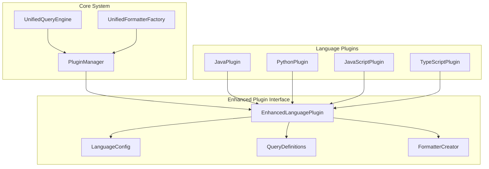

# 拡張プラグインインターフェース設計書

## 🎯 設計目標

1. **条件分岐の完全排除**: 言語固有ロジックをプラグインに移譲
2. **統一インターフェース**: 全言語で一貫したAPI提供
3. **拡張性の確保**: 新言語追加の最小工数化
4. **後方互換性**: 既存プラグインとの互換性維持

## 🏗️ アーキテクチャ概要



## 📋 インターフェース仕様

### 1. 拡張言語プラグインベースクラス

```python
from abc import ABC, abstractmethod
from dataclasses import dataclass, field
from typing import Dict, List, Any, Optional, Union
from enum import Enum

class QueryType(Enum):
    """クエリタイプの列挙"""
    FUNCTION = "function"
    CLASS = "class"
    METHOD = "method"
    VARIABLE = "variable"
    IMPORT = "import"
    INTERFACE = "interface"
    TYPE = "type"
    ENUM = "enum"
    ANNOTATION = "annotation"

@dataclass
class LanguageConfig:
    """言語設定の統一データクラス"""
    name: str
    display_name: str
    extensions: List[str]
    tree_sitter_language: str
    supported_queries: List[QueryType]
    default_formatters: List[str]
    
    # 言語固有の特別な処理設定
    special_handling: Dict[str, Any] = field(default_factory=dict)
    
    # Tree-sitter固有設定
    node_type_mappings: Dict[str, str] = field(default_factory=dict)
    
    # フォーマッター設定
    formatter_configs: Dict[str, Dict[str, Any]] = field(default_factory=dict)

@dataclass
class QueryDefinition:
    """クエリ定義"""
    query_string: str
    capture_names: List[str]
    post_processors: List[str] = field(default_factory=list)
    metadata: Dict[str, Any] = field(default_factory=dict)

class EnhancedLanguagePlugin(ABC):
    """拡張言語プラグインインターフェース"""
    
    def __init__(self):
        self._config: Optional[LanguageConfig] = None
        self._query_definitions: Optional[Dict[str, QueryDefinition]] = None
        self._formatter_registry: Dict[str, type] = {}
    
    # === 必須実装メソッド ===
    
    @abstractmethod
    def get_language_config(self) -> LanguageConfig:
        """言語設定を返す"""
        pass
    
    @abstractmethod
    def get_query_definitions(self) -> Dict[str, QueryDefinition]:
        """言語固有のクエリ定義を返す"""
        pass
    
    @abstractmethod
    def create_formatter(self, format_type: str) -> 'BaseFormatter':
        """言語固有のフォーマッターを作成"""
        pass
    
    @abstractmethod
    def process_query_result(self, query_type: str, raw_results: List[Any]) -> List['CodeElement']:
        """クエリ結果の後処理"""
        pass
    
    # === デフォルト実装メソッド ===
    
    def get_language_name(self) -> str:
        """言語名を返す（後方互換性）"""
        return self.get_language_config().name
    
    def get_file_extensions(self) -> List[str]:
        """ファイル拡張子を返す（後方互換性）"""
        return self.get_language_config().extensions
    
    def supports_query(self, query_type: Union[str, QueryType]) -> bool:
        """特定のクエリをサポートするかチェック"""
        if isinstance(query_type, str):
            return query_type in self.get_query_definitions()
        return query_type in self.get_language_config().supported_queries
    
    def get_supported_formatters(self) -> List[str]:
        """サポートするフォーマッター一覧を返す"""
        return self.get_language_config().default_formatters
    
    def validate_configuration(self) -> List[str]:
        """設定の妥当性をチェック"""
        errors = []
        config = self.get_language_config()
        
        if not config.name:
            errors.append("Language name is required")
        
        if not config.extensions:
            errors.append("At least one file extension is required")
        
        if not config.tree_sitter_language:
            errors.append("Tree-sitter language name is required")
        
        # クエリ定義の検証
        query_defs = self.get_query_definitions()
        for query_name, query_def in query_defs.items():
            if not query_def.query_string:
                errors.append(f"Query '{query_name}' has empty query string")
        
        return errors
    
    # === ユーティリティメソッド ===
    
    def get_node_type_mapping(self, generic_type: str) -> str:
        """汎用ノードタイプを言語固有タイプにマッピング"""
        config = self.get_language_config()
        return config.node_type_mappings.get(generic_type, generic_type)
    
    def get_formatter_config(self, format_type: str) -> Dict[str, Any]:
        """フォーマッター設定を取得"""
        config = self.get_language_config()
        return config.formatter_configs.get(format_type, {})
```

### 2. 統一クエリエンジン

```python
class UnifiedQueryEngine:
    """言語非依存の統一クエリエンジン"""
    
    def __init__(self, plugin_manager: 'PluginManager'):
        self.plugin_manager = plugin_manager
        self.query_cache: Dict[str, Any] = {}
        self.compiled_queries: Dict[str, Any] = {}
    
    def execute_query(
        self, 
        language: str, 
        query_type: Union[str, QueryType], 
        tree: 'Tree',
        source_code: str
    ) -> List['CodeElement']:
        """プラグインベースのクエリ実行"""
        
        # プラグイン取得
        plugin = self._get_plugin(language)
        
        # クエリサポート確認
        if not plugin.supports_query(query_type):
            raise UnsupportedQueryError(
                f"Query '{query_type}' not supported for language '{language}'"
            )
        
        # クエリ定義取得
        query_def = self._get_query_definition(plugin, query_type)
        
        # Tree-sitterクエリ実行
        raw_results = self._execute_tree_sitter_query(
            language, query_def, tree, source_code
        )
        
        # プラグインによる後処理
        processed_results = plugin.process_query_result(
            str(query_type), raw_results
        )
        
        return processed_results
    
    def get_available_queries(self, language: str) -> List[str]:
        """言語でサポートされているクエリ一覧を取得"""
        plugin = self._get_plugin(language)
        return list(plugin.get_query_definitions().keys())
    
    def _get_plugin(self, language: str) -> EnhancedLanguagePlugin:
        """プラグイン取得（エラーハンドリング付き）"""
        plugin = self.plugin_manager.get_plugin(language)
        if not plugin:
            raise UnsupportedLanguageError(f"No plugin found for language: {language}")
        
        if not isinstance(plugin, EnhancedLanguagePlugin):
            raise PluginCompatibilityError(
                f"Plugin for {language} does not implement EnhancedLanguagePlugin"
            )
        
        return plugin
    
    def _get_query_definition(
        self, 
        plugin: EnhancedLanguagePlugin, 
        query_type: Union[str, QueryType]
    ) -> QueryDefinition:
        """クエリ定義取得"""
        query_key = str(query_type)
        query_defs = plugin.get_query_definitions()
        
        if query_key not in query_defs:
            available = list(query_defs.keys())
            raise UnsupportedQueryError(
                f"Query '{query_key}' not found. Available: {available}"
            )
        
        return query_defs[query_key]
    
    def _execute_tree_sitter_query(
        self,
        language: str,
        query_def: QueryDefinition,
        tree: 'Tree',
        source_code: str
    ) -> List[Any]:
        """Tree-sitterクエリの実際の実行"""
        # キャッシュキー生成
        cache_key = f"{language}:{hash(query_def.query_string)}"
        
        # コンパイル済みクエリの取得またはコンパイル
        if cache_key not in self.compiled_queries:
            ts_language = self._get_tree_sitter_language(language)
            compiled_query = ts_language.query(query_def.query_string)
            self.compiled_queries[cache_key] = compiled_query
        
        compiled_query = self.compiled_queries[cache_key]
        
        # クエリ実行
        captures = compiled_query.captures(tree.root_node)
        
        # 結果の構造化
        results = []
        for node, capture_name in captures:
            result = {
                'node': node,
                'capture_name': capture_name,
                'text': self._extract_node_text(node, source_code),
                'start_point': node.start_point,
                'end_point': node.end_point,
                'metadata': query_def.metadata
            }
            results.append(result)
        
        return results
```

### 3. 統一フォーマッターファクトリー

```python
class UnifiedFormatterFactory:
    """プラグインベースの統一フォーマッターファクトリー"""
    
    def __init__(self, plugin_manager: 'PluginManager'):
        self.plugin_manager = plugin_manager
        self.formatter_cache: Dict[str, 'BaseFormatter'] = {}
    
    def create_formatter(
        self, 
        language: str, 
        format_type: str,
        **kwargs
    ) -> 'BaseFormatter':
        """言語とフォーマットタイプに基づいてフォーマッターを作成"""
        
        # キャッシュキー
        cache_key = f"{language}:{format_type}"
        
        if cache_key in self.formatter_cache:
            return self.formatter_cache[cache_key]
        
        # プラグイン取得
        plugin = self.plugin_manager.get_plugin(language)
        
        if plugin and isinstance(plugin, EnhancedLanguagePlugin):
            # プラグインによるフォーマッター作成
            if plugin.supports_formatter(format_type):
                formatter = plugin.create_formatter(format_type)
                self.formatter_cache[cache_key] = formatter
                return formatter
        
        # フォールバック: 汎用フォーマッター
        formatter = self._create_generic_formatter(format_type, **kwargs)
        self.formatter_cache[cache_key] = formatter
        return formatter
    
    def get_supported_formats(self, language: str) -> List[str]:
        """言語でサポートされているフォーマット一覧"""
        plugin = self.plugin_manager.get_plugin(language)
        
        if plugin and isinstance(plugin, EnhancedLanguagePlugin):
            return plugin.get_supported_formatters()
        
        # デフォルトフォーマット
        return ['json', 'csv', 'summary']
    
    def _create_generic_formatter(self, format_type: str, **kwargs) -> 'BaseFormatter':
        """汎用フォーマッターの作成"""
        from ..formatters.base_formatter import BaseFormatter
        
        if format_type == 'json':
            from ..formatters.json_formatter import JsonFormatter
            return JsonFormatter(**kwargs)
        elif format_type == 'csv':
            from ..formatters.csv_formatter import CsvFormatter
            return CsvFormatter(**kwargs)
        elif format_type == 'summary':
            from ..formatters.summary_formatter import SummaryFormatter
            return SummaryFormatter(**kwargs)
        else:
            raise UnsupportedFormatError(f"Unsupported format type: {format_type}")
```

## 🔧 実装例：Java言語プラグイン

```python
class JavaEnhancedPlugin(EnhancedLanguagePlugin):
    """Java言語の拡張プラグイン実装例"""
    
    def get_language_config(self) -> LanguageConfig:
        return LanguageConfig(
            name="java",
            display_name="Java",
            extensions=[".java"],
            tree_sitter_language="java",
            supported_queries=[
                QueryType.CLASS,
                QueryType.METHOD,
                QueryType.FUNCTION,
                QueryType.VARIABLE,
                QueryType.IMPORT,
                QueryType.INTERFACE,
                QueryType.ENUM,
                QueryType.ANNOTATION
            ],
            default_formatters=["json", "csv", "summary", "java_detailed"],
            node_type_mappings={
                "class": "class_declaration",
                "method": "method_declaration",
                "field": "field_declaration",
                "interface": "interface_declaration"
            },
            formatter_configs={
                "java_detailed": {
                    "include_modifiers": True,
                    "include_annotations": True,
                    "include_generics": True
                }
            }
        )
    
    def get_query_definitions(self) -> Dict[str, QueryDefinition]:
        return {
            "class": QueryDefinition(
                query_string="""
                (class_declaration
                  name: (identifier) @class_name
                  superclass: (superclass)? @superclass
                  interfaces: (super_interfaces)? @interfaces
                  body: (class_body) @class_body
                ) @class
                """,
                capture_names=["class", "class_name", "superclass", "interfaces", "class_body"],
                post_processors=["extract_modifiers", "extract_annotations"],
                metadata={"type": "class_declaration"}
            ),
            "method": QueryDefinition(
                query_string="""
                (method_declaration
                  modifiers: (modifiers)? @modifiers
                  type: (_)? @return_type
                  name: (identifier) @method_name
                  parameters: (formal_parameters) @parameters
                  body: (block)? @method_body
                ) @method
                """,
                capture_names=["method", "modifiers", "return_type", "method_name", "parameters", "method_body"],
                post_processors=["extract_parameter_details", "extract_throws"],
                metadata={"type": "method_declaration"}
            )
        }
    
    def create_formatter(self, format_type: str) -> 'BaseFormatter':
        if format_type == "java_detailed":
            return JavaDetailedFormatter(self.get_formatter_config(format_type))
        elif format_type == "json":
            return JavaJsonFormatter()
        elif format_type == "csv":
            return JavaCsvFormatter()
        else:
            raise UnsupportedFormatError(f"Java plugin does not support format: {format_type}")
    
    def process_query_result(self, query_type: str, raw_results: List[Any]) -> List['CodeElement']:
        """Java固有の後処理"""
        if query_type == "class":
            return self._process_class_results(raw_results)
        elif query_type == "method":
            return self._process_method_results(raw_results)
        else:
            return self._process_generic_results(raw_results)
    
    def _process_class_results(self, raw_results: List[Any]) -> List['JavaClass']:
        """クラス結果の処理"""
        classes = []
        for result in raw_results:
            # Java固有のクラス情報抽出
            java_class = JavaClass(
                name=self._extract_class_name(result),
                modifiers=self._extract_modifiers(result),
                superclass=self._extract_superclass(result),
                interfaces=self._extract_interfaces(result),
                annotations=self._extract_annotations(result),
                # ... その他のJava固有属性
            )
            classes.append(java_class)
        return classes
```

## 🧪 移行戦略

### 1. 段階的実装
1. **Phase 1**: `EnhancedLanguagePlugin`インターフェース実装
2. **Phase 2**: `UnifiedQueryEngine`実装
3. **Phase 3**: `UnifiedFormatterFactory`実装
4. **Phase 4**: 既存プラグインの段階的移行

### 2. 後方互換性
- 既存の`LanguagePlugin`インターフェースは維持
- `EnhancedLanguagePlugin`は`LanguagePlugin`を継承
- 段階的な移行期間中は両方のインターフェースをサポート

### 3. テスト戦略
- 各インターフェースの単体テスト
- プラグイン実装の統合テスト
- 既存機能との互換性テスト
- パフォーマンステスト

## 📊 期待される効果

1. **条件分岐の完全排除**: 54件 → 0件
2. **新言語追加の簡素化**: 数日 → 数時間
3. **コードの可読性向上**: 言語固有ロジックの明確な分離
4. **テスト容易性**: 言語ごとの独立テスト
5. **拡張性の向上**: プラグインベースの統一アーキテクチャ

この拡張インターフェース設計により、tree-sitter-analyzerは真に拡張可能で保守容易なアーキテクチャを実現します。