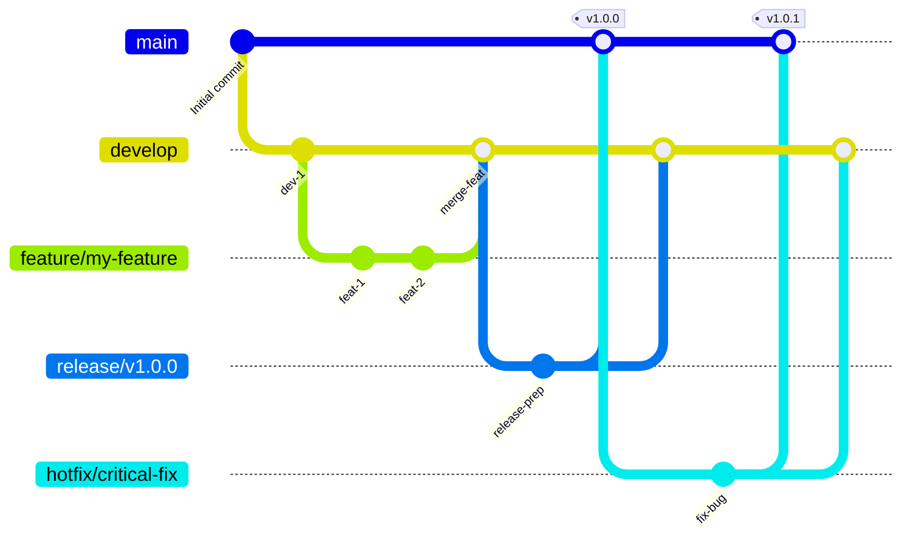

# GitFlow 分支策略 (中文说明)

本文档使用 Mermaid 图表和中文解释了 `tree-sitter-analyzer` 项目中实施的 GitFlow 分支策略。

## GitFlow 流程图



## 分支结构

### 主要分支

- **`main`**: 生产就绪的代码。始终包含最新的稳定版本。任何时候都应该是可部署的状态。
- **`develop`**: 功能集成分支。包含最新的已交付开发变更，是所有功能开发的起点。

### 支持分支

- **`feature/*`**: 功能开发分支。
    - **来源**: `develop`
    - **合并回**: `develop`
    - **命名**: `feature/descriptive-name` (例如: `feature/user-authentication`)
- **`release/*`**: 版本发布准备分支。用于准备新的生产版本，只进行少量 Bug 修复和文档生成等面向发布的任务。
    - **来源**: `develop`
    - **合并回**: `main` 和 `develop`
    - **命名**: `release/v1.2.0`
- **`hotfix/*`**: 紧急生产 Bug 修复分支。用于快速修复生产环境中的关键问题。
    - **来源**: `main`
    - **合并回**: `main` 和 `develop`
    - **命名**: `hotfix/critical-bug-fix`

## 工作流程

### 1. 功能开发 (Feature Development)

1.  **从 `develop` 创建 `feature` 分支**: 
    ```bash
    git fetch origin
    git checkout -b feature/your-feature-name origin/develop
    ```
2.  **进行功能开发**并定期提交。
3.  **开发完成后**，将 `feature` 分支推送到远程，并创建拉取请求 (Pull Request) 到 `develop` 分支。
4.  经过代码审查和持续集成 (CI) 检查通过后，**合并到 `develop`**。

### 2. 版本发布 (Release Process)

项目推荐使用自动化发布流程，但手动流程如下：

1.  **从 `develop` 创建 `release` 分支**: 
    ```bash
    git fetch origin
    git checkout -b release/v1.0.0 origin/develop
    ```
2.  **准备发布**: 更新版本号、生成文档等。
    ```bash
    # 更新 pyproject.toml 中的版本号
    # 更新 server_version
    # 同步版本号到 __init__.py
    uv run python scripts/sync_version_minimal.py

    # 获取当前测试数量统计：
    # 测试数量: uv run python -m pytest --collect-only -q | findstr /C:"collected"
    # 注意：覆盖率使用Codecov自动徽章，无需手动更新

    # 更新文档：
    # - 更新 README.md 中的版本号和测试数量
    # - 更新版本徽章、测试徽章（覆盖率徽章使用Codecov自动更新）
    # - 更新"最新质量成就"部分的版本引用
    # - 更新测试环境部分的版本引用
    # - 更新文档中的所有其他版本引用
    # - 更新 README_zh.md 和 README_ja.md 翻译版本
    # - 如有工作流更改，更新 GITFLOW_zh.md 和 GITFLOW_ja.md
    # - 更新 CHANGELOG.md 发布详情
    ```
3.  **推送 `release` 分支到远程以触发 PyPI 发布**:
    ```bash
    git checkout release/v1.0.0
    git push origin release/v1.0.0
    ```
4.  **等待 PyPI 发布完成并验证**:
    ```bash
    # 等待自动化工作流完成PyPI发布
    # 可以通过GitHub Actions页面监控发布状态
    # 验证PyPI包是否成功发布：
    # pip install tree-sitter-analyzer==1.0.0 --dry-run
    ```
5.  **PyPI 发布成功后，合并到 `main` 和 `develop`**:
    ```bash
    # 切换到 main 分支并合并
    git checkout main
    git merge release/v1.0.0
    git tag -a v1.0.0 -m "Release v1.0.0" # 打上版本标签
    git push origin main --tags

    # 切换到 develop 分支并合并
    git checkout develop
    git merge release/v1.0.0
    git push origin develop
    ```
6.  **创建GitHub Release**:
    ```bash
    # 创建临时的release消息文件（避免编码和符号错误）
    cat > release_message.md << 'EOF'
    ## vX.Y.Z - <版本标题>

    ### 🎯 新增功能
    - <描述新功能>

    ### 📊 质量指标
    - 测试数量: <来自release CI的测试数量>（100%通过）
    - 代码覆盖率: <覆盖率%>
    - <其他指标>

    ### 🔧 技术改进
    - <描述技术改进>
    EOF

    # 使用gh CLI创建release
    gh release create vX.Y.Z \
        --title "Release vX.Y.Z: <版本标题>" \
        --notes-file release_message.md \
        --target main

    # 删除临时文件
    rm release_message.md
    ```
7.  **删除 `release` 分支**:
    ```bash
    # 删除本地分支
    git branch -d release/v1.0.0
    # 删除远程分支
    git push origin --delete release/v1.0.0
    ```

**重要说明**: 此流程采用"PyPI优先"策略，确保包发布成功后再更新main分支，避免代码已发布但包不可用的风险。

### 3. 紧急修复 (Hotfix Process)

1.  **从 `main` 创建 `hotfix` 分支**: 
    ```bash
    git fetch origin
    git checkout -b hotfix/critical-bug-fix origin/main
    ```
2.  **修复 Bug** 并提交。
3.  **更新版本和文档**:
    ```bash
    # 更新 pyproject.toml 版本号 (例如: 1.0.0 -> 1.0.1)
    # 更新 server_version
    # 同步版本号到 __init__.py
    uv run python scripts/sync_version_minimal.py

    # 获取当前测试数量统计：
    # 测试数量: uv run python -m pytest --collect-only -q | findstr /C:"collected"
    # 注意：覆盖率使用Codecov自动徽章，无需手动更新

    # 更新文档：
    # - 更新 CHANGELOG.md 添加 hotfix 详情
    # - 更新 README.md 中的版本号和测试数量
    # - 更新版本徽章、测试徽章（覆盖率徽章使用Codecov自动更新）
    # - 更新"最新质量成就"部分的版本引用
    # - 更新测试环境部分的版本引用
    # - 更新文档中的所有其他版本引用
    # - 更新 README_zh.md 和 README_ja.md 翻译版本
    # - 如有工作流更改，更新 GITFLOW_zh.md 和 GITFLOW_ja.md
    ```
4.  **推送 `hotfix` 分支到远程以触发 PyPI 发布**:
    ```bash
    git checkout hotfix/critical-bug-fix
    git push origin hotfix/critical-bug-fix
    ```
5.  **等待 PyPI 发布完成并验证**:
    ```bash
    # 等待自动化工作流完成PyPI发布
    # 可以通过GitHub Actions页面监控发布状态
    # 验证PyPI包是否成功发布：
    # pip install tree-sitter-analyzer==1.0.1 --dry-run
    ```
6.  **PyPI 发布成功后，合并到 `main` 和 `develop`**:
    ```bash
    # 切换到 main 分支并合并
    git checkout main
    git merge hotfix/critical-bug-fix
    git tag -a v1.0.1 -m "Hotfix v1.0.1" # 打上修复版本标签
    git push origin main --tags

    # 切换到 develop 分支并合并
    git checkout develop
    git merge hotfix/critical-bug-fix
    git push origin develop
    ```
7.  **创建GitHub Release**:
    ```bash
    # 创建临时的hotfix release消息文件
    cat > hotfix_release_message.md << 'EOF'
    ## v1.0.1 - 紧急修复

    ### 🐛 修复内容
    - 修复了关键的生产环境问题
    - 提高了系统稳定性和安全性

    ### 📊 质量指标
    - 所有测试通过
    - 紧急修复验证完成

    ### ⚡ 部署说明
    - 此版本为紧急修复，建议立即部署到生产环境
    - 已通过完整的测试验证
    EOF

    # 使用gh CLI创建hotfix release
    gh release create v1.0.1 \
        --title "Hotfix v1.0.1: Critical Production Fix" \
        --notes-file hotfix_release_message.md \
        --target main

    # 删除临时文件
    rm hotfix_release_message.md
    ```
8.  **删除 `hotfix` 分支**:
    ```bash
    # 删除本地分支
    git branch -d hotfix/critical-bug-fix
    # 删除远程分支
    git push origin --delete hotfix/critical-bug-fix
    ```

**重要说明**: 此hotfix流程同样采用"PyPI优先"策略，确保包发布成功后再更新main分支，避免紧急修复代码已发布但包不可用的风险。

**注意**: 根据实际的自动化工作流，hotfix分支**会**自动触发PyPI发布。但这可能导致版本冲突，建议在使用hotfix分支前确保版本号正确更新。

## 自动化流程 (Authority CI/CD Pipeline)

`tree-sitter-analyzer` 项目实施了企业级的 CI/CD 流水线。我们的 "Authority Pipeline" 建立在模块化、可重用的组件之上，确保每个版本都符合质量、安全和性能的最高标准。

### 🏗️ 流水线架构
- **模块化设计**: 所有核心逻辑都封装在 `reusable-*.yml` 工作流中，以确保一致性。
- **统一质量门禁 (Unified Quality Gate)**: `ci.yml` 中的集中聚合点作为分支健康状况的唯一真实来源。
- **环境安全**: 部署通过 GitHub Environments 进行管理，限制了机密访问。
- **高可见性**: 高级步骤摘要提供有关测试结果、代码覆盖率和安全扫描的即时反馈。

### 🛡️ 核心工作流

#### 1. 统一 CI 协调器 (`ci.yml`)
在每次推送和拉取请求时执行。它并行协调以下内容：
- **质量检查**: 同时执行 Ruff (Linting)、MyPy (静态分析) 和 Bandit (安全)。
- **测试矩阵**: 完整的跨平台 (Linux, Windows, macOS) 和多版本 Python 测试。
- **构建验证**: Python 包的结构验证。
- **Quality Gate**: 最终的聚合作业。**这是分支保护规则唯一要求的检查。**

#### 2. Develop 自动化 (`develop-automation.yml`)
促进功能的持续集成：
- 验证包构建的完整性。
- 自动创建标准化的拉取请求到 `main` 分支。

#### 3. Release & Hotfix 交付 (`release-automation.yml`, `hotfix-automation.yml`)
处理生产就绪代码的安全交付：
- 执行代码库的详尽验证。
- **自动化 PyPI 部署**: 安全地发布已验证的包。
- 通过将更改合并回 `main` 和 `develop` 来完成 GitFlow 周期。

---

*我们的 Authority Pipeline 保证每一行代码在到达用户之前都经过测试、验证和保护。*
