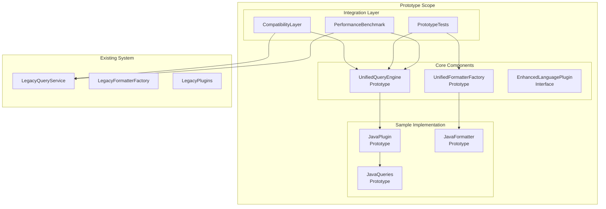

# プロトタイプ実装計画書

## 🎯 プロトタイプ目標

### 主要目標
1. **新アーキテクチャの実現可能性検証**
2. **パフォーマンス影響の事前評価**
3. **統合の複雑性とリスクの特定**
4. **開発工数の正確な見積もり**
5. **ステークホルダーへのデモンストレーション**

### 検証項目
- ✅ UnifiedQueryEngineの動作確認
- ✅ UnifiedFormatterFactoryの機能検証
- ✅ EnhancedLanguagePluginの拡張性確認
- ✅ 既存システムとの互換性検証
- ✅ パフォーマンス影響の測定

## 🏗️ プロトタイプアーキテクチャ



## 📋 実装スコープ

### Phase 1: 最小実装（1週間）
**目標**: 基本的な動作確認

#### Day 1-2: UnifiedQueryEngine基本実装
```python
# tree_sitter_analyzer/prototype/unified_query_engine.py
class UnifiedQueryEnginePrototype:
    """統一クエリエンジンのプロトタイプ実装"""
    
    def __init__(self, plugin_manager):
        self.plugin_manager = plugin_manager
        self.query_cache = {}
        self.execution_stats = ExecutionStats()
    
    def execute_query(self, language: str, query_key: str, node, **options):
        """プロトタイプクエリ実行"""
        
        # プラグイン取得
        plugin = self.plugin_manager.get_plugin(language)
        if not plugin:
            raise PluginNotFoundError(f"Plugin not found for language: {language}")
        
        # クエリ実行
        start_time = time.time()
        try:
            result = plugin.execute_query(query_key, node, **options)
            self.execution_stats.record_success(language, query_key, time.time() - start_time)
            return result
        except Exception as e:
            self.execution_stats.record_error(language, query_key, str(e))
            raise
    
    def get_execution_stats(self):
        """実行統計の取得"""
        return self.execution_stats.get_summary()
```

#### Day 3-4: JavaEnhancedPlugin実装
```python
# tree_sitter_analyzer/prototype/java_enhanced_plugin.py
class JavaEnhancedPluginPrototype(EnhancedLanguagePlugin):
    """Java言語の拡張プラグインプロトタイプ"""
    
    def __init__(self):
        super().__init__()
        self.language_name = "java"
        self.query_definitions = self._load_java_queries()
        self.formatter_configs = self._load_formatter_configs()
    
    def execute_query(self, query_key: str, node, **options):
        """Javaクエリの実行"""
        
        query_def = self.query_definitions.get(query_key)
        if not query_def:
            raise QueryNotFoundError(f"Query not found: {query_key}")
        
        # Tree-sitterクエリの実行
        matches = query_def.execute(node)
        
        # 結果の後処理
        return self._process_query_results(matches, query_key, **options)
    
    def create_formatter(self, format_type: str):
        """Javaフォーマッターの作成"""
        
        if format_type == "java_detailed":
            return JavaDetailedFormatterPrototype()
        elif format_type == "json":
            return JavaJsonFormatterPrototype()
        else:
            raise UnsupportedFormatError(f"Unsupported format: {format_type}")
    
    def get_supported_formatters(self):
        """サポートするフォーマッター一覧"""
        return ["json", "csv", "summary", "java_detailed"]
    
    def _load_java_queries(self):
        """Javaクエリ定義の読み込み"""
        return {
            "class_definition": JavaClassQueryDefinition(),
            "method_definition": JavaMethodQueryDefinition(),
            "field_definition": JavaFieldQueryDefinition()
        }
    
    def _load_formatter_configs(self):
        """フォーマッター設定の読み込み"""
        return {
            "java_detailed": {
                "include_modifiers": True,
                "include_annotations": True,
                "include_generics": True
            }
        }
```

#### Day 5-7: 基本統合とテスト
```python
# tree_sitter_analyzer/prototype/integration_test.py
class PrototypeIntegrationTest:
    """プロトタイプ統合テスト"""
    
    def __init__(self):
        self.prototype_system = self._setup_prototype_system()
        self.legacy_system = self._setup_legacy_system()
        self.test_cases = self._load_test_cases()
    
    def test_basic_functionality(self):
        """基本機能のテスト"""
        
        for test_case in self.test_cases:
            # プロトタイプでの実行
            prototype_result = self.prototype_system.execute_query(
                test_case.language,
                test_case.query_key,
                test_case.node
            )
            
            # レガシーシステムでの実行
            legacy_result = self.legacy_system.execute_query(
                test_case.language,
                test_case.query_key,
                test_case.node
            )
            
            # 結果の比較
            compatibility_score = self._compare_results(prototype_result, legacy_result)
            
            assert compatibility_score >= 0.95, f"Compatibility score too low: {compatibility_score}"
    
    def test_performance_comparison(self):
        """パフォーマンス比較テスト"""
        
        performance_results = {}
        
        for test_case in self.test_cases:
            # プロトタイプのパフォーマンス測定
            prototype_time = self._measure_execution_time(
                self.prototype_system, test_case
            )
            
            # レガシーシステムのパフォーマンス測定
            legacy_time = self._measure_execution_time(
                self.legacy_system, test_case
            )
            
            performance_results[test_case.name] = {
                "prototype_time": prototype_time,
                "legacy_time": legacy_time,
                "ratio": prototype_time / legacy_time
            }
        
        return performance_results
```

### Phase 2: 拡張実装（1週間）
**目標**: 実用性の検証

#### Day 8-10: UnifiedFormatterFactory実装
```python
# tree_sitter_analyzer/prototype/unified_formatter_factory.py
class UnifiedFormatterFactoryPrototype:
    """統一フォーマッターファクトリーのプロトタイプ"""
    
    def __init__(self, plugin_manager):
        self.plugin_manager = plugin_manager
        self.formatter_registry = FormatterRegistryPrototype()
        self.formatter_cache = FormatterCachePrototype()
        
        # 標準フォーマッターの登録
        self._register_core_formatters()
    
    def create_formatter(self, language: str, format_type: str, **options):
        """フォーマッターの作成"""
        
        # キャッシュチェック
        cache_key = self._generate_cache_key(language, format_type, options)
        cached_formatter = self.formatter_cache.get(cache_key)
        
        if cached_formatter:
            return cached_formatter
        
        # プラグインベースのフォーマッター作成を試行
        plugin = self.plugin_manager.get_plugin(language)
        if plugin and hasattr(plugin, 'create_formatter'):
            try:
                formatter = plugin.create_formatter(format_type)
                if options:
                    formatter.configure(options)
                
                self.formatter_cache.put(cache_key, formatter)
                return formatter
            except UnsupportedFormatError:
                pass  # フォールバックへ
        
        # 標準フォーマッターの作成
        formatter_class = self.formatter_registry.get_formatter_class(format_type)
        if formatter_class:
            formatter = formatter_class(language=language, **options)
            self.formatter_cache.put(cache_key, formatter)
            return formatter
        
        raise UnsupportedFormatError(f"Unsupported format: {format_type}")
    
    def format_elements(self, language: str, format_type: str, elements: List, **options):
        """要素のフォーマット"""
        
        formatter = self.create_formatter(language, format_type, **options)
        return formatter.format(elements)
```

#### Day 11-12: 複数言語対応
```python
# tree_sitter_analyzer/prototype/python_enhanced_plugin.py
class PythonEnhancedPluginPrototype(EnhancedLanguagePlugin):
    """Python言語の拡張プラグインプロトタイプ"""
    
    def __init__(self):
        super().__init__()
        self.language_name = "python"
        self.query_definitions = self._load_python_queries()
    
    def execute_query(self, query_key: str, node, **options):
        """Pythonクエリの実行"""
        # Python固有の実装
        pass
    
    def create_formatter(self, format_type: str):
        """Pythonフォーマッターの作成"""
        
        if format_type == "python_docstring":
            return PythonDocstringFormatterPrototype()
        elif format_type == "json":
            return PythonJsonFormatterPrototype()
        else:
            raise UnsupportedFormatError(f"Unsupported format: {format_type}")
```

#### Day 13-14: 統合テストとベンチマーク
```python
# tree_sitter_analyzer/prototype/benchmark.py
class PrototypeBenchmark:
    """プロトタイプベンチマーク"""
    
    def __init__(self):
        self.test_files = self._load_test_files()
        self.benchmark_cases = self._generate_benchmark_cases()
    
    def run_comprehensive_benchmark(self):
        """包括的ベンチマークの実行"""
        
        results = {
            "execution_time": self._benchmark_execution_time(),
            "memory_usage": self._benchmark_memory_usage(),
            "scalability": self._benchmark_scalability(),
            "compatibility": self._benchmark_compatibility()
        }
        
        return BenchmarkReport(results)
    
    def _benchmark_execution_time(self):
        """実行時間のベンチマーク"""
        
        results = {}
        
        for case in self.benchmark_cases:
            prototype_times = []
            legacy_times = []
            
            for _ in range(10):  # 10回実行の平均
                # プロトタイプ実行時間
                start = time.time()
                self.prototype_system.execute_query(case.language, case.query, case.node)
                prototype_times.append(time.time() - start)
                
                # レガシー実行時間
                start = time.time()
                self.legacy_system.execute_query(case.language, case.query, case.node)
                legacy_times.append(time.time() - start)
            
            results[case.name] = {
                "prototype_avg": statistics.mean(prototype_times),
                "legacy_avg": statistics.mean(legacy_times),
                "improvement_ratio": statistics.mean(legacy_times) / statistics.mean(prototype_times)
            }
        
        return results
    
    def _benchmark_memory_usage(self):
        """メモリ使用量のベンチマーク"""
        
        import tracemalloc
        
        results = {}
        
        for case in self.benchmark_cases:
            # プロトタイプのメモリ使用量
            tracemalloc.start()
            self.prototype_system.execute_query(case.language, case.query, case.node)
            prototype_memory = tracemalloc.get_traced_memory()[1]
            tracemalloc.stop()
            
            # レガシーのメモリ使用量
            tracemalloc.start()
            self.legacy_system.execute_query(case.language, case.query, case.node)
            legacy_memory = tracemalloc.get_traced_memory()[1]
            tracemalloc.stop()
            
            results[case.name] = {
                "prototype_memory": prototype_memory,
                "legacy_memory": legacy_memory,
                "memory_ratio": prototype_memory / legacy_memory
            }
        
        return results
```

### Phase 3: 実証実装（1週間）
**目標**: 実用レベルの検証

#### Day 15-17: 実際のコードベースでのテスト
```python
# tree_sitter_analyzer/prototype/real_world_test.py
class RealWorldTest:
    """実際のコードベースでのテスト"""
    
    def __init__(self):
        self.test_repositories = [
            "tree-sitter-analyzer",  # 自分自身
            "sample-java-project",
            "sample-python-project"
        ]
    
    def test_on_real_codebases(self):
        """実際のコードベースでのテスト"""
        
        results = {}
        
        for repo in self.test_repositories:
            repo_results = self._test_repository(repo)
            results[repo] = repo_results
        
        return RealWorldTestReport(results)
    
    def _test_repository(self, repo_path: str):
        """リポジトリのテスト"""
        
        files = self._find_source_files(repo_path)
        
        test_results = {
            "total_files": len(files),
            "successful_analyses": 0,
            "failed_analyses": 0,
            "performance_comparison": {},
            "compatibility_issues": []
        }
        
        for file_path in files:
            try:
                # プロトタイプでの解析
                prototype_result = self._analyze_file_with_prototype(file_path)
                
                # レガシーでの解析
                legacy_result = self._analyze_file_with_legacy(file_path)
                
                # 結果の比較
                compatibility = self._compare_analysis_results(
                    prototype_result, legacy_result
                )
                
                if compatibility >= 0.95:
                    test_results["successful_analyses"] += 1
                else:
                    test_results["failed_analyses"] += 1
                    test_results["compatibility_issues"].append({
                        "file": file_path,
                        "compatibility_score": compatibility
                    })
                
            except Exception as e:
                test_results["failed_analyses"] += 1
                test_results["compatibility_issues"].append({
                    "file": file_path,
                    "error": str(e)
                })
        
        return test_results
```

#### Day 18-19: パフォーマンス最適化
```python
# tree_sitter_analyzer/prototype/optimization.py
class PrototypeOptimization:
    """プロトタイプ最適化"""
    
    def __init__(self, prototype_system):
        self.prototype_system = prototype_system
        self.profiler = PerformanceProfiler()
    
    def identify_bottlenecks(self):
        """ボトルネックの特定"""
        
        # プロファイリング実行
        profile_results = self.profiler.profile_system(self.prototype_system)
        
        # ボトルネック分析
        bottlenecks = self._analyze_bottlenecks(profile_results)
        
        return bottlenecks
    
    def optimize_query_execution(self):
        """クエリ実行の最適化"""
        
        optimizations = [
            self._optimize_query_caching(),
            self._optimize_plugin_loading(),
            self._optimize_result_processing()
        ]
        
        return optimizations
    
    def _optimize_query_caching(self):
        """クエリキャッシュの最適化"""
        
        # キャッシュヒット率の測定
        cache_stats = self.prototype_system.get_cache_stats()
        
        # 最適化の実装
        if cache_stats.hit_rate < 0.8:
            # キャッシュサイズの増加
            self.prototype_system.increase_cache_size()
            
            # キャッシュ戦略の変更
            self.prototype_system.change_cache_strategy("LRU")
        
        return "Query caching optimized"
```

#### Day 20-21: 最終検証とレポート
```python
# tree_sitter_analyzer/prototype/final_validation.py
class FinalValidation:
    """最終検証"""
    
    def __init__(self):
        self.validation_suite = ValidationSuite()
        self.report_generator = ReportGenerator()
    
    def execute_final_validation(self):
        """最終検証の実行"""
        
        validation_results = {
            "functionality": self._validate_functionality(),
            "performance": self._validate_performance(),
            "compatibility": self._validate_compatibility(),
            "scalability": self._validate_scalability(),
            "reliability": self._validate_reliability()
        }
        
        # 総合評価
        overall_score = self._calculate_overall_score(validation_results)
        
        # レポート生成
        report = self.report_generator.generate_final_report(
            validation_results, overall_score
        )
        
        return report
    
    def _validate_functionality(self):
        """機能性の検証"""
        
        test_cases = [
            "basic_query_execution",
            "formatter_creation",
            "plugin_integration",
            "error_handling",
            "configuration_management"
        ]
        
        results = {}
        for test_case in test_cases:
            results[test_case] = self.validation_suite.run_test(test_case)
        
        return results
    
    def _validate_performance(self):
        """パフォーマンスの検証"""
        
        performance_tests = [
            "execution_time_comparison",
            "memory_usage_comparison",
            "scalability_test",
            "concurrent_execution_test"
        ]
        
        results = {}
        for test in performance_tests:
            results[test] = self.validation_suite.run_performance_test(test)
        
        return results
    
    def _calculate_overall_score(self, validation_results):
        """総合スコアの計算"""
        
        weights = {
            "functionality": 0.3,
            "performance": 0.25,
            "compatibility": 0.25,
            "scalability": 0.1,
            "reliability": 0.1
        }
        
        total_score = 0
        for category, results in validation_results.items():
            category_score = self._calculate_category_score(results)
            total_score += category_score * weights[category]
        
        return total_score
```

## 📊 プロトタイプ評価基準

### 1. 機能性評価

| 項目 | 評価基準 | 重要度 |
|------|----------|--------|
| クエリ実行 | 既存機能と同等 | 高 |
| フォーマット出力 | 既存出力と95%以上一致 | 高 |
| プラグイン統合 | 新プラグイン追加可能 | 中 |
| エラーハンドリング | 適切なエラー処理 | 中 |
| 設定管理 | 柔軟な設定システム | 低 |

### 2. パフォーマンス評価

| 項目 | 評価基準 | 重要度 |
|------|----------|--------|
| 実行時間 | 既存システムの110%以内 | 高 |
| メモリ使用量 | 既存システムの120%以内 | 中 |
| スケーラビリティ | 大規模ファイルでの動作 | 中 |
| 同時実行 | マルチスレッド対応 | 低 |

### 3. 互換性評価

| 項目 | 評価基準 | 重要度 |
|------|----------|--------|
| API互換性 | 既存API完全互換 | 高 |
| 出力互換性 | 出力フォーマット一致 | 高 |
| 設定互換性 | 既存設定ファイル対応 | 中 |
| プラグイン互換性 | 既存プラグイン動作 | 中 |

## 🧪 テスト戦略

### 1. 単体テスト
```python
class PrototypeUnitTests:
    """プロトタイプ単体テスト"""
    
    def test_unified_query_engine(self):
        """統一クエリエンジンのテスト"""
        pass
    
    def test_unified_formatter_factory(self):
        """統一フォーマッターファクトリーのテスト"""
        pass
    
    def test_enhanced_language_plugin(self):
        """拡張言語プラグインのテスト"""
        pass
```

### 2. 統合テスト
```python
class PrototypeIntegrationTests:
    """プロトタイプ統合テスト"""
    
    def test_end_to_end_workflow(self):
        """エンドツーエンドワークフローのテスト"""
        pass
    
    def test_plugin_interaction(self):
        """プラグイン間相互作用のテスト"""
        pass
    
    def test_legacy_compatibility(self):
        """レガシー互換性のテスト"""
        pass
```

### 3. パフォーマンステスト
```python
class PrototypePerformanceTests:
    """プロトタイプパフォーマンステスト"""
    
    def test_execution_time(self):
        """実行時間のテスト"""
        pass
    
    def test_memory_usage(self):
        """メモリ使用量のテスト"""
        pass
    
    def test_scalability(self):
        """スケーラビリティのテスト"""
        pass
```

## 📈 期待される成果

### 1. 技術的検証
- ✅ 新アーキテクチャの実現可能性確認
- ✅ パフォーマンス影響の定量的評価
- ✅ 統合の複雑性とリスクの特定
- ✅ 実装工数の正確な見積もり

### 2. ビジネス価値
- ✅ ステークホルダーへの具体的デモ
- ✅ 投資対効果の明確化
- ✅ 移行リスクの最小化
- ✅ 開発チームの技術習得

### 3. 品質保証
- ✅ 既存機能の完全互換性
- ✅ パフォーマンス劣化の回避
- ✅ 拡張性の実証
- ✅ 保守性の向上

## 🚀 プロトタイプ後の展開

### 1. 本格実装への移行
```python
class ProductionMigration:
    """本格実装への移行"""
    
    def __init__(self, prototype_results):
        self.prototype_results = prototype_results
        self.migration_plan = self._create_migration_plan()
    
    def execute_production_migration(self):
        """本格実装への移行実行"""
        
        # プロトタイプの知見を活用
        lessons_learned = self.prototype_results.get_lessons_learned()
        
        # 最適化された実装計画
        optimized_plan = self._optimize_implementation_plan(lessons_learned)
        
        return optimized_plan
```

### 2. 継続的改善
```python
class ContinuousImprovement:
    """継続的改善"""
    
    def __init__(self, prototype_metrics):
        self.prototype_metrics = prototype_metrics
        self.improvement_tracker = ImprovementTracker()
    
    def identify_improvement_areas(self):
        """改善領域の特定"""
        
        areas = []
        
        # パフォーマンスボトルネック
        if self.prototype_metrics.performance_score < 0.9:
            areas.append("performance_optimization")
        
        # 機能拡張
        if self.prototype_metrics.extensibility_score < 0.8:
            areas.append("extensibility_enhancement")
        
        return areas
```

このプロトタイプ実装計画により、新アーキテクチャの実現可能性を低リスクで検証し、本格実装への確実な道筋を確立できます。