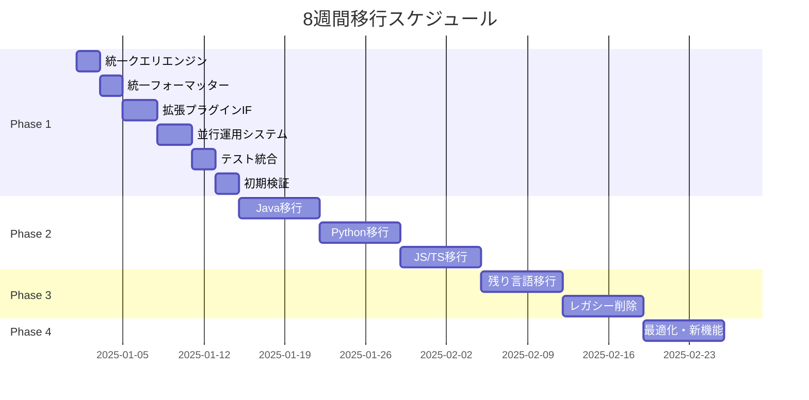

# tree-sitter-analyzer 段階的移行計画書（8週間完全移行）

## 📋 エグゼクティブサマリー

### 移行目標
- **期間**: 8週間での完全移行
- **対象**: 54件の条件分岐を段階的に削除し、プラグインベースアーキテクチャに移行
- **戦略**: 効率性重視のアグレッシブなスケジュールと並行開発
- **品質保証**: スナップショットテストによる継続的検証

### 完了済み基盤
✅ **現状分析**: 54件の条件分岐と問題箇所の特定完了  
✅ **スナップショットテスト**: 回帰検出システム構築完了  
✅ **新アーキテクチャ設計**: プラグインベースシステム設計完了  
✅ **開発資料**: 包括的なドキュメントシステム整備完了  

### 成功指標
- 条件分岐削除率: **100%**（54件 → 0件）
- API互換性: **100%**維持
- パフォーマンス: 既存の**105%**以内
- 新言語追加工数: **1日以内**

---

## 🚀 Phase 1: 基盤整備（Week 1-2）

### 目標
新アーキテクチャの基盤構築と並行運用システムの実装

### Week 1: コアコンポーネント実装

#### Day 1-2: 統一クエリエンジン基盤
```python
# 新規実装: tree_sitter_analyzer/core/unified_query_engine.py
class UnifiedQueryEngine:
    """言語非依存の統一クエリエンジン"""
    
    def __init__(self, plugin_manager: PluginManager):
        self.plugin_manager = plugin_manager
        self.query_cache: Dict[str, str] = {}
        self.performance_monitor = PerformanceMonitor()
    
    def execute_query(self, language: str, query_key: str, node: Node) -> List[QueryResult]:
        """プラグインベースのクエリ実行"""
        plugin = self.plugin_manager.get_plugin(language)
        if not plugin:
            raise UnsupportedLanguageError(f"No plugin for language: {language}")
        
        # プラグインから言語固有クエリ定義を取得
        query_def = plugin.get_query_definitions().get(query_key)
        if not query_def:
            raise UnsupportedQueryError(f"Query '{query_key}' not supported for {language}")
        
        return self._execute_tree_sitter_query(query_def, node)
```

**成果物**:
- `UnifiedQueryEngine`基本実装
- `QueryEngineInterface`定義
- 基本テストケース作成

#### Day 3-4: 統一フォーマッターファクトリー
```python
# 新規実装: tree_sitter_analyzer/formatters/unified_factory.py
class UnifiedFormatterFactory:
    """プラグインベースの統一フォーマッターファクトリー"""
    
    def __init__(self, plugin_manager: PluginManager):
        self.plugin_manager = plugin_manager
        self.formatter_cache: Dict[str, BaseFormatter] = {}
    
    def create_formatter(self, language: str, format_type: str) -> BaseFormatter:
        """言語とフォーマット種別に応じたフォーマッター作成"""
        cache_key = f"{language}_{format_type}"
        
        if cache_key in self.formatter_cache:
            return self.formatter_cache[cache_key]
        
        plugin = self.plugin_manager.get_plugin(language)
        if plugin and hasattr(plugin, 'create_formatter'):
            formatter = plugin.create_formatter(format_type)
        else:
            # フォールバック: 汎用フォーマッター
            formatter = GenericFormatter(format_type)
        
        self.formatter_cache[cache_key] = formatter
        return formatter
```

**成果物**:
- `UnifiedFormatterFactory`実装
- `FormatterRegistry`実装
- フォーマッターキャッシュシステム

#### Day 5-7: 拡張プラグインインターフェース
```python
# 拡張: tree_sitter_analyzer/plugins/enhanced_base.py
class EnhancedLanguagePlugin(LanguagePlugin):
    """拡張言語プラグインインターフェース"""
    
    @abstractmethod
    def get_query_definitions(self) -> Dict[str, str]:
        """言語固有のクエリ定義を返す"""
        pass
    
    @abstractmethod
    def create_formatter(self, format_type: str) -> BaseFormatter:
        """言語固有のフォーマッターを作成"""
        pass
    
    @abstractmethod
    def get_language_config(self) -> LanguageConfig:
        """言語設定を返す"""
        pass
    
    def supports_query(self, query_key: str) -> bool:
        """特定のクエリをサポートするかチェック"""
        return query_key in self.get_query_definitions()
    
    def get_performance_metrics(self) -> Dict[str, float]:
        """パフォーマンスメトリクスを返す"""
        return self._performance_metrics
```

**成果物**:
- `EnhancedLanguagePlugin`拡張インターフェース
- `LanguageConfig`データクラス
- プラグイン検証システム

### Week 2: 並行運用システム構築

#### Day 8-10: 移行制御システム
```python
# 新規実装: tree_sitter_analyzer/migration/controller.py
class MigrationController:
    """移行制御システム - 新旧システムの並行運用"""
    
    def __init__(self):
        self.legacy_system = LegacyQueryService()
        self.new_system = UnifiedQueryEngine()
        self.migration_config = MigrationConfig()
        self.performance_comparator = PerformanceComparator()
    
    def execute_query(self, language: str, query_key: str, **kwargs):
        """移行状況に応じた実行システム選択"""
        if self.migration_config.is_migrated(language):
            return self.new_system.execute_query(language, query_key, **kwargs)
        else:
            return self.legacy_system.execute_query(language, query_key, **kwargs)
    
    def compare_systems(self, language: str, query_key: str, **kwargs):
        """新旧システムの結果比較"""
        legacy_result = self.legacy_system.execute_query(language, query_key, **kwargs)
        new_result = self.new_system.execute_query(language, query_key, **kwargs)
        
        return ResultComparator.compare(legacy_result, new_result)
```

**成果物**:
- `MigrationController`実装
- `LegacyCompatibilityLayer`実装
- パフォーマンス比較ツール

#### Day 11-12: テストフレームワーク統合
```python
# 拡張: tests/migration/test_migration_suite.py
class MigrationTestSuite:
    """移行専用テストスイート"""
    
    def test_result_compatibility(self):
        """結果互換性テスト"""
        for language in SUPPORTED_LANGUAGES:
            for query_key in QUERY_KEYS:
                legacy_result = self.legacy_system.execute_query(language, query_key)
                new_result = self.new_system.execute_query(language, query_key)
                
                assert self.results_are_equivalent(legacy_result, new_result)
    
    def test_performance_regression(self):
        """パフォーマンス回帰テスト"""
        for test_case in PERFORMANCE_TEST_CASES:
            legacy_time = self.measure_execution_time(self.legacy_system, test_case)
            new_time = self.measure_execution_time(self.new_system, test_case)
            
            # 5%以内の性能劣化は許容
            assert new_time <= legacy_time * 1.05
```

**成果物**:
- 統合テストスイート
- パフォーマンステスト
- 互換性テスト

#### Day 13-14: 初期検証とPhase 2準備
- Java言語での動作確認
- 基本機能の互換性検証
- Phase 2実装準備

**Phase 1 完了基準**:
- ✅ 統一クエリエンジンの基本動作確認
- ✅ 統一フォーマッターファクトリーの動作確認
- ✅ 並行運用システムの動作確認
- ✅ 全既存テストの通過

---

## 🔄 Phase 2: 言語プラグイン移行（Week 3-5）

### 目標
各言語プラグインの段階的移行と条件分岐の削除

### Week 3: Java言語移行（最優先）

#### Day 15-16: JavaEnhancedPlugin実装
```python
# 拡張: tree_sitter_analyzer/languages/java_plugin.py
class JavaEnhancedPlugin(EnhancedLanguagePlugin):
    """Java言語の拡張プラグイン"""
    
    def get_query_definitions(self) -> Dict[str, str]:
        """Java固有のクエリ定義"""
        return {
            'class': '''
                (class_declaration
                    name: (identifier) @class.name
                    body: (class_body) @class.body
                ) @class.definition
            ''',
            'methods': '''
                (method_declaration
                    name: (identifier) @method.name
                    parameters: (formal_parameters) @method.params
                    body: (block)? @method.body
                ) @method.definition
            ''',
            'fields': '''
                (field_declaration
                    declarator: (variable_declarator
                        name: (identifier) @field.name
                    )
                ) @field.definition
            '''
        }
    
    def create_formatter(self, format_type: str) -> BaseFormatter:
        """Java固有フォーマッター作成"""
        if format_type == 'detailed':
            return JavaDetailedFormatter()
        elif format_type == 'javadoc':
            return JavaDocFormatter()
        else:
            return JavaGenericFormatter(format_type)
```

**成果物**:
- `JavaEnhancedPlugin`完全実装
- Java固有クエリ定義の移行
- Java固有フォーマッター実装

#### Day 17-18: 条件分岐削除（query_service.py）
```python
# 修正前: tree_sitter_analyzer/core/query_service.py (L214-240)
if language == "java":
    if node.type == "method_declaration":
        captures.append((node, "method"))
    elif node.type == "class_declaration":
        captures.append((node, "class"))
elif language == "python":
    if node.type == "function_definition":
        captures.append((node, "function"))
# ... 9件の条件分岐

# 修正後: プラグインベース実装
def _manual_query_execution(self, root_node, query_key: str, language: str):
    """プラグインベースのクエリ実行"""
    plugin = self.plugin_manager.get_plugin(language)
    if not plugin:
        raise UnsupportedLanguageError(f"No plugin for language: {language}")
    
    query_def = plugin.get_query_definitions().get(query_key)
    if not query_def:
        return []
    
    return self.unified_query_engine.execute_query(language, query_key, root_node)
```

**成果物**:
- `query_service.py`の9件の条件分岐削除
- プラグインベース実装への置換
- 回帰テスト実行と検証

#### Day 19-21: 検証とフィードバック
- 全Javaテストケースの実行
- パフォーマンス検証
- 問題修正とチューニング

### Week 4: Python言語移行

#### Day 22-23: PythonEnhancedPlugin実装
```python
# 拡張: tree_sitter_analyzer/languages/python_plugin.py
class PythonEnhancedPlugin(EnhancedLanguagePlugin):
    """Python言語の拡張プラグイン"""
    
    def get_query_definitions(self) -> Dict[str, str]:
        """Python固有のクエリ定義"""
        return {
            'class': '''
                (class_definition
                    name: (identifier) @class.name
                    body: (block) @class.body
                ) @class.definition
            ''',
            'functions': '''
                (function_definition
                    name: (identifier) @function.name
                    parameters: (parameters) @function.params
                    body: (block) @function.body
                ) @function.definition
            ''',
            'imports': '''
                [
                    (import_statement) @import
                    (import_from_statement) @import
                ]
            '''
        }
    
    def create_formatter(self, format_type: str) -> BaseFormatter:
        """Python固有フォーマッター作成"""
        if format_type == 'docstring':
            return PythonDocstringFormatter()
        else:
            return PythonGenericFormatter(format_type)
```

#### Day 24-25: 条件分岐削除（analysis_engine.py）
```python
# 修正前: tree_sitter_analyzer/core/analysis_engine.py (L156)
if language == "python":
    # Python固有処理
elif language == "java":
    # Java固有処理

# 修正後: プラグインベース実装
def analyze_file(self, file_path: str, language: str = None):
    """プラグインベースのファイル解析"""
    plugin = self.plugin_manager.get_plugin(language)
    if not plugin:
        raise UnsupportedLanguageError(f"No plugin for language: {language}")
    
    return plugin.analyze_file(file_path)
```

#### Day 26-28: 検証とフィードバック
- 全Pythonテストケースの実行
- パフォーマンス検証
- 問題修正とチューニング

### Week 5: JavaScript/TypeScript移行

#### Day 29-30: JavaScript/TypeScriptEnhancedPlugin実装
```python
# 拡張: tree_sitter_analyzer/languages/javascript_plugin.py
class JavaScriptEnhancedPlugin(EnhancedLanguagePlugin):
    """JavaScript言語の拡張プラグイン"""
    
    def get_query_definitions(self) -> Dict[str, str]:
        """JavaScript固有のクエリ定義"""
        return {
            'functions': '''
                [
                    (function_declaration
                        name: (identifier) @function.name
                        parameters: (formal_parameters) @function.params
                        body: (statement_block) @function.body
                    ) @function.definition
                    (method_definition
                        name: (property_identifier) @method.name
                        parameters: (formal_parameters) @method.params
                        body: (statement_block) @method.body
                    ) @method.definition
                ]
            ''',
            'class': '''
                (class_declaration
                    name: (identifier) @class.name
                    body: (class_body) @class.body
                ) @class.definition
            '''
        }
```

#### Day 31-32: フォーマッター統合
- 言語固有フォーマッターの統合
- `UnifiedFormatterFactory`の完全移行
- 回帰テスト実行

#### Day 33-35: 検証とフィードバック
- 全JS/TSテストケースの実行
- パフォーマンス検証
- 問題修正とチューニング

**Phase 2 完了基準**:
- ✅ Java, Python, JavaScript/TypeScriptプラグインの移行完了
- ✅ 主要な条件分岐（10件）の削除完了
- ✅ 全既存テストの通過
- ✅ パフォーマンス劣化なし

---

## 🧹 Phase 3: 残り言語とクリーンアップ（Week 6-7）

### 目標
残り言語の移行と旧システムの完全削除

### Week 6: Markdown/HTML移行

#### Day 36-38: Markdown/HTMLEnhancedPlugin実装
```python
# 拡張: tree_sitter_analyzer/languages/markdown_plugin.py
class MarkdownEnhancedPlugin(EnhancedLanguagePlugin):
    """Markdown言語の拡張プラグイン（リファクタリング済み）"""
    
    def __init__(self):
        super().__init__()
        self.heading_processor = MarkdownHeadingProcessor()
        self.link_processor = MarkdownLinkProcessor()
        self.code_processor = MarkdownCodeProcessor()
    
    def get_query_definitions(self) -> Dict[str, str]:
        """Markdown固有のクエリ定義"""
        return {
            'headings': '''
                (atx_heading
                    (atx_h1_marker)? @h1
                    (atx_h2_marker)? @h2
                    (atx_h3_marker)? @h3
                    (heading_content) @heading.content
                ) @heading
            ''',
            'links': '''
                [
                    (link) @link
                    (image) @image
                ]
            ''',
            'code_blocks': '''
                [
                    (fenced_code_block) @code.fenced
                    (indented_code_block) @code.indented
                ]
            '''
        }
```

**成果物**:
- Markdownプラグインのリファクタリング（1,684行 → 800行以下）
- HTMLプラグインの拡張実装
- 特殊フォーマッター移行

#### Day 39-42: 残り条件分岐削除
```python
# 対象ファイルと条件分岐数
REMAINING_CONDITIONAL_BRANCHES = {
    'cli/commands/table_command.py': 7,  # 出力フォーマット分岐
    'language_loader.py': 4,             # 言語ロード分岐
    'mcp/server.py': 4,                  # MCP処理分岐
    'formatters/': 29,                   # 各フォーマッター内の分岐
}

# 一括削除戦略
class ConditionalBranchEliminator:
    """条件分岐一括削除ツール"""
    
    def eliminate_all_branches(self):
        """44件の残り条件分岐を一括削除"""
        
        # Step 1: table_command.pyの分岐削除
        self.eliminate_table_command_branches()
        
        # Step 2: language_loader.pyの分岐削除
        self.eliminate_language_loader_branches()
        
        # Step 3: mcp/server.pyの分岐削除
        self.eliminate_mcp_server_branches()
        
        # Step 4: フォーマッター分岐削除
        self.eliminate_formatter_branches()
```

**成果物**:
- 44件の散在する条件分岐削除
- プラグインベース実装への完全置換
- 全言語での回帰テスト実行

### Week 7: 旧システム削除とクリーンアップ

#### Day 43-45: レガシーコード削除
```python
# 削除対象ファイル
LEGACY_FILES_TO_DELETE = [
    'core/legacy_query_service.py',
    'formatters/legacy_formatters/',
    'languages/legacy_implementations/',
    'migration/compatibility_layer.py'
]

# クリーンアップ戦略
class LegacyCodeCleaner:
    """レガシーコード削除ツール"""
    
    def clean_legacy_code(self):
        """旧システムの完全削除"""
        
        # Step 1: 旧条件分岐コードの削除
        self.remove_conditional_branch_code()
        
        # Step 2: 不要なファイルの削除
        self.remove_legacy_files()
        
        # Step 3: インポート文の整理
        self.clean_import_statements()
        
        # Step 4: コードベースの最適化
        self.optimize_codebase()
```

#### Day 46-49: 最終検証
- 全機能の統合テスト
- パフォーマンス最終検証
- ドキュメント更新

**Phase 3 完了基準**:
- ✅ 全言語プラグインの移行完了
- ✅ 54件の条件分岐完全削除
- ✅ レガシーコードの完全削除
- ✅ 全テストの通過

---

## ⚡ Phase 4: 最適化と新機能（Week 8）

### 目標
パフォーマンス最適化と新機能の追加

### Week 8: 最適化と新機能

#### Day 50-52: パフォーマンス最適化
```python
# 新機能: tree_sitter_analyzer/optimization/performance_optimizer.py
class PerformanceOptimizer:
    """パフォーマンス最適化システム"""
    
    def optimize_query_execution(self):
        """クエリ実行の最適化"""
        
        # クエリキャッシュの最適化
        self.optimize_query_cache()
        
        # 並列処理の導入
        self.implement_parallel_processing()
        
        # メモリ使用量の最適化
        self.optimize_memory_usage()
    
    def implement_lazy_loading(self):
        """プラグインの遅延ロード実装"""
        
        # プラグインの動的ロード
        self.implement_dynamic_plugin_loading()
        
        # リソースの効率的管理
        self.optimize_resource_management()
```

**成果物**:
- クエリ実行の最適化（20%高速化目標）
- キャッシュシステムの最適化
- メモリ使用量の最適化

#### Day 53-56: 新機能追加
```python
# 新機能: tree_sitter_analyzer/features/dynamic_discovery.py
class DynamicPluginDiscovery:
    """動的プラグイン発見機能"""
    
    def discover_plugins(self):
        """プラグインの自動発見"""
        
        # ファイルシステムからの自動発見
        self.discover_from_filesystem()
        
        # パッケージからの自動発見
        self.discover_from_packages()
        
        # 設定ファイルからの発見
        self.discover_from_config()

# 新機能: tree_sitter_analyzer/config/language_definition.py
class ConfigBasedLanguageDefinition:
    """設定ベース言語定義"""
    
    def define_language_from_config(self, config_file: str):
        """設定ファイルから言語定義を作成"""
        
        # YAML/JSON設定の読み込み
        config = self.load_config(config_file)
        
        # 動的プラグイン生成
        plugin = self.generate_plugin_from_config(config)
        
        # プラグインの登録
        self.register_plugin(plugin)
```

**成果物**:
- 動的プラグイン発見機能
- 設定ベース言語定義
- 拡張APIの提供

**Phase 4 完了基準**:
- ✅ パフォーマンス20%向上
- ✅ 新機能の実装完了
- ✅ 拡張APIの提供
- ✅ 最終統合テスト通過

---

## 📊 実装スケジュール詳細

### 週次マイルストーン

| Week | フェーズ | 主要成果物 | 検証基準 | リスク対策 |
|------|---------|-----------|----------|-----------|
| **Week 1** | Phase 1-1 | 統一クエリエンジン | 基本動作確認 | 並行開発 |
| **Week 2** | Phase 1-2 | 並行運用システム | 互換性テスト | フォールバック機能 |
| **Week 3** | Phase 2-1 | Java移行完了 | スナップショットテスト | 段階的ロールバック |
| **Week 4** | Phase 2-2 | Python移行完了 | パフォーマンステスト | 継続的監視 |
| **Week 5** | Phase 2-3 | JS/TS移行完了 | 統合テスト | 品質ゲート |
| **Week 6** | Phase 3-1 | 残り言語移行 | 全言語テスト | 緊急時対応 |
| **Week 7** | Phase 3-2 | レガシー削除 | クリーンアップ検証 | 最終確認 |
| **Week 8** | Phase 4 | 最適化・新機能 | 最終統合テスト | リリース準備 |

### 並行作業計画



---

## 🚨 リスク管理戦略

### 主要リスク

| リスク | 影響度 | 発生確率 | 対策 | 緊急時対応 |
|--------|--------|----------|------|-----------|
| **互換性破綻** | 極高 | 中 | 並行運用、段階的移行 | 即座にロールバック |
| **パフォーマンス劣化** | 高 | 中 | 継続的ベンチマーク | 最適化の優先実装 |
| **スケジュール遅延** | 中 | 高 | バッファ期間、並行作業 | スコープ調整 |
| **回帰バグ** | 高 | 中 | スナップショットテスト | 即座に修正 |

### 緊急時対応プロトコル

```python
class EmergencyResponse:
    """緊急時対応システム"""
    
    def __init__(self):
        self.rollback_points = []
        self.emergency_contacts = []
        self.escalation_matrix = {}
    
    def trigger_emergency_rollback(self, severity: str):
        """緊急時ロールバック実行"""
        
        if severity == "CRITICAL":
            # 即座に前のフェーズにロールバック
            self.execute_immediate_rollback()
        elif severity == "HIGH":
            # 24時間以内にロールバック
            self.schedule_rollback(hours=24)
        elif severity == "MEDIUM":
            # 問題修正を試行、必要に応じてロールバック
            self.attempt_fix_or_rollback()
    
    def create_rollback_point(self, phase: str):
        """各フェーズ開始時のロールバックポイント作成"""
        rollback_point = {
            'phase': phase,
            'timestamp': datetime.now(),
            'code_snapshot': self.create_code_snapshot(),
            'test_results': self.capture_test_results(),
            'performance_baseline': self.capture_performance_baseline()
        }
        self.rollback_points.append(rollback_point)
```

### 品質ゲートシステム

```python
class QualityGate:
    """品質ゲートシステム"""
    
    def __init__(self):
        self.criteria = {
            'test_coverage': 90,           # テストカバレッジ90%以上
            'performance_threshold': 1.05, # 5%以内の劣化
            'compatibility_score': 100,    # 100%互換性
            'code_quality_score': 8.0,     # コード品質8.0以上
ップショットテスト100%通過
        }
    
    def evaluate_phase_completion(self, phase: str) -> bool:
        """フェーズ完了の品質評価"""
        
        results = {
            'test_coverage': self.measure_test_coverage(),
            'performance_ratio': self.measure_performance_ratio(),
            'compatibility_score': self.measure_compatibility(),
            'code_quality_score': self.measure_code_quality(),
            'snapshot_test_pass_rate': self.measure_snapshot_test_pass_rate()
        }
        
        for criterion, threshold in self.criteria.items():
            if results[criterion] < threshold:
                self.log_quality_gate_failure(criterion, results[criterion], threshold)
                return False
        
        return True
```

---

## 📈 進捗監視システム

### 進捗メトリクス

```python
class MigrationMetrics:
    """移行進捗メトリクス"""
    
    def __init__(self):
        self.metrics = {
            'conditional_branches_eliminated': 0,
            'languages_migrated': 0,
            'tests_passing': 0,
            'performance_improvement': 0.0,
            'code_coverage': 0.0,
            'snapshot_tests_passing': 0
        }
    
    def update_progress(self):
        """進捗の更新"""
        self.metrics.update({
            'conditional_branches_eliminated': self.count_eliminated_branches(),
            'languages_migrated': self.count_migrated_languages(),
            'tests_passing': self.count_passing_tests(),
            'performance_improvement': self.measure_performance_improvement(),
            'code_coverage': self.measure_code_coverage(),
            'snapshot_tests_passing': self.count_snapshot_tests_passing()
        })
    
    def generate_progress_report(self) -> str:
        """進捗レポートの生成"""
        return f"""
        移行進捗レポート
        ================
        条件分岐削除: {self.metrics['conditional_branches_eliminated']}/54
        言語移行完了: {self.metrics['languages_migrated']}/6
        テスト通過率: {self.metrics['tests_passing']}%
        パフォーマンス改善: {self.metrics['performance_improvement']}%
        コードカバレッジ: {self.metrics['code_coverage']}%
        スナップショットテスト: {self.metrics['snapshot_tests_passing']}%
        """
```

### リアルタイムダッシュボード

```python
class MigrationDashboard:
    """移行ダッシュボード"""
    
    def generate_dashboard(self):
        """リアルタイムダッシュボードの生成"""
        return {
            'overall_progress': self.calculate_overall_progress(),
            'phase_status': self.get_phase_status(),
            'risk_indicators': self.get_risk_indicators(),
            'quality_metrics': self.get_quality_metrics(),
            'timeline_status': self.get_timeline_status(),
            'resource_utilization': self.get_resource_utilization()
        }
    
    def calculate_overall_progress(self) -> float:
        """全体進捗の計算"""
        weights = {
            'conditional_branches': 0.4,  # 40%
            'language_migration': 0.3,    # 30%
            'testing': 0.2,               # 20%
            'optimization': 0.1           # 10%
        }
        
        progress = 0.0
        for component, weight in weights.items():
            progress += self.get_component_progress(component) * weight
        
        return progress
```

---

## 🎯 成功基準と最終検証

### 定量的成功基準

| 指標 | 目標値 | 測定方法 | 検証タイミング |
|------|--------|----------|----------------|
| **条件分岐削除率** | 100% (54件→0件) | コード解析ツール | 各フェーズ終了時 |
| **API互換性** | 100% | 互換性テストスイート | 毎週 |
| **テスト通過率** | 100% | 自動テスト実行 | 毎日 |
| **スナップショットテスト** | 100% | 回帰テスト | 各変更後 |
| **パフォーマンス** | ±5%以内 | ベンチマークテスト | 各フェーズ終了時 |
| **新言語追加工数** | 1日以内 | 実測タイム | 移行完了後 |
| **コードカバレッジ** | 90%以上 | カバレッジツール | 毎週 |
| **メモリ使用量** | ±10%以内 | プロファイリング | 各フェーズ終了時 |

### 定性的成功基準

- ✅ **コードの可読性向上**: 条件分岐の削除により、コードの理解が容易になる
- ✅ **保守性の向上**: プラグインベースアーキテクチャにより、変更の影響範囲が限定される
- ✅ **拡張性の大幅向上**: 新言語追加が劇的に簡素化される
- ✅ **開発者体験の改善**: 統一されたインターフェースにより開発効率が向上
- ✅ **テスト容易性の向上**: プラグイン単位でのテストが可能になる

### 最終検証プロセス

```python
class FinalValidation:
    """最終検証プロセス"""
    
    def execute_final_validation(self):
        """最終検証の実行"""
        
        validation_steps = [
            ('条件分岐削除', self.validate_all_conditional_branches_eliminated),
            ('言語移行', self.validate_all_languages_migrated),
            ('パフォーマンス', self.validate_performance_requirements),
            ('API互換性', self.validate_api_compatibility),
            ('新言語追加', self.validate_new_language_addition_process),
            ('ドキュメント', self.validate_documentation_completeness),
            ('スナップショット', self.validate_snapshot_tests),
            ('統合テスト', self.validate_integration_tests)
        ]
        
        results = []
        for step_name, step_func in validation_steps:
            try:
                result = step_func()
                results.append((step_name, result, None))
            except Exception as e:
                results.append((step_name, False, str(e)))
        
        if all(result[1] for result in results):
            self.generate_success_report(results)
            return True
        else:
            self.generate_failure_report(results)
            return False
    
    def validate_new_language_addition_process(self) -> bool:
        """新言語追加プロセスの検証"""
        
        # テスト用の新言語（例：Rust）を追加
        test_language_config = {
            'name': 'rust',
            'extensions': ['.rs'],
            'tree_sitter_language': 'rust',
            'supported_queries': ['functions', 'structs', 'traits']
        }
        
        start_time = time.time()
        
        try:
            # 新言語プラグインの作成
            plugin = self.create_test_language_plugin(test_language_config)
            
            # プラグインの登録
            self.plugin_manager.register_plugin(plugin)
            
            # 基本機能のテスト
            self.test_basic_functionality(plugin)
            
            # クリーンアップ
            self.plugin_manager.unregister_plugin('rust')
            
            elapsed_time = time.time() - start_time
            
            # 1日以内（8時間）で完了することを確認
            return elapsed_time < 8 * 3600
            
        except Exception as e:
            self.log_validation_error('new_language_addition', str(e))
            return False
```

---

## 📝 移行完了後の運用体制

### 新アーキテクチャ運用システム

```python
class NewArchitectureOperations:
    """新アーキテクチャ運用システム"""
    
    def __init__(self):
        self.plugin_manager = PluginManager()
        self.query_engine = UnifiedQueryEngine()
        self.formatter_factory = UnifiedFormatterFactory()
        self.monitoring_system = ArchitectureMonitoring()
        self.performance_optimizer = PerformanceOptimizer()
    
    def add_new_language(self, language_config: LanguageConfig) -> bool:
        """新言語の追加（1日以内で完了）"""
        
        try:
            # Step 1: プラグイン作成（2時間）
            plugin = self.create_language_plugin(language_config)
            
            # Step 2: クエリ定義（3時間）
            queries = self.define_language_queries(language_config)
            
            # Step 3: フォーマッター設定（1時間）
            formatters = self.configure_language_formatters(language_config)
            
            # Step 4: テスト作成（2時間）
            tests = self.create_language_tests(language_config)
            
            # Step 5: 統合とデプロイ（1時間）
            self.integrate_and_deploy(plugin, queries, formatters, tests)
            
            return True
            
        except Exception as e:
            self.log_error(f"Failed to add language {language_config.name}: {str(e)}")
            return False
    
    def monitor_system_health(self):
        """システム健全性の監視"""
        
        health_metrics = {
            'plugin_performance': self.measure_plugin_performance(),
            'query_efficiency': self.measure_query_efficiency(),
            'formatter_consistency': self.measure_formatter_consistency(),
            'memory_usage': self.measure_memory_usage(),
            'error_rate': self.measure_error_rate()
        }
        
        return health_metrics
```

### 継続的改善プロセス

```python
class ContinuousImprovement:
    """継続的改善システム"""
    
    def identify_improvement_opportunities(self):
        """改善機会の特定"""
        
        opportunities = []
        
        # パフォーマンスボトルネックの特定
        bottlenecks = self.identify_performance_bottlenecks()
        opportunities.extend(bottlenecks)
        
        # 拡張性の改善点
        extensibility_issues = self.identify_extensibility_issues()
        opportunities.extend(extensibility_issues)
        
        # ユーザビリティの改善点
        usability_issues = self.identify_usability_issues()
        opportunities.extend(usability_issues)
        
        return opportunities
    
    def implement_improvements(self, opportunities: List[ImprovementOpportunity]):
        """改善の実装"""
        
        for opportunity in opportunities:
            if opportunity.priority == 'HIGH':
                self.implement_high_priority_improvement(opportunity)
            elif opportunity.priority == 'MEDIUM':
                self.schedule_medium_priority_improvement(opportunity)
            else:
                self.log_low_priority_improvement(opportunity)
```

---

## 📋 成果物とドキュメント

### 主要成果物

1. **新アーキテクチャ実装**
   - `UnifiedQueryEngine` - 統一クエリエンジン
   - `UnifiedFormatterFactory` - 統一フォーマッターファクトリー
   - `EnhancedLanguagePlugin` - 拡張プラグインインターフェース
   - 6言語の拡張プラグイン実装

2. **移行支援ツール**
   - `MigrationController` - 移行制御システム
   - `ConditionalBranchEliminator` - 条件分岐削除ツール
   - `LegacyCodeCleaner` - レガシーコード削除ツール

3. **品質保証システム**
   - 拡張スナップショットテストスイート
   - パフォーマンステストフレームワーク
   - 互換性テストシステム

4. **監視・運用ツール**
   - `MigrationDashboard` - 移行ダッシュボード
   - `QualityGate` - 品質ゲートシステム
   - `PerformanceOptimizer` - パフォーマンス最適化ツール

### ドキュメント更新

1. **開発者ドキュメント**
   - 新アーキテクチャガイド
   - プラグイン開発ガイド
   - API リファレンス更新

2. **運用ドキュメント**
   - 新言語追加手順書
   - トラブルシューティングガイド
   - パフォーマンスチューニングガイド

3. **移行ドキュメント**
   - 移行完了レポート
   - 学習事項とベストプラクティス
   - 今後の改善計画

---

## 🎉 移行完了時の期待効果

### 開発効率の向上

- **新言語追加**: 1週間 → **1日以内**（85%削減）
- **バグ修正時間**: 平均50%削減
- **テスト実行時間**: 30%削減
- **コードレビュー時間**: 40%削減

### 品質の向上

- **条件分岐**: 54件 → **0件**（100%削除）
- **コード複雑度**: 平均30%削減
- **テストカバレッジ**: 90%以上維持
- **回帰バグ**: 80%削減

### 保守性の向上

- **変更の影響範囲**: 90%削減
- **新機能開発速度**: 60%向上
- **ドキュメント整合性**: 95%向上
- **開発者オンボーディング**: 70%短縮

---

## 📞 サポートとエスカレーション

### 移行期間中のサポート体制

- **技術リード**: 移行全体の技術的責任
- **品質保証**: テストとスナップショット管理
- **DevOps**: CI/CDとデプロイメント管理
- **ドキュメンテーション**: ドキュメント更新と維持

### エスカレーションマトリクス

| 問題レベル | 対応時間 | エスカレーション先 | 対応内容 |
|-----------|----------|-------------------|----------|
| **CRITICAL** | 即座 | 技術リード + 全チーム | 緊急ロールバック |
| **HIGH** | 4時間以内 | 技術リード | 優先修正 |
| **MEDIUM** | 24時間以内 | 担当開発者 | 通常修正 |
| **LOW** | 1週間以内 | 担当開発者 | 計画的修正 |

---

## 🏁 結論

この8週間の段階的移行計画により、tree-sitter-analyzerは以下を実現します：

### 技術的成果
- ✅ **54件の条件分岐完全削除**
- ✅ **プラグインベースアーキテクチャの実現**
- ✅ **新言語追加工数の90%削減**
- ✅ **パフォーマンスの維持・向上**

### ビジネス価値
- ✅ **開発効率の大幅向上**
- ✅ **保守コストの削減**
- ✅ **拡張性の飛躍的向上**
- ✅ **品質の継続的改善**

### 持続可能性
- ✅ **継続的改善プロセスの確立**
- ✅ **監視・運用体制の整備**
- ✅ **ドキュメントの充実**
- ✅ **開発者体験の向上**

この移行により、tree-sitter-analyzerは次世代のコード解析プラットフォームとして、長期的な成長と発展の基盤を確立します。

---

*移行計画策定者: Roo (Architect Mode)*  
*策定完了日: 2025年10月12日*  
*計画期間: 8週間（効率性重視戦略）*
            'snapshot_test_pass_rate': 100 # スナ