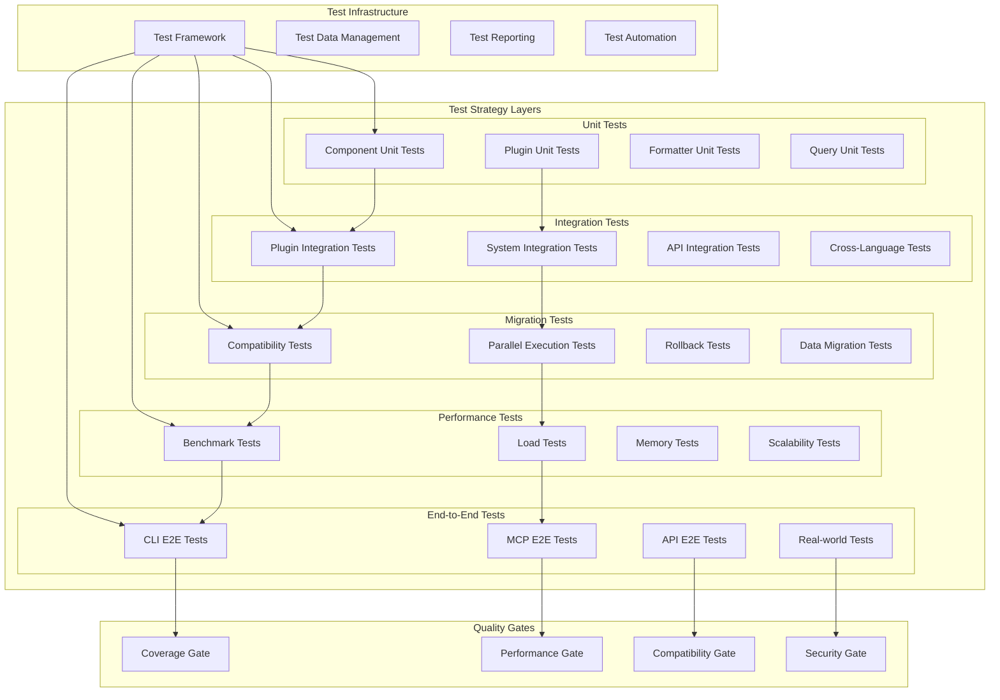

# テスト戦略設計書

## 🎯 テスト戦略目標

### 主要目標
1. **移行プロセスの安全性確保** - 各段階での回帰リスクを最小化
2. **新アーキテクチャの品質保証** - 機能性、パフォーマンス、拡張性の検証
3. **継続的品質維持** - 自動化されたテストパイプラインの構築
4. **開発効率の向上** - 迅速なフィードバックループの確立
5. **ドキュメント化された品質基準** - 明確な合格基準の設定

### 品質ゲート
- ✅ **機能互換性**: 既存機能の100%互換性
- ✅ **パフォーマンス**: 既存システムの105%以内
- ✅ **テストカバレッジ**: 90%以上
- ✅ **回帰テスト**: 全テストケースの通過
- ✅ **拡張性検証**: 新言語追加の実証

## 🏗️ テスト戦略アーキテクチャ



## 📋 テストレベル詳細設計

### 1. 単体テスト（Unit Tests）

#### 1.1 コンポーネント単体テスト
```python
# tests/unit/test_unified_query_engine.py
class TestUnifiedQueryEngine:
    """統一クエリエンジンの単体テスト"""
    
    def setup_method(self):
        """テストセットアップ"""
        self.mock_plugin_manager = Mock(spec=PluginManager)
        self.query_engine = UnifiedQueryEngine(self.mock_plugin_manager)
    
    def test_execute_query_success(self):
        """正常なクエリ実行のテスト"""
        # Arrange
        mock_plugin = Mock(spec=EnhancedLanguagePlugin)
        mock_plugin.execute_query.return_value = [Mock(spec=CodeElement)]
        self.mock_plugin_manager.get_plugin.return_value = mock_plugin
        
        # Act
        result = self.query_engine.execute_query("java", "class_definition", Mock())
        
        # Assert
        assert result is not None
        mock_plugin.execute_query.assert_called_once()
    
    def test_execute_query_plugin_not_found(self):
        """プラグインが見つからない場合のテスト"""
        # Arrange
        self.mock_plugin_manager.get_plugin.return_value = None
        
        # Act & Assert
        with pytest.raises(PluginNotFoundError):
            self.query_engine.execute_query("unknown", "class_definition", Mock())
    
    def test_execute_query_caching(self):
        """クエリキャッシュのテスト"""
        # Arrange
        mock_plugin = Mock(spec=EnhancedLanguagePlugin)
        mock_result = [Mock(spec=CodeElement)]
        mock_plugin.execute_query.return_value = mock_result
        self.mock_plugin_manager.get_plugin.return_value = mock_plugin
        
        # Act
        result1 = self.query_engine.execute_query("java", "class_definition", Mock())
        result2 = self.query_engine.execute_query("java", "class_definition", Mock())
        
        # Assert
        assert result1 == result2
        # キャッシュが効いているため、プラグインは1回だけ呼ばれる
        assert mock_plugin.execute_query.call_count == 1
    
    @pytest.mark.parametrize("language,query_key,expected_calls", [
        ("java", "class_definition", 1),
        ("python", "function_definition", 1),
        ("javascript", "function_declaration", 1),
    ])
    def test_execute_query_multiple_languages(self, language, query_key, expected_calls):
        """複数言語でのクエリ実行テスト"""
        # Arrange
        mock_plugin = Mock(spec=EnhancedLanguagePlugin)
        mock_plugin.execute_query.return_value = [Mock(spec=CodeElement)]
        self.mock_plugin_manager.get_plugin.return_value = mock_plugin
        
        # Act
        result = self.query_engine.execute_query(language, query_key, Mock())
        
        # Assert
        assert result is not None
        assert mock_plugin.execute_query.call_count == expected_calls
```

#### 1.2 プラグイン単体テスト
```python
# tests/unit/test_java_enhanced_plugin.py
class TestJavaEnhancedPlugin:
    """Java拡張プラグインの単体テスト"""
    
    def setup_method(self):
        """テストセットアップ"""
        self.plugin = JavaEnhancedPlugin()
        self.sample_java_code = """
        public class TestClass {
            private String field;
            
            public void method() {
                // method body
            }
        }
        """
        self.tree = self._parse_java_code(self.sample_java_code)
    
    def test_execute_class_query(self):
        """クラス定義クエリのテスト"""
        # Act
        result = self.plugin.execute_query("class_definition", self.tree.root_node)
        
        # Assert
        assert len(result) == 1
        assert result[0].element_type == "class"
        assert result[0].name == "TestClass"
    
    def test_execute_method_query(self):
        """メソッド定義クエリのテスト"""
        # Act
        result = self.plugin.execute_query("method_definition", self.tree.root_node)
        
        # Assert
        assert len(result) == 1
        assert result[0].element_type == "method"
        assert result[0].name == "method"
    
    def test_create_formatter_java_detailed(self):
        """Java詳細フォーマッターの作成テスト"""
        # Act
        formatter = self.plugin.create_formatter("java_detailed")
        
        # Assert
        assert isinstance(formatter, JavaDetailedFormatter)
        assert formatter.language == "java"
    
    def test_create_formatter_unsupported(self):
        """サポートされていないフォーマッターのテスト"""
        # Act & Assert
        with pytest.raises(UnsupportedFormatError):
            self.plugin.create_formatter("unsupported_format")
    
    def test_get_supported_formatters(self):
        """サポートフォーマッター一覧のテスト"""
        # Act
        formatters = self.plugin.get_supported_formatters()
        
        # Assert
        expected_formatters = ["json", "csv", "summary", "java_detailed"]
        assert all(fmt in formatters for fmt in expected_formatters)
    
    def _parse_java_code(self, code: str):
        """Javaコードのパース"""
        import tree_sitter_java as tsjava
        from tree_sitter import Language, Parser
        
        JAVA_LANGUAGE = Language(tsjava.language(), "java")
        parser = Parser()
        parser.set_language(JAVA_LANGUAGE)
        
        return parser.parse(bytes(code, "utf8"))
```

#### 1.3 フォーマッター単体テスト
```python
# tests/unit/test_unified_formatter_factory.py
class TestUnifiedFormatterFactory:
    """統一フォーマッターファクトリーの単体テスト"""
    
    def setup_method(self):
        """テストセットアップ"""
        self.mock_plugin_manager = Mock(spec=PluginManager)
        self.factory = UnifiedFormatterFactory(self.mock_plugin_manager)
    
    def test_create_formatter_plugin_based(self):
        """プラグインベースフォーマッター作成のテスト"""
        # Arrange
        mock_plugin = Mock(spec=EnhancedLanguagePlugin)
        mock_formatter = Mock(spec=BaseFormatter)
        mock_plugin.create_formatter.return_value = mock_formatter
        mock_plugin.supports_formatter.return_value = True
        self.mock_plugin_manager.get_plugin.return_value = mock_plugin
        
        # Act
        formatter = self.factory.create_formatter("java", "java_detailed")
        
        # Assert
        assert formatter == mock_formatter
        mock_plugin.create_formatter.assert_called_once_with("java_detailed")
    
    def test_create_formatter_core_fallback(self):
        """コアフォーマッターへのフォールバックテスト"""
        # Arrange
        mock_plugin = Mock(spec=EnhancedLanguagePlugin)
        mock_plugin.create_formatter.side_effect = UnsupportedFormatError()
        self.mock_plugin_manager.get_plugin.return_value = mock_plugin
        
        # Act
        formatter = self.factory.create_formatter("java", "json")
        
        # Assert
        assert isinstance(formatter, JsonFormatter)
        assert formatter.language == "java"
    
    def test_format_elements_end_to_end(self):
        """要素フォーマットのエンドツーエンドテスト"""
        # Arrange
        elements = [
            Mock(spec=CodeElement, name="TestClass", element_type="class"),
            Mock(spec=CodeElement, name="testMethod", element_type="method")
        ]
        
        # Act
        result = self.factory.format_elements("java", "json", elements)
        
        # Assert
        assert isinstance(result, FormatterResult)
        assert result.language == "java"
        assert result.format_type == "json"
        assert result.element_count == 2
        assert "TestClass" in result.content
        assert "testMethod" in result.content
```

### 2. 統合テスト（Integration Tests）

#### 2.1 プラグイン統合テスト
```python
# tests/integration/test_plugin_integration.py
class TestPluginIntegration:
    """プラグイン統合テスト"""
    
    def setup_method(self):
        """テストセットアップ"""
        self.plugin_manager = PluginManager()
        self.query_engine = UnifiedQueryEngine(self.plugin_manager)
        self.formatter_factory = UnifiedFormatterFactory(self.plugin_manager)
        
        # 実際のプラグインを登録
        self.plugin_manager.register_plugin("java", JavaEnhancedPlugin())
        self.plugin_manager.register_plugin("python", PythonEnhancedPlugin())
    
    def test_java_plugin_full_workflow(self):
        """Javaプラグインの完全ワークフローテスト"""
        # Arrange
        java_code = self._load_sample_java_file()
        tree = self._parse_java_code(java_code)
        
        # Act - クエリ実行
        classes = self.query_engine.execute_query("java", "class_definition", tree.root_node)
        methods = self.query_engine.execute_query("java", "method_definition", tree.root_node)
        
        # Act - フォーマット
        json_result = self.formatter_factory.format_elements("java", "json", classes + methods)
        detailed_result = self.formatter_factory.format_elements("java", "java_detailed", classes + methods)
        
        # Assert
        assert len(classes) > 0
        assert len(methods) > 0
        assert json_result.format_type == "json"
        assert detailed_result.format_type == "java_detailed"
        
        # JSON結果の検証
        json_data = json.loads(json_result.content)
        assert "classes" in json_data
        assert "methods" in json_data
        
        # 詳細結果の検証
        assert "modifiers" in detailed_result.content
        assert "annotations" in detailed_result.content
    
    def test_cross_language_consistency(self):
        """言語間一貫性のテスト"""
        # Arrange
        java_code = "public class Test { public void method() {} }"
        python_code = "class Test:\n    def method(self):\n        pass"
        
        java_tree = self._parse_java_code(java_code)
        python_tree = self._parse_python_code(python_code)
        
        # Act
        java_classes = self.query_engine.execute_query("java", "class_definition", java_tree.root_node)
        python_classes = self.query_engine.execute_query("python", "class_definition", python_tree.root_node)
        
        java_json = self.formatter_factory.format_elements("java", "json", java_classes)
        python_json = self.formatter_factory.format_elements("python", "json", python_classes)
        
        # Assert - 同じ構造のJSONが生成されることを確認
        java_data = json.loads(java_json.content)
        python_data = json.loads(python_json.content)
        
        assert java_data["classes"][0]["name"] == python_data["classes"][0]["name"]
        assert java_data["classes"][0]["element_type"] == python_data["classes"][0]["element_type"]
    
    def test_plugin_error_handling(self):
        """プラグインエラーハンドリングのテスト"""
        # Arrange
        invalid_code = "invalid syntax here"
        
        # Act & Assert
        with pytest.raises(ParseError):
            tree = self._parse_java_code(invalid_code)
            self.query_engine.execute_query("java", "class_definition", tree.root_node)
```

#### 2.2 システム統合テスト
```python
# tests/integration/test_system_integration.py
class TestSystemIntegration:
    """システム統合テスト"""
    
    def setup_method(self):
        """テストセットアップ"""
        self.system = self._create_integrated_system()
    
    def test_cli_integration(self):
        """CLI統合テスト"""
        # Arrange
        test_file = "test_samples/sample.java"
        
        # Act
        result = self.system.analyze_file(
            file_path=test_file,
            language="java",
            format_type="json"
        )
        
        # Assert
        assert result.success
        assert result.format_type == "json"
        assert len(result.elements) > 0
    
    def test_mcp_integration(self):
        """MCP統合テスト"""
        # Arrange
        mcp_request = {
            "file_path": "test_samples/sample.java",
            "language": "java",
            "query_key": "class_definition"
        }
        
        # Act
        result = self.system.handle_mcp_request(mcp_request)
        
        # Assert
        assert result["status"] == "success"
        assert "elements" in result
        assert len(result["elements"]) > 0
    
    def test_api_integration(self):
        """API統合テスト"""
        # Arrange
        api_request = {
            "code": "public class Test { public void method() {} }",
            "language": "java",
            "queries": ["class_definition", "method_definition"],
            "format": "json"
        }
        
        # Act
        result = self.system.process_api_request(api_request)
        
        # Assert
        assert result["status"] == "success"
        assert "classes" in result["data"]
        assert "methods" in result["data"]
```

### 3. 移行テスト（Migration Tests）

#### 3.1 互換性テスト
```python
# tests/migration/test_compatibility.py
class TestCompatibility:
    """互換性テスト"""
    
    def setup_method(self):
        """テストセットアップ"""
        self.legacy_system = LegacyQueryService()
        self.new_system = UnifiedQueryEngine(PluginManager())
        self.compatibility_checker = CompatibilityChecker()
    
    def test_api_compatibility(self):
        """API互換性のテスト"""
        # Arrange
        test_cases = self._load_api_test_cases()
        
        for test_case in test_cases:
            # Act
            legacy_result = self.legacy_system.execute_query(
                test_case.language,
                test_case.query_key,
                test_case.node
            )
            
            new_result = self.new_system.execute_query(
                test_case.language,
                test_case.query_key,
                test_case.node
            )
            
            # Assert
            compatibility_score = self.compatibility_checker.compare_results(
                legacy_result, new_result
            )
            
            assert compatibility_score >= 0.95, f"Compatibility score too low for {test_case.name}: {compatibility_score}"
    
    def test_output_format_compatibility(self):
        """出力フォーマット互換性のテスト"""
        # Arrange
        elements = self._create_sample_elements()
        
        # Act
        legacy_json = self.legacy_system.format_elements(elements, "json")
        new_json = self.new_system.format_elements("java", "json", elements)
        
        # Assert
        legacy_data = json.loads(legacy_json)
        new_data = json.loads(new_json.content)
        
        # 構造の互換性を確認
        assert self._compare_json_structure(legacy_data, new_data)
    
    def test_configuration_compatibility(self):
        """設定互換性のテスト"""
        # Arrange
        legacy_config = self._load_legacy_config()
        
        # Act
        new_system = self._create_new_system_with_legacy_config(legacy_config)
        
        # Assert
        assert new_system.is_configured_correctly()
        
        # 同じ設定で同じ結果が得られることを確認
        test_result = new_system.execute_query("java", "class_definition", Mock())
        assert test_result is not None
```

#### 3.2 並行実行テスト
```python
# tests/migration/test_parallel_execution.py
class TestParallelExecution:
    """並行実行テスト"""
    
    def setup_method(self):
        """テストセットアップ"""
        self.migration_controller = MigrationController()
    
    def test_parallel_execution_consistency(self):
        """並行実行の一貫性テスト"""
        # Arrange
        test_cases = self._load_parallel_test_cases()
        
        for test_case in test_cases:
            # Act - 新旧システムで並行実行
            results = self.migration_controller.execute_parallel(
                test_case.language,
                test_case.query_key,
                test_case.node
            )
            
            # Assert
            assert results.legacy_result is not None
            assert results.new_result is not None
            assert self._results_are_equivalent(results.legacy_result, results.new_result)
    
    def test_gradual_migration(self):
        """段階的移行のテスト"""
        # Arrange
        languages = ["java", "python", "javascript"]
        
        for language in languages:
            # Act - 言語を段階的に移行
            self.migration_controller.migrate_language(language)
            
            # Assert - 移行後も正常に動作することを確認
            result = self.migration_controller.execute_query(
                language, "class_definition", Mock()
            )
            assert result is not None
            
            # 他の言語に影響がないことを確認
            for other_language in languages:
                if other_language != language:
                    other_result = self.migration_controller.execute_query(
                        other_language, "class_definition", Mock()
                    )
                    assert other_result is not None
```

### 4. パフォーマンステスト（Performance Tests）

#### 4.1 ベンチマークテスト
```python
# tests/performance/test_benchmark.py
class TestBenchmark:
    """ベンチマークテスト"""
    
    def setup_method(self):
        """テストセットアップ"""
        self.legacy_system = LegacyQueryService()
        self.new_system = UnifiedQueryEngine(PluginManager())
        self.benchmark_runner = BenchmarkRunner()
    
    def test_execution_time_benchmark(self):
        """実行時間ベンチマーク"""
        # Arrange
        test_files = self._load_benchmark_files()
        
        for test_file in test_files:
            # Act
            legacy_time = self.benchmark_runner.measure_execution_time(
                self.legacy_system, test_file
            )
            
            new_time = self.benchmark_runner.measure_execution_time(
                self.new_system, test_file
            )
            
            # Assert - 新システムが既存システムの105%以内であること
            performance_ratio = new_time / legacy_time
            assert performance_ratio <= 1.05, f"Performance regression detected: {performance_ratio}"
    
    def test_memory_usage_benchmark(self):
        """メモリ使用量ベンチマーク"""
        # Arrange
        large_files = self._load_large_test_files()
        
        for test_file in large_files:
            # Act
            legacy_memory = self.benchmark_runner.measure_memory_usage(
                self.legacy_system, test_file
            )
            
            new_memory = self.benchmark_runner.measure_memory_usage(
                self.new_system, test_file
            )
            
            # Assert - メモリ使用量が120%以内であること
            memory_ratio = new_memory / legacy_memory
            assert memory_ratio <= 1.20, f"Memory usage regression detected: {memory_ratio}"
    
    def test_scalability_benchmark(self):
        """スケーラビリティベンチマーク"""
        # Arrange
        file_sizes = [1000, 5000, 10000, 50000]  # 行数
        
        for size in file_sizes:
            test_file = self._generate_test_file(size)
            
            # Act
            execution_time = self.benchmark_runner.measure_execution_time(
                self.new_system, test_file
            )
            
            # Assert - 線形スケーラビリティを確認
            expected_time = self._calculate_expected_time(size)
            assert execution_time <= expected_time * 1.5, f"Scalability issue at size {size}"
```

#### 4.2 負荷テスト
```python
# tests/performance/test_load.py
class TestLoad:
    """負荷テスト"""
    
    def test_concurrent_execution(self):
        """同時実行負荷テスト"""
        # Arrange
        num_threads = 10
        num_requests_per_thread = 100
        
        # Act
        results = self._run_concurrent_test(num_threads, num_requests_per_thread)
        
        # Assert
        assert all(result.success for result in results)
        assert len(results) == num_threads * num_requests_per_thread
        
        # レスポンス時間の確認
        avg_response_time = sum(r.execution_time for r in results) / len(results)
        assert avg_response_time <= 1.0  # 1秒以内
    
    def test_memory_leak_detection(self):
        """メモリリーク検出テスト"""
        # Arrange
        initial_memory = self._get_memory_usage()
        
        # Act - 大量のリクエストを実行
        for _ in range(1000):
            self.new_system.execute_query("java", "class_definition", Mock())
        
        # Assert
        final_memory = self._get_memory_usage()
        memory_increase = final_memory - initial_memory
        
        # メモリ増加が許容範囲内であることを確認
        assert memory_increase <= 100 * 1024 * 1024  # 100MB以内
```

### 5. エンドツーエンドテスト（E2E Tests）

#### 5.1 CLI E2Eテスト
```python
# tests/e2e/test_cli_e2e.py
class TestCLIE2E:
    """CLI エンドツーエンドテスト"""
    
    def test_analyze_java_file(self):
        """Javaファイル解析のE2Eテスト"""
        # Arrange
        test_file = "test_samples/complex_java_class.java"
        
        # Act
        result = subprocess.run([
            "python", "-m", "tree_sitter_analyzer",
            "analyze", test_file,
            "--format", "json",
            "--output", "test_output.json"
        ], capture_output=True, text=True)
        
        # Assert
        assert result.returncode == 0
        assert os.path.exists("test_output.json")
        
        with open("test_output.json", "r") as f:
            output_data = json.load(f)
        
        assert "classes" in output_data
        assert "methods" in output_data
        assert len(output_data["classes"]) > 0
    
    def test_multi_language_analysis(self):
        """多言語解析のE2Eテスト"""
        # Arrange
        test_directory = "test_samples/multi_language_project"
        
        # Act
        result = subprocess.run([
            "python", "-m", "tree_sitter_analyzer",
            "analyze-directory", test_directory,
            "--format", "summary",
            "--languages", "java,python,javascript"
        ], capture_output=True, text=True)
        
        # Assert
        assert result.returncode == 0
        assert "Java files analyzed:" in result.stdout
        assert "Python files analyzed:" in result.stdout
        assert "JavaScript files analyzed:" in result.stdout
```

#### 5.2 MCP E2Eテスト
```python
# tests/e2e/test_mcp_e2e.py
class TestMCPE2E:
    """MCP エンドツーエンドテスト"""
    
    def setup_method(self):
        """テストセットアップ"""
        self.mcp_server = MCPServer()
        self.mcp_client = MCPClient()
    
    def test_query_code_tool(self):
        """query_codeツールのE2Eテスト"""
        # Arrange
        request = {
            "file_path": "test_samples/sample.java",
            "language": "java",
            "query_key": "class_definition",
            "output_format": "json"
        }
        
        # Act
        response = self.mcp_client.call_tool("query_code", request)
        
        # Assert
        assert response["status"] == "success"
        assert "elements" in response["data"]
        assert len(response["data"]["elements"]) > 0
    
    def test_analyze_code_structure_tool(self):
        """analyze_code_structureツールのE2Eテスト"""
        # Arrange
        request = {
            "file_path": "test_samples/large_java_class.java",
            "format_type": "full",
            "language": "java"
        }
        
        # Act
        response = self.mcp_client.call_tool("analyze_code_structure", request)
        
        # Assert
        assert response["status"] == "success"
        assert "table_output" in response["data"]
        assert "Classes" in response["data"]["table_output"]
        assert "Methods" in response["data"]["table_output"]
```

## 🧪 テストデータ管理

### 1. テストデータ戦略
```python
# tests/data/test_data_manager.py
class TestDataManager:
    """テストデータ管理"""
    
    def __init__(self):
        self.data_directory = "tests/data"
        self.sample_files = self._load_sample_files()
        self.golden_outputs = self._load_golden_outputs()
    
    def get_sample_file(self, language: str, complexity: str = "simple"):
        """サンプルファイルの取得"""
        key = f"{language}_{complexity}"
        return self.sample_files.get(key)
    
    def get_golden_output(self, language: str, query_type: str, format_type: str):
        """ゴールデン出力の取得"""
        key = f"{language}_{query_