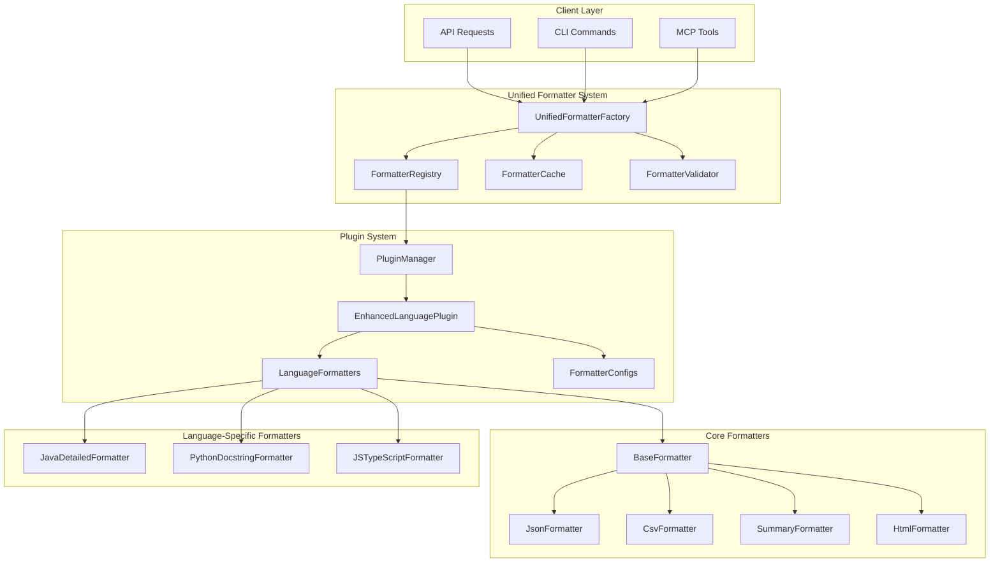

# 統一フォーマッターシステム設計書

## 🎯 設計目標

1. **言語固有フォーマッターの統合**: 各言語プラグインにフォーマッター機能を移譲
2. **条件分岐の排除**: フォーマッターファクトリーの言語固有条件分岐を削除
3. **拡張性の確保**: 新しいフォーマット形式の追加を簡素化
4. **一貫性の向上**: 全言語で統一されたフォーマッター API
5. **カスタマイズ性**: 言語固有の特殊フォーマットをサポート

## 🏗️ アーキテクチャ概要



## 📋 コアコンポーネント設計

### 1. UnifiedFormatterFactory（統一ファクトリー）

```python
from typing import Dict, List, Any, Optional, Type, Protocol
from dataclasses import dataclass
from abc import ABC, abstractmethod
import threading
from enum import Enum

class FormatterType(Enum):
    """標準フォーマッタータイプ"""
    JSON = "json"
    CSV = "csv"
    SUMMARY = "summary"
    HTML = "html"
    XML = "xml"
    MARKDOWN = "markdown"
    YAML = "yaml"

@dataclass
class FormatterRequest:
    """フォーマッターリクエスト"""
    language: str
    format_type: str
    elements: List['CodeElement']
    options: Dict[str, Any] = None
    
    def __post_init__(self):
        if self.options is None:
            self.options = {}

@dataclass
class FormatterResult:
    """フォーマッター結果"""
    content: str
    metadata: Dict[str, Any]
    format_type: str
    language: str
    element_count: int
    formatter_info: Dict[str, str]

class FormatterError(Exception):
    """フォーマッターエラー"""
    pass

class UnsupportedFormatError(FormatterError):
    """サポートされていないフォーマットエラー"""
    pass

class UnifiedFormatterFactory:
    """プラグインベースの統一フォーマッターファクトリー"""
    
    def __init__(self, plugin_manager: 'PluginManager', config: Optional[Dict] = None):
        self.plugin_manager = plugin_manager
        self.config = config or {}
        
        # コンポーネント初期化
        self.formatter_registry = FormatterRegistry()
        self.formatter_cache = FormatterCache(
            max_size=self.config.get('cache_size', 100)
        )
        self.formatter_validator = FormatterValidator()
        
        # スレッドセーフティ
        self.lock = threading.RLock()
        
        # 統計情報
        self.creation_stats = FormatterCreationStats()
        
        # 標準フォーマッターの登録
        self._register_core_formatters()
    
    def create_formatter(
        self, 
        language: str, 
        format_type: str,
        **options
    ) -> 'BaseFormatter':
        """メインのフォーマッター作成エントリーポイント"""
        
        with self.lock:
            # リクエスト作成
            request = FormatterRequest(
                language=language,
                format_type=format_type,
                elements=[],  # 作成時は空
                options=options
            )
            
            # バリデーション
            self.formatter_validator.validate_request(request)
            
            # キャッシュチェック
            cache_key = self._generate_cache_key(language, format_type, options)
            cached_formatter = self.formatter_cache.get(cache_key)
            
            if cached_formatter:
                self.creation_stats.record_cache_hit(language, format_type)
                return cached_formatter
            
            # フォーマッター作成
            formatter = self._create_formatter_internal(request)
            
            # キャッシュ保存
            self.formatter_cache.put(cache_key, formatter)
            
            # 統計更新
            self.creation_stats.record_creation(language, format_type)
            
            return formatter
    
    def format_elements(
        self,
        language: str,
        format_type: str,
        elements: List['CodeElement'],
        **options
    ) -> FormatterResult:
        """要素のフォーマット（ワンショット）"""
        
        formatter = self.create_formatter(language, format_type, **options)
        content = formatter.format(elements)
        
        return FormatterResult(
            content=content,
            metadata=formatter.get_metadata(),
            format_type=format_type,
            language=language,
            element_count=len(elements),
            formatter_info={
                'formatter_class': formatter.__class__.__name__,
                'formatter_module': formatter.__class__.__module__
            }
        )
    
    def get_supported_formats(self, language: str) -> List[str]:
        """言語でサポートされているフォーマット一覧"""
        
        # プラグインからサポートフォーマットを取得
        plugin = self.plugin_manager.get_plugin(language)
        supported_formats = []
        
        if plugin and hasattr(plugin, 'get_supported_formatters'):
            supported_formats.extend(plugin.get_supported_formatters())
        
        # 標準フォーマットを追加
        core_formats = [fmt.value for fmt in FormatterType]
        supported_formats.extend(core_formats)
        
        # 重複除去
        return list(set(supported_formats))
    
    def get_formatter_schema(self, language: str, format_type: str) -> Dict[str, Any]:
        """フォーマッターのスキーマ情報を取得"""
        
        plugin = self.plugin_manager.get_plugin(language)
        
        if plugin and hasattr(plugin, 'get_formatter_config'):
            config = plugin.get_formatter_config(format_type)
            if config:
                return {
                    'format_type': format_type,
                    'language': language,
                    'options': config.get('options', {}),
                    'description': config.get('description', ''),
                    'examples': config.get('examples', [])
                }
        
        # デフォルトスキーマ
        return {
            'format_type': format_type,
            'language': language,
            'options': {},
            'description': f'Standard {format_type} formatter',
            'examples': []
        }
    
    def _create_formatter_internal(self, request: FormatterRequest) -> 'BaseFormatter':
        """内部フォーマッター作成ロジック"""
        
        # 1. プラグインベースのフォーマッター作成を試行
        plugin_formatter = self._try_create_plugin_formatter(request)
        if plugin_formatter:
            return plugin_formatter
        
        # 2. 標準フォーマッターの作成
        core_formatter = self._try_create_core_formatter(request)
        if core_formatter:
            return core_formatter
        
        # 3. フォールバック: 汎用フォーマッター
        return self._create_generic_formatter(request)
    
    def _try_create_plugin_formatter(self, request: FormatterRequest) -> Optional['BaseFormatter']:
        """プラグインベースのフォーマッター作成を試行"""
        
        plugin = self.plugin_manager.get_plugin(request.language)
        
        if not plugin:
            return None
        
        # 拡張プラグインインターフェースの確認
        if not hasattr(plugin, 'create_formatter'):
            return None
        
        try:
            # プラグインがフォーマットをサポートするかチェック
            if hasattr(plugin, 'supports_formatter'):
                if not plugin.supports_formatter(request.format_type):
                    return None
            
            # フォーマッター作成
            formatter = plugin.create_formatter(request.format_type)
            
            # オプションの適用
            if request.options and hasattr(formatter, 'configure'):
                formatter.configure(request.options)
            
            return formatter
            
        except Exception as e:
            # プラグインフォーマッター作成失敗時はログに記録してフォールバック
            self.creation_stats.record_plugin_error(request.language, request.format_type, str(e))
            return None
    
    def _try_create_core_formatter(self, request: FormatterRequest) -> Optional['BaseFormatter']:
        """標準フォーマッターの作成を試行"""
        
        formatter_class = self.formatter_registry.get_formatter_class(request.format_type)
        
        if not formatter_class:
            return None
        
        try:
            # 言語固有設定の取得
            language_config = self._get_language_formatter_config(
                request.language, request.format_type
            )
            
            # フォーマッター作成
            formatter = formatter_class(
                language=request.language,
                config=language_config,
                **request.options
            )
            
            return formatter
            
        except Exception as e:
            self.creation_stats.record_core_error(request.format_type, str(e))
            return None
    
    def _create_generic_formatter(self, request: FormatterRequest) -> 'BaseFormatter':
        """汎用フォーマッターの作成（最終フォールバック）"""
        
        from .generic_formatter import GenericFormatter
        
        return GenericFormatter(
            language=request.language,
            format_type=request.format_type,
            **request.options
        )
    
    def _get_language_formatter_config(self, language: str, format_type: str) -> Dict[str, Any]:
        """言語固有のフォーマッター設定を取得"""
        
        plugin = self.plugin_manager.get_plugin(language)
        
        if plugin and hasattr(plugin, 'get_formatter_config'):
            return plugin.get_formatter_config(format_type) or {}
        
        return {}
    
    def _register_core_formatters(self):
        """標準フォーマッターの登録"""
        
        from .json_formatter import JsonFormatter
        from .csv_formatter import CsvFormatter
        from .summary_formatter import SummaryFormatter
        from .html_formatter import HtmlFormatter
        from .xml_formatter import XmlFormatter
        from .markdown_formatter import MarkdownFormatter
        from .yaml_formatter import YamlFormatter
        
        self.formatter_registry.register('json', JsonFormatter)
        self.formatter_registry.register('csv', CsvFormatter)
        self.formatter_registry.register('summary', SummaryFormatter)
        self.formatter_registry.register('html', HtmlFormatter)
        self.formatter_registry.register('xml', XmlFormatter)
        self.formatter_registry.register('markdown', MarkdownFormatter)
        self.formatter_registry.register('yaml', YamlFormatter)
    
    def _generate_cache_key(self, language: str, format_type: str, options: Dict) -> str:
        """キャッシュキーの生成"""
        options_str = str(sorted(options.items()))
        return f"{language}:{format_type}:{hash(options_str)}"
    
    def get_creation_stats(self) -> Dict[str, Any]:
        """作成統計の取得"""
        return self.creation_stats.get_stats()
    
    def clear_cache(self):
        """キャッシュのクリア"""
        self.formatter_cache.clear()
```

### 2. FormatterRegistry（フォーマッター登録）

```python
class FormatterRegistry:
    """フォーマッタークラスの登録管理"""
    
    def __init__(self):
        self.formatters: Dict[str, Type['BaseFormatter']] = {}
        self.aliases: Dict[str, str] = {}
        self.lock = threading.RLock()
    
    def register(self, format_type: str, formatter_class: Type['BaseFormatter']):
        """フォーマッタークラスの登録"""
        with self.lock:
            self.formatters[format_type] = formatter_class
    
    def register_alias(self, alias: str, format_type: str):
        """フォーマットタイプのエイリアス登録"""
        with self.lock:
            self.aliases[alias] = format_type
    
    def get_formatter_class(self, format_type: str) -> Optional[Type['BaseFormatter']]:
        """フォーマッタークラスの取得"""
        with self.lock:
            # エイリアス解決
            resolved_type = self.aliases.get(format_type, format_type)
            return self.formatters.get(resolved_type)
    
    def get_registered_formats(self) -> List[str]:
        """登録されているフォーマット一覧"""
        with self.lock:
            return list(self.formatters.keys())
    
    def unregister(self, format_type: str):
        """フォーマッターの登録解除"""
        with self.lock:
            self.formatters.pop(format_type, None)
```

### 3. 拡張BaseFormatter

```python
class BaseFormatter(ABC):
    """拡張されたベースフォーマッター"""
    
    def __init__(self, language: str = "unknown", config: Optional[Dict] = None, **options):
        self.language = language
        self.config = config or {}
        self.options = options
        self.metadata: Dict[str, Any] = {}
        
        # 設定の初期化
        self._initialize_config()
    
    @abstractmethod
    def format(self, elements: List['CodeElement']) -> str:
        """要素のフォーマット"""
        pass
    
    def configure(self, options: Dict[str, Any]):
        """動的設定の更新"""
        self.options.update(options)
        self._initialize_config()
    
    def get_metadata(self) -> Dict[str, Any]:
        """メタデータの取得"""
        return self.metadata.copy()
    
    def supports_language(self, language: str) -> bool:
        """言語サポートの確認"""
        return True  # デフォルトは全言語サポート
    
    def get_format_info(self) -> Dict[str, Any]:
        """フォーマット情報の取得"""
        return {
            'format_type': self.__class__.__name__.lower().replace('formatter', ''),
            'language': self.language,
            'description': self.__doc__ or '',
            'options': self._get_available_options()
        }
    
    def _initialize_config(self):
        """設定の初期化"""
        # 言語固有設定とオプションのマージ
        merged_config = {}
        merged_config.update(self.config)
        merged_config.update(self.options)
        
        # 設定の適用
        self._apply_config(merged_config)
    
    def _apply_config(self, config: Dict[str, Any]):
        """設定の適用（サブクラスでオーバーライド）"""
        pass
    
    def _get_available_options(self) -> Dict[str, Any]:
        """利用可能なオプション（サブクラスでオーバーライド）"""
        return {}
    
    def _format_element(self, element: 'CodeElement') -> Dict[str, Any]:
        """単一要素のフォーマット（共通処理）"""
        return {
            'name': element.name,
            'type': element.element_type,
            'start_line': element.start_line,
            'end_line': element.end_line,
            'language': element.language
        }
```

### 4. 言語固有フォーマッター例

```python
class JavaDetailedFormatter(BaseFormatter):
    """Java言語専用の詳細フォーマッター"""
    
    def __init__(self, **kwargs):
        super().__init__(**kwargs)
        self.include_modifiers = self.options.get('include_modifiers', True)
        self.include_annotations = self.options.get('include_annotations', True)
        self.include_generics = self.options.get('include_generics', True)
    
    def format(self, elements: List['CodeElement']) -> str:
        """Java固有のフォーマット"""
        formatted_elements = []
        
        for element in elements:
            if element.element_type == 'class':
                formatted_elements.append(self._format_java_class(element))
            elif element.element_type == 'method':
                formatted_elements.append(self._format_java_method(element))
            else:
                formatted_elements.append(self._format_element(element))
        
        return self._generate_java_output(formatted_elements)
    
    def _format_java_class(self, element: 'JavaClass') -> Dict[str, Any]:
        """Javaクラスの詳細フォーマット"""
        result = self._format_element(element)
        
        if self.include_modifiers and hasattr(element, 'modifiers'):
            result['modifiers'] = element.modifiers
        
        if self.include_annotations and hasattr(element, 'annotations'):
            result['annotations'] = element.annotations
        
        if hasattr(element, 'superclass'):
            result['superclass'] = element.superclass
        
        if hasattr(element, 'interfaces'):
            result['interfaces'] = element.interfaces
        
        return result
    
    def _format_java_method(self, element: 'JavaMethod') -> Dict[str, Any]:
        """Javaメソッドの詳細フォーマット"""
        result = self._format_element(element)
        
        if self.include_modifiers and hasattr(element, 'modifiers'):
            result['modifiers'] = element.modifiers
        
        if hasattr(element, 'return_type'):
            result['return_type'] = element.return_type
        
        if hasattr(element, 'parameters'):
            result['parameters'] = [
                {
                    'name': param.name,
                    'type': param.type,
                    'annotations': param.annotations if self.include_annotations else []
                }
                for param in element.parameters
            ]
        
        if hasattr(element, 'throws'):
            result['throws'] = element.throws
        
        return result
    
    def _generate_java_output(self, formatted_elements: List[Dict]) -> str:
        """Java固有の出力生成"""
        # Java固有のテンプレートを使用
        template = self._get_java_template()
        return template.render(elements=formatted_elements)
    
    def supports_language(self, language: str) -> bool:
        """Java言語のみサポート"""
        return language.lower() == 'java'
```

## 🔄 プラグイン統合

### 1. EnhancedLanguagePluginの拡張

```python
class EnhancedLanguagePlugin(ABC):
    """フォーマッター機能を含む拡張プラグイン"""
    
    @abstractmethod
    def create_formatter(self, format_type: str) -> BaseFormatter:
        """言語固有のフォーマッターを作成"""
        pass
    
    def supports_formatter(self, format_type: str) -> bool:
        """フォーマットタイプのサポート確認"""
        return format_type in self.get_supported_formatters()
    
    def get_supported_formatters(self) -> List[str]:
        """サポートするフォーマッター一覧"""
        return ['json', 'csv', 'summary']  # デフォルト
    
    def get_formatter_config(self, format_type: str) -> Dict[str, Any]:
        """フォーマッター設定の取得"""
        config = self.get_language_config()
        return config.formatter_configs.get(format_type, {})
```

### 2. Java言語プラグインの実装例

```python
class JavaEnhancedPlugin(EnhancedLanguagePlugin):
    """Java言語の拡張プラグイン"""
    
    def create_formatter(self, format_type: str) -> BaseFormatter:
        """Java固有フォーマッターの作成"""
        
        if format_type == 'java_detailed':
            return JavaDetailedFormatter(language='java')
        elif format_type == 'java_javadoc':
            return JavaJavadocFormatter(language='java')
        elif format_type == 'java_uml':
            return JavaUmlFormatter(language='java')
        elif format_type == 'json':
            return JavaJsonFormatter(language='java')
        else:
            raise UnsupportedFormatError(f"Java plugin does not support format: {format_type}")
    
    def get_supported_formatters(self) -> List[str]:
        """Javaでサポートするフォーマッター"""
        return [
            'json', 'csv', 'summary',  # 標準
            'java_detailed', 'java_javadoc', 'java_uml'  # Java固有
        ]
    
    def get_formatter_config(self, format_type: str) -> Dict[str, Any]:
        """Java固有のフォーマッター設定"""
        configs = {
            'java_detailed': {
                'include_modifiers': True,
                'include_annotations': True,
                'include_generics': True,
                'include_javadoc': False
            },
            'java_javadoc': {
                'include_param_docs': True,
                'include_return_docs': True,
                'include_throws_docs': True
            },
            'java_uml': {
                'include_relationships': True,
                'include_visibility': True,
                'format': 'plantuml'
            }
        }
        return configs.get(format_type, {})
```

## 📊 移行戦略

### 1. 段階的移行
```python
# Phase 1: 基本統一ファクトリー
class UnifiedFormatterFactoryV1:
    """基本機能のみ"""
    pass

# Phase 2: プラグイン統合
class UnifiedFormatterFactoryV2(UnifiedFormatterFactoryV1):
    """プラグイン統合機能追加"""
    pass

# Phase 3: 高度な機能
class UnifiedFormatterFactory(UnifiedFormatterFactoryV2):
    """完全版"""
    pass
```

### 2. 既存フォーマッターの移行
```python
class LegacyFormatterWrapper:
    """既存フォーマッターのラッパー"""
    
    def __init__(self, legacy_formatter):
        self.legacy_formatter = legacy_formatter
    
    def format(self, elements):
        # 既存フォーマッターの呼び出し
        return self.legacy_formatter.format_elements(elements)
```

## 🧪 テスト戦略

### 1. フォーマッター単体テスト
```python
class TestUnifiedFormatterFactory:
    def test_plugin_formatter_creation(self):
        """プラグインフォーマッターの作成テスト"""
        pass
    
    def test_fallback_to_core_formatter(self):
        """コアフォーマッターへのフォールバックテスト"""
        pass
    
    def test_format_consistency(self):
        """フォーマット一貫性テスト"""
        pass
```

### 2. 言語固有フォーマッターテスト
```python
class TestJavaDetailedFormatter:
    def test_java_class_formatting(self):
        """Javaクラスフォーマットテスト"""
        pass
    
    def test_java_method_formatting(self):
        """Javaメソッドフォーマットテスト"""
        pass
```

## 📈 期待される効果

1. **条件分岐の排除**: フォーマッターファクトリーの言語固有分岐削除
2. **拡張性の向上**: 新しいフォーマット形式の簡単追加
3. **一貫性の確保**: 全言語で統一されたフォーマッターAPI
4. **カスタマイズ性**: 言語固有の特殊フォーマット対応
5. **保守性の向上**: プラグインベースの明確な責任分離

この統一フォーマッターシステムにより、tree-sitter-analyzerは柔軟で拡張可能なフォーマット機能を実現します。