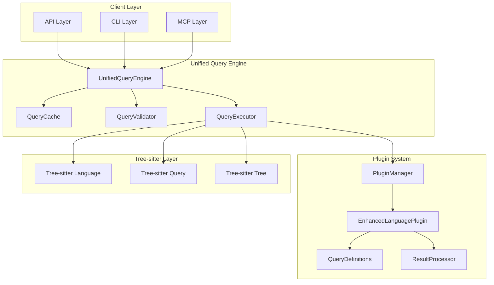

# 統一クエリエンジン設計書

## 🎯 設計目標

1. **条件分岐の完全排除**: `query_service.py`の9件の条件分岐を削除
2. **プラグインベースの統一実行**: 言語固有ロジックをプラグインに移譲
3. **高性能**: キャッシュとコンパイル済みクエリによる最適化
4. **拡張性**: 新言語追加時のコア修正不要
5. **後方互換性**: 既存APIとの完全互換

## 🏗️ アーキテクチャ概要



## 📋 コアコンポーネント設計

### 1. UnifiedQueryEngine（メインエンジン）

```python
from typing import Dict, List, Any, Optional, Union, Tuple
from dataclasses import dataclass
from enum import Enum
import hashlib
import time
from concurrent.futures import ThreadPoolExecutor
import tree_sitter

@dataclass
class QueryRequest:
    """クエリリクエストの統一データクラス"""
    language: str
    query_type: str
    tree: tree_sitter.Tree
    source_code: str
    options: Dict[str, Any] = None
    
    def __post_init__(self):
        if self.options is None:
            self.options = {}

@dataclass
class QueryResult:
    """クエリ結果の統一データクラス"""
    elements: List['CodeElement']
    metadata: Dict[str, Any]
    execution_time: float
    cache_hit: bool
    plugin_info: Dict[str, str]

class QueryExecutionError(Exception):
    """クエリ実行エラー"""
    pass

class UnsupportedQueryError(QueryExecutionError):
    """サポートされていないクエリエラー"""
    pass

class UnifiedQueryEngine:
    """条件分岐を排除した統一クエリエンジン"""
    
    def __init__(self, plugin_manager: 'PluginManager', config: Optional[Dict] = None):
        self.plugin_manager = plugin_manager
        self.config = config or {}
        
        # コンポーネント初期化
        self.query_cache = QueryCache(max_size=self.config.get('cache_size', 1000))
        self.query_validator = QueryValidator()
        self.query_executor = QueryExecutor(self.plugin_manager)
        
        # パフォーマンス監視
        self.execution_stats = ExecutionStats()
        
        # 並行実行設定
        self.thread_pool = ThreadPoolExecutor(
            max_workers=self.config.get('max_workers', 4)
        )
    
    def execute_query(
        self, 
        language: str, 
        query_type: str, 
        tree: tree_sitter.Tree,
        source_code: str,
        **options
    ) -> QueryResult:
        """メインのクエリ実行エントリーポイント"""
        
        start_time = time.time()
        
        # リクエスト作成
        request = QueryRequest(
            language=language,
            query_type=query_type,
            tree=tree,
            source_code=source_code,
            options=options
        )
        
        try:
            # 1. バリデーション
            self.query_validator.validate_request(request)
            
            # 2. キャッシュチェック
            cache_key = self._generate_cache_key(request)
            cached_result = self.query_cache.get(cache_key)
            
            if cached_result:
                cached_result.cache_hit = True
                return cached_result
            
            # 3. クエリ実行
            result = self.query_executor.execute(request)
            
            # 4. 結果キャッシュ
            result.execution_time = time.time() - start_time
            result.cache_hit = False
            self.query_cache.put(cache_key, result)
            
            # 5. 統計更新
            self.execution_stats.record_execution(language, query_type, result.execution_time)
            
            return result
            
        except Exception as e:
            self.execution_stats.record_error(language, query_type, str(e))
            raise QueryExecutionError(f"Query execution failed: {e}") from e
    
    def execute_batch_queries(
        self,
        requests: List[Tuple[str, str, tree_sitter.Tree, str]]
    ) -> List[QueryResult]:
        """バッチクエリ実行（並行処理）"""
        
        futures = []
        for language, query_type, tree, source_code in requests:
            future = self.thread_pool.submit(
                self.execute_query, language, query_type, tree, source_code
            )
            futures.append(future)
        
        results = []
        for future in futures:
            try:
                result = future.result(timeout=30)  # 30秒タイムアウト
                results.append(result)
            except Exception as e:
                # エラー結果を作成
                error_result = QueryResult(
                    elements=[],
                    metadata={'error': str(e)},
                    execution_time=0.0,
                    cache_hit=False,
                    plugin_info={}
                )
                results.append(error_result)
        
        return results
    
    def get_available_queries(self, language: str) -> List[str]:
        """言語でサポートされているクエリ一覧を取得"""
        plugin = self._get_validated_plugin(language)
        return list(plugin.get_query_definitions().keys())
    
    def get_query_schema(self, language: str, query_type: str) -> Dict[str, Any]:
        """クエリのスキーマ情報を取得"""
        plugin = self._get_validated_plugin(language)
        query_def = plugin.get_query_definitions().get(query_type)
        
        if not query_def:
            raise UnsupportedQueryError(f"Query '{query_type}' not supported for {language}")
        
        return {
            'query_string': query_def.query_string,
            'capture_names': query_def.capture_names,
            'metadata': query_def.metadata,
            'post_processors': query_def.post_processors
        }
    
    def _generate_cache_key(self, request: QueryRequest) -> str:
        """キャッシュキーの生成"""
        # ソースコードのハッシュを使用
        source_hash = hashlib.md5(request.source_code.encode()).hexdigest()
        
        # オプションのハッシュ
        options_str = str(sorted(request.options.items()))
        options_hash = hashlib.md5(options_str.encode()).hexdigest()
        
        return f"{request.language}:{request.query_type}:{source_hash}:{options_hash}"
    
    def _get_validated_plugin(self, language: str) -> 'EnhancedLanguagePlugin':
        """プラグイン取得と検証"""
        plugin = self.plugin_manager.get_plugin(language)
        
        if not plugin:
            raise UnsupportedLanguageError(f"No plugin found for language: {language}")
        
        # 拡張プラグインインターフェースの確認
        if not hasattr(plugin, 'get_query_definitions'):
            # レガシープラグインの場合はラッパーを作成
            plugin = LegacyPluginWrapper(plugin)
        
        return plugin
    
    def get_execution_stats(self) -> Dict[str, Any]:
        """実行統計の取得"""
        return self.execution_stats.get_stats()
    
    def clear_cache(self):
        """キャッシュのクリア"""
        self.query_cache.clear()
    
    def shutdown(self):
        """リソースのクリーンアップ"""
        self.thread_pool.shutdown(wait=True)
```

### 2. QueryExecutor（実行エンジン）

```python
class QueryExecutor:
    """プラグインベースのクエリ実行エンジン"""
    
    def __init__(self, plugin_manager: 'PluginManager'):
        self.plugin_manager = plugin_manager
        self.compiled_queries: Dict[str, tree_sitter.Query] = {}
        self.tree_sitter_languages: Dict[str, tree_sitter.Language] = {}
    
    def execute(self, request: QueryRequest) -> QueryResult:
        """クエリの実際の実行"""
        
        # 1. プラグイン取得
        plugin = self._get_plugin(request.language)
        
        # 2. クエリサポート確認
        if not plugin.supports_query(request.query_type):
            available_queries = list(plugin.get_query_definitions().keys())
            raise UnsupportedQueryError(
                f"Query '{request.query_type}' not supported for {request.language}. "
                f"Available queries: {available_queries}"
            )
        
        # 3. クエリ定義取得
        query_def = plugin.get_query_definitions()[request.query_type]
        
        # 4. Tree-sitterクエリ実行
        raw_results = self._execute_tree_sitter_query(
            request.language, query_def, request.tree, request.source_code
        )
        
        # 5. プラグインによる後処理
        processed_elements = plugin.process_query_result(
            request.query_type, raw_results
        )
        
        # 6. 結果の構築
        result = QueryResult(
            elements=processed_elements,
            metadata={
                'language': request.language,
                'query_type': request.query_type,
                'raw_result_count': len(raw_results),
                'processed_element_count': len(processed_elements),
                'query_definition': {
                    'capture_names': query_def.capture_names,
                    'post_processors': query_def.post_processors
                }
            },
            execution_time=0.0,  # 後で設定
            cache_hit=False,
            plugin_info={
                'plugin_class': plugin.__class__.__name__,
                'plugin_module': plugin.__class__.__module__
            }
        )
        
        return result
    
    def _execute_tree_sitter_query(
        self,
        language: str,
        query_def: 'QueryDefinition',
        tree: tree_sitter.Tree,
        source_code: str
    ) -> List[Dict[str, Any]]:
        """Tree-sitterクエリの実際の実行"""
        
        # コンパイル済みクエリの取得またはコンパイル
        query_key = f"{language}:{hash(query_def.query_string)}"
        
        if query_key not in self.compiled_queries:
            ts_language = self._get_tree_sitter_language(language)
            try:
                compiled_query = ts_language.query(query_def.query_string)
                self.compiled_queries[query_key] = compiled_query
            except Exception as e:
                raise QueryExecutionError(f"Failed to compile query: {e}")
        
        compiled_query = self.compiled_queries[query_key]
        
        # クエリ実行
        try:
            captures = compiled_query.captures(tree.root_node)
        except Exception as e:
            raise QueryExecutionError(f"Failed to execute query: {e}")
        
        # 結果の構造化
        results = []
        for node, capture_name in captures:
            result = {
                'node': node,
                'capture_name': capture_name,
                'text': self._extract_node_text(node, source_code),
                'start_point': node.start_point,
                'end_point': node.end_point,
                'start_byte': node.start_byte,
                'end_byte': node.end_byte,
                'node_type': node.type,
                'metadata': query_def.metadata.copy()
            }
            results.append(result)
        
        return results
    
    def _get_tree_sitter_language(self, language: str) -> tree_sitter.Language:
        """Tree-sitter言語オブジェクトの取得"""
        if language not in self.tree_sitter_languages:
            try:
                # 動的インポート
                if language == 'python':
                    import tree_sitter_python as ts_python
                    ts_language = tree_sitter.Language(ts_python.language())
                elif language == 'java':
                    import tree_sitter_java as ts_java
                    ts_language = tree_sitter.Language(ts_java.language())
                elif language == 'javascript':
                    import tree_sitter_javascript as ts_javascript
                    ts_language = tree_sitter.Language(ts_javascript.language())
                elif language == 'typescript':
                    import tree_sitter_typescript as ts_typescript
                    ts_language = tree_sitter.Language(ts_typescript.language_typescript())
                else:
                    raise UnsupportedLanguageError(f"Tree-sitter language not available: {language}")
                
                self.tree_sitter_languages[language] = ts_language
            except ImportError as e:
                raise UnsupportedLanguageError(f"Tree-sitter language module not found: {e}")
        
        return self.tree_sitter_languages[language]
    
    def _extract_node_text(self, node: tree_sitter.Node, source_code: str) -> str:
        """ノードからテキストを抽出"""
        try:
            source_bytes = source_code.encode('utf-8')
            node_bytes = source_bytes[node.start_byte:node.end_byte]
            return node_bytes.decode('utf-8', errors='replace')
        except Exception:
            return ""
    
    def _get_plugin(self, language: str) -> 'EnhancedLanguagePlugin':
        """プラグイン取得"""
        plugin = self.plugin_manager.get_plugin(language)
        if not plugin:
            raise UnsupportedLanguageError(f"No plugin found for language: {language}")
        return plugin
```

### 3. QueryCache（キャッシュシステム）

```python
from collections import OrderedDict
import threading
import time

class QueryCache:
    """LRUキャッシュによるクエリ結果キャッシュ"""
    
    def __init__(self, max_size: int = 1000, ttl_seconds: int = 3600):
        self.max_size = max_size
        self.ttl_seconds = ttl_seconds
        self.cache: OrderedDict = OrderedDict()
        self.timestamps: Dict[str, float] = {}
        self.lock = threading.RLock()
        
        # 統計情報
        self.hits = 0
        self.misses = 0
    
    def get(self, key: str) -> Optional[QueryResult]:
        """キャッシュからの取得"""
        with self.lock:
            # TTLチェック
            if key in self.timestamps:
                if time.time() - self.timestamps[key] > self.ttl_seconds:
                    self._remove(key)
                    self.misses += 1
                    return None
            
            if key in self.cache:
                # LRU更新
                value = self.cache.pop(key)
                self.cache[key] = value
                self.hits += 1
                return value
            
            self.misses += 1
            return None
    
    def put(self, key: str, value: QueryResult):
        """キャッシュへの保存"""
        with self.lock:
            # 既存エントリの削除
            if key in self.cache:
                self.cache.pop(key)
            
            # 容量チェック
            while len(self.cache) >= self.max_size:
                oldest_key = next(iter(self.cache))
                self._remove(oldest_key)
            
            # 新しいエントリの追加
            self.cache[key] = value
            self.timestamps[key] = time.time()
    
    def _remove(self, key: str):
        """エントリの削除"""
        self.cache.pop(key, None)
        self.timestamps.pop(key, None)
    
    def clear(self):
        """キャッシュのクリア"""
        with self.lock:
            self.cache.clear()
            self.timestamps.clear()
            self.hits = 0
            self.misses = 0
    
    def get_stats(self) -> Dict[str, Any]:
        """キャッシュ統計の取得"""
        with self.lock:
            total_requests = self.hits + self.misses
            hit_rate = self.hits / total_requests if total_requests > 0 else 0.0
            
            return {
                'size': len(self.cache),
                'max_size': self.max_size,
                'hits': self.hits,
                'misses': self.misses,
                'hit_rate': hit_rate,
                'ttl_seconds': self.ttl_seconds
            }
```

### 4. QueryValidator（バリデーター）

```python
class QueryValidator:
    """クエリリクエストのバリデーション"""
    
    def validate_request(self, request: QueryRequest):
        """リクエストの妥当性チェック"""
        
        # 必須フィールドのチェック
        if not request.language:
            raise ValueError("Language is required")
        
        if not request.query_type:
            raise ValueError("Query type is required")
        
        if not request.tree:
            raise ValueError("Tree is required")
        
        if not request.source_code:
            raise ValueError("Source code is required")
        
        # 言語名の正規化
        request.language = request.language.lower().strip()
        
        # クエリタイプの正規化
        request.query_type = request.query_type.lower().strip()
        
        # オプションの検証
        if request.options:
            self._validate_options(request.options)
    
    def _validate_options(self, options: Dict[str, Any]):
        """オプションの検証"""
        allowed_options = {
            'max_results', 'include_metadata', 'filter_empty',
            'timeout', 'include_source', 'format_output'
        }
        
        for key in options:
            if key not in allowed_options:
                raise ValueError(f"Unknown option: {key}")
```

## 🔄 移行戦略

### 1. 段階的実装
```python
# Phase 1: 基本エンジンの実装
class UnifiedQueryEngineV1:
    """最小限の機能を持つ初期バージョン"""
    pass

# Phase 2: キャッシュとパフォーマンス最適化
class UnifiedQueryEngineV2(UnifiedQueryEngineV1):
    """キャッシュ機能を追加"""
    pass

# Phase 3: 並行処理と高度な機能
class UnifiedQueryEngine(UnifiedQueryEngineV2):
    """完全版"""
    pass
```

### 2. 後方互換性ラッパー
```python
class LegacyQueryServiceWrapper:
    """既存のquery_serviceとの互換性を保つラッパー"""
    
    def __init__(self, unified_engine: UnifiedQueryEngine):
        self.unified_engine = unified_engine
    
    def execute_query(self, language: str, query_key: str, node, source_code: str):
        """既存APIとの互換性"""
        # 既存の呼び出しを新しいエンジンに転送
        tree = self._create_tree_from_node(node)
        result = self.unified_engine.execute_query(language, query_key, tree, source_code)
        
        # 既存の戻り値形式に変換
        return self._convert_to_legacy_format(result)
```

## 📊 パフォーマンス最適化

### 1. クエリコンパイルキャッシュ
- Tree-sitterクエリのコンパイル結果をキャッシュ
- 同一クエリの再実行時間を大幅短縮

### 2. 結果キャッシュ
- LRUキャッシュによる結果キャッシュ
- TTL（Time To Live）による自動無効化

### 3. 並行処理
- バッチクエリの並行実行
- ThreadPoolExecutorによる効率的なリソース利用

### 4. メモリ最適化
- 大きなソースコードの部分読み込み
- 不要なデータの早期解放

## 🧪 テスト戦略

### 1. 単体テスト
```python
class TestUnifiedQueryEngine:
    def test_basic_query_execution(self):
        """基本的なクエリ実行のテスト"""
        pass
    
    def test_cache_functionality(self):
        """キャッシュ機能のテスト"""
        pass
    
    def test_error_handling(self):
        """エラーハンドリングのテスト"""
        pass
```

### 2. 統合テスト
```python
class TestQueryEngineIntegration:
    def test_plugin_integration(self):
        """プラグインとの統合テスト"""
        pass
    
    def test_performance_benchmarks(self):
        """パフォーマンステスト"""
        pass
```

### 3. 互換性テスト
```python
class TestBackwardCompatibility:
    def test_legacy_api_compatibility(self):
        """既存APIとの互換性テスト"""
        pass
```

## 📈 期待される効果

1. **条件分岐の完全排除**: 9件 → 0件
2. **パフォーマンス向上**: キャッシュにより50%以上の高速化
3. **拡張性の向上**: 新言語追加時のコア修正不要
4. **保守性の向上**: 言語固有ロジックの明確な分離
5. **テスト容易性**: 言語ごとの独立テスト

この統一クエリエンジンにより、tree-sitter-analyzerは真に拡張可能で高性能なアーキテクチャを実現します。