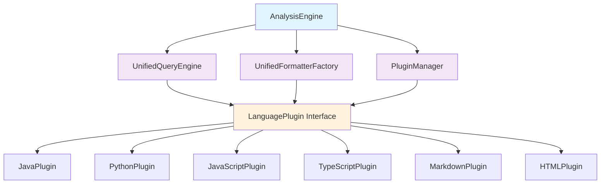

# tree-sitter-analyzer 実装ガイドライン

## 📋 概要

このドキュメントは、tree-sitter-analyzerプロジェクトの実装に関する包括的なガイドラインです。新機能の開発、既存機能の改善、および品質保証のベストプラクティスを提供します。

### 対象読者
- 新規開発者
- 既存開発者
- コントリビューター
- プロジェクトメンテナー

### 前提知識
- Python 3.8+の基本知識
- Tree-sitterの基本概念
- プラグインアーキテクチャの理解

---

## 🏗️ アーキテクチャ概要

### 現在のアーキテクチャ状況

**問題点:**
- 54件の言語固有条件分岐が散在
- プラグインシステムの形骸化
- コアエンジンの責務過多

**移行目標:**
- プラグインベースアーキテクチャへの完全移行
- 条件分岐の完全除去
- 統一インターフェースの実装

### 新アーキテクチャ設計



---

## 🔧 開発環境セットアップ

### 必要な依存関係

```bash
# 基本依存関係
pip install tree-sitter>=0.20.0
pip install tree-sitter-languages>=1.5.0

# 開発依存関係
pip install pytest>=7.0.0
pip install pytest-cov>=4.0.0
pip install black>=22.0.0
pip install flake8>=5.0.0
pip install mypy>=1.0.0

# MCP開発用
pip install mcp>=0.1.0
```

### 開発環境の初期化

```bash
# プロジェクトのクローン
git clone https://github.com/your-org/tree-sitter-analyzer.git
cd tree-sitter-analyzer

# 仮想環境の作成
python -m venv venv
source venv/bin/activate  # Windows: venv\Scripts\activate

# 依存関係のインストール
pip install -e ".[dev]"

# プリコミットフックの設定
pre-commit install

# テストの実行
pytest tests/
```

---

## 📝 コーディング規約

### Python コーディングスタイル

#### 1. 基本スタイル
- **PEP 8**準拠
- **Black**による自動フォーマット
- **行長**: 88文字以内
- **インデント**: スペース4文字

#### 2. 命名規約

```python
# クラス名: PascalCase
class LanguagePlugin:
    pass

# 関数名・変数名: snake_case
def analyze_code_structure():
    file_path = "example.py"

# 定数: UPPER_SNAKE_CASE
MAX_FILE_SIZE = 1024 * 1024

# プライベートメソッド: _で開始
def _internal_method(self):
    pass

# 抽象メソッド: abstractmethod デコレータ
@abstractmethod
def process_node(self, node: Node) -> List[Element]:
    pass
```

#### 3. 型ヒント

```python
from typing import Dict, List, Optional, Union, Any
from pathlib import Path

# 必須: 関数の引数と戻り値
def analyze_file(file_path: Path, options: Dict[str, Any]) -> Optional[AnalysisResult]:
    pass

# 推奨: クラス属性
class PluginManager:
    plugins: Dict[str, LanguagePlugin]
    cache: Dict[str, Any]
    
    def __init__(self) -> None:
        self.plugins = {}
        self.cache = {}
```

#### 4. ドキュメンテーション

```python
def extract_functions(self, tree: Tree, source_code: str) -> List[ModelFunction]:
    """ソースコードから関数定義を抽出します。
    
    Args:
        tree: Tree-sitterで解析されたAST
        source_code: 元のソースコード文字列
        
    Returns:
        抽出された関数のリスト
        
    Raises:
        ParseError: ASTの解析に失敗した場合
        UnsupportedLanguageError: 対応していない言語の場合
        
    Example:
        >>> plugin = PythonPlugin()
        >>> functions = plugin.extract_functions(tree, code)
        >>> print(f"Found {len(functions)} functions")
    """
    pass
```

### エラーハンドリング

#### 1. カスタム例外の定義

```python
# tree_sitter_analyzer/exceptions.py
class TreeSitterAnalyzerError(Exception):
    """基底例外クラス"""
    pass

class UnsupportedLanguageError(TreeSitterAnalyzerError):
    """対応していない言語エラー"""
    pass

class ParseError(TreeSitterAnalyzerError):
    """解析エラー"""
    pass

class PluginError(TreeSitterAnalyzerError):
    """プラグインエラー"""
    pass
```

#### 2. エラーハンドリングパターン

```python
import logging
from typing import Optional

logger = logging.getLogger(__name__)

def safe_analyze_file(file_path: str) -> Optional[AnalysisResult]:
    """安全なファイル解析（例外を捕捉）"""
    try:
        return analyze_file(file_path)
    except UnsupportedLanguageError as e:
        logger.warning(f"Unsupported language for {file_path}: {e}")
        return None
    except ParseError as e:
        logger.error(f"Parse error in {file_path}: {e}")
        return None
    except Exception as e:
        logger.exception(f"Unexpected error analyzing {file_path}: {e}")
        return None
```

---

## 🔌 プラグイン開発ガイドライン

### プラグインインターフェース

#### 1. 基本インターフェース

```python
from abc import ABC, abstractmethod
from typing import Dict, List, Any
from tree_sitter import Tree, Node

class LanguagePlugin(ABC):
    """言語プラグインの基底クラス"""
    
    @abstractmethod
    def get_language_name(self) -> str:
        """言語名を返す"""
        pass
    
    @abstractmethod
    def get_file_extensions(self) -> List[str]:
        """対応ファイル拡張子のリストを返す"""
        pass
    
    @abstractmethod
    def is_applicable(self, file_path: str) -> bool:
        """ファイルがこのプラグインで処理可能かを判定"""
        pass
    
    @abstractmethod
    def get_query_definitions(self) -> Dict[str, str]:
        """Tree-sitterクエリ定義を返す"""
        pass
    
    @abstractmethod
    def create_formatter(self, format_type: str) -> 'BaseFormatter':
        """指定されたフォーマット種別のフォーマッターを作成"""
        pass
    
    @abstractmethod
    def analyze_file(self, file_path: str, request: 'AnalysisRequest') -> 'AnalysisResult':
        """ファイルを解析して結果を返す"""
        pass
```

#### 2. 拡張インターフェース

```python
class EnhancedLanguagePlugin(LanguagePlugin):
    """拡張言語プラグインインターフェース"""
    
    def get_plugin_info(self) -> Dict[str, Any]:
        """プラグイン情報を返す"""
        return {
            "name": self.get_language_name(),
            "version": "1.0.0",
            "extensions": self.get_file_extensions(),
            "features": self.get_supported_features(),
            "author": "Unknown",
            "description": f"Plugin for {self.get_language_name()} language analysis"
        }
    
    def get_supported_features(self) -> List[str]:
        """サポートする機能のリストを返す"""
        return ["functions", "classes", "variables", "imports"]
    
    def validate_configuration(self, config: Dict[str, Any]) -> bool:
        """設定の妥当性を検証"""
        return True
    
    def get_performance_metrics(self) -> Dict[str, Any]:
        """パフォーマンスメトリクスを返す"""
        return {
            "avg_parse_time": 0.0,
            "cache_hit_rate": 0.0,
            "error_rate": 0.0
        }
```

### プラグイン実装パターン

#### 1. 基本実装テンプレート

```python
from tree_sitter_analyzer.plugins.base import EnhancedLanguagePlugin
from tree_sitter_analyzer.formatters.base import BaseFormatter
from tree_sitter_analyzer.models import AnalysisRequest, AnalysisResult
import tree_sitter_python as ts_python

class PythonPlugin(EnhancedLanguagePlugin):
    """Python言語プラグイン"""
    
    def __init__(self):
        self.language = ts_python.language()
        self.parser = tree_sitter.Parser()
        self.parser.set_language(self.language)
        self._query_cache = {}
    
    def get_language_name(self) -> str:
        return "python"
    
    def get_file_extensions(self) -> List[str]:
        return [".py", ".pyi", ".pyw"]
    
    def is_applicable(self, file_path: str) -> bool:
        return any(file_path.endswith(ext) for ext in self.get_file_extensions())
    
    def get_query_definitions(self) -> Dict[str, str]:
        return {
            "functions": """
                (function_definition
                    name: (identifier) @function.name
                ) @function.definition
            """,
            "classes": """
                (class_definition
                    name: (identifier) @class.name
                ) @class.definition
            """,
            "variables": """
                (assignment
                    left: (identifier) @variable.name
                ) @variable.definition
            """,
            "imports": """
                [
                    (import_statement
                        name: (dotted_name) @import.name
                    )
                    (import_from_statement
                        module_name: (dotted_name) @import.module
                        name: (dotted_name) @import.name
                    )
                ] @import.statement
            """
        }
    
    def create_formatter(self, format_type: str) -> BaseFormatter:
        from tree_sitter_analyzer.formatters.python import PythonFormatter
        return PythonFormatter(format_type)
    
    def analyze_file(self, file_path: str, request: AnalysisRequest) -> AnalysisResult:
        # 実装詳細は後述
        pass
```

#### 2. クエリ実行の実装

```python
def _execute_query(self, query_key: str, tree: Tree, source_code: str) -> List[QueryResult]:
    """クエリを実行して結果を返す"""
    
    # クエリ定義の取得
    query_definitions = self.get_query_definitions()
    if query_key not in query_definitions:
        raise UnsupportedQueryError(f"Query '{query_key}' not supported")
    
    # クエリのコンパイル（キャッシュ利用）
    if query_key not in self._query_cache:
        query_string = query_definitions[query_key]
        self._query_cache[query_key] = self.language.query(query_string)
    
    query = self._query_cache[query_key]
    
    # クエリの実行
    captures = query.captures(tree.root_node)
    results = []
    
    for node, capture_name in captures:
        result = QueryResult(
            node_type=node.type,
            name=self._extract_name(node, source_code),
            start_line=node.start_point[0] + 1,
            end_line=node.end_point[0] + 1,
            start_column=node.start_point[1],
            end_column=node.end_point[1],
            content=source_code[node.start_byte:node.end_byte],
            metadata={
                "capture_name": capture_name,
                "language": self.get_language_name()
            }
        )
        results.append(result)
    
    return results
```

---

## 🧪 テスト実装ガイドライン

### テスト構造

#### 1. テストディレクトリ構成

```
tests/
├── unit/                    # 単体テスト
│   ├── test_plugins/
│   ├── test_formatters/
│   ├── test_core/
│   └── test_interfaces/
├── integration/             # 統合テスト
│   ├── test_end_to_end/
│   ├── test_plugin_integration/
│   └── test_mcp_integration/
├── snapshots/              # スナップショットテスト
│   ├── python/
│   ├── javascript/
│   └── java/
├── fixtures/               # テストデータ
│   ├── sample_files/
│   └── expected_outputs/
└── conftest.py            # pytest設定
```

#### 2. プラグインテストテンプレート

```python
import pytest
from pathlib import Path
from tree_sitter_analyzer.plugins.python import PythonPlugin
from tree_sitter_analyzer.models import AnalysisRequest

class TestPythonPlugin:
    """Pythonプラグインのテストクラス"""
    
    @pytest.fixture
    def plugin(self):
        return PythonPlugin()
    
    @pytest.fixture
    def sample_python_file(self, tmp_path):
        content = '''
def hello_world():
    """Hello world function"""
    print("Hello, World!")

class Calculator:
    def add(self, a, b):
        return a + b
        
import os
from typing import List
        '''
        file_path = tmp_path / "sample.py"
        file_path.write_text(content)
        return str(file_path)
    
    def test_language_name(self, plugin):
        assert plugin.get_language_name() == "python"
    
    def test_file_extensions(self, plugin):
        extensions = plugin.get_file_extensions()
        assert ".py" in extensions
        assert ".pyi" in extensions
    
    def test_is_applicable(self, plugin):
        assert plugin.is_applicable("test.py") is True
        assert plugin.is_applicable("test.js") is False
    
    def test_query_definitions(self, plugin):
        queries = plugin.get_query_definitions()
        assert "functions" in queries
        assert "classes" in queries
        assert "variables" in queries
        assert "imports" in queries
    
    def test_analyze_file_functions(self, plugin, sample_python_file):
        request = AnalysisRequest(query_types=["functions"])
        result = plugin.analyze_file(sample_python_file, request)
        
        functions = result.functions
        assert len(functions) == 2  # hello_world, add
        
        hello_func = next(f for f in functions if f.name == "hello_world")
        assert hello_func.start_line == 2
        assert "Hello world function" in hello_func.docstring
    
    def test_analyze_file_classes(self, plugin, sample_python_file):
        request = AnalysisRequest(query_types=["classes"])
        result = plugin.analyze_file(sample_python_file, request)
        
        classes = result.classes
        assert len(classes) == 1
        assert classes[0].name == "Calculator"
    
    @pytest.mark.parametrize("query_type", ["functions", "classes", "variables", "imports"])
    def test_query_execution(self, plugin, sample_python_file, query_type):
        request = AnalysisRequest(query_types=[query_type])
        result = plugin.analyze_file(sample_python_file, request)
        assert result is not None
```

#### 3. スナップショットテスト

```python
import pytest
from tree_sitter_analyzer.testing.snapshot import SnapshotTester

class TestPythonPluginSnapshots:
    """Pythonプラグインのスナップショットテスト"""
    
    @pytest.fixture
    def snapshot_tester(self):
        return SnapshotTester("python")
    
    def test_function_extraction_snapshot(self, snapshot_tester):
        """関数抽出のスナップショットテスト"""
        sample_code = '''
def simple_function():
    pass

async def async_function(param: str) -> bool:
    return True

def function_with_decorator():
    @property
    def inner():
        pass
    return inner
        '''
        
        result = snapshot_tester.analyze_code(sample_code, ["functions"])
        snapshot_tester.assert_matches_snapshot("function_extraction", result)
    
    def test_class_extraction_snapshot(self, snapshot_tester):
        """クラス抽出のスナップショットテスト"""
        sample_code = '''
class SimpleClass:
    pass

class InheritedClass(SimpleClass):
    def __init__(self):
        super().__init__()
    
    @classmethod
    def class_method(cls):
        return cls()

@dataclass
class DataClass:
    name: str
    value: int = 0
        '''
        
        result = snapshot_tester.analyze_code(sample_code, ["classes"])
        snapshot_tester.assert_matches_snapshot("class_extraction", result)
```

### パフォーマンステスト

```python
import pytest
import time
from pathlib import Path

class TestPerformance:
    """パフォーマンステスト"""
    
    @pytest.mark.performance
    def test_large_file_analysis(self, plugin):
        """大きなファイルの解析性能テスト"""
        # 大きなファイルを生成
        large_content = self._generate_large_python_file(1000)  # 1000関数
        
        start_time = time.time()
        result = plugin.analyze_code(large_content, ["functions"])
        end_time = time.time()
        
        execution_time = end_time - start_time
        assert execution_time < 5.0  # 5秒以内
        assert len(result.functions) == 1000
    
    @pytest.mark.performance
    def test_memory_usage(self, plugin):
        """メモリ使用量テスト"""
        import psutil
        import os
        
        process = psutil.Process(os.getpid())
        initial_memory = process.memory_info().rss
        
        # 複数ファイルを解析
        for i in range(100):
            content = self._generate_python_file(10)
            plugin.analyze_code(content, ["functions", "classes"])
        
        final_memory = process.memory_info().rss
        memory_increase = final_memory - initial_memory
        
        # メモリ増加が100MB以下であることを確認
        assert memory_increase < 100 * 1024 * 1024
```

---

## 🔄 継続的インテグレーション

### GitHub Actions設定

```yaml
# .github/workflows/ci.yml
name: CI

on:
  push:
    branches: [ main, develop ]
  pull_request:
    branches: [ main ]

jobs:
  test:
    runs-on: ubuntu-latest
    strategy:
      matrix:
        python-version: [3.8, 3.9, "3.10", "3.11"]
    
    steps:
    - uses: actions/checkout@v3
    
    - name: Set up Python ${{ matrix.python-version }}
      uses: actions/setup-python@v4
      with:
        python-version: ${{ matrix.python-version }}
    
    - name: Install dependencies
      run: |
        python -m pip install --upgrade pip
        pip install -e ".[dev]"
    
    - name: Lint with flake8
      run: |
        flake8 tree_sitter_analyzer tests
    
    - name: Type check with mypy
      run: |
        mypy tree_sitter_analyzer
    
    - name: Test with pytest
      run: |
        pytest tests/ --cov=tree_sitter_analyzer --cov-report=xml
    
    - name: Upload coverage to Codecov
      uses: codecov/codecov-action@v3
      with:
        file: ./coverage.xml

  snapshot-test:
    runs-on: ubuntu-latest
    steps:
    - uses: actions/checkout@v3
    
    - name: Set up Python
      uses: actions/setup-python@v4
      with:
        python-version: "3.10"
    
    - name: Install dependencies
      run: |
        python -m pip install --upgrade pip
        pip install -e ".[dev]"
    
    - name: Run snapshot tests
      run: |
        pytest tests/snapshots/ --snapshot-update
    
    - name: Check for snapshot changes
      run: |
        git diff --exit-code tests/snapshots/
```

---

## 📊 品質メトリクス

### コード品質指標

#### 1. カバレッジ目標
- **単体テスト**: 90%以上
- **統合テスト**: 80%以上
- **全体**: 85%以上

#### 2. 複雑度指標
- **関数の循環的複雑度**: 10以下
- **クラスの複雑度**: 50以下
- **ファイルサイズ**: 500行以下（特別な理由がない限り）

#### 3. パフォーマンス指標
- **小ファイル解析**: 100ms以下
- **中ファイル解析**: 1秒以下
- **大ファイル解析**: 5秒以下
- **メモリ使用量**: 100MB以下（通常使用時）

### 品質チェックツール

```bash
# コード品質チェック
flake8 tree_sitter_analyzer/
black --check tree_sitter_analyzer/
mypy tree_sitter_analyzer/

# セキュリティチェック
bandit -r tree_sitter_analyzer/

# 複雑度チェック
radon cc tree_sitter_analyzer/ -a

# 依存関係チェック
safety check
```

---

## 🚀 デプロイメントガイドライン

### リリースプロセス

#### 1. バージョニング
- **セマンティックバージョニング**（SemVer）を使用
- `MAJOR.MINOR.PATCH`形式
- 破壊的変更: MAJOR
- 新機能追加: MINOR
- バグ修正: PATCH

#### 2. リリース手順

```bash
# 1. 開発ブランチでの作業完了確認
git checkout develop
git pull origin develop

# 2. リリースブランチの作成
git checkout -b release/v1.2.0

# 3. バージョン更新
# pyproject.toml, __init__.py等のバージョンを更新

# 4. CHANGELOG.mdの更新
# 新機能、バグ修正、破壊的変更を記載

# 5. テストの実行
pytest tests/
pytest tests/snapshots/

# 6. リリースブランチのプッシュ
git add .
git commit -m "Prepare release v1.2.0"
git push origin release/v1.2.0

# 7. プルリクエストの作成（develop → main）

# 8. レビューとマージ後、タグの作成
git checkout main
git pull origin main
git tag v1.2.0
git push origin v1.2.0

# 9. PyPIへのリリース（GitHub Actionsで自動化）
```

#### 3. 自動デプロイ設定

```yaml
# .github/workflows/release.yml
name: Release

on:
  push:
    tags:
      - 'v*'

jobs:
  release:
    runs-on: ubuntu-latest
    steps:
    - uses: actions/checkout@v3
    
    - name: Set up Python
      uses: actions/setup-python@v4
      with:
        python-version: "3.10"
    
    - name: Install build dependencies
      run: |
        python -m pip install --upgrade pip
        pip install build twine
    
    - name: Build package
      run: python -m build
    
    - name: Publish to PyPI
      env:
        TWINE_USERNAME: __token__
        TWINE_PASSWORD: ${{ secrets.PYPI_API_TOKEN }}
      run: twine upload dist/*
    
    - name: Create GitHub Release
      uses: actions/create-release@v1
      env:
        GITHUB_TOKEN: ${{ secrets.GITHUB_TOKEN }}
      with:
        tag_name: ${{ github.ref }}
        release_name: Release ${{ github.ref }}
        draft: false
        prerelease: false
```

---

## 📚 参考資料

### 内部ドキュメント
- [新言語プラグイン追加ガイド](NEW_LANGUAGE_PLUGIN_GUIDE.md)
- [品質保証ガイドライン](QUALITY_ASSURANCE_GUIDE.md)
- [移行実装ガイド](MIGRATION_IMPLEMENTATION_GUIDE.md)
- [トラブルシューティングガイド](TROUBLESHOOTING_GUIDE.md)

### 外部リソース
- [Tree-sitter公式ドキュメント](https://tree-sitter.github.io/tree-sitter/)
- [Python PEP 8](https://pep8.org/)
- [セマンティックバージョニング](https://semver.org/)
- [pytest公式ドキュメント](https://docs.pytest.org/)

---

## 🤝 コントリビューション

### プルリクエストガイドライン

1. **ブランチ命名規則**
   - `feature/機能名`
   - `bugfix/バグ修正内容`
   - `refactor/リファクタリング内容`

2. **コミットメッセージ**
   - 英語で記述
   - 動詞で開始（Add, Fix, Update, Remove等）
   - 50文字以内の簡潔な説明

3. **プルリクエスト要件**
   - テストの追加・更新
   - ドキュメントの更新
   - コードレビューの通過
   - CIの成功

### コードレビューチェックリスト

- [ ] コーディング規約の遵守
- [ ] 適切なテストの追加
- [ ] ドキュメントの更新
- [ ] パフォーマンスへの影響確認
- [ ] セキュリティ考慮事項の確認
- [ ] 後方互換性の維持

---

*最終更新: 2025年10月12日*
*作成者: tree-sitter-analyzer開発チーム*