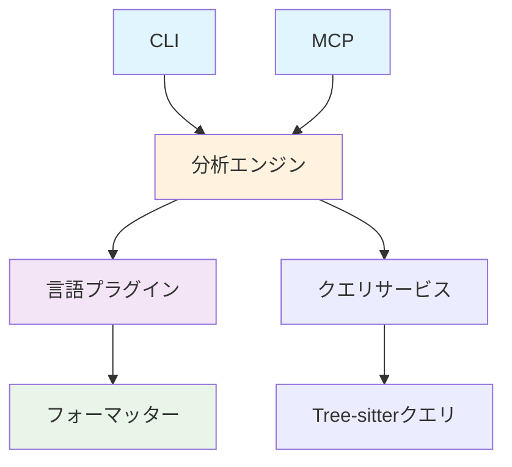

# 📁 Tree-sitter Analyzer プロジェクト構造詳細

> **プロジェクトの完全な構造とコンポーネントの詳細解説**

## 📋 目次

- [1. 🎯 概要](#1--概要)
- [2. 📁 ルートディレクトリ構造](#2--ルートディレクトリ構造)
- [3. 🏗️ メインパッケージ詳細](#3-️-メインパッケージ詳細)
- [4. 🧪 テスト構造](#4--テスト構造)
- [5. 📚 ドキュメント構造](#5--ドキュメント構造)
- [6. 🔧 設定ファイル](#6--設定ファイル)
- [7. 📊 コンポーネント統計](#7--コンポーネント統計)

---

## 1. 🎯 概要

Tree-sitter Analyzerは、**モジュラー設計**と**プラグインアーキテクチャ**を採用したエンタープライズグレードのコード解析ツールです。

### 設計原則
- **単一責任原則**: 各モジュールは明確な責務を持つ
- **開放閉鎖原則**: 拡張に開放、修正に閉鎖
- **依存性逆転**: 高レベルモジュールは低レベルモジュールに依存しない
- **プラグイン指向**: 新機能は既存コードを変更せずに追加可能

---

## 2. 📁 ルートディレクトリ構造

```
tree-sitter-analyzer/
├── 📁 tree_sitter_analyzer/          # メインパッケージ (114ファイル)
├── 📁 tests/                         # テストスイート (159ファイル)
├── 📁 docs/                          # ドキュメント (5ファイル)
├── 📁 training/                      # トレーニング資料 (19ファイル)
├── 📁 examples/                      # サンプルファイル (8ファイル)
├── 📁 scripts/                       # ビルド・リリーススクリプト (5ファイル)
├── 📁 test_snapshots/                # スナップショットテスト
├── 📁 .github/                       # GitHub設定
├── 📁 .roo/                          # Roo設定
├── 📁 .kiro/                         # Kiro設定
│
├── 📄 pyproject.toml                 # プロジェクト設定
├── 📄 pytest.ini                     # テスト設定
├── 📄 .gitignore                     # Git除外設定
├── 📄 .pre-commit-config.yaml        # プリコミット設定
│
├── 📄 README.md                      # プロジェクト説明 (英語)
├── 📄 README_ja.md                   # プロジェクト説明 (日本語)
├── 📄 README_zh.md                   # プロジェクト説明 (中国語)
├── 📄 CONTRIBUTING.md                # コントリビューションガイド
├── 📄 CHANGELOG.md                   # 変更履歴
│
├── 📄 AI_COLLABORATION_GUIDE.md      # AI協作ガイド
├── 📄 LLM_CODING_GUIDELINES.md       # LLM開発ガイドライン
├── 📄 CODE_STYLE_GUIDE.md            # コードスタイルガイド
├── 📄 LANGUAGE_GUIDELINES.md         # 言語ガイドライン
├── 📄 DEPLOYMENT_GUIDE.md            # デプロイメントガイド
├── 📄 PYPI_RELEASE_GUIDE.md          # PyPIリリースガイド
├── 📄 MCP_SETUP_DEVELOPERS.md        # MCP開発者セットアップ
├── 📄 MCP_SETUP_USERS.md             # MCPユーザーセットアップ
├── 📄 PROJECT_ROOT_CONFIG.md         # プロジェクトルート設定
│
├── 📄 GITFLOW.md                     # Gitワークフロー (英語)
├── 📄 GITFLOW_ja.md                  # Gitワークフロー (日本語)
├── 📄 GITFLOW_zh.md                  # Gitワークフロー (中国語)
│
├── 📄 check_quality.py               # 品質チェックスクリプト
├── 📄 llm_code_checker.py            # LLMコードチェッカー
├── 📄 start_mcp_server.py            # MCPサーバー起動スクリプト
├── 📄 build_standalone.py            # スタンドアロンビルド
│
└── 📄 CURRENT_ARCHITECTURE_ANALYSIS_REPORT.md  # アーキテクチャ分析レポート
```

---

## 3. 🏗️ メインパッケージ詳細

### 3.1 パッケージルート

```
tree_sitter_analyzer/
├── 📄 __init__.py                    # パッケージ初期化 (3,449 bytes)
├── 📄 __main__.py                    # モジュールエントリポイント (228 bytes)
├── 📄 api.py                         # 公開API (22,753 bytes)
├── 📄 cli_main.py                    # CLIメインエントリ (10,374 bytes)
├── 📄 models.py                      # データモデル (21,062 bytes)
├── 📄 exceptions.py                  # カスタム例外 (11,615 bytes)
├── 📄 constants.py                   # 定数定義 (1,889 bytes)
│
├── 📄 utils.py                       # 汎用ユーティリティ (11,871 bytes)
├── 📄 file_handler.py                # ファイル処理 (6,689 bytes)
├── 📄 encoding_utils.py              # エンコーディング処理 (14,805 bytes)
├── 📄 output_manager.py              # 出力管理 (8,260 bytes)
├── 📄 table_formatter.py             # テーブルフォーマット (28,577 bytes)
├── 📄 debug_utils.py                 # デバッグユーティリティ (12,642 bytes)
│
├── 📄 language_detector.py           # 言語検出 (14,032 bytes)
├── 📄 language_loader.py             # 言語ローダー (9,002 bytes)
├── 📄 query_loader.py                # クエリローダー (10,152 bytes)
└── 📄 project_detector.py            # プロジェクト検出 (9,430 bytes)
```

### 3.2 コアエンジン (`core/`)

```
core/
├── 📄 __init__.py                    # コア初期化 (516 bytes)
├── 📄 analysis_engine.py             # 統合分析エンジン (18,936 bytes)
│   ├── 🏗️ UnifiedAnalysisEngine     # メイン分析エンジン
│   ├── 📊 PerformanceMonitor        # パフォーマンス監視
│   ├── 🔧 PerformanceContext        # パフォーマンスコンテキスト
│   └── 🚫 UnsupportedLanguageError  # 未サポート言語例外
│
├── 📄 engine.py                      # レガシーエンジン (18,357 bytes)
├── 📄 parser.py                      # パーサー (9,293 bytes)
├── 📄 query.py                       # クエリ実行 (16,397 bytes)
├── 📄 query_service.py               # クエリサービス (15,166 bytes)
├── 📄 query_filter.py                # クエリフィルター (6,591 bytes)
└── 📄 cache_service.py               # キャッシュサービス (9,762 bytes)
```

### 3.3 言語プラグイン (`languages/`)

```
languages/
├── 📄 __init__.py                    # 言語初期化 (340 bytes)
├── 📄 java_plugin.py                 # Java言語プラグイン (54,433 bytes)
├── 📄 python_plugin.py               # Python言語プラグイン (54,267 bytes)
├── 📄 javascript_plugin.py           # JavaScript言語プラグイン (57,090 bytes)
├── 📄 typescript_plugin.py           # TypeScript言語プラグイン (67,885 bytes)
├── 📄 markdown_plugin.py             # Markdown言語プラグイン (72,762 bytes)
└── 📄 html_plugin.py                 # HTML言語プラグイン (30,224 bytes)
```

#### 言語プラグイン統計

| 言語 | ファイルサイズ | 複雑度 | 状態 | 主要機能 |
|------|---------------|--------|------|----------|
| **Markdown** | 72,762 bytes | 高 | ⚠️ 要リファクタリング | ヘッダー、コードブロック、リンク、画像、テーブル |
| **TypeScript** | 67,885 bytes | 高 | 🟡 大規模 | インターフェース、型、デコレーター、TSX/JSX |
| **JavaScript** | 57,090 bytes | 中 | 🟡 大規模 | ES6+、React/Vue/Angular、JSX |
| **Java** | 54,433 bytes | 中 | 🟡 大規模 | Spring、JPA、エンタープライズ機能 |
| **Python** | 54,267 bytes | 中 | 🟡 大規模 | 型アノテーション、デコレーター |
| **HTML** | 30,224 bytes | 低 | 🟢 開発中 | HTML5セマンティックタグ、属性、埋め込み |

### 3.4 Tree-sitterクエリ (`queries/`)

```
queries/
├── 📄 __init__.py                    # クエリ初期化 (714 bytes)
├── 📄 java.py                        # Javaクエリ (12,388 bytes)
├── 📄 python.py                      # Pythonクエリ (26,116 bytes)
├── 📄 javascript.py                  # JavaScriptクエリ (23,104 bytes)
├── 📄 typescript.py                  # TypeScriptクエリ (22,527 bytes)
├── 📄 markdown.py                    # Markdownクエリ (10,882 bytes)
└── 📄 html.py                        # HTMLクエリ (17,094 bytes)
```

### 3.5 フォーマッター (`formatters/`)

```
formatters/
├── 📄 __init__.py                    # フォーマッター初期化 (31 bytes)
├── 📄 base_formatter.py              # ベースフォーマッター (11,625 bytes)
├── 📄 formatter_factory.py           # フォーマッターファクトリー (2,517 bytes)
├── 📄 language_formatter_factory.py  # 言語フォーマッターファクトリー (2,435 bytes)
├── 📄 java_formatter.py              # Javaフォーマッター (13,223 bytes)
├── 📄 python_formatter.py            # Pythonフォーマッター (17,224 bytes)
├── 📄 javascript_formatter.py        # JavaScriptフォーマッター (21,345 bytes)
├── 📄 typescript_formatter.py        # TypeScriptフォーマッター (19,402 bytes)
├── 📄 markdown_formatter.py          # Markdownフォーマッター (26,049 bytes)
└── 📄 html_formatter.py              # HTMLフォーマッター (20,085 bytes)
```

### 3.6 CLI (`cli/`)

```
cli/
├── 📄 __init__.py                    # CLI初期化 (871 bytes)
├── 📄 __main__.py                    # CLIメインエントリ (218 bytes)
├── 📄 info_commands.py               # 情報コマンド (4,432 bytes)
│
└── 📁 commands/                      # コマンド実装
    ├── 📄 __init__.py                # コマンド初期化 (671 bytes)
    ├── 📄 base_command.py            # ベースコマンド (6,611 bytes)
    ├── 📄 default_command.py         # デフォルトコマンド (524 bytes)
    ├── 📄 table_command.py           # テーブルコマンド (23,723 bytes)
    ├── 📄 summary_command.py         # サマリーコマンド (6,323 bytes)
    ├── 📄 structure_command.py       # 構造コマンド (7,984 bytes)
    ├── 📄 advanced_command.py        # 高度コマンド (11,434 bytes)
    ├── 📄 query_command.py           # クエリコマンド (4,003 bytes)
    ├── 📄 partial_read_command.py    # 部分読み取りコマンド (4,619 bytes)
    ├── 📄 signature_parsers.py       # シグネチャパーサー (17,436 bytes)
    ├── 📄 list_files_cli.py          # ファイル一覧CLI (3,842 bytes)
    ├── 📄 search_content_cli.py      # コンテンツ検索CLI (5,093 bytes)
    └── 📄 find_and_grep_cli.py       # 検索・抽出CLI (6,290 bytes)
```

### 3.7 MCP統合 (`mcp/`)

```
mcp/
├── 📄 __init__.py                    # MCP初期化 (944 bytes)
├── 📄 server.py                      # MCPサーバー (32,410 bytes)
│
├── 📁 tools/                         # MCPツール (12ツール)
│   ├── 📄 __init__.py                # ツール初期化 (739 bytes)
│   ├── 📄 base_tool.py               # ベースツール (3,546 bytes)
│   ├── 📄 analyze_scale_tool.py      # スケール分析ツール (28,087 bytes)
│   ├── 📄 table_format_tool.py       # テーブルフォーマットツール (20,885 bytes)
│   ├── 📄 read_partial_tool.py       # 部分読み取りツール (14,868 bytes)
│   ├── 📄 query_tool.py              # クエリツール (15,057 bytes)
│   ├── 📄 universal_analyze_tool.py  # 汎用分析ツール (25,084 bytes)
│   ├── 📄 list_files_tool.py         # ファイル一覧ツール (17,914 bytes)
│   ├── 📄 search_content_tool.py     # コンテンツ検索ツール (32,086 bytes)
│   ├── 📄 find_and_grep_tool.py      # 検索・抽出ツール (31,130 bytes)
│   ├── 📄 language_info_tool.py      # 言語情報ツール (16,307 bytes)
│   ├── 📄 fd_rg_utils.py             # fd/ripgrepユーティリティ (17,749 bytes)
│   └── 📄 analyze_scale_tool_cli_compatible.py  # CLI互換ツール (8,997 bytes)
│
├── 📁 resources/                     # MCPリソース
│   ├── 📄 __init__.py                # リソース初期化 (1,367 bytes)
│   ├── 📄 code_file_resource.py      # コードファイルリソース (6,166 bytes)
│   └── 📄 project_stats_resource.py  # プロジェクト統計リソース (20,360 bytes)
│
└── 📁 utils/                         # MCPユーティリティ
    ├── 📄 __init__.py                # ユーティリティ初期化 (3,126 bytes)
    ├── 📄 error_handler.py           # エラーハンドラー (18,404 bytes)
    ├── 📄 file_output_manager.py     # ファイル出力マネージャー (9,204 bytes)
    ├── 📄 path_resolver.py           # パス解決 (15,006 bytes)
    ├── 📄 search_cache.py            # 検索キャッシュ (12,991 bytes)
    └── 📄 gitignore_detector.py      # .gitignore検出 (11,942 bytes)
```

### 3.8 インターフェース (`interfaces/`)

```
interfaces/
├── 📄 __init__.py                    # インターフェース初期化 (271 bytes)
├── 📄 cli.py                         # CLI インターフェース (17,100 bytes)
├── 📄 cli_adapter.py                 # CLI アダプター (11,402 bytes)
├── 📄 mcp_server.py                  # MCPサーバーインターフェース (16,510 bytes)
└── 📄 mcp_adapter.py                 # MCP アダプター (7,707 bytes)
```

### 3.9 プラグインシステム (`plugins/`)

```
plugins/
├── 📄 __init__.py                    # プラグイン初期化 (10,326 bytes)
├── 📄 base.py                        # プラグインベースクラス (17,167 bytes)
└── 📄 manager.py                     # プラグインマネージャー (12,535 bytes)
```

### 3.10 セキュリティ (`security/`)

```
security/
├── 📄 __init__.py                    # セキュリティ初期化 (623 bytes)
├── 📄 boundary_manager.py            # 境界管理 (9,347 bytes)
├── 📄 regex_checker.py               # 正規表現チェッカー (9,616 bytes)
└── 📄 validator.py                   # バリデーター (9,809 bytes)
```

---

## 4. 🧪 テスト構造

### 4.1 テストディレクトリ概要

```
tests/
├── 📄 __init__.py                    # テスト初期化
├── 📄 conftest.py                    # pytest設定
│
├── 📄 test_api.py                    # API テスト
├── 📄 test_cli.py                    # CLI テスト
├── 📄 test_cli_comprehensive.py      # CLI 包括テスト
├── 📄 test_utils.py                  # ユーティリティテスト
├── 📄 test_language_detector.py      # 言語検出テスト
├── 📄 test_table_formatter.py        # テーブルフォーマッターテスト
│
├── 📁 test_core/                     # コアテスト
│   ├── 📄 test_analysis_engine.py    # 分析エンジンテスト
│   ├── 📄 test_cache_service.py      # キャッシュサービステスト
│   ├── 📄 test_engine.py             # エンジンテスト
│   ├── 📄 test_parser.py             # パーサーテスト
│   └── 📄 test_query.py              # クエリテスト
│
├── 📁 test_languages/                # 言語プラグインテスト
│   └── 📄 test_html_plugin_comprehensive.py  # HTML プラグインテスト
│
├── 📁 test_mcp/                      # MCP テスト
│   ├── 📄 __init__.py
│   ├── 📄 test_server.py             # サーバーテスト
│   └── 📄 test_tools_integration.py  # ツール統合テスト
│
└── 📁 test_snapshots/                # スナップショットテスト
    ├── 📄 README.md                  # スナップショットテストガイド
    ├── 📁 config/                    # テスト設定
    ├── 📁 baselines/                 # ベースライン
    └── 📁 current/                   # 現在の結果
```

### 4.2 テスト統計

| テストカテゴリ | ファイル数 | 主要テスト内容 |
|---------------|-----------|---------------|
| **コアテスト** | 5 | 分析エンジン、パーサー、クエリ |
| **言語テスト** | 15+ | 各言語プラグインの機能 |
| **MCPテスト** | 10+ | MCP統合、ツール、リソース |
| **CLIテスト** | 8+ | コマンドライン機能 |
| **統合テスト** | 20+ | エンドツーエンド機能 |
| **回帰テスト** | 5+ | スナップショットテスト |

---

## 5. 📚 ドキュメント構造

### 5.1 ドキュメントディレクトリ

```
docs/
├── 📄 api.md                         # API ドキュメント
├── 📄 mcp_fd_rg_design.md            # MCP fd/rg 設計
├── 📄 GITFLOW_BEST_PRACTICES.md      # Gitflow ベストプラクティス
├── 📄 RELEASE_EXECUTION_GUIDE.md     # リリース実行ガイド
├── 📄 SNAPSHOT_TESTING_GUIDE.md      # スナップショットテストガイド
├── 📄 DEVELOPER_GUIDE.md             # 開発者ガイド (新規作成)
├── 📄 PROJECT_STRUCTURE.md           # プロジェクト構造 (このファイル)
├── 📄 IMPLEMENTATION_RULES.md        # 実装ルール (作成予定)
├── 📄 ARCHITECTURE_DECISIONS.md      # アーキテクチャ決定記録 (作成予定)
└── 📄 LLM_CONTEXT_GUIDE.md           # LLM コンテキストガイド (作成予定)
```

### 5.2 トレーニング資料

```
training/
├── 📄 README.md                      # トレーニング概要
├── 📄 01_onboarding.md               # オンボーディング
├── 📄 02_architecture_map.md         # アーキテクチャマップ
├── 📄 03_cli_cheatsheet.md           # CLI チートシート
├── 📄 04_mcp_cheatsheet.md           # MCP チートシート
├── 📄 05_plugin_tutorial.md          # プラグインチュートリアル
├── 📄 06_quality_workflow.md         # 品質ワークフロー
├── 📄 07_troubleshooting.md          # トラブルシューティング
├── 📄 08_prompt_library.md           # プロンプトライブラリ
├── 📄 09_tasks.md                    # タスク
├── 📄 10_glossary.md                 # 用語集
├── 📄 11_takeover_plan.md            # 引き継ぎ計画
├── 📄 CLI_COMMAND_CORRECTIONS.md     # CLI コマンド修正
└── 📄 IMPROVEMENT_SUMMARY.md         # 改善サマリー
```

---

## 6. 🔧 設定ファイル

### 6.1 プロジェクト設定

| ファイル | 用途 | 重要度 |
|---------|------|--------|
| **pyproject.toml** | プロジェクト設定、依存関係、ビルド設定 | 🔴 必須 |
| **pytest.ini** | テスト設定 | 🟡 重要 |
| **.gitignore** | Git除外設定 | 🟡 重要 |
| **.pre-commit-config.yaml** | プリコミットフック設定 | 🟡 重要 |

### 6.2 品質管理設定

```toml
# pyproject.toml の主要設定
[tool.black]
line-length = 88
target-version = ['py310']

[tool.isort]
profile = "black"
multi_line_output = 3

[tool.ruff]
target-version = "py310"
line-length = 88

[tool.mypy]
python_version = "3.10"
warn_return_any = true
disallow_untyped_defs = true

[tool.coverage.run]
source = ["tree_sitter_analyzer"]
omit = ["*/tests/*"]
```

---

## 7. 📊 コンポーネント統計

### 7.1 ファイルサイズ統計

| コンポーネント | ファイル数 | 総サイズ | 平均サイズ |
|---------------|-----------|----------|-----------|
| **言語プラグイン** | 6 | 336,661 bytes | 56,110 bytes |
| **MCPツール** | 12 | 231,164 bytes | 19,264 bytes |
| **フォーマッター** | 9 | 133,965 bytes | 14,885 bytes |
| **コアエンジン** | 7 | 94,502 bytes | 13,500 bytes |
| **クエリ定義** | 7 | 112,825 bytes | 16,118 bytes |

### 7.2 複雑度分析

| コンポーネント | 複雑度レベル | リファクタリング優先度 |
|---------------|-------------|---------------------|
| **Markdownプラグイン** | 極高 | 🔴 最優先 |
| **TypeScriptプラグイン** | 高 | 🟡 高優先 |
| **JavaScriptプラグイン** | 高 | 🟡 高優先 |
| **MCPサーバー** | 中 | 🟢 中優先 |
| **分析エンジン** | 中 | 🟢 中優先 |

### 7.3 依存関係マップ



---

## 🎯 まとめ

Tree-sitter Analyzerのプロジェクト構造は、以下の特徴を持ちます：

### ✅ 強み
- **モジュラー設計**: 明確な責務分離
- **プラグインアーキテクチャ**: 拡張性の高い設計
- **包括的テスト**: 2,934テストによる品質保証
- **豊富なドキュメント**: 多言語対応の詳細文書

### ⚠️ 改善点
- **大規模プラグイン**: Markdownプラグインの分割が必要
- **条件分岐の集中**: コアエンジンの言語固有ロジック除去
- **依存関係の最適化**: プラグインシステムの活用促進

### 🚀 今後の方向性
- プラグインシステムの実装整合性確保
- 大規模コンポーネントのリファクタリング
- アーキテクチャ決定記録の整備

---

**📁 このドキュメントは、プロジェクトの構造変更に合わせて継続的に更新されます。**