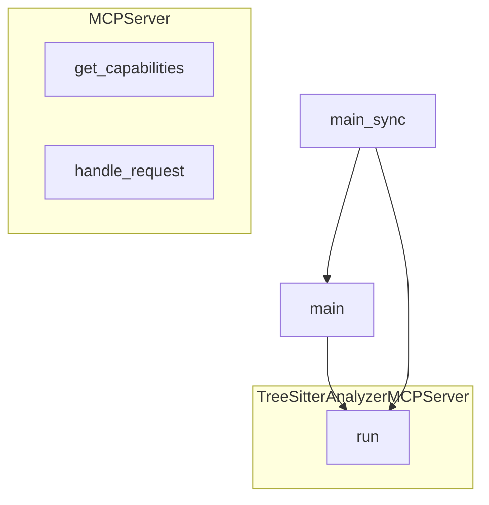

# tree-sitter-analyzer-v2 项目理解报告

> 使用本仓库 MCP 工具（analyze_code_structure / analyze_code_graph / visualize_code_graph）+ MD 模板自分析生成

---

## 一、5分钟快速概览

### 项目定位
- **名称**: tree-sitter-analyzer-v2
- **用途**: 基于 Tree-sitter 的**代码分析 MCP 服务**，提供结构分析、调用图、搜索、质量/债务/安全等能力，并通过 MCP 暴露为工具与资源
- **语言**: Python，约 94 个 .py 文件

### 核心功能一句话
**多语言代码分析引擎 + MCP 服务**：解析源码 → 提取结构/调用关系/复杂度/债务等 → 通过 MCP tools/list、tools/call、resources 对外提供；支持 Python/Java/TypeScript 等，含「瞬间项目理解」等组合能力。

### 规模与入口（工具输出）
| 指标 | 数值 |
|------|------|
| Python 文件数 | ~94 |
| 入口 | `mcp/server.py`（MCP）、`cli/main.py`（CLI）、`api/interface.py`（Python API） |
| 核心类（示例） | MCPServer, TreeSitterAnalyzerMCPServer, InstantUnderstandingEngine |

### 主要依赖
- **tree-sitter**：多语言 AST 解析
- **mcp**：MCP 协议（Server, stdio, Tool, TextContent 等）
- **pathlib / typing / dataclasses**：路径与类型
- 内部：formatters、core.parser、features.*、graph.*、mcp.tools.*

---

## 二、15分钟架构理解

### 1. 目录与模块

```
tree_sitter_analyzer_v2/
├── api/          # Python API 入口 (interface.py)
├── cli/          # 命令行入口 (main.py)
├── core/          # 解析与检测 (parser, detector, exceptions)
├── features/      # 分析能力 (project_knowledge, instant_understanding, refactoring, performance, tech_debt, ...)
├── formatters/    # 输出格式 (toon, markdown, summary, registry)
├── graph/         # 图存储与查询 (builder, advanced_storage, incremental, ...)
├── mcp/           # MCP 服务与工具
│   ├── server.py       # MCPServer, TreeSitterAnalyzerMCPServer
│   ├── resources.py   # KnowledgeResourceProvider
│   └── tools/         # 各 Tool 实现 (analyze, query, instant_understand, ...)
├── security/      # 安全规则与漏洞检测
├── utils/         # 编码、Mermaid、校验等
└── search.py      # 搜索引擎
```

### 2. MCP 服务核心（server.py 工具输出）

| 类/函数 | 行号 | 职责 |
|--------|------|------|
| **MCPServer** | 98-446 | 协议实现：initialize / ping / shutdown / tools/list / tools/call / resources/list、read |
| `__init__` | 115-136 | project_root、ToolRegistry、注册所有工具、ProjectKnowledgeEngine、KnowledgeResourceProvider、_init_knowledge_snapshot |
| `_register_tools` | 138-235 | 注册 AnalyzeTool, QueryTool, InstantUnderstandTool, CompareProjectsTool, ... 等全部 MCP 工具 |
| `handle_request` | 248-314 | 按 method 分发到 _handle_initialize / _handle_tools_list / _handle_tools_call 等 |
| **TreeSitterAnalyzerMCPServer** | 449-531 | 包装 MCP SDK：_register_handlers、run（stdio_server） |
| `main` | 534-556 | 异步入口，调用 run |
| `main_sync` | 559-561 | 同步入口（setuptools 用） |

### 3. 瞬间理解引擎核心（instant_understanding.py 工具输出）

| 类/函数 | 职责 |
|--------|------|
| **InstantUnderstandingEngine** | 组合 ProjectKnowledgeEngine、RefactoringAnalyzer、PerformanceAnalyzer、TechDebtAnalyzer |
| `analyze()` | _collect_analysis_data → _generate_layer1/2/3 → _generate_all_mermaid_diagrams → UnderstandingReport |
| `_collect_analysis_data` | 调用 knowledge_engine.build_snapshot、performance/tech_debt 扫描、统计 |
| `_generate_layer1_overview` | 统计、top_files、tech_stack、entry_points |
| `_generate_layer2_architecture` | module_structure、call_graph、design_patterns、hotspot_chart |
| `_generate_layer3_insights` | performance_analysis、tech_debt_report、refactoring_suggestions、learning_path、health_score |
| `instant_understand()` | 便捷函数：引擎实例化 → analyze → 可选 save_report |

### 4. 调用关系（主流程）

```
main (server.py) / __main__
  → TreeSitterAnalyzerMCPServer.run()
  → stdio_server + 协议处理

请求 tools/call
  → handle_request → _handle_tools_call
  → tool_registry 按 name 取 Tool → execute(arguments)

请求 resources/read
  → _handle_resources_read
  → resource_provider 提供 project knowledge 等

InstantUnderstandTool.execute
  → InstantUnderstandingEngine(project_path).analyze()
  → to_markdown(report) / save_report
```

---

## 三、30分钟深入理解

### 1. 业务与设计要点

- **多语言**：core 层统一 Tree-sitter 解析（core/parser），按语言动态加载；formatters 按语言选格式。
- **工具即能力**：所有分析能力以「MCP Tool」形式注册；新增能力 = 新 Tool 类 + 在 _register_tools 中注册。
- **项目知识**：ProjectKnowledgeEngine 维护快照与热点；Resources 暴露给 MCP 客户端「只读浏览」。
- **瞬间理解**：不新增分析算法，组合现有 knowledge / refactoring / performance / tech_debt，产出三层报告 + Mermaid；纯数据，无 AI 依赖。

### 2. 输出与入口

- **MCP**：tools/list 返回所有工具 schema；tools/call 执行指定工具；resources/list、read 提供项目知识等。
- **CLI**：cli/main.py，供本地命令行调用分析。
- **API**：api/interface.py，供 Python 代码直接调用解析/分析接口。

### 3. 关键设计点

- **零硬编码语言**：解析器按语言动态创建，避免写死各 language 模块。
- **报告分层**：5/15/30 分钟对应概览/架构/深入，便于不同阅读深度。
- **报告输出约定**：理解报告写用户指定路径，不写回 V2 仓库；检查清单在 docs/ 为通用模板。

---

## 四、特殊机制简述

### 4.1 工具自动注册
- **机制**：_register_tools() 中集中 import 并 register 所有 Tool 子类实例；新增工具只需在 tools/ 实现并在 __init__.py 导出、在 server 中 register。
- **效果**：客户端 tools/list 一次拿到全部能力，无需改协议。

### 4.2 Resources 与 Knowledge
- **机制**：ProjectKnowledgeEngine 维护项目快照；KnowledgeResourceProvider 将快照以 MCP Resource 暴露（如 project://knowledge）。
- **效果**：IDE/客户端可「读资源」快速浏览项目知识，不必每次调 tools/call。

### 4.3 瞬间理解组合
- **机制**：InstantUnderstandingEngine 内聚 ProjectKnowledgeEngine、RefactoringAnalyzer、PerformanceAnalyzer、TechDebtAnalyzer；analyze() 串行/并行收集数据后生成三层 + Mermaid。
- **效果**：一个工具调用得到 5/15/30 分钟三层报告与图表，适合「先整体后局部」的理解方式。

---

## 五、调用关系图（Mermaid，server 入口）



---

## 六、学习/修改建议顺序

1. **先看** `mcp/server.py`：MCPServer.__init__、_register_tools、handle_request，理解「工具从哪来、请求怎么到 Tool」。
2. **再看** `core/parser`、`api/interface`：解析与 API 入口如何用 parser。
3. **然后** `features/project_knowledge`、`features/instant_understanding`：项目知识与三层报告如何生成。
4. **接着** `mcp/tools/` 下若干 Tool（如 analyze、query、instant_understand）：schema 与 execute 约定。
5. **最后** `formatters`、`graph`：输出格式与图存储，按需深入。

---

## 七、工具使用记录（本次自分析）

- **analyze_code_structure**：mcp/server.py（2 类、2 模块函数、15 导入）、features/instant_understanding.py（5 类、1 模块函数、9 导入）。
- **analyze_code_graph**：server 21 节点 37 边、instant_understanding 28 节点 47 边。
- **visualize_code_graph**：server 的 main → run 流程图。
- **list_dir / glob**：统计约 94 个 .py 文件与目录布局。

---

## 八、用「工具组合 + MD 模板」理解 V2 的用法

- **目标**：理解「我们自己的 V2 项目」时，用**同一套**工具组合（analyze_code_structure、analyze_code_graph、visualize_code_graph、read_file）+ **同一份** MD 模板（5/15/30 分钟 + 特殊机制 + Mermaid + 学习顺序 + 工具记录）。
- **可选粒度**：
  - **单文件**：对 `mcp/server.py`、`features/instant_understanding.py`、`core/parser.py` 等逐个跑工具，每个生成一份「xxx_理解报告.md」。
  - **项目级**：对项目根目录跑 instant_understand（若已实现目录入参），或手动汇总多文件结果，得到一份「V2_理解报告.md」（即本文档）。
- **报告放置**：V2 自身报告可放在 V2 仓库内（如 `docs/V2_理解报告.md`）；对**外部/机密项目**的报告只放在对方路径下，不写回 V2。
- **检查清单**：写报告时对照 `docs/理解报告检查清单.md`（通用模板），避免遗漏「特殊机制」「容错」「学习顺序」等项；清单内容保持通用，不写具体项目业务。

以上为对 **tree-sitter-analyzer-v2** 的自我理解报告，并说明如何用同一套工具与模板理解 V2 自身。
