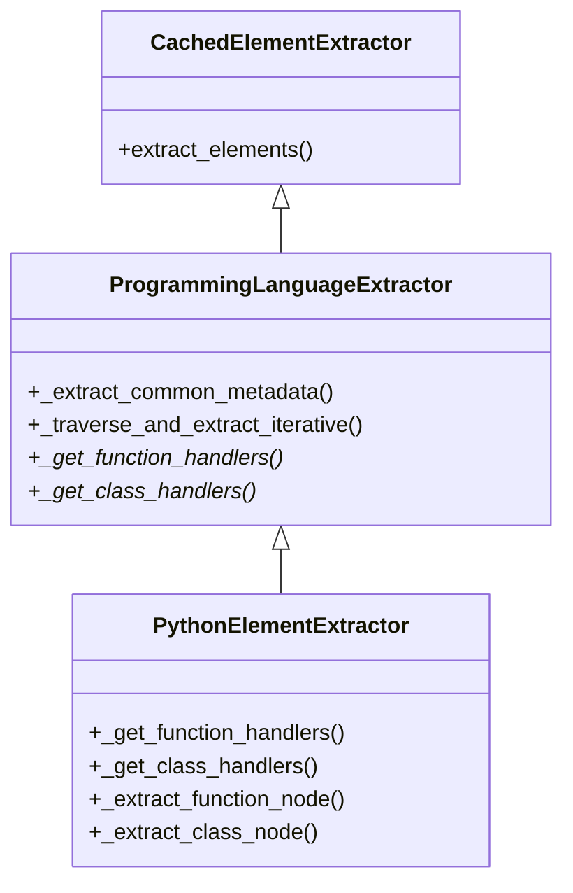

# 言語プラグインのハンドラレジストリパターン

本文書では、言語プラグインリファクタリングプロジェクトで導入された新しいアーキテクチャパターンである「**ハンドラレジストリパターン**（Handler Registry Pattern）」について解説します。このパターンは、Tree-sitterを使用したコード要素（関数、クラスなど）の抽出方法を標準化するために設計されました。

## 概要

ハンドラレジストリパターンは、走査（traversal）ロジックと抽出（extraction）ロジックを分離するデザインパターンです。条件分岐が複雑に入り組んだ巨大な `extract_functions` メソッドを作成する代わりに、プラグインは特定のTree-sitterノードタイプに対して特定の「ハンドラ」メソッドを登録する方式をとります。

### 導入の背景

このパターンが導入される前、言語プラグインには以下のような問題がありました：

1.  **コードの重複**: 各プラグインが独自のAST走査ループを実装していました。
2.  **メタデータの不整合**: 基本的なメタデータ（行番号、生テキスト）の抽出方法がプラグイン間で異なっていました。
3.  **保守の負担**: 走査ロジックの改善（例：深さ制限、パフォーマンス最適化）を、すべてのプラグインに個別に適用する必要がありました。

### 利点

-   **ボイラープレートの削減**: AST走査、深さ制限、エラーハンドリングは基底クラスが一括して処理します。
-   **標準化**: すべてのプラグインで、標準化されたメタデータ抽出（行番号、ドキュメント文字列、複雑度）が自動的に適用されます。
-   **拡張性**: 新しいノードタイプ（例：`async_function_definition`）のサポートを追加する場合、レジストリにエントリを1つ追加するだけで済みます。
-   **パフォーマンス**: 基底クラスには、キャッシングや最適化された走査戦略が実装されています。

---

## アーキテクチャ

このパターンの核心は [`ProgrammingLanguageExtractor`](tree_sitter_analyzer/plugins/programming_language_extractor.py:24) 基底クラスです。

### クラス構造



### 主要コンポーネント

1.  **`ProgrammingLanguageExtractor`**: 抽出プロセスを統括する基底クラスです。
    *   `_traverse_and_extract_iterative()`: ASTを走査する汎用メソッドです。現在のノードタイプをハンドラレジストリで検索し、ハンドラが見つかればそれを実行します。
    *   `_extract_common_metadata()`: `start_line`（開始行）、`end_line`（終了行）、`raw_text`（生テキスト）、`docstring`（ドキュメント）、`complexity`（複雑度）などの標準フィールドを抽出するヘルパーメソッドです。

2.  **ハンドラレジストリメソッド** (抽象メソッド):
    *   `_get_function_handlers() -> dict[str, Callable]`: ノードタイプと関数抽出メソッドのマッピングを返します。
    *   `_get_class_handlers() -> dict[str, Callable]`: ノードタイプとクラス抽出メソッドのマッピングを返します。

---

## 実装ガイド

新しい言語プラグインをハンドラレジストリパターンを使用して実装するための手順は以下の通りです。

### 1. `ProgrammingLanguageExtractor` を継承する

```python
from ..plugins.programming_language_extractor import ProgrammingLanguageExtractor

class MyLanguageElementExtractor(ProgrammingLanguageExtractor):
    def __init__(self) -> None:
        super().__init__()
        # 必要に応じて言語固有の状態を初期化
```

### 2. コンテナノードタイプを定義する

`_get_container_node_types` をオーバーライドして、他の要素を内包できるノードを指定します。これにより、無関係なブランチをスキップして走査を最適化できます。

```python
    def _get_container_node_types(self) -> set[str]:
        return super()._get_container_node_types() | {
            "class_definition",
            "function_definition",
            "namespace_definition",
        }
```

### 3. ハンドラレジストリを実装する

Tree-sitterのノードタイプと、独自の抽出メソッドをマッピングします。

```python
    def _get_function_handlers(self) -> dict[str, callable]:
        return {
            "function_definition": self._extract_function_node,
            "method_definition": self._extract_function_node,
        }

    def _get_class_handlers(self) -> dict[str, callable]:
        return {
            "class_definition": self._extract_class_node,
        }
```

### 4. 抽出メソッドを実装する

レジストリで参照したメソッドを実装します。`_extract_common_metadata` を使用してコードを簡素化してください。

```python
    def _extract_function_node(self, node: "tree_sitter.Node") -> Function | None:
        try:
            # 1. 標準メタデータ（行番号、テキスト、複雑度、ドキュメント）を取得
            meta = self._extract_common_metadata(node)
            
            # 2. 言語固有の詳細情報を抽出
            name = self._get_node_name(node)
            params = self._get_parameters(node)
            
            if not name:
                return None
                
            # 3. モデルを返す
            return Function(
                name=name,
                start_line=meta["start_line"],
                end_line=meta["end_line"],
                raw_text=meta["raw_text"],
                docstring=meta["docstring"],
                complexity_score=meta["complexity"],
                language="mylang",
                parameters=params,
                # ... その他のフィールド
            )
        except Exception as e:
            log_error(f"Error extracting function: {e}")
            return None
```

### 5. オプションのオーバーライド

必要に応じて、基底メソッドをオーバーライドして振る舞いをカスタマイズできます：

*   **複雑度計算**: `_get_decision_keywords()` または `_calculate_complexity_optimized()` をオーバーライド。
*   **ドキュメント抽出**: `_extract_docstring_for_node()` または `_extract_docstring_for_line()` をオーバーライド。

---

## ベストプラクティス

### 命名規則
*   **ハンドラ**: `_extract_` で始める（例：`_extract_function_node`）。
*   **レジストリ**: `_get_` で始め、`_handlers` で終わる（例：`_get_function_handlers`）。

### エラーハンドリング
*   抽出ロジックは `try-except` ブロックで囲み、単一の不正なノードが原因で解析全体がクラッシュしないようにします。
*   抽出に失敗した場合は `None` を返してください。基底クラスはこれを無視して処理を継続します。

### パフォーマンス
*   **`_extract_common_metadata` を使用する**: このメソッドは最適化されており、整合性を保証します。
*   **コンテナを正しく定義する**: `_get_container_node_types` の定義はパフォーマンスに大きく影響します。コンテナタイプが漏れていると、ネストされた要素がスキップされる可能性があります。

---

## 移行ガイド

既存のプラグインを移行する場合の手順：

1.  **継承の変更**: クラスの継承元を `ProgrammingLanguageExtractor` に変更します。
2.  **ロジックの移動**: 
    *   ループ内の `if node.type == '...'` ロジックを `_get_X_handlers` マップに移動します。
    *   抽出処理の本体を専用の `_extract_X_node` メソッドに移動します。
3.  **簡素化**: 手動で行っていた行番号やテキストの抽出を `_extract_common_metadata` に置き換えます。
4.  **ループの削除**: `traverse_tree` や `walk` などのループ実装を削除し、基底クラスの `extract_functions` / `extract_classes` に任せます（カスタムセットアップが必要な場合は、これらをオーバーライドして `_traverse_and_extract_iterative` を呼び出すだけにします）。

---

## トラブルシューティング

### 要素が抽出されない
*   **レジストリの確認**: ノードタイプを `_get_function_handlers` に追加しましたか？
*   **コンテナの確認**: その要素は、`_get_container_node_types` にリストされていないノードタイプの中に含まれていませんか？ 走査は、ターゲットでもコンテナでもない未知のノードで停止します。
*   **ノードタイプの確認**: `tree-sitter-cli parse` を使用して、その言語の正確なノードタイプ名を確認してください。

### メタデータが正しくない
*   **行番号**: Tree-sitterは0始まりですが、我々のモデルは1始まりです。`_extract_common_metadata` はこれを自動的に処理します。
