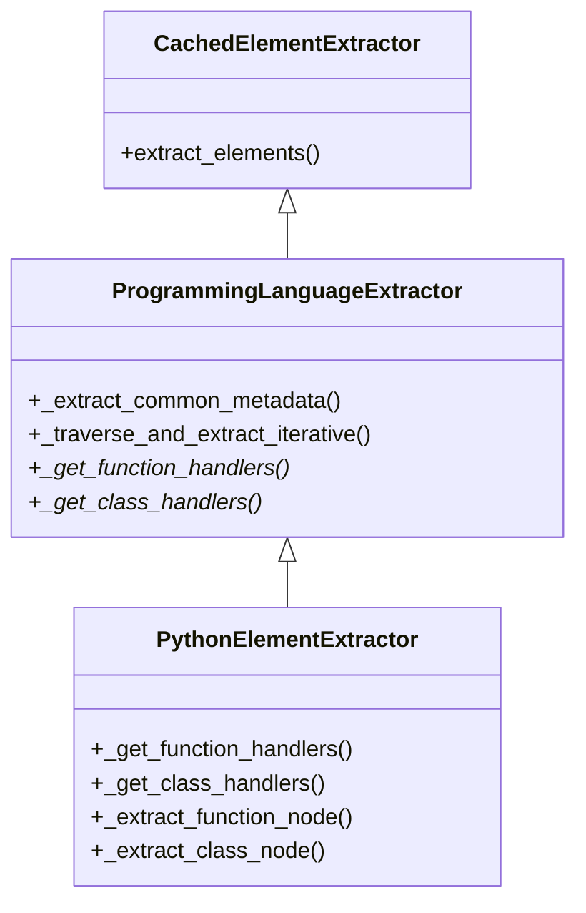

# Handler Registry Pattern for Language Plugins

This document describes the **Handler Registry Pattern**, a new architectural pattern introduced in the language plugin refactoring project. It is designed to standardize how language plugins extract code elements (functions, classes, etc.) using Tree-sitter.

## Overview

The Handler Registry Pattern is a design pattern that decouples the traversal logic from the extraction logic. Instead of monolithic `extract_functions` methods with complex conditional logic, plugins now register specific "handler" methods for specific Tree-sitter node types.

### Why this pattern?

Prior to this pattern, language plugins often duplicated traversal logic:
1.  **Code Duplication**: Every plugin implemented its own AST traversal loop.
2.  **Inconsistent Metadata**: Basic metadata (line numbers, raw text) was extracted differently across plugins.
3.  **Maintenance Burden**: Improvements to traversal (e.g., depth limits, performance optimizations) had to be applied to every plugin individually.

### Benefits

-   **Reduced Boilerplate**: The base class handles AST traversal, depth limiting, and error handling.
-   **Standardization**: All plugins automatically get standardized metadata extraction (line numbers, docstrings, complexity).
-   **Extensibility**: Adding support for a new node type (e.g., `async_function_definition`) is as simple as adding one entry to the registry.
-   **Performance**: The base class implements caching and optimized traversal strategies.

---

## Architecture

The core of this pattern is the `ProgrammingLanguageExtractor` base class.

### Class Structure



### Key Components

1.  **`ProgrammingLanguageExtractor`**: The base class that orchestrates the extraction process.
    *   `_traverse_and_extract_iterative()`: A generic method that walks the AST. It looks up the current node type in the handler registry. If a handler is found, it is executed.
    *   `_extract_common_metadata()`: A helper that extracts standard fields like `start_line`, `end_line`, `raw_text`, `docstring`, and `complexity`.

2.  **Handler Registry Methods** (Abstract):
    *   `_get_function_handlers() -> dict[str, Callable]`: Returns a mapping of node types to function extractors.
    *   `_get_class_handlers() -> dict[str, Callable]`: Returns a mapping of node types to class extractors.

---

## Implementation Guide

Follow these steps to implement a new language plugin using the Handler Registry Pattern.

### 1. Inherit from `ProgrammingLanguageExtractor`

```python
from ..plugins.programming_language_extractor import ProgrammingLanguageExtractor

class MyLanguageElementExtractor(ProgrammingLanguageExtractor):
    def __init__(self) -> None:
        super().__init__()
        # Initialize language-specific state if needed
```

### 2. Define Container Node Types

Override `_get_container_node_types` to specify which nodes can contain other elements. This optimizes traversal by skipping irrelevant branches.

```python
    def _get_container_node_types(self) -> set[str]:
        return super()._get_container_node_types() | {
            "class_definition",
            "function_definition",
            "namespace_definition",
        }
```

### 3. Implement Handler Registries

Map Tree-sitter node types to your specific extractor methods.

```python
    def _get_function_handlers(self) -> dict[str, callable]:
        return {
            "function_definition": self._extract_function_node,
            "method_definition": self._extract_function_node,
        }

    def _get_class_handlers(self) -> dict[str, callable]:
        return {
            "class_definition": self._extract_class_node,
        }
```

### 4. Implement Extractor Methods

Implement the methods referenced in your registry. Use `_extract_common_metadata` to simplify your code.

```python
    def _extract_function_node(self, node: "tree_sitter.Node") -> Function | None:
        try:
            # 1. Get standard metadata (lines, text, complexity, docstring)
            meta = self._extract_common_metadata(node)
            
            # 2. Extract language-specific details
            name = self._get_node_name(node)
            params = self._get_parameters(node)
            
            if not name:
                return None
                
            # 3. Return the model
            return Function(
                name=name,
                start_line=meta["start_line"],
                end_line=meta["end_line"],
                raw_text=meta["raw_text"],
                docstring=meta["docstring"],
                complexity_score=meta["complexity"],
                language="mylang",
                parameters=params,
                # ... other fields
            )
        except Exception as e:
            log_error(f"Error extracting function: {e}")
            return None
```

### 5. Optional Overrides

You can customize specific behaviors by overriding base methods:

*   **Complexity Calculation**: Override `_get_decision_keywords()` or `_calculate_complexity_optimized()`.
*   **Docstring Extraction**: Override `_extract_docstring_for_node()` or `_extract_docstring_for_line()`.

---

## Best Practices

### Naming Conventions
*   **Handlers**: Prefix with `_extract_` (e.g., `_extract_function_node`).
*   **Registries**: Prefix with `_get_` and end with `_handlers` (e.g., `_get_function_handlers`).

### Error Handling
*   Wrap extraction logic in `try-except` blocks to prevent a single malformed node from crashing the entire analysis.
*   Return `None` if extraction fails, which the base class will gracefully ignore.

### Performance
*   **Use `_extract_common_metadata`**: It is optimized and ensures consistency.
*   **Define Containers Correctly**: `_get_container_node_types` is crucial for performance. If you miss a container type, nested elements might be skipped.

---

## Migration Guide

If you are migrating an existing plugin:

1.  **Change Inheritance**: Update the class to inherit from `ProgrammingLanguageExtractor`.
2.  **Move Logic**: 
    *   Take the `if node.type == '...'` logic from your loop and move it into the `_get_X_handlers` map.
    *   Move the extraction body into a dedicated `_extract_X_node` method.
3.  **Simplify**: Replace manual line number and text extraction with `_extract_common_metadata`.
4.  **Remove Loop**: Delete the `traverse_tree` or `walk` loop implementation; rely on the base class's `extract_functions` / `extract_classes` (or override them just to call `_traverse_and_extract_iterative` if you need custom setup).

---

## Troubleshooting

### Elements are not being extracted
*   **Check Registry**: Did you add the node type to `_get_function_handlers`?
*   **Check Containers**: Is the element inside a node type that is NOT listed in `_get_container_node_types`? The traversal stops at unknown non-target nodes.
*   **Check Node Types**: Use `tree-sitter-cli parse` to verify the exact node type names for your language.

### Metadata is incorrect
*   **Line Numbers**: Remember that Tree-sitter is 0-indexed, but our models are 1-indexed. `_extract_common_metadata` handles this automatically.
