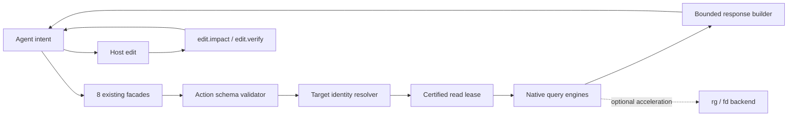

# RFC-0036：面向 Agent 的核心工作流

- **Status**: draft
- **Author(s)**: OpenAI 多模型评审组 / @aimasteracc
- **Created**: 2026-09-18
- **Last updated**: 2026-09-18
- **Tracking**: `ROADMAP-agent-native-workbench.md`
- **Affected source paths**:
  - `tree_sitter_analyzer/mcp/tools/facade_tool.py`
  - `tree_sitter_analyzer/mcp/tools/search_facade.py`
  - `tree_sitter_analyzer/mcp/tools/nav_facade.py`
  - `tree_sitter_analyzer/mcp/tools/edit_facade.py`
  - `tree_sitter_analyzer/mcp/tools/symbol_search_tool.py`
  - `tree_sitter_analyzer/mcp/tools/symbol_resolve_tool.py`
  - `docs/agent-envelope-contract.md`
  - `benchmarks/no1_010b/`

## Summary

TSA 不再以 action 数量作为 Agent 产品能力的代理指标。保留现有 8 个 MCP
facade 和高级 action，建立五步核心工作流：

1. `search.symbol`：定位候选实体；
2. `structure.outline`：读取文件结构；
3. `nav.pulse`：取得一次编辑所需的局部关系；
4. `edit.impact`：生成影响范围和验证计划；
5. `edit.verify`：确认计划仍对应当前变更并执行验证。

核心工作流要求每次调用都能回答四个问题：调用者的参数是否真的生效、结果绑定
哪一代源码、结果是否完整、下一步怎样恢复。TSA 负责结构、关系、风险和验证证据；
通用文本搜索与写文件仍由宿主工具完成。`rg` / `fd` 可以作为可选加速后端，但
不得成为正确性或可用性的必要依赖。

## Evidence and problem statement

2026-09-18 在本仓库隔离工作树上的单次诊断得到：

- 运行时暴露 8 个 facade、84 个业务 action、356 个 CLI flag；8 份 tool definition
  合计 36,469 JSON bytes，均只要求 `action` 且允许额外属性。
- 完整原生索引约 31.33 秒，结果正文约 98 KiB；随后一次
  `codegraph-context` 约 2.35 秒并返回约 15 KiB。这些是单机探针，不是 p95。
- `search.symbol` 和 resolve 返回的 `build_edit_facade` 坐标为 71–290，当前直接
  outline 为 27–249；旧坐标与当前正文被拼入同一个成功响应，且无 freshness。
- `nav.pulse` 对同一并发状态选择 `unknown/CONCURRENT_WRITER`，证明仓库已有更
  诚实的证据语义，但尚未覆盖所有编辑决策入口。
- 门面投影会静默丢弃 `limt` 等拼错参数和不适用于所选 action 的参数，使 Agent
  误以为限制条件已经生效。
- 搜索命中上限时把“返回数量达到 limit”当作 `truncated=true`，却不能证明存在
  更多结果；outline 还重复输出同一 classes/functions 正文。
- `docs/agent-envelope-contract.md` 仍描述已退役的 TOON 默认路径，与 JSON-only
  锁定决策冲突。

这些问题共同支持一个裁决：先消灭“错误成功”和不可预测成本，再增加高级能力。

## Goals

- Agent 在不知道内部索引结构的情况下完成“找入口 → 理解 → 判断影响 → 验证”。
- 拼错、无效或属于其他 action 的参数在执行前失败，并给出机器可读纠错信息。
- 参与编辑判断的结果绑定同一代源码，freshness 与 completeness 分开表达。
- 高频响应默认有界、无重复正文，并提供显式 continuation 或扩大范围方法。
- 缺索引或认证失败时快速给出诚实的局部能力与恢复路径。
- 用可重复的真实任务 corpus 衡量任务成功率、调用轮数、恢复次数和总等待时间。

## Non-goals

- 本 RFC 的可信读路径阶段不新增第九个 facade，也不复制一套自然语言 DSL；现有
  internal-only task kernel 只有通过预注册的 live Agent 菜单实验后才可另案公开。
- 不让 TSA 接管宿主的通用 patch/write 能力。
- 不要求所有文本搜索都经过 AST 索引。
- 不以 watcher 尚未观察到事件作为 fresh 证明。
- 不以代码覆盖率、action 数或单次微基准替代 Agent 任务成功证据。

## Product contract

### Core profile

Core profile 是现有 action 的默认发现和组合策略，不是新工具表面。高级 action
继续通过各 facade 的按需帮助发现。一个标准编辑会话应形成以下数据流：

```text
query
  -> search.symbol -> candidate target IDs
  -> structure.outline / nav.pulse -> certified local context
  -> edit.impact -> bounded verification plan
  -> host edit/apply_patch
  -> edit.verify -> plan replay + structural delta
```

### Action-level input contract

公共 facade schema 继续允许 action 专属参数通过，以控制 `tools/list` 体积；路由
选定后必须按内部 action schema 严格校验：

- 未知字段：`INVALID_ARGUMENT`，不执行；
- 字段近似拼错：返回 `suggestions`；
- 属于同 facade 其他 action 的字段：同样失败，不再静默投影；
- 门面公开的 `symbol` / `function_name` / `class_name` 别名只在目标 action 能消费
  时合法；
- bespoke route 在拥有机器可读参数 schema 前维持原行为，并在响应中明确该兼容
  边界，后续逐条迁移。

错误响应至少包含：

```json
{
  "success": false,
  "verdict": "ERROR",
  "error_code": "INVALID_ARGUMENT",
  "facade": "search",
  "action": "symbol",
  "invalid_arguments": ["limt"],
  "allowed_arguments": ["action", "kind", "limit", "query"],
  "suggestions": {"limt": "limit"},
  "agent_summary": {"next_step": "..."}
}
```

动作 schema 通过现有渐进发现控制动作读取，不新增顶层工具或业务 action：

```json
{"action": "help", "target_action": "symbol"}
```

无 `target_action` 时返回 `agent-core/v1` 五步 profile、业务动作清单和文本帮助；
指定 direct action 时返回 `action_schema`，其中 `action` 使用固定值，inner 的必填
参数、JSON-only 输出控制和 facade 的 `symbol` / `function_name` / `class_name` 别名
共同组成可直接执行的 JSON Schema。bespoke route 在获得权威 schema 前返回
`ACTION_SCHEMA_UNAVAILABLE`，不能用手写的近似 schema 冒充可执行契约。`help` 是
发现控制动作，不计入 84 个业务 action。

### Target identity

搜索返回的候选必须提供可传给 outline、pulse、impact 的稳定 target ID。ID 至少
绑定项目身份、语言、相对路径、符号限定名和源码 generation。重名返回候选集并
标记 `AMBIGUOUS_SYMBOL`，不得自动替 Agent 选择编辑目标。

在稳定 ID 落地前，兼容层继续接受现有 `file_path + symbol` 参数，但响应必须给出
规范化 target，供下一次调用直接复用。

### Evidence envelope

所有参与编辑判断的读结果统一携带：

- `action_version`；
- `source_evidence.freshness`：`fresh | stale | missing | unknown`；
- `source_evidence.snapshot_id` 与 `source_generation`，不能证明时为 `null`；
- `completeness`：查询范围是否完整，与 freshness 独立；
- `returned_count`、`truncated` 和可选 continuation；无法证明总量时
  `total_count=null`；
- 每个位置与正文必须来自同一代源码。

无数据不能推导 SAFE。只有 fresh 且认证范围完整时，NOT_FOUND 才表示已认证范围
内不存在。deadline 或预算耗尽只有在已返回内容带证据时才能标为 partial。

### Readiness and fallback

- 文件级 outline/inspect 可以直接解析当前文件，不依赖项目索引。
- 项目级关系缺索引时返回 `MISSING_INDEX`，给出显式构建或局部替代调用；读请求
  不隐式启动无界全仓索引。
- partial index 可以支持有界局部结果，但不能升级成完整项目结论。
- 索引构建结果默认只返回摘要、错误样本和 continuation，不输出数万符号正文。

### Grep/edit boundary

通用 grep 处理任意文本、配置、日志、注释和未知语言；TSA 处理实体、结构、关系、
影响和验证证据。宿主 edit/apply_patch 负责写入；TSA 在写入前提供身份与风险，写入
后比较结构差异并验证计划。

原生 Python 实现保持语义基线。检测到 `rg` / `fd` 时可以加速候选枚举，但同一
fixture 上的规范化结果和错误语义必须与原生路径一致；后端缺失不得改变公共能力。

## Architecture



校验器位于 facade 路由边界，因为此时 `(facade, action)` 已确定，可以精确区分
合法的 action 专属字段与同级噪声。源码认证复用 RFC-0030 的 snapshot owner，
禁止先查 status 再用另一个连接查询。bounded response builder 只裁剪 payload，
不得裁掉证据和恢复提示。

### Conditional workflow coordinator

仓库已有 internal-only 的 `tree_sitter_analyzer.task` kernel，组合
`understand`、`plan_change` 和 `assess_change`，并复用 diff snapshot、预算、证据
和 finally cleanup。它是未来“一次意图、一份结果”的候选协调层，不应重写现有
primitive，也不应自动执行验证或通用写入。

公开 transport 前先做固定 corpus、模型、随机化与重复次数的 paired live-Agent
A/B：当前 8-facade 菜单对比候选协调入口。只有 discovery、终态任务成功率、turn
和输入输出成本达到预注册阈值，才提交单独 RFC/PR 讨论第九个 facade；未通过则
继续作为 SDK 与 benchmark harness。进程内 snapshot ID 不能暴露为跨进程 CLI
能力，CLI twin 必须在一次命令内完成生产、消费和释放。

验证仍是显式的 `edit.verify` 请求。`assess_change` 只返回绑定当前 root、diff
digest 和 plan digest 的 receipt；diff 变化后重放必须在启动任何测试进程前返回
`VERIFICATION_PLAN_CHANGED`。

## Compatibility and migration

Phase 0 只对 direct inner routes 启用动作级未知参数拒绝。以前依赖静默丢弃字段的
调用会从成功转为 `INVALID_ARGUMENT`；这是有意修复错误成功。facade schema 和
工具数量不变，CLI 本来就由 argparse 拒绝未知 flag，因此 MCP 与 CLI 行为更一致。

RFC-0013 的 `ignored_params` 方案被本 RFC supersede：对编辑决策工具，仅告诉 Agent
“参数已忽略”仍可能让它消费错误范围的结果。可修复错误必须在执行前停止。

后续对 evidence、target ID 和 NOT_FOUND 的变化先以增量字段发布；旧参数至少保留
一个次版本并在响应中给出迁移目标。任何 removal 进入下一个明确主版本。

## TDD strategy

每一阶段采用 Red → Green → Refactor，并保存失败证据：

1. **参数诚实性**：先写 `limt` 和 sibling 参数失败测试，证明当前实现错误成功；
   最小实现只在 direct route 执行前校验，再补真实 `search.symbol` 场景。
2. **新鲜度一致性**：用真实小仓库建立索引，等长改写并恢复 mtime；search、resolve
   和 pulse 必须共同拒绝旧证据，不能 mock freshness 字段。
3. **稳定 target**：重名 fixture 先证明需要二次输入，再让 search 输出 target ID，
   pulse/impact 原样消费。
4. **有界响应**：以精确字节数、字段唯一性、continuation round-trip 为断言；不得
   只断言 key 存在。
5. **任务纵向切片**：复用 NO1-010B 的 internal-only 方法，首条任务为
   `0001-bugfix-dispatch-unknown-route`；记录完整调用序列、allowed paths、oracle、
   verification command 和终态 verdict。

### P4 首条纵向切片（2026-09-18）

首条 E0 reference transcript 已按上述测试策略实现。普通规模的 `edit.impact` 现在也
返回绑定当前 root、changed set、阶段计划和分析请求的 `verification_request`，所以
`edit.verify` 在常见任务上可直接调用；diff 或计划变化仍由既有
`VERIFICATION_PLAN_CHANGED` 契约拒绝。

参考链实际调用现有 facade，并在临时 Git 副本应用仓库自带的固定修复。输出固定标记
`evidence_level=E0`、`qualification=REFERENCE_ONLY`、`model_executed=false` 和
`public_claim=null`；它同时运行注册的完整 verification argv、oracle，并比较非 allowed
文件摘要。该切片证明工作流可达，不具备 RFC-0026 B1 沙箱、正式 VCSR 或默认工具声明
资格。

### P4 代表性 transcript 扩展（2026-09-18）

同一 harness 现以预注册规格驱动四类代表性任务，不为每类复制另一套协议：

- `0003-refactor-extract-route-registry` 验证跨文件、行为保持的重构；
- `0004-test-selection-dispatch-version` 要求 `edit.impact` 报告的 pytest 文件与
  corpus 的 `selected_tests` 精确相等，再由绑定请求执行选中测试；
- `0007-migration-drop-legacy-total` 验证调用点从废弃入口迁移到当前入口；
- `0006-bugfix-cancel-unknown-order` 使用预注册的错误参考补丁，要求 oracle 已满足，
  同时 `edit.verify` 与完整注册验证都失败，终态固定为
  `FAIL / VERIFICATION_FAILED`。

每条任务仍先索引，再以任务规格绑定的 symbol 和 file 取得新鲜目标，随后执行
`structure.outline`、`edit.safe`、宿主编辑、`edit.impact`、`edit.verify`、完整注册验证
和 oracle。参考改动必须唯一命中固定 anchor；完整 Git 补丁必须通过 parser、allowed
paths 和精确 changed-path 检查；非 allowed 文件摘要必须保持不变。成功与预期失败都
只有在实际终态和 corpus 注册值一致时才生成 transcript。该扩展仍是 E0，未改变 B1、
VCSR 或公开默认工具资格。

固定规格同时绑定 `repo`、`allowed_paths`、oracle 路径与 reason、完整
`verification_argv` 及 `selected_tests`。同一 task ID 的任一字段漂移都会在复制夹具或
启动命令前失败，不能借已注册身份替换可执行验证或放宽写入边界。

差分 oracle 使用 `rg` / `fd` / 直接文件切片 / `git diff`，但不把这些实现泄漏为
TSA 的公共依赖。性能测试记录端到端 wall time，索引认证和恢复时间都进入总成本。

## Delivery phases

- **P0 Trust the call**：动作级未知参数拒绝、文档 JSON-only 对账、错误码契约。
- **P1 Learn five moves**：core profile 的机器可读发现、稳定 target、去重默认输出。
- **P2 Trust every read**：search/resolve/pulse 共享源码证据和完整性语义。
- **P3 Hide index mechanics**：有界索引摘要、后台增量失效、可信热路径和局部 fallback。
- **P4 Close the edit loop**：impact → host edit → verify，计划过期时 `PLAN_CHANGED`。
- **P5 Earn default status**：真实 Agent corpus 对比 grep/read 基线；达不到正确性与总
  交互成本门槛时不宣称默认工具资格。
- **P6 Gate the coordinator**：对 internal-only task kernel 做 live Agent 菜单 A/B；
  只有门槛通过才讨论公开 transport，不把静态 token 估计当采用证据。

## Acceptance criteria

- [x] direct route 的未知、拼错和 sibling 参数均在执行前失败并给出合法字段；
- [x] 8 facade / 84 business action 的工具数量不因 core profile 增长；
- [x] 五个核心 action 有机器可读的逐 action schema 与稳定恢复提示；
- [x] search、resolve、pulse 对 stale/missing/unknown/fresh 使用同一证据模型；
- [ ] 位置、正文和 target ID 均绑定同一代源码；
- [ ] 默认响应无重复正文，截断与未知总量不混淆；
- [ ] 无 `rg` / `fd` 环境通过同一正确性 corpus；可选后端通过差分测试；
- [ ] 首条 NO1-010B 纵向任务和后续代表性 corpus 达到预注册门槛；
- [ ] quick、PR、release 分层门禁、补丁覆盖率和 MCP/CLI parity 全部通过。

## Open questions

1. stable target ID 是否作为不透明字符串，还是公开可校验的版本化对象？
2. **已裁决**：使用现有 `action=help`，以可选 `target_action` 返回精确 schema；
   `help` 显式进入 facade input schema，但不计入业务 action，也不新增顶层工具。
3. bespoke route 如何声明 schema，才能在不复制参数定义的前提下获得同样的严格性？
4. Agent corpus 的默认资格阈值需在采样前预注册，不能看完结果后调整。
