# Tree-sitter Analyzer 互換性テストシステム アーキテクチャ図

## 概要

このドキュメントでは、Tree-sitter Analyzer互換性テストシステムのアーキテクチャを視覚的に説明します。システムの構成要素、データフロー、処理フロー、ファイル関連図を含みます。

---

## 1. システム全体アーキテクチャ

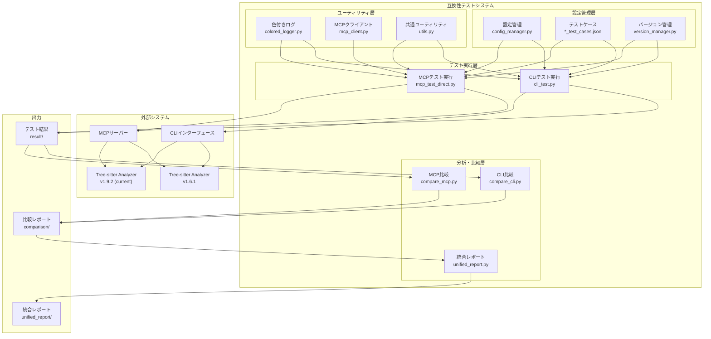

---

## 2. データフロー図

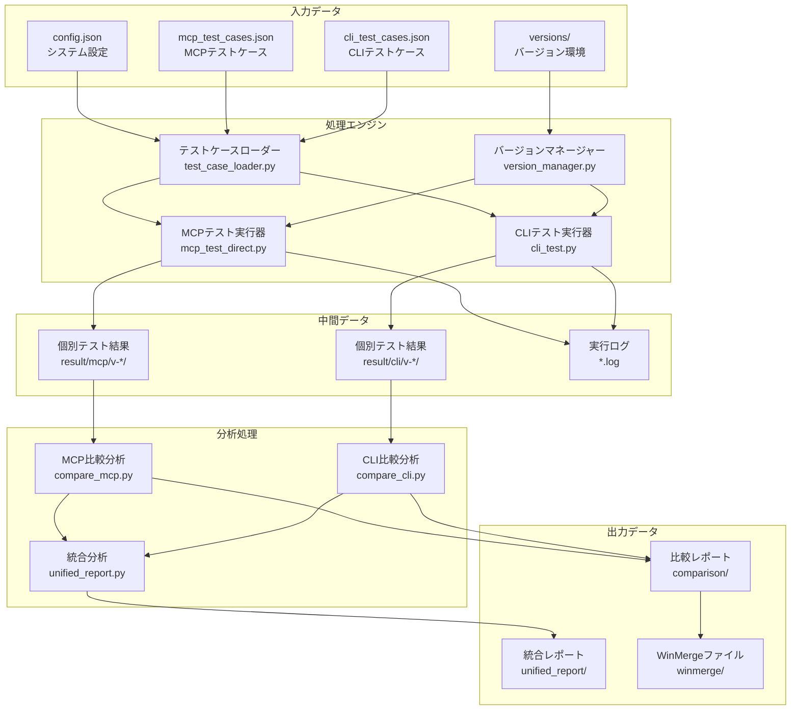

---

## 3. 処理フロー図

### 3.1 MCPテスト処理フロー

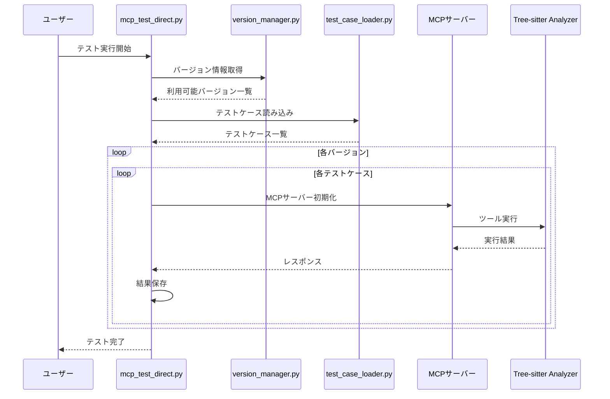

### 3.2 CLIテスト処理フロー

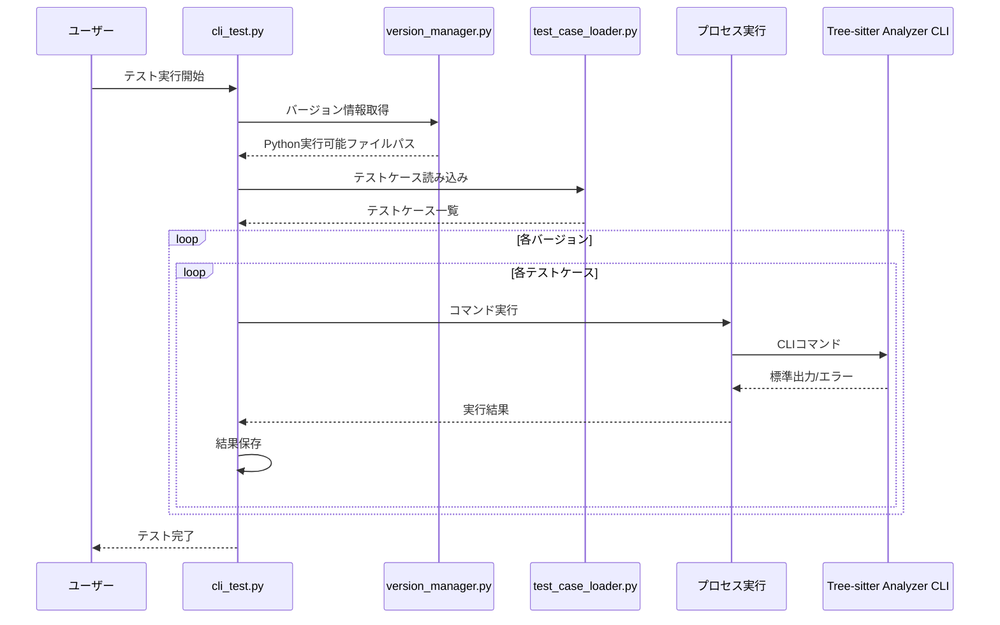

### 3.3 比較・レポート生成フロー

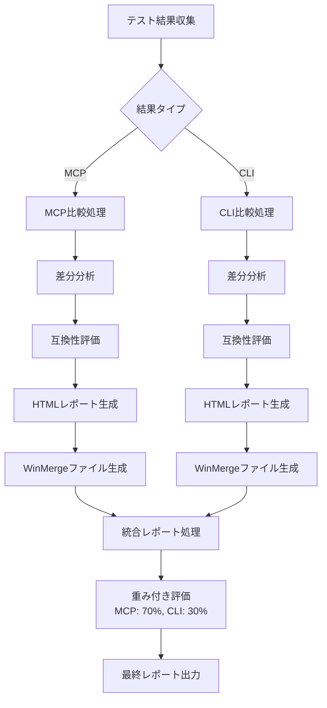

---

## 4. ファイル関連図

### 4.1 設定ファイル関係

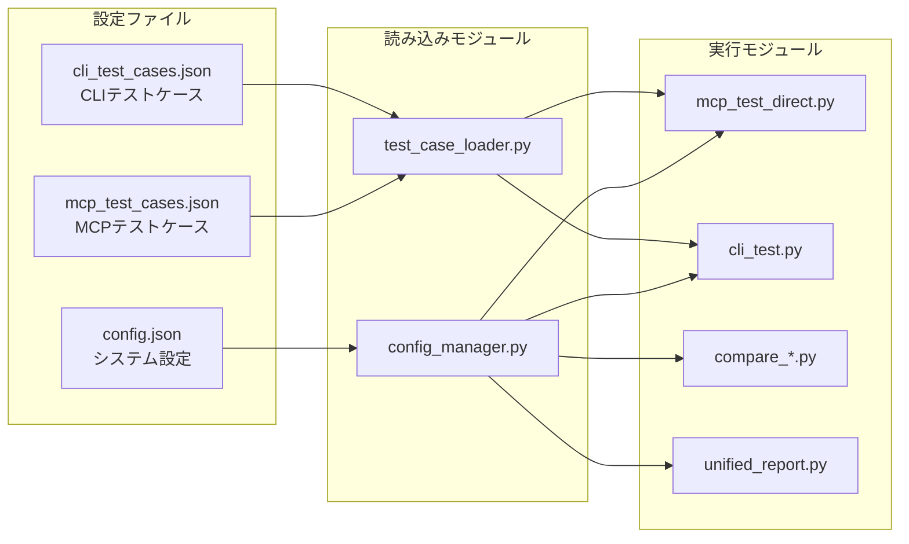

### 4.2 結果ファイル構造

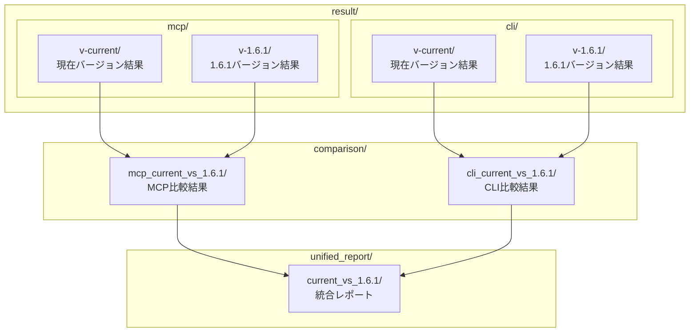

---

## 5. コンポーネント詳細図

### 5.1 MCPテストコンポーネント

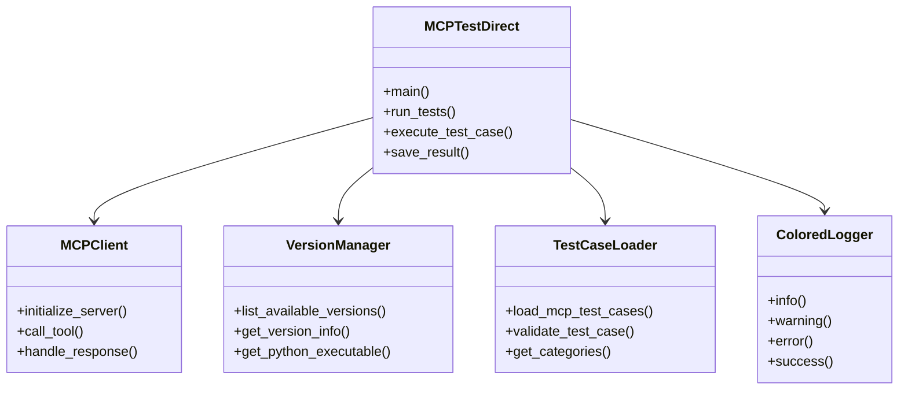

### 5.2 比較・レポートコンポーネント

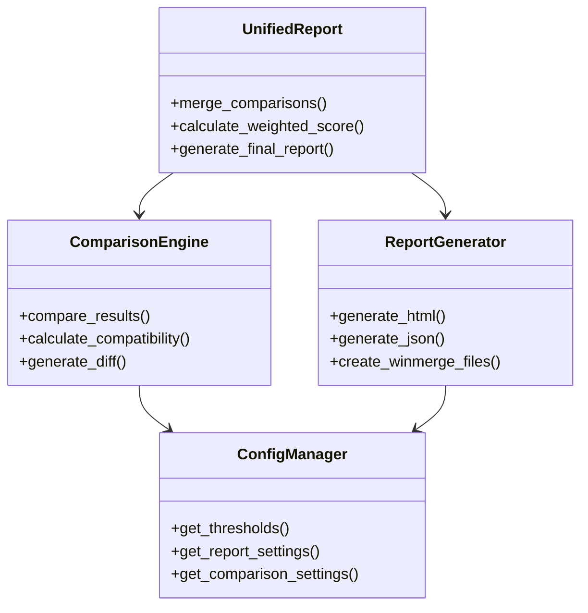

---

## 6. データモデル図

### 6.1 テストケースデータモデル

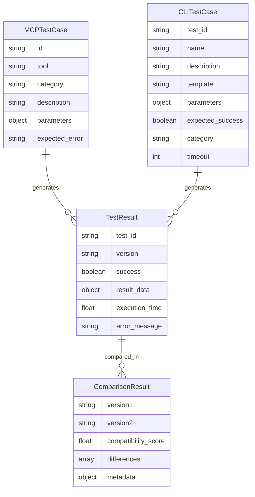

---

## 7. 実行環境図

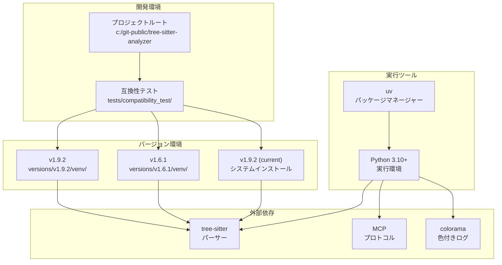

---

## 8. セキュリティ・エラーハンドリング図

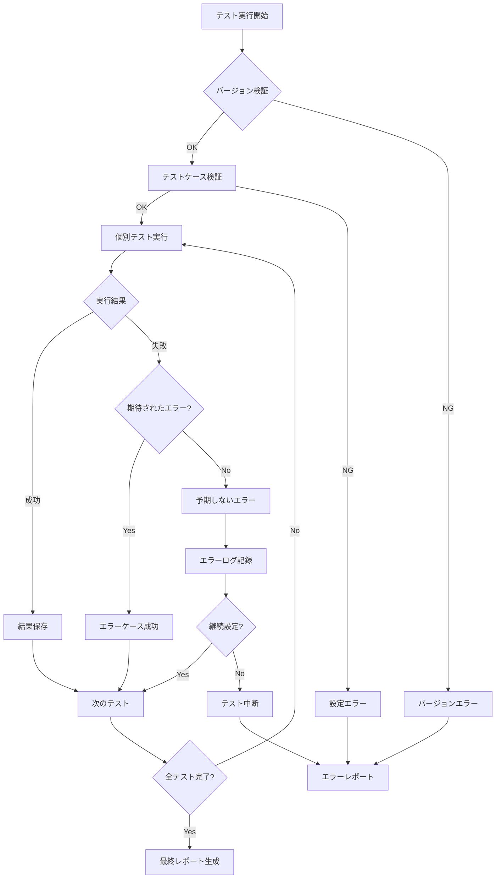

---

## まとめ

このアーキテクチャ図は、Tree-sitter Analyzer互換性テストシステムの全体像を示しています。システムは以下の特徴を持ちます：

1. **モジュラー設計**: 各コンポーネントが独立して動作
2. **拡張性**: 新しいバージョンやテストケースの追加が容易
3. **堅牢性**: エラーハンドリングと継続実行機能
4. **可視性**: 詳細なログとレポート機能
5. **自動化**: 設定ベースの自動テスト実行

これらの図を参考に、システムの理解と保守を効率的に行うことができます。