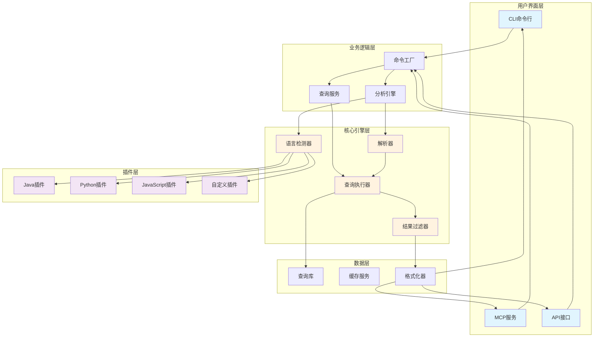
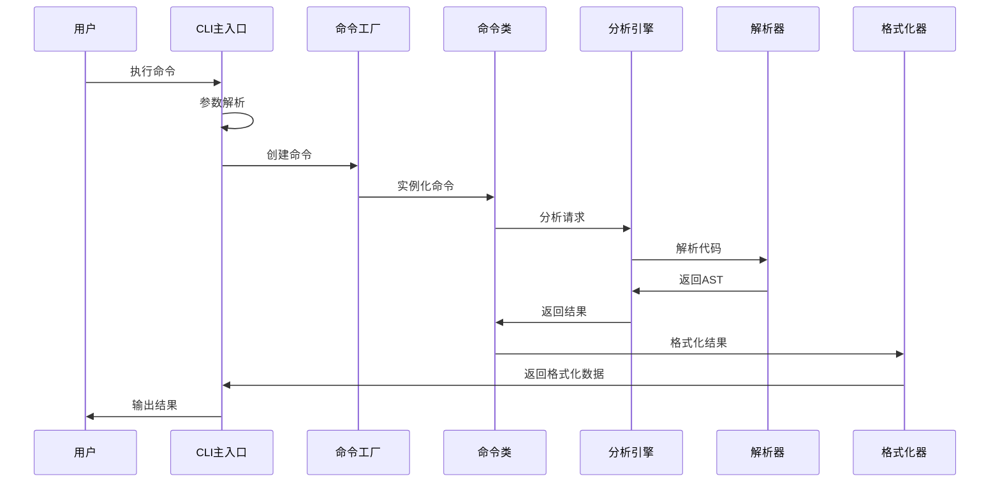
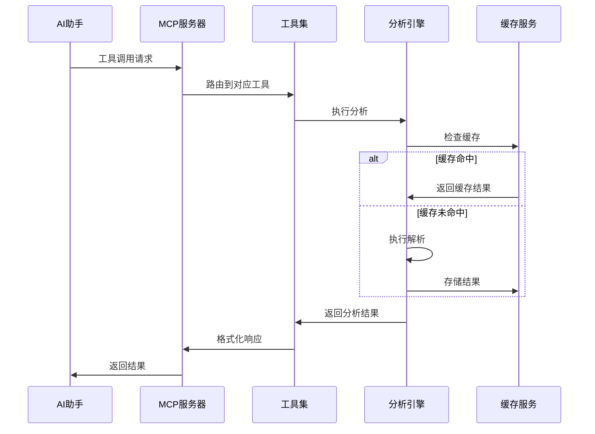

# 🏗️ 02 架构深度解析

> **深入理解Tree-sitter Analyzer的系统架构，掌握从输入到输出的完整数据流**


## 🎯 学习目标

通过本教程，您将：
- 🏗️ **理解系统架构**：掌握整体架构设计原则
- 🔄 **追踪数据流**：从输入到输出的完整流程
- 🧩 **掌握核心模块**：每个模块的职责和交互
- 🔧 **理解扩展机制**：如何添加新功能
- 📊 **分析性能特点**：系统的优势和限制

## 🏛️ 系统架构概览

### 2.1 整体架构图



### 2.2 架构设计原则

1. **🔄 单一职责原则**：每个模块只负责一个特定功能
2. **🔌 开闭原则**：对扩展开放，对修改封闭
3. **🎯 依赖倒置**：高层模块不依赖低层模块
4. **⚡ 性能优先**：增量解析和缓存机制
5. **🛡️ 安全边界**：严格的文件路径验证

## 🔄 数据流深度分析

### 3.1 CLI数据流



### 3.2 MCP数据流



## 🧩 核心模块深度解析

### 4.1 语言检测器 (`language_detector.py`)

**职责**：自动识别代码文件的编程语言

```python
# 核心逻辑示例
def detect_language(file_path: str, content: str = None) -> str:
    # 1. 扩展名检测
    ext = Path(file_path).suffix.lower()
    if ext in LANGUAGE_EXTENSIONS:
        return LANGUAGE_EXTENSIONS[ext]
    
    # 2. 内容分析
    if content:
        return analyze_content(content)
    
    # 3. 默认回退
    return "unknown"
```

**支持的语言**：
- Java (`.java`)
- Python (`.py`)
- JavaScript (`.js`, `.ts`)
- TypeScript (`.ts`, `.tsx`)

### 4.2 解析引擎 (`core/engine.py`)

**职责**：协调整个解析过程

```python
class AnalysisEngine:
    def __init__(self):
        self.language_detector = LanguageDetector()
        self.parser = Parser()
        self.cache_service = CacheService()
    
    def analyze(self, file_path: str, **options) -> AnalysisResult:
        # 1. 语言检测
        language = self.language_detector.detect(file_path)
        
        # 2. 获取插件
        plugin = self.get_language_plugin(language)
        
        # 3. 解析代码
        ast = self.parser.parse(file_path, plugin)
        
        # 4. 提取结构
        structure = plugin.extract_structure(ast)
        
        return AnalysisResult(structure)
```

### 4.3 查询服务 (`core/query_service.py`)

**职责**：执行Tree-sitter查询并过滤结果

```python
class QueryService:
    def execute_query(self, ast, query_key: str, filter_expr: str = None):
        # 1. 加载查询
        query = self.load_query(query_key)
        
        # 2. 执行查询
        results = self.execute(ast, query)
        
        # 3. 应用过滤
        if filter_expr:
            results = self.filter_results(results, filter_expr)
        
        return results
    
    def filter_results(self, results, filter_expr: str):
        # 支持复杂的过滤表达式
        # name=main, params=0, public=true
        return FilterEngine.apply(results, filter_expr)
```

### 4.4 插件系统 (`languages/`)

**职责**：为不同语言提供统一的解析接口

```python
class BaseLanguagePlugin:
    """插件基类"""
    
    def extract_classes(self, ast) -> List[ClassInfo]:
        """提取类信息"""
        raise NotImplementedError
    
    def extract_methods(self, ast) -> List[MethodInfo]:
        """提取方法信息"""
        raise NotImplementedError
    
    def extract_fields(self, ast) -> List[FieldInfo]:
        """提取字段信息"""
        raise NotImplementedError
```

## 🔧 扩展机制详解

### 5.1 添加新语言插件

```python
# 1. 创建插件文件
class RustPlugin(BaseLanguagePlugin):
    key = "rust"
    extensions = [".rs"]
    
    def __init__(self):
        self.parser = Parser()
        self.parser.set_language(Language("build/languages.so", "rust"))
    
    def extract_classes(self, ast):
        # 实现Rust特定的类提取逻辑
        pass

# 2. 注册插件
# pyproject.toml
[project.entry-points."tree_sitter_analyzer.plugins"]
rust = "tree_sitter_analyzer.languages.rust_plugin:RustPlugin"
```

### 5.2 添加新查询类型

```python
# queries/rust.py
RUST_QUERIES = {
    "structs": """
    (struct_item
      name: (type_identifier) @struct.name
      body: (field_declaration_list) @struct.body
    )
    """,
    
    "functions": """
    (function_item
      name: (identifier) @function.name
      parameters: (parameters) @function.params
      body: (block) @function.body
    )
    """
}
```

### 5.3 添加新输出格式

```python
class XMLFormatter(BaseFormatter):
    def format(self, data: dict) -> str:
        xml = ET.Element("analysis")
        
        for class_info in data["classes"]:
            class_elem = ET.SubElement(xml, "class")
            class_elem.set("name", class_info.name)
            class_elem.set("start_line", str(class_info.start_line))
            class_elem.set("end_line", str(class_info.end_line))
        
        return ET.tostring(xml, encoding="unicode", pretty_print=True)
```

## 📊 性能特点分析

### 6.1 优势

- ⚡ **增量解析**：只重新解析修改的部分
- 🗄️ **智能缓存**：避免重复解析相同文件
- 🔍 **精确查询**：基于AST的精确代码分析
- 🌍 **多语言支持**：统一的接口支持多种语言
- 🛡️ **安全边界**：严格的文件路径验证

### 6.2 限制

- 📁 **文件大小**：大文件可能影响解析性能
- 🔧 **语言支持**：需要对应的Tree-sitter语法
- 💾 **内存使用**：AST可能占用较多内存
- 🎯 **查询复杂度**：复杂查询可能影响性能

### 6.3 性能优化策略

```python
# 1. 缓存策略
class CacheService:
    def __init__(self):
        self.file_cache = {}
        self.query_cache = {}
    
    def get_cached_result(self, file_path: str, query_key: str):
        cache_key = f"{file_path}:{query_key}"
        return self.query_cache.get(cache_key)

# 2. 增量更新
class IncrementalParser:
    def parse_incremental(self, file_path: str, changes: List[Change]):
        # 只重新解析修改的部分
        pass

# 3. 并行处理
class ParallelProcessor:
    def process_multiple_files(self, file_paths: List[str]):
        with ThreadPoolExecutor() as executor:
            results = list(executor.map(self.analyze_file, file_paths))
        return results
```

## 🎯 实战练习

### 练习1：追踪调用链路

```bash
# 使用调试模式运行
uv run python -m tree_sitter_analyzer examples/BigService.java --table=full --debug

# 观察输出中的调用链路信息
```

### 练习2：分析性能

```bash
# 使用性能分析
uv run python -m tree_sitter_analyzer examples/BigService.java --profile

# 查看性能报告
```

### 练习3：扩展功能

```python
# 创建一个简单的自定义格式化器
class CustomFormatter:
    def format(self, data):
        return f"Found {len(data['classes'])} classes"
```

## ✅ 验证学习成果

### 自我评估

- [ ] 我能够绘制完整的系统架构图
- [ ] 我理解数据流的每个环节
- [ ] 我能够解释每个核心模块的职责
- [ ] 我了解如何扩展系统功能
- [ ] 我理解系统的性能特点

### 深度思考

1. **架构设计**：为什么选择这种分层架构？
2. **扩展性**：如何支持新的编程语言？
3. **性能优化**：还有哪些优化空间？
4. **安全性**：如何进一步加强安全边界？

## 🚀 下一步

继续您的架构学习之旅：

1. **⚡ [CLI大师级速查](03_cli_cheatsheet.md)** - 掌握命令行工具的高级用法
2. **🔌 [MCP集成专家](04_mcp_cheatsheet.md)** - 学习AI工具集成
3. **🔧 [插件开发实战](05_plugin_tutorial.md)** - 开发自定义插件

---

**🏗️ 您已经掌握了系统架构的核心知识！**

**👉 继续学习：[03 CLI大师级速查](03_cli_cheatsheet.md)**
