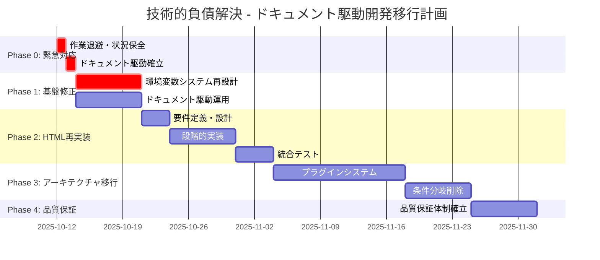

# ドキュメント駆動開発戦略による技術的負債解決 - 緊急対応計画書

**作成日時**: 2025年10月12日 13:22 JST  
**計画バージョン**: 1.0  
**緊急度**: 最高  
**実行責任者**: プロジェクトアーキテクト  

## 📋 エグゼクティブサマリー

### 危機的状況
tree-sitter-analyzerプロジェクトは、HTMLサポート追加により技術的負債が雪だるま式に増加し、開発効率の急激な低下と品質保証体制の破綻に直面しています。

### 解決戦略
**ドキュメント駆動開発への完全移行**により、実装前の完全設計を義務化し、技術的負債の根本的解決と再発防止を実現します。

### 期待される成果
- 技術的負債の連鎖反応停止
- 予測可能で安全な開発プロセス確立
- 新機能追加時の品質保証
- 長期的な保守性・拡張性向上

## 🚨 即座実行項目（今日中）

### 1. 現在の作業状況の完全保全

#### 実行コマンド
```bash
# 緊急退避ブランチ作成
git checkout -b emergency-backup-html-crisis-20251012
git add .
git commit -m "EMERGENCY: Complete backup before HTML crisis resolution

- Current state: develop branch at 80b99bd2
- HTML support causing 944 code locations impact
- Environment variable design flaws (58 locations)
- Technical debt snowball effect in progress

This backup preserves all current work before implementing
document-driven development strategy for crisis resolution."

git push origin emergency-backup-html-crisis-20251012

# 作業状況の記録
echo "Emergency backup completed at $(date)" >> EMERGENCY_LOG.txt
git log --oneline -10 >> EMERGENCY_LOG.txt
```

#### 保全対象資産
- ✅ **docs/** - 全アーキテクチャ設計書（保持必須）
- ✅ **training/** - 開発者ガイド（保持必須）
- ✅ **test_snapshots/** - テスト体制（保持必須）
- ✅ **既存の改善計画書** - 8週間移行計画等（保持必須）
- ⚠️ **HTMLサポート実装** - 問題のある実装（要検証）

### 2. 安定版への回帰検討

#### 候補コミット
- **推奨**: `a79a93f3` (Release v1.7.4: Update quality metrics and documentation)
- **代替**: `f605641c` (HTMLサポート前の可能性)

#### 検証手順
```bash
# 安定版の動作確認
git checkout a79a93f3
python -m pytest tests/ -v --tb=short
python -m tree_sitter_analyzer examples/sample.py

# 基本機能確認
# - Java/Python解析の動作確認
# - MCP サーバーの起動確認
# - 基本的なCLIコマンドの動作確認
```

## 📚 ドキュメント駆動開発フレームワーク

### 1. 開発前必須ドキュメント

#### Phase 1: 要件定義書（必須）
```markdown
# [機能名]_要件定義書.md

## 1. 機能概要
- **目的**: なぜこの機能が必要か
- **背景**: 現在の問題と解決すべき課題
- **期待効果**: 実装後の改善点

## 2. 技術要件
- **機能要件**: 具体的な機能仕様
- **非機能要件**: パフォーマンス、セキュリティ等
- **制約条件**: 技術的・時間的制約

## 3. 影響範囲分析
- **変更対象ファイル**: 具体的なファイルリスト
- **既存機能への影響**: 回帰リスク評価
- **依存関係**: 他システムとの関係

## 4. 受け入れ基準
- **成功基準**: 明確な完了条件
- **テスト基準**: 品質保証要件
- **パフォーマンス基準**: 性能要件
```

#### Phase 2: アーキテクチャ設計書（必須）
```markdown
# [機能名]_アーキテクチャ設計書.md

## 1. システム設計
- **コンポーネント図**: 新規・変更コンポーネント
- **データフロー図**: データの流れ
- **インターフェース定義**: API仕様

## 2. 実装詳細
- **クラス設計**: 新規クラスの詳細設計
- **メソッド仕様**: 公開メソッドの仕様
- **データ構造**: 使用するデータ構造

## 3. 品質保証
- **テスト戦略**: 単体・統合・E2Eテスト計画
- **検証方法**: 品質確認方法
- **品質ゲート**: 各段階の完了基準
```

#### Phase 3: 実装計画書（必須）
```markdown
# [機能名]_実装計画書.md

## 1. 実装戦略
- **実装順序**: 依存関係を考慮した順序
- **マイルストーン**: 段階的な目標設定
- **リスク管理**: 想定リスクと対策

## 2. 品質保証計画
- **テスト計画**: 詳細なテスト戦略
- **レビュー計画**: コードレビュー戦略
- **検証計画**: 各段階での検証方法

## 3. 緊急時対応
- **ロールバック戦略**: 問題発生時の対応
- **エスカレーション**: 問題解決プロセス
- **コミュニケーション**: 進捗報告方法
```

### 2. 実装開始基準（すべて必須）

#### ドキュメント完成基準
- ✅ 要件定義書の完成と承認
- ✅ アーキテクチャ設計書の完成と承認
- ✅ 実装計画書の完成と承認
- ✅ 影響範囲分析の完了
- ✅ テスト計画の策定完了

#### レビュー完了基準
- ✅ 要件レビュー（ステークホルダー承認）
- ✅ 設計レビュー（アーキテクト承認）
- ✅ 実装レビュー（開発者承認）
- ✅ テストレビュー（QA承認）

### 3. 実装プロセス（厳格遵守）

#### 小さな変更単位での実装
```bash
# 1つのコミットで1つの機能
git add [specific_files]
git commit -m "feat: [specific_feature] - implements [design_doc_reference]

- Implements: [設計書の該当セクション]
- Tests: [追加されたテスト]
- Verification: [検証方法]

Refs: [設計書ファイル名]"
```

#### 各段階での検証
1. **実装後**: 単体テスト実行
2. **コミット前**: 統合テスト実行
3. **プッシュ前**: 全テスト実行
4. **マージ前**: スナップショットテスト実行

## 🎯 段階的復旧計画

### Phase 0: 緊急対応（1日）

#### 目標
現在の危機的状況の安定化と復旧準備

#### 実行項目
1. **作業退避完了** ✅
2. **安定版への回帰検討**
3. **緊急時対応体制確立**
4. **ドキュメント駆動開発プロセス確立**

### Phase 1: 基盤修正（1週間）

#### 目標
技術的負債の根本原因である環境変数システムの完全再設計

#### 実行項目
1. **環境変数システム再設計**
   - ConfigurationManager実装
   - 動的設定管理システム
   - 58箇所の参照を段階的移行

2. **ドキュメント駆動開発の本格運用開始**
   - 全ての変更に対してドキュメント作成義務化
   - レビュープロセスの確立
   - 品質ゲートの設定

#### 成功基準
- ✅ 環境変数の動的設定が可能
- ✅ ベースライン作成が正常動作
- ✅ 全既存テストが通過
- ✅ ドキュメント駆動プロセスが確立

### Phase 2: HTMLサポート再実装（2週間）

#### 目標
ドキュメント駆動開発によるHTMLサポートの安全な再実装

#### 実行項目
1. **HTMLサポート要件定義**
   - 完全な要件定義書作成
   - 影響範囲の詳細分析
   - 段階的実装計画策定

2. **アーキテクチャ設計**
   - 既存システムとの整合性確保
   - プラグインアーキテクチャとの統合
   - 拡張性を考慮した設計

3. **段階的実装**
   - 基本HTMLパーサー実装
   - 既存システムとの統合
   - 段階的機能拡張

#### 成功基準
- ✅ HTMLサポートが安定動作
- ✅ 既存機能に回帰なし
- ✅ 全言語サポート率50%以上
- ✅ スナップショットテスト100%通過

### Phase 3: プラグインアーキテクチャ移行（3週間）

#### 目標
54件の条件分岐を削除し、プラグインベースアーキテクチャに完全移行

#### 実行項目
1. **統一インターフェース実装**
2. **プラグインマネージャー実装**
3. **言語プラグインの段階的移行**
4. **条件分岐の段階的削除**

#### 成功基準
- ✅ 条件分岐削除率100%
- ✅ 全言語サポート率100%
- ✅ 新言語追加工数1日以内
- ✅ パフォーマンス劣化なし

### Phase 4: 品質保証体制確立（1週間）

#### 目標
継続的品質保証の仕組み確立と長期的な技術的負債予防

#### 実行項目
1. **自動化されたテスト体制**
2. **継続的品質監視**
3. **技術的負債予防システム**
4. **開発者教育プログラム**

## 📊 優先順位マトリックス

### 緊急度・重要度による分類

| 項目 | 緊急度 | 重要度 | 優先順位 | 対応期限 | 担当者 |
|------|--------|--------|----------|----------|--------|
| **作業退避・状況保全** | 最高 | 最高 | 1 | 即座 | アーキテクト |
| **ドキュメント駆動プロセス確立** | 最高 | 最高 | 2 | 1日 | アーキテクト |
| **環境変数システム再設計** | 最高 | 最高 | 3 | 1週間 | 開発チーム |
| **HTMLサポート再実装** | 中 | 高 | 4 | 2週間 | 開発チーム |
| **プラグインアーキテクチャ移行** | 中 | 最高 | 5 | 3週間 | 開発チーム |
| **品質保証体制確立** | 低 | 最高 | 6 | 1週間 | QAチーム |

### リソース配分計画

| フェーズ | 期間 | 主要作業 | 必要リソース | 成果物 |
|----------|------|----------|--------------|--------|
| **Phase 0** | 1日 | 緊急対応 | アーキテクト1名 | 安定化完了 |
| **Phase 1** | 1週間 | 基盤修正 | アーキテクト1名 + 開発者2名 | 環境変数システム |
| **Phase 2** | 2週間 | HTML再実装 | 開発チーム3名 | HTMLサポート |
| **Phase 3** | 3週間 | アーキテクチャ移行 | 開発チーム3名 | プラグインシステム |
| **Phase 4** | 1週間 | 品質保証 | QAチーム2名 | 品質保証体制 |

## 🔧 実装ロードマップ統合

### 既存8週間計画との統合

#### 修正されたスケジュール


### 新しいマイルストーン

| Week | マイルストーン | 成功基準 | 検証方法 |
|------|----------------|----------|----------|
| **Week 0** | 緊急対応完了 | 作業退避・プロセス確立 | ドキュメント完成 |
| **Week 1** | 基盤修正完了 | 環境変数システム動作 | 全テスト通過 |
| **Week 3** | HTML再実装完了 | HTMLサポート安定動作 | スナップショット通過 |
| **Week 6** | アーキテクチャ移行完了 | 条件分岐削除100% | 新言語追加1日以内 |
| **Week 7** | 品質保証確立 | 継続的品質保証動作 | 自動化テスト100% |

## 🚀 実行開始チェックリスト

### 即座実行項目（今日中）
- [ ] 緊急退避ブランチ作成
- [ ] 現在の状況完全記録
- [ ] 安定版動作確認
- [ ] ドキュメント駆動プロセス確立
- [ ] 緊急時対応体制確立

### 1週間以内実行項目
- [ ] 環境変数システム要件定義
- [ ] 環境変数システム設計書作成
- [ ] 環境変数システム実装計画策定
- [ ] 実装開始承認取得
- [ ] 開発チーム体制確立

### 継続実行項目
- [ ] 毎日の進捗確認
- [ ] 週次品質レビュー
- [ ] 月次アーキテクチャレビュー
- [ ] 四半期技術的負債評価

## 📞 緊急時エスカレーション

### 技術的問題
- **Level 1**: 開発者による初期対応（2時間以内）
- **Level 2**: アーキテクトによる設計レビュー（4時間以内）
- **Level 3**: 外部専門家による技術コンサルティング（24時間以内）

### 意思決定
- **技術選択**: アーキテクト判断（即座）
- **機能優先度**: プロダクトオーナー判断（24時間以内）
- **リリース判断**: プロジェクトマネージャー判断（48時間以内）

### コミュニケーション
- **日次**: 進捗報告（毎日17:00）
- **週次**: 詳細レビュー（毎週金曜日）
- **緊急時**: 即座報告（問題発生から1時間以内）

## 💡 成功要因と予防策

### 成功要因
1. **ドキュメント駆動の徹底**: 実装前の完全設計
2. **段階的実装**: 小さな変更単位での実装
3. **継続的検証**: 各段階での品質確認
4. **チーム連携**: 明確な役割分担と責任

### 予防策
1. **アーキテクチャガバナンス**: 設計レビューの義務化
2. **品質ゲート**: 各段階での品質基準
3. **継続的監視**: 技術的負債の定期的評価
4. **開発者教育**: ベストプラクティスの共有

---

**この緊急対応計画により、技術的負債の危機を根本的に解決し、**  
**持続可能な開発体制を確立します。**  
**ドキュメント駆動開発への移行により、同様の問題の再発を防止します。**