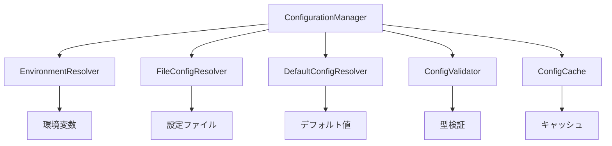

# 環境変数・設定システム再設計仕様書

**作成日時**: 2025年10月12日 13:20 JST  
**バージョン**: 1.0  
**ステータス**: 設計完了・実装待ち  
**優先度**: 最高（技術的負債解決の基盤）  

## 📋 現在の問題分析

### 既存システムの致命的欠陥

#### 1. 静的設定による柔軟性の欠如
```python
# 現在の問題のある実装
TREE_SITTER_OUTPUT_PATH = "/固定/パス"  # 動的変更不可
TREE_SITTER_PROJECT_ROOT = "/固定/パス"  # 環境依存
```

#### 2. 影響範囲（58箇所の参照）
- **ベースライン作成**: 出力パス指定不可
- **テスト環境**: 環境ごとの手動設定必要
- **CI/CD**: 自動化阻害
- **開発効率**: 設定変更のたびにコード修正

#### 3. 設計上の根本問題
- **単一責任原則違反**: 設定とロジックの混在
- **依存性注入の欠如**: ハードコードされた依存関係
- **テスタビリティの欠如**: モック化困難

## 🎯 新設計の基本方針

### 1. 設計原則
- **設定の外部化**: 全ての設定を外部ファイル・環境変数で管理
- **階層的設定解決**: 環境変数 → 設定ファイル → デフォルト値
- **動的設定変更**: 実行時の設定変更サポート
- **型安全性**: 設定値の型検証と変換
- **テスタビリティ**: 完全なモック化サポート

### 2. アーキテクチャ概要


## 🏗️ 詳細設計仕様

### 1. ConfigurationManager（中核クラス）

```python
from typing import Any, Dict, Optional, Union, TypeVar, Generic
from pathlib import Path
import os
import json
import yaml
from dataclasses import dataclass
from enum import Enum

T = TypeVar('T')

class ConfigScope(Enum):
    """設定スコープ定義"""
    GLOBAL = "global"
    PROJECT = "project"
    SESSION = "session"
    TEMPORARY = "temporary"

@dataclass
class ConfigDefinition(Generic[T]):
    """設定項目定義"""
    key: str
    default_value: T
    description: str
    scope: ConfigScope
    validator: Optional[callable] = None
    transformer: Optional[callable] = None
    required: bool = False
    sensitive: bool = False

class ConfigurationManager:
    """統一設定管理システム"""
    
    def __init__(self, project_root: Optional[Path] = None):
        self.project_root = project_root or self._detect_project_root()
        self.resolvers = [
            EnvironmentResolver(),
            FileConfigResolver(self.project_root),
            DefaultConfigResolver()
        ]
        self.validator = ConfigValidator()
        self.cache = ConfigCache()
        self._config_definitions = self._load_config_definitions()
    
    def get(self, key: str, scope: ConfigScope = ConfigScope.PROJECT) -> Any:
        """設定値の取得（階層的解決）"""
        cache_key = f"{scope.value}:{key}"
        
        # キャッシュチェック
        if cached_value := self.cache.get(cache_key):
            return cached_value
        
        # 階層的解決
        for resolver in self.resolvers:
            if value := resolver.resolve(key, scope):
                # 検証と変換
                validated_value = self.validator.validate(key, value)
                transformed_value = self._transform_value(key, validated_value)
                
                # キャッシュ保存
                self.cache.set(cache_key, transformed_value)
                return transformed_value
        
        # デフォルト値
        if definition := self._config_definitions.get(key):
            return definition.default_value
        
        raise ConfigurationError(f"Configuration key '{key}' not found")
    
    def set(self, key: str, value: Any, scope: ConfigScope = ConfigScope.SESSION) -> None:
        """設定値の動的変更"""
        validated_value = self.validator.validate(key, value)
        
        if scope == ConfigScope.SESSION:
            # セッション内での一時的変更
            self.cache.set(f"{scope.value}:{key}", validated_value)
        elif scope == ConfigScope.PROJECT:
            # プロジェクト設定ファイルへの永続化
            self._save_to_project_config(key, validated_value)
        else:
            raise ConfigurationError(f"Cannot set value for scope: {scope}")
    
    def get_output_path(self, relative_path: str = "") -> Path:
        """動的出力パス取得"""
        base_path = self.get("output_path")
        return Path(base_path) / relative_path
    
    def get_project_root(self) -> Path:
        """プロジェクトルート取得"""
        return Path(self.get("project_root"))
    
    def create_scoped_config(self, scope: ConfigScope) -> 'ScopedConfiguration':
        """スコープ付き設定オブジェクト作成"""
        return ScopedConfiguration(self, scope)
```

### 2. 設定解決システム

#### EnvironmentResolver（環境変数解決）
```python
class EnvironmentResolver:
    """環境変数からの設定解決"""
    
    def __init__(self):
        self.prefix = "TREE_SITTER_"
        self.mapping = {
            "output_path": "TREE_SITTER_OUTPUT_PATH",
            "project_root": "TREE_SITTER_PROJECT_ROOT",
            "cache_dir": "TREE_SITTER_CACHE_DIR",
            "log_level": "TREE_SITTER_LOG_LEVEL",
            "max_file_size": "TREE_SITTER_MAX_FILE_SIZE",
            "timeout": "TREE_SITTER_TIMEOUT"
        }
    
    def resolve(self, key: str, scope: ConfigScope) -> Optional[str]:
        """環境変数からの値解決"""
        env_key = self.mapping.get(key)
        if not env_key:
            # 動的環境変数名生成
            env_key = f"{self.prefix}{key.upper()}"
        
        return os.getenv(env_key)
```

#### FileConfigResolver（設定ファイル解決）
```python
class FileConfigResolver:
    """設定ファイルからの設定解決"""
    
    def __init__(self, project_root: Path):
        self.project_root = project_root
        self.config_files = [
            project_root / ".tree-sitter-analyzer.yaml",
            project_root / ".tree-sitter-analyzer.json",
            project_root / "pyproject.toml",  # [tool.tree-sitter-analyzer]
            Path.home() / ".config" / "tree-sitter-analyzer" / "config.yaml"
        ]
    
    def resolve(self, key: str, scope: ConfigScope) -> Optional[Any]:
        """設定ファイルからの値解決"""
        for config_file in self.config_files:
            if config_file.exists():
                config_data = self._load_config_file(config_file)
                if value := self._extract_value(config_data, key, scope):
                    return value
        return None
    
    def _load_config_file(self, config_file: Path) -> Dict[str, Any]:
        """設定ファイルの読み込み"""
        if config_file.suffix == ".yaml":
            return yaml.safe_load(config_file.read_text())
        elif config_file.suffix == ".json":
            return json.loads(config_file.read_text())
        elif config_file.suffix == ".toml":
            import tomli
            return tomli.loads(config_file.read_text())
        else:
            raise ConfigurationError(f"Unsupported config file format: {config_file}")
```

### 3. 設定定義システム

#### 標準設定定義
```python
STANDARD_CONFIG_DEFINITIONS = {
    "output_path": ConfigDefinition(
        key="output_path",
        default_value=lambda: Path.cwd() / "output",
        description="Analysis output directory path",
        scope=ConfigScope.PROJECT,
        validator=lambda x: Path(x).is_absolute(),
        transformer=lambda x: Path(x).resolve()
    ),
    
    "project_root": ConfigDefinition(
        key="project_root",
        default_value=lambda: Path.cwd(),
        description="Project root directory path",
        scope=ConfigScope.PROJECT,
        validator=lambda x: Path(x).exists(),
        transformer=lambda x: Path(x).resolve()
    ),
    
    "cache_dir": ConfigDefinition(
        key="cache_dir",
        default_value=lambda: Path.home() / ".cache" / "tree-sitter-analyzer",
        description="Cache directory path",
        scope=ConfigScope.GLOBAL,
        transformer=lambda x: Path(x).resolve()
    ),
    
    "max_file_size": ConfigDefinition(
        key="max_file_size",
        default_value="10MB",
        description="Maximum file size for analysis",
        scope=ConfigScope.PROJECT,
        validator=lambda x: self._validate_size_string(x),
        transformer=lambda x: self._parse_size_string(x)
    ),
    
    "timeout": ConfigDefinition(
        key="timeout",
        default_value=30,
        description="Analysis timeout in seconds",
        scope=ConfigScope.PROJECT,
        validator=lambda x: isinstance(x, (int, float)) and x > 0,
        transformer=lambda x: float(x)
    ),
    
    "log_level": ConfigDefinition(
        key="log_level",
        default_value="INFO",
        description="Logging level",
        scope=ConfigScope.SESSION,
        validator=lambda x: x.upper() in ["DEBUG", "INFO", "WARNING", "ERROR"],
        transformer=lambda x: x.upper()
    )
}
```

### 4. 設定ファイル形式

#### .tree-sitter-analyzer.yaml
```yaml
# プロジェクト設定ファイル例
project:
  name: "my-project"
  root: "."
  output_path: "./analysis-output"
  
analysis:
  max_file_size: "50MB"
  timeout: 60
  languages: ["python", "javascript", "java"]
  
cache:
  enabled: true
  directory: "./.cache/tree-sitter"
  ttl: 3600
  
logging:
  level: "INFO"
  file: "./logs/analysis.log"
  
mcp:
  server:
    port: 8080
    host: "localhost"
  tools:
    enabled: ["analyze_code_structure", "search_content"]
```

#### pyproject.toml統合
```toml
[tool.tree-sitter-analyzer]
output_path = "./analysis-output"
max_file_size = "50MB"
timeout = 60

[tool.tree-sitter-analyzer.cache]
enabled = true
directory = "./.cache/tree-sitter"

[tool.tree-sitter-analyzer.logging]
level = "INFO"
file = "./logs/analysis.log"
```

## 🔧 実装計画

### Phase 1: 基盤実装（3日）

#### Day 1: コア設定管理
- `ConfigurationManager`基本実装
- `ConfigDefinition`データクラス
- 基本的な設定解決ロジック

#### Day 2: 解決システム
- `EnvironmentResolver`実装
- `FileConfigResolver`実装
- `DefaultConfigResolver`実装

#### Day 3: 検証・変換システム
- `ConfigValidator`実装
- 型変換システム
- エラーハンドリング

### Phase 2: 統合実装（2日）

#### Day 4: 既存システム統合
- 既存の環境変数参照を新システムに移行
- 後方互換性の確保
- 移行テスト

#### Day 5: 高度機能
- 動的設定変更
- スコープ付き設定
- キャッシュシステム

### Phase 3: テスト・検証（2日）

#### Day 6: 包括的テスト
- 単体テスト作成
- 統合テスト作成
- パフォーマンステスト

#### Day 7: 最終検証
- 全機能テスト
- ドキュメント作成
- リリース準備

## 🧪 テスト戦略

### 1. 単体テスト
```python
class TestConfigurationManager:
    """設定管理システムの単体テスト"""
    
    def test_hierarchical_resolution(self):
        """階層的設定解決のテスト"""
        # 環境変数 > 設定ファイル > デフォルト値
        
    def test_dynamic_configuration_change(self):
        """動的設定変更のテスト"""
        
    def test_scope_isolation(self):
        """スコープ分離のテスト"""
        
    def test_validation_and_transformation(self):
        """検証・変換のテスト"""
```

### 2. 統合テスト
```python
class TestConfigurationIntegration:
    """設定システム統合テスト"""
    
    def test_mcp_tools_integration(self):
        """MCPツールとの統合テスト"""
        
    def test_cli_integration(self):
        """CLIとの統合テスト"""
        
    def test_backward_compatibility(self):
        """後方互換性テスト"""
```

## 📊 移行戦略

### 1. 段階的移行計画

#### Phase 1: 新システム並行運用
- 新設定システムの実装
- 既存システムとの並行運用
- 段階的な機能移行

#### Phase 2: 既存参照の置換
- 58箇所の環境変数参照を順次置換
- 各置換後の動作確認
- 回帰テストの実行

#### Phase 3: 旧システム削除
- 旧環境変数システムの削除
- クリーンアップ
- 最終検証

### 2. 後方互換性保証

#### 環境変数の継続サポート
```python
class BackwardCompatibilityLayer:
    """後方互換性レイヤー"""
    
    def __init__(self, config_manager: ConfigurationManager):
        self.config_manager = config_manager
        self._setup_legacy_mappings()
    
    def _setup_legacy_mappings(self):
        """既存環境変数のマッピング設定"""
        legacy_mappings = {
            "TREE_SITTER_OUTPUT_PATH": "output_path",
            "TREE_SITTER_PROJECT_ROOT": "project_root"
        }
        
        for legacy_key, new_key in legacy_mappings.items():
            if legacy_value := os.getenv(legacy_key):
                self.config_manager.set(new_key, legacy_value, ConfigScope.SESSION)
```

## 🎯 期待される効果

### 1. 技術的改善
- **柔軟性**: 動的設定変更による開発効率向上
- **保守性**: 設定の一元管理による保守性向上
- **テスタビリティ**: 完全なモック化サポート
- **拡張性**: 新しい設定項目の簡単追加

### 2. 開発効率向上
- **環境構築**: 自動的な環境検出と設定
- **テスト実行**: 環境に依存しないテスト実行
- **CI/CD**: 自動化された設定管理
- **デバッグ**: 設定値の透明性向上

### 3. 品質向上
- **エラー削減**: 設定ミスによるエラーの削減
- **一貫性**: 全システムでの設定一貫性
- **検証**: 設定値の自動検証
- **ドキュメント**: 設定項目の自動ドキュメント生成

## 🚀 実装開始準備

### 必要なライブラリ
```toml
# pyproject.toml追加依存関係
dependencies = [
    "pyyaml>=6.0",
    "tomli>=2.0.0; python_version<'3.11'",
    "pydantic>=2.0.0",  # 設定検証用
]
```

### 実装ファイル構造
```
tree_sitter_analyzer/
├── config/
│   ├── __init__.py
│   ├── manager.py          # ConfigurationManager
│   ├── resolvers.py        # 各種Resolver
│   ├── validators.py       # ConfigValidator
│   ├── definitions.py      # 設定定義
│   └── cache.py           # ConfigCache
├── utils/
│   └── backward_compat.py  # 後方互換性
└── tests/
    └── test_config/
        ├── test_manager.py
        ├── test_resolvers.py
        └── test_integration.py
```

---

**この再設計により、環境変数問題を根本的に解決し、技術的負債解消の基盤を確立します。**  
**動的設定管理により、開発効率と品質の大幅な向上が期待されます。**